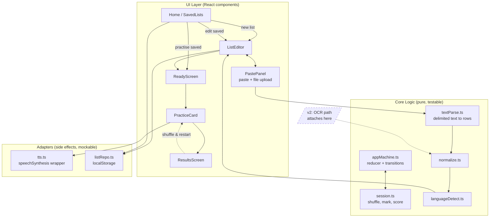
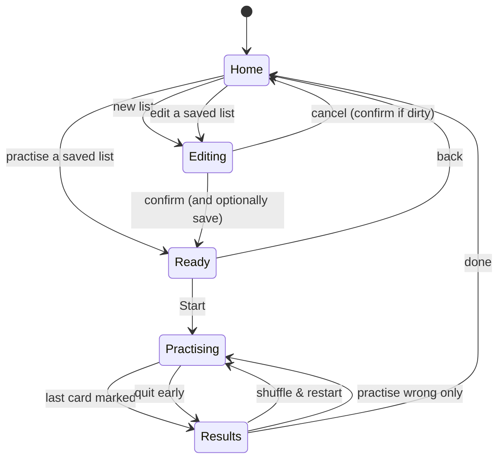
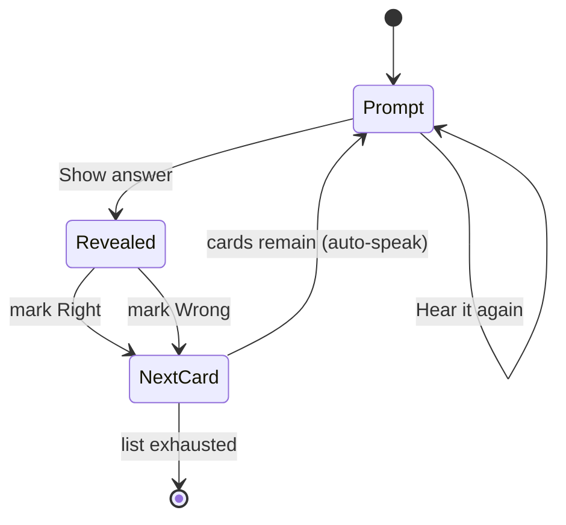
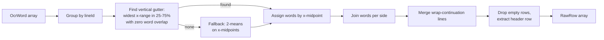

# Plan: Vocabulary Trainer

**Feature ID:** 001-vocab-trainer
**Status:** DRAFT (v1 scope)
**Created:** 2026-09-05
**Revised:** 2026-09-05 — v1 descoped to text entry only; OCR design preserved in the appendix
**Repository:** new, greenfield

## Technical Approach

A single-page React application, 100% client-side, built with Vite and deployed as static files.

v1 has **two ways to get a word list in** — typing it row by row, and pasting/uploading delimited
text — and they converge on one editable table. Two genuinely independent technical problems remain:

1. **Text → word pairs.** A delimiter-detecting line parser. Pure, small, heavily unit-tested.
2. **Word pairs → speech.** The browser-native Web Speech API (`speechSynthesis`) with defensive
   voice loading and graceful degradation when no matching voice exists. This is where the real
   cross-browser hazards live.

Everything else — the practice session — is a pure reducer over an immutable word list, testable with
no DOM and no mocks.

With OCR deferred, v1 has **zero runtime dependencies beyond React**. No WASM, no CDN fetch, no
language-data download, no CSP exception, no lazy chunk. That is the main benefit of the descope, and
it is worth protecting: adding a dependency to v1 should require a reason.

## Architecture



The dashed node is the only thing v2 adds. `normalize` onwards is already shared, so the OCR work
lands entirely upstream of code that will by then be in use and tested.

### Application state machine



`Editing` has two inbound edges in v1 and carries `mode: 'create' | 'update'`. Every list, however it
originated, passes through exactly one screen before practice.

### Per-card practice loop



The answer (column 1) is unreachable from the `Prompt` state by design — there is no path that reveals
it without passing through the explicit `Show answer` transition. Modelling the card as a discriminated
union makes that a compile-time property rather than a convention.

## Technology Choices

| Concern | Choice | Rationale |
|---------|--------|-----------|
| Build tool | Vite 8 | Fastest static SPA toolchain; first-class free-host support |
| UI | React 19 + TypeScript 6 | Types matter most at the parse boundary, where the data is messy |
| Styling | Tailwind CSS v4 via `@tailwindcss/vite` | No config file needed in v4; keeps the repo small |
| Linting | **oxlint** | Ships with the current Vite template; fast, zero-config. *Deviation from the original plan, which assumed ESLint — adapting to the template rather than fighting it* |
| TTS | Web Speech API (`speechSynthesis`) | Built into every target browser, free, offline, no key |
| State | `useReducer` + one Context | The whole app is one linear flow; Redux/Zustand would be ceremony |
| Storage | `localStorage`, versioned key | Sync API is fine for a handful of small JSON lists |
| Unit tests | Vitest + React Testing Library | Native Vite integration, no extra transform config |
| CI | GitHub Actions | Free for public repos |
| Hosting | Cloudflare Pages (primary), GitHub Pages (alternative) | See `deployment.md` |

### Dependencies

```
react  react-dom
-- dev --
vite  @vitejs/plugin-react  typescript  oxlint
tailwindcss  @tailwindcss/vite
vitest  @testing-library/react  @testing-library/user-event  jsdom
```

**Two runtime dependencies total.** Deliberately not added: a CSV library (the parser is ~60 lines and
the interesting behaviour — first-delimiter splitting — is not what a CSV library does), a state
library, a router (the flow is a state machine, not URLs), and a UI kit.

## Module Design

### `src/parse/types.ts` — the convergence point

```ts
export interface RawRow {
  col1: string;
  col2: string;
  conf?: number;   // 0-100, optional; unused in v1, populated by OCR in v2
}
```

Every ingest route produces `RawRow[]`. Nothing downstream knows where the rows came from. This one
type is what makes the v2 OCR work additive rather than invasive.

### `src/parse/textParse.ts` — paste, type and file import

```ts
export type Delimiter = 'tab' | 'comma' | 'semicolon' | 'dash' | 'equals' | 'spaces';

export function detectDelimiter(text: string): { delimiter: Delimiter | null; confidence: number };
export function parseDelimited(text: string, delimiter: Delimiter): RawRow[];
```

**Detection.** Score each candidate by the fraction of non-empty lines yielding exactly two non-empty
fields. Highest score wins if it clears **0.6**; otherwise return `null` and let the UI show the picker
with a "couldn't tell" hint. Refusing to guess is deliberate — a silently mis-parsed 40-row list is far
worse than one extra click.

**Split on the first occurrence only.** `line.split(d)` is wrong here: `niece,My sibling's daughter,
my niece` would become three fields and lose text. Split at the first delimiter index — everything
before is `col1`, everything after is `col2`. This makes commas inside the second column free, which
matters because the second column is where sentences live.

**Quoted CSV.** On the comma path only, honour minimal RFC 4180 quoting (`"a, b",c`) before falling
back to first-index splitting. Not needed for tab-separated spreadsheet pastes, which is the common case.

**Header row.** If the first parsed row's two cells fuzzy-match language names, hand it to
`languageDetect` and drop it from the pairs.

**Input hygiene.** Strip a leading BOM, normalise CRLF and CR to LF, and drop trailing blank lines
before any of the above. File uploads hit exactly the same two functions — `.tsv` pre-selects the tab
delimiter, everything else auto-detects.

### `src/parse/languageDetect.ts`

| Order | Method | `source` |
|-------|--------|----------|
| 1 | Header row fuzzy match (Levenshtein ≤ 2) against `{english, engels}` → `en`, `{dutch, nederlands, hollands}` → `nl` | `header` |
| 2 | Marker-word/digraph scoring per column: Dutch (`de het een van niet zijn`, `ij ui oe aa ee`, `-en` endings) vs English (`the to my is are of`) | `heuristic` |
| 3 | Default `col1 = en`, `col2 = nl` | `default` |

Only `header` renders a green badge. `heuristic` and `default` render amber with "(guessed)", so a
wrong detection is visible in the editor rather than surfacing as a wrong-sounding voice mid-drill.
The fuzzy match exists so a mistyped `Engish` still resolves — and, in v2, so does an OCR'd `Engllsh`.

### `src/components/ListEditor.tsx` — one editor, two entry points

| Entry point | Initial state |
|---|---|
| New list | One empty row, `mode: 'create'` |
| Edit a saved list | Pre-filled from `listRepo`, `mode: 'update'` |

Owns an editable `RawRow[]`, a dirty flag, and an embedded `PastePanel` that **appends** parsed rows
rather than replacing them — so a list can be built from several pastes, and an accidental paste never
wipes typed work.

Typing in the last row auto-appends a new empty row, so there is no "add row" ceremony in the common
case (the button still exists). Rows with an empty side are flagged; rows with `conf < 60` are flagged
amber, which in v1 never triggers because nothing sets `conf`.

**Save semantics** are the only difference between entry points, carried by the `mode` prop: `create`
mints a new id; `update` preserves id and name and bumps `updatedAt`.

**Language detection re-runs on every save**, not just on import. This is what turns the header row
into a working override: a user seeing the amber "(guessed)" badge can type `English` / `Dutch` into
the first row and get the green `header` badge.

**Navigation guard:** leaving while dirty prompts for confirmation.

### `src/speech/tts.ts`

```ts
export function speak(text: string, lang: 'en' | 'nl') {
  speechSynthesis.cancel();                    // clears iOS/Safari stuck queue
  const u = new SpeechSynthesisUtterance(text);
  u.lang = lang === 'nl' ? 'nl-NL' : 'en-GB';
  const v = pickVoice(lang);                   // exact tag, then prefix, then null
  if (v) u.voice = v;
  u.rate = 0.9;
  speechSynthesis.speak(u);
}
```

**Gotchas — this module carries most of v1's real risk:**

- `getVoices()` returns `[]` on first call in Chrome. Resolve via the `voiceschanged` event with a
  3-second timeout, then re-check. Load once at app start, never per card.
- iOS Safari only permits speech started inside a user gesture. The first `speak()` of a session is on
  the **Start** tap; every subsequent auto-speak descends from a tap on Right/Wrong, so the gesture
  chain is never broken. **Do not** auto-speak from a bare `useEffect` on mount.
- `speechSynthesis` can hang after the tab is backgrounded — `cancel()` before every `speak()` is the
  standard workaround.
- Chrome truncates utterances beyond ~15s; single words and short sentences are unaffected.
- Voice availability is device-dependent, not browser-dependent. Chrome on iOS uses the WebKit voice
  list, not the desktop Chrome list. Never assume `nl-NL` exists — FR17 covers the absence.

### `src/storage/listRepo.ts`

Key `pvt.lists.v1`, holding `{ schemaVersion: 1, lists: WordList[] }`.

- `getAll`, `getById`, `save`, `update`, `rename`, `remove`.
- Every read wrapped in try/catch, returning `[]` on parse failure — a corrupted key must never
  white-screen the app.
- Writes catch `QuotaExceededError` and return a typed result rather than throwing. Private-mode Safari
  throws on `setItem`; a save failure must not break the in-memory session.
- Soft cap of 50 lists, oldest flagged for deletion in the UI.

## Data Model

```ts
type LangCode = 'en' | 'nl';

interface WordPair { id: string; col1: string; col2: string }

interface WordList {
  id: string;
  name: string;
  col1Lang: LangCode;
  col2Lang: LangCode;
  langSource: 'header' | 'heuristic' | 'default';
  pairs: WordPair[];
  createdAt: number;
  updatedAt: number;
  origin: 'manual';            // v2 adds 'photo'
}

interface Session {
  listId: string;
  pairs: WordPair[];                                // snapshot, not a reference
  order: string[];                                  // shuffled pair ids
  index: number;
  revealed: boolean;
  marks: Record<string, 'right' | 'wrong'>;
}
```

`Session` holds a **snapshot** of the pairs and is never persisted, so editing a list cannot corrupt a
running drill and a mid-session refresh cannot corrupt a saved list.

## Security & Privacy Considerations

- **No data egress.** Lists never leave the device. With OCR deferred, v1 makes **no network requests
  at all** after the initial page load — no CDN, no fonts, no analytics.
- **No secrets.** No API keys exist, so none can leak through a public repo or a client bundle.
- **XSS.** Pasted text is attacker-influenceable only by the user themself, but it is rendered as React
  text nodes throughout — no `dangerouslySetInnerHTML` anywhere, lint-enforced.
- **File upload** is read with `FileReader.readAsText` and parsed as plain text. It is never `eval`'d,
  never inserted as HTML, and capped at 1 MB.
- **localStorage** is origin-scoped and holds no sensitive data; content is user-authored vocabulary.
- **CSP** via `<meta http-equiv>` restricted to `'self'` — v1 needs no external origins, so the policy
  can be strict. (v2's OCR CDN would need an explicit exception.)

## Performance

v1 is small enough that the performance work is mostly *not* doing things: no OCR chunk, no WASM, no
web fonts, no CDN round-trips. Two things still deserve care:

- The editor re-renders on every keystroke across a table that may hold 200 rows. Keep row state
  per-row and memoise rows so a keystroke re-renders one row, not the table.
- Voice loading happens once at app start behind a promise, not per card.

## Key Risks & Mitigations

| # | Risk | Likelihood | Mitigation |
|---|------|-----------|------------|
| R1 | No Dutch voice on the user's device | Medium | Banner + degraded text-visible mode (FR17/Story 7); this is now v1's largest risk |
| R2 | iOS speech blocked outside a gesture | Medium | Gesture-chain rule documented above; a test asserts speech is never called from a mount effect |
| R3 | Delimiter auto-detection picks wrong, silently mangling a pasted list | Medium | 0.6 confidence floor; never guess below it; detected delimiter displayed and overridable; live preview before commit |
| R4 | Auto language detection guesses wrong | Medium | Amber "(guessed)" badge makes it visible pre-practice; header row acts as the override |
| R5 | Editor sluggish on long lists | Low | Per-row memoisation; 200-row soft warning |
| R6 | `localStorage` quota exhaustion | Low | No images stored in v1; quota errors caught and surfaced |
| R7 | `ListEditor` accretes conditional logic per entry point | Low | Differences confined to a single `mode` prop; a test asserts both entry points render the same control set |

Deferring OCR removed the plan's only High-likelihood risk.

## Testing Strategy

| Layer | Tool | Scope |
|-------|------|-------|
| Unit — pure logic | Vitest | `textParse` (detect + parse), `normalize`, `languageDetect`, `session` (shuffle/mark/score), `listRepo` |
| Unit — components | Vitest + RTL | `ListEditor` in both modes, `PastePanel` parse/preview/commit, `PracticeCard` reveal/mark flow, `ResultsScreen` scoring — all against a mocked `speechSynthesis` |

`speechSynthesis` and `SpeechSynthesisUtterance` are stubbed globally in `src/test/setup.ts`, since
jsdom implements neither. The shuffle takes an injectable RNG so session tests are deterministic.

**Coverage target:** 80%+ on `src/parse/`, `src/speech/`, `src/storage/`, `src/state/`. UI components
are covered by behaviour tests rather than a line-coverage number.

**TDD:** every task below writes its test first (RED), implements minimally (GREEN), then refactors.
The pure-logic phase is where this pays — `textParse` in particular has a large fixture surface and
almost no ambiguity about expected output.

## Pragmatic Principles Review

- **DRY** — Language-code mapping (`'nl'` → `'nl-NL'` → Dutch marker set) lives in a single
  `src/lang/languages.ts` constant. Typing, pasting and file upload converge on `RawRow[]` before any
  UI exists, so `normalize`, `languageDetect`, `ListEditor`, saving and practice are each written once.
- **Broken windows** — Strict TypeScript and lint are wired up before any feature code exists.
- **Automate** — CI runs typecheck + lint + tests on every push from the first commit; deploy is a git
  push, never a manual upload.
- **Design for change** — `RawRow` is the seam that makes v2's OCR additive. `Session` logic is pure so
  spaced repetition can be added later without touching the UI. Neither costs anything now, which is
  the test of a good seam: it is just a type and a pure function boundary, not speculative machinery.

## Alternatives Considered

| Decision | Chosen | Rejected | Why |
|----------|--------|----------|-----|
| v1 ingest | Type + paste + file upload | Photo OCR | OCR was the highest-risk, highest-effort third of the build and is strictly optional — every list it produces can be typed instead |
| Pasted-line splitting | Split at first delimiter only | `String.split(d)` | Preserves commas inside column 2, where sentences live |
| Bad delimiter guess | Refuse below 0.6, show picker | Always pick the best-scoring | A silently mis-parsed 40-row list is worse than one extra click |
| CSV parsing | ~60 hand-written lines | `papaparse` | First-delimiter splitting is not what a CSV library does; the dependency would not remove the code we actually need |
| Editor entry points | One component + `mode` prop | Separate new/edit screens | Avoids duplicating the table, validation and save logic |
| Linting | oxlint (template default) | ESLint + typescript-eslint | Adapting to the current template; oxlint covers the rules this project needs, including `no-danger` |
| Routing | None (state machine) | React Router | No shareable URLs in the product; a router would add a 404-rewrite problem on GitHub Pages for nothing |

---

## Appendix: v2 OCR design (preserved, not scheduled)

Retained so the research behind the deferred photo path is not lost. None of this is built in v1.

**Attachment point:** produce `RawRow[]` and hand it to `normalize`. Nothing else changes.

**Library:** `tesseract.js` v7 (v7 is 15–35% faster than v6). Load it with a dynamic `import()` so it
stays out of the main bundle.

```ts
const worker = await createWorker('eng+nld', 1, { logger });
const { data } = await worker.recognize(image, {}, { tsv: true, text: false });
// parse TSV rows where level === 5 -> word-level boxes
await worker.terminate();
```

**Gotchas:**
- Non-text output formats are **off by default** since v6 — `tsv: true` is mandatory or no bounding
  boxes are returned and column splitting has nothing to work with.
- `worker.loadLanguage()` / `worker.initialize()` were removed in v6; `createWorker(lang)` replaced them.
- Use TSV rather than the `blocks` output: v6 restructured `blocks` so word/symbol data must be derived
  manually, whereas TSV is the stable classic Tesseract format with fixed columns.
- `terminate()` in a `finally`, including the error path; leaked workers hold tens of MB.
- First run downloads ~15 MB of traineddata. Surface it in the UI; it is browser-cached afterwards.

**Column-splitting algorithm:**



A continuation line is one where exactly one side is empty — append it to the *previous* row's matching
cell, or multi-line entries like `cousin (male and female)` are silently corrupted.

**Crop/rotate step is load-bearing, not cosmetic.** It is what makes a rotated photo containing two
side-by-side tables tractable at all, and cropping a 12 MP photo to one table cuts OCR runtime by
roughly an order of magnitude. Downscale to a 2000 px max edge — beyond that, accuracy plateaus while
time keeps climbing.

**A failed scan must offer "type them in instead"**, routing to the editor. That is what keeps OCR a
convenience rather than a dependency — and in v1 that path is simply the only path.
