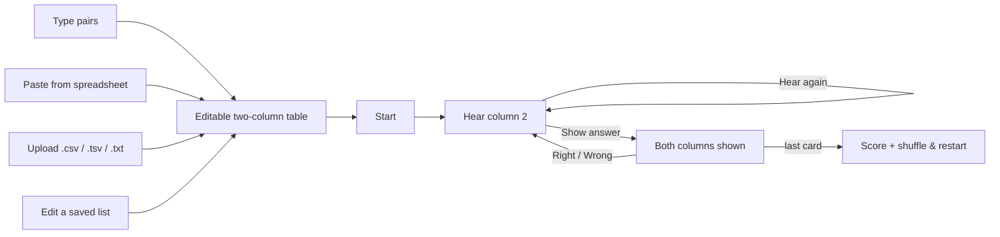

# Quickstart: Vocabulary Trainer

**Feature ID:** 001-vocab-trainer
**Scope:** v1 — text entry only. Photo/OCR deferred to v2.

## What it does

Get a two-column English/Dutch word list into the app — by typing it, pasting it, or uploading a
file — then drill yourself as it reads **column 2** aloud while **column 1** stays hidden as the answer.

## The flow



## Decisions already made

| Question | Answer |
|----------|--------|
| Getting words in | Type, paste, or upload a text/CSV file — no camera in v1 |
| Pasting | Auto-detects tab/comma/semicolon/dash separators; refuses to guess below 60% confidence |
| Editing | Any saved list can be reopened in the same editor and updated in place |
| Language detection | Auto from a header row, then a word heuristic, then `en`/`nl` default |
| Persistence | Lists saved in `localStorage`, per-device, no accounts |
| Hosting | Cloudflare Pages (free); GitHub Pages documented as the no-extra-account alternative |
| Backend | None. No API keys, no running costs, no network requests after page load |

## Stack

Vite 8 · React 19 · TypeScript 6 (strict) · Tailwind v4 · oxlint · Web Speech API · Vitest

**Two runtime dependencies total:** `react`, `react-dom`.

## Structure to be created

```
src/
  lang/languages.ts        Single source of truth for language codes & markers
  parse/                   types (RawRow) · textParse · normalize · languageDetect  (pure)
  speech/                  tts · useVoices
  storage/listRepo.ts      localStorage, versioned
  state/                   appMachine · session  (pure)
  components/              8 screens · ListEditor + PastePanel shared by both entry points
  test/                    setup + text fixtures
.github/workflows/         ci.yml · deploy.yml
```

## Commands

```bash
npm run dev          # local dev server
npm run typecheck    # tsc --noEmit
npm run lint         # oxlint
npm test             # vitest
npm run build        # -> dist/
```

## Where to start

`tasks.md` Task 1. Phases 1–2 (Tasks 1–11) are pure logic with no UI — that is where the real
difficulty lives (delimiter detection, language heuristics) and all of it is unit-testable before a
single pixel is rendered. TDD is mandatory throughout.

Phases 4 and 5 are independent: seed a list into `localStorage` and the whole practice flow is
demoable before the editor exists.

## The three things most likely to bite

1. **iOS speech gesture chain** — `speak()` must descend from a tap. Never auto-speak from a mount
   `useEffect`. See `plan.md` § tts. This is v1's biggest risk.
2. **Splitting pasted lines** — split at the *first* delimiter only, or a comma inside a Dutch
   sentence silently truncates the entry. See `tasks.md` Task 8.
3. **`base` in `vite.config.ts`** — wrong value ⇒ blank deployed page. Cloudflare Pages avoids it
   entirely. See `deployment.md`.

## Read next

`spec.md` (what & why) → `plan.md` (how) → `tasks.md` (do) → `deployment.md` (ship)
