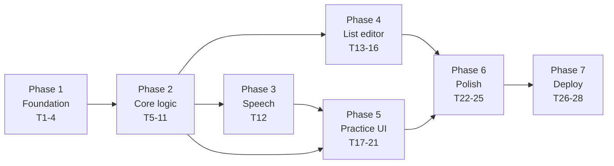

# Tasks: Vocabulary Trainer

**Feature ID:** 001-vocab-trainer
**Total:** 28 tasks across 7 phases (v1 — no photo/OCR)
**Legend:** `[P]` = parallelisable with siblings · every task ends with a runnable VALIDATE

> **TDD is mandatory.** For every task: write the test first and watch it fail (RED), write the
> minimal code to pass (GREEN), then refactor with tests green. Tasks below name the test file
> explicitly wherever one applies.

> **Structural note.** Typing, pasting and file upload all converge on `RawRow[]` before any UI
> exists. `ListEditor` (Phase 4) is shared by new-list and edit-saved-list. Nothing downstream of
> `normalize` knows where the rows came from — which is also where v2's OCR path will attach.

---

## Phase 1 — Foundation (Tasks 1–4)

### Task 1: COMPLETE project scaffold
- **STATUS:** Vite scaffold already copied in (React 19.2, TS 6, Vite 8, oxlint). Remaining work below.
- **IMPLEMENT:** `npm install`. Add Tailwind v4: `npm i -D tailwindcss @tailwindcss/vite`, register `tailwindcss()` in `vite.config.ts` plugins, and put `@import "tailwindcss";` as the **first** line of `src/index.css`. Delete the template's `App.css`, `src/assets/`, and the demo counter markup in `App.tsx`.
- **GOTCHA:** Tailwind v4 has no `tailwind.config.js` and no `postcss.config.js` — do not create them.
- **GOTCHA:** Do **not** add `tesseract.js`. v1 has two runtime dependencies: `react`, `react-dom`.
- **NOTE:** `node_modules` sits inside an iCloud Drive folder. Confirm `.gitignore` covers it.
- **VALIDATE:** `npm run dev` serves on :5173 and `npm run build` exits 0

### Task 2: CONFIGURE strict TypeScript + lint
- **IMPLEMENT:** Add `strict`, `noUncheckedIndexedAccess`, `noImplicitOverride`, `exactOptionalPropertyTypes` to `tsconfig.app.json`. Configure `.oxlintrc.json` with the `react` and `typescript` plugins and turn on `no-danger` (bans `dangerouslySetInnerHTML`, plan.md § Security). Add `typecheck` and `format` npm scripts.
- **WHY:** Broken-windows — strictness lands before any feature code. Retrofitting it never happens.
- **VALIDATE:** `npm run typecheck && npm run lint` both exit 0

### Task 3: CONFIGURE Vitest + Testing Library
- **IMPLEMENT:** `npm i -D vitest @testing-library/react @testing-library/user-event @testing-library/jest-dom jsdom`. Vitest config with `environment: 'jsdom'`, `globals: true`, `setupFiles: ['src/test/setup.ts']`. In setup, stub `window.speechSynthesis` (`speak`, `cancel`, `getVoices`, `addEventListener`) and `SpeechSynthesisUtterance` — jsdom implements neither. Add `test` and `test:coverage` scripts.
- **GOTCHA:** The speech stubs must record calls in order — several later tests assert `cancel()` is called before `speak()`.
- **VALIDATE:** `npm test` runs and reports 0 tests without erroring

### Task 4: CREATE `.github/workflows/ci.yml` [P]
- **IMPLEMENT:** On push + PR: checkout, setup-node 22 with npm cache, `npm ci`, `npm run typecheck`, `npm run lint`, `npm test`, `npm run build`.
- **VALIDATE:** Push the branch and confirm the run goes green

---

## Phase 2 — Core logic, no UI (Tasks 5–11)

*Entirely pure functions. All of it testable without a DOM or a browser. This is where TDD earns its keep.*

### Task 5: CREATE `src/lang/languages.ts` + `src/parse/types.ts` [P]
- **IMPLEMENT:** `LangCode = 'en' | 'nl'`, BCP-47 map (`en`→`en-GB`, `nl`→`nl-NL`), display names, header-alias sets (`english/engels`, `dutch/nederlands/hollands`), and the marker-word/digraph sets for the heuristic. Separately, the `RawRow` interface (`col1`, `col2`, `conf?`) — the convergence point for every ingest route.
- **WHY:** DRY — language-code mapping is the one real duplication risk in this codebase. `RawRow` is the seam that makes v2's OCR additive.
- **VALIDATE:** `npm run typecheck`

### Task 6: CREATE text fixtures [P]
- **IMPLEMENT:** `src/test/fixtures/text.ts` — tab-separated spreadsheet paste; comma with a comma inside column 2; quoted CSV (`"a, b",c`); ` - ` separated; semicolon; ambiguous/mixed input that should fall below the confidence floor; single-field lines; a leading `English<TAB>Dutch` header line; input with a BOM and CRLF endings; trailing blank lines. Use real English/Dutch pairs.
- **VALIDATE:** `npx tsc --noEmit`

### Task 7: CREATE `src/parse/normalize.ts` + tests
- **TEST FIRST:** `src/parse/normalize.test.ts`
- **IMPLEMENT:** Trim, collapse internal whitespace, strip stray artifacts (`|`, `_`, leading/trailing punctuation runs), drop rows where both cells are empty, flag rows with `conf < 60`.
- **GOTCHA:** `conf` is optional and v1 never sets it — rows without it must never be flagged. Assert this explicitly; it is the property that keeps the v2 seam free.
- **VALIDATE:** `npm test -- normalize`

### Task 8: CREATE `src/parse/textParse.ts` + tests
- **TEST FIRST:** `src/parse/textParse.test.ts` — drive it from every fixture in Task 6.
- **IMPLEMENT:** Input hygiene (strip BOM, normalise CRLF/CR → LF, drop trailing blank lines). `detectDelimiter(text)` → `{ delimiter, confidence }` scoring each candidate (`tab`, `comma`, `semicolon`, `dash`, `equals`, `spaces`) by the fraction of non-empty lines yielding exactly two non-empty fields; return `null` below **0.6**. `parseDelimited(text, delimiter)` → `RawRow[]`.
- **GOTCHA:** Split at the **first** delimiter occurrence only. `line.split(d)` would turn `niece,My sibling's daughter, my niece` into three fields and lose text. Field 1 → col1, remainder → col2.
- **GOTCHA:** On the comma path only, handle minimal RFC 4180 quoting before falling back to first-index splitting.
- **GOTCHA:** Never guess below the 0.6 floor — a silently mis-parsed 40-row list is far worse than one extra click (plan.md R3).
- **GOTCHA:** Lines yielding one field produce a row with an empty cell, flagged incomplete — never dropped.
- **VALIDATE:** `npm test -- textParse` — all fixtures plus the below-threshold refusal case

### Task 9: CREATE `src/parse/languageDetect.ts` + tests
- **TEST FIRST:** `src/parse/languageDetect.test.ts`
- **IMPLEMENT:** Three-tier resolution from plan.md: header fuzzy match (Levenshtein ≤ 2) → marker-word/digraph scoring → `en`/`nl` default. Returns `{ col1Lang, col2Lang, source }`.
- **GOTCHA:** Must return distinct languages for the two columns; if both score the same language, fall through to the next tier.
- **GOTCHA:** Fuzzy, not exact — `Engish` must still resolve to `en`.
- **VALIDATE:** `npm test -- languageDetect` — header hit, mistyped header, no header, inconclusive heuristic, default fallback

### Task 10: CREATE `src/state/session.ts` + tests
- **TEST FIRST:** `src/state/session.test.ts`
- **IMPLEMENT:** `createSession(pairs, rng)` (Fisher–Yates over pair ids, taking a **snapshot** of pairs), `reveal`, `mark(id, result)`, `next`, `score()` → `{ right, wrong, total, pct, wrongPairs }`, `restartShuffled`, `restartWrongOnly`.
- **GOTCHA:** Inject the RNG so tests are deterministic. Never mutate the `WordList` — the snapshot is what makes editing a list mid-session safe (spec.md Story 6).
- **VALIDATE:** `npm test -- session` — includes the 1-pair edge case and quit-early scoring

### Task 11: CREATE `src/storage/listRepo.ts` + `src/state/appMachine.ts` + tests
- **TEST FIRST:** `src/storage/listRepo.test.ts`, `src/state/appMachine.test.ts`
- **IMPLEMENT:** *Repo:* `getAll`, `getById`, `save` (create), `update` (in place, preserves id + name, bumps `updatedAt`), `rename`, `remove` against key `pvt.lists.v1` shaped `{ schemaVersion: 1, lists: [] }`. Every read try/catch'd, returning `[]` on parse failure. Writes catch `QuotaExceededError` and return a typed result rather than throwing. *Machine:* reducer over the states in plan.md, `AppState` as a discriminated union, `Editing` carrying `mode: 'create' | 'update'`.
- **GOTCHA:** Private-mode Safari throws on `localStorage.setItem`. A save failure must not break the in-memory session.
- **GOTCHA:** Discriminated union, not a bag of booleans — it makes "answer unreachable from Prompt" a compile-time property.
- **VALIDATE:** `npm test -- listRepo appMachine` — create, update-in-place, corrupted JSON, quota exceeded; every legal transition plus rejection of illegal ones

---

## Phase 3 — Speech adapter (Task 12)

### Task 12: CREATE `src/speech/tts.ts` + `src/speech/useVoices.ts` + tests
- **TEST FIRST:** `src/speech/tts.test.ts`
- **IMPLEMENT:** `loadVoices()` resolving on `voiceschanged` with a 3s timeout then re-check; `pickVoice(lang)` matching exact BCP-47 tag → language prefix → `null`; `speak(text, lang)` with `cancel()` first and `rate: 0.9`; `hasVoiceFor(lang)`.
- **GOTCHA:** `getVoices()` is empty on first call in Chrome. Load once at app start, never per card.
- **GOTCHA:** `cancel()` before every `speak()` — the fix for `speechSynthesis` hanging after the tab is backgrounded. Assert the call order.
- **WHY:** This module carries most of v1's remaining risk (plan.md R1, R2).
- **VALIDATE:** `npm test -- tts` — cancel-before-speak ordering, exact-tag match, prefix fallback, null when absent, empty-first-call recovery

---

## Phase 4 — List editor (Tasks 13–16)

### Task 13: CREATE `src/components/ListEditor.tsx` + tests
- **TEST FIRST:** `src/components/ListEditor.test.tsx`
- **IMPLEMENT:** Editable two-column table over `RawRow[]` with column headers showing the detected languages. Inline edit both cells; typing in the last row auto-appends a new empty row; explicit add-row and delete-row buttons. Red flag for rows with an empty side, amber for `conf < 60`. Language badge: green "Column 1 English → Column 2 Dutch 🔊" when `source === 'header'`, amber + "(guessed)" otherwise. Props: `initialRows`, `mode: 'create' | 'update'`, `listId?`. Dirty tracking with a navigation-guard confirm. Running "N complete pairs" count. **Start practice** disabled until ≥ 1 complete pair. Soft warning above 200 rows.
- **PATTERN:** One component, two entry points. Differences live only in the `mode` prop — no `if (isNew)` branching.
- **GOTCHA:** Re-run `languageDetect` on save, not only on import — this is what makes typing a header row a working correction for a bad guess (spec.md Deferred).
- **GOTCHA:** Memoise rows so a keystroke re-renders one row, not a 200-row table (plan.md R5).
- **GOTCHA:** Render all cells as React text nodes — never `dangerouslySetInnerHTML` (lint-enforced Task 2).
- **VALIDATE:** `npm test -- ListEditor` — edit/add/delete, auto-append on last row, badge variants, disabled-start guard, dirty-guard prompt, and a test asserting both modes render the same control set (plan.md R7)

### Task 14: CREATE `src/components/PastePanel.tsx` + tests
- **TEST FIRST:** `src/components/PastePanel.test.tsx`
- **IMPLEMENT:** Collapsible panel inside `ListEditor`. Textarea → `detectDelimiter` → `parseDelimited` → live preview showing "will add N complete pairs, M incomplete". Separator dropdown pre-set to the detection result; below the confidence floor, show "Couldn't tell — pick a separator" with nothing pre-selected. **Add to list** appends rows.
- **GOTCHA:** Appending, not replacing, is what lets a list be built from several pastes and prevents an accidental paste wiping typed work.
- **VALIDATE:** `npm test -- PastePanel` — tab paste, comma-in-column-2, quoted CSV, ambiguous input shows the picker, append preserves existing rows

### Task 15: ADD file upload to `PastePanel` [P]
- **TEST FIRST:** extend `PastePanel.test.tsx`
- **IMPLEMENT:** `<input type="file" accept=".csv,.tsv,.txt,text/plain,text/csv">` → `FileReader.readAsText` → the same `detectDelimiter`/`parseDelimited` path. `.tsv` pre-selects tab; others auto-detect. Reject files > 1 MB and non-text types with an inline message.
- **GOTCHA:** Reuse the parser — do not write a second path for files.
- **VALIDATE:** `npm test -- PastePanel` file-upload cases

### Task 16: CREATE `src/components/Home.tsx` + wire `App.tsx`
- **TEST FIRST:** `src/components/Home.test.tsx`
- **IMPLEMENT:** **New list** as the primary action; saved lists below. Wire `appMachine` through a Context provider in `App.tsx` and render the screen for the current state.
- **VALIDATE:** `npm test -- Home` — new-list reaches `Editing` with one empty row and `mode: 'create'`

---

## Phase 5 — Practice UI (Tasks 17–21)

*Depends only on Phases 2–3. Buildable in parallel with Phase 4 by seeding a list into `localStorage`.*

### Task 17: CREATE `src/components/ReadyScreen.tsx` [P]
- **TEST FIRST:** `src/components/ReadyScreen.test.tsx`
- **IMPLEMENT:** List name, pair count, direction line ("You'll hear Dutch, answer in English"), **Start**, **Save this list**, **Back**.
- **GOTCHA:** **Start** must be the element that triggers the session's first `speak()` — this establishes the iOS user-gesture chain for the whole session.
- **VALIDATE:** `npm test -- ReadyScreen`

### Task 18: CREATE `src/components/PracticeCard.tsx` + tests
- **TEST FIRST:** `src/components/PracticeCard.test.tsx`
- **IMPLEMENT:** Prompt state → **Hear it again 🔊** and **Show answer**. Revealed state → both columns as text, plus **Right ✓** / **Wrong ✗**. Header shows "Card 7 of 24" and the running tally. **Quit** exits to results.
- **GOTCHA:** Never auto-speak from a mount `useEffect` — speech must descend from the tap on Start or Right/Wrong, or iOS silently blocks it. Add a test asserting speech is not called on mount.
- **GOTCHA:** The answer must not be in the DOM while in the Prompt state — not merely hidden with CSS.
- **VALIDATE:** `npm test -- PracticeCard` — speak-on-advance, replay, reveal, mark, col1 absent from the DOM pre-reveal, no speech on mount

### Task 19: ADD keyboard shortcuts to `PracticeCard` [P]
- **IMPLEMENT:** Space = replay, Enter = reveal, Y/N = mark right/wrong (NFR5). One-line hint on non-touch devices.
- **GOTCHA:** `preventDefault()` on Space or the page scrolls.
- **VALIDATE:** `npm test -- PracticeCard` keyboard cases

### Task 20: CREATE `src/components/VoiceWarning.tsx` [P]
- **TEST FIRST:** `src/components/VoiceWarning.test.tsx`
- **IMPLEMENT:** When `hasVoiceFor(promptLang)` is false, a dismissible banner with per-OS install instructions. Set a `voiceMissing` flag that makes `PracticeCard` show the prompt word as text (Story 7's degraded mode).
- **VALIDATE:** `npm test -- VoiceWarning` — banner appears and degraded mode reveals the prompt text

### Task 21: CREATE `src/components/ResultsScreen.tsx` + tests
- **TEST FIRST:** `src/components/ResultsScreen.test.tsx`
- **IMPLEMENT:** "18 / 24 (75%)", the missed words with both columns, and **Shuffle & restart** / **Practise wrong ones only** / **Done**. Disable wrong-only when there are no misses.
- **VALIDATE:** `npm test -- ResultsScreen` — score maths, wrong-list contents, both restart paths

---

## Phase 6 — Persistence & polish (Tasks 22–25)

### Task 22: CREATE `src/components/SavedLists.tsx` + tests
- **TEST FIRST:** `src/components/SavedLists.test.tsx`
- **IMPLEMENT:** Saved lists with name, pair count, created + updated dates. Actions per list: **Practise**, **Edit**, **Rename**, **Delete**. Empty state leads to **New list**. Toast on quota failure.
- **VALIDATE:** `npm test -- SavedLists` — all four actions, empty state

### Task 23: WIRE edit-a-saved-list through `ListEditor`
- **IMPLEMENT:** **Edit** → `listRepo.getById` → `Editing` with `mode: 'update'` and the stored `listId`. Save calls `listRepo.update`, preserving id and name and bumping `updatedAt`. Cancel leaves the stored list untouched.
- **GOTCHA:** A session started from this list holds its own snapshot (Task 10) — add a test verifying a running drill is unaffected by an edit.
- **VALIDATE:** `npm test -- ListEditor listRepo` — update-mode round-trip

### Task 24: RESPONSIVE + a11y pass [P]
- **IMPLEMENT:** Mobile-first layout, tap targets ≥ 44 px, thumb-reachable primary actions (FR18). `aria-live="polite"` on the practice card so a screen reader announces advances; labels on all icon buttons; visible focus rings. The editor table must stay usable at 375 px — stack cells vertically per row below `sm`.
- **GOTCHA:** A two-column editable table is the hardest thing here to make work on a phone. Budget real time for it.
- **VALIDATE:** Chrome DevTools device emulation at 375 px; Lighthouse accessibility ≥ 90

### Task 25: CREATE `README.md` [P]
- **IMPLEMENT:** What it does, a screenshot, the three ways to add words (type / paste / upload), local dev commands, deploy instructions (link `deployment.md`), browser support, and the privacy note that nothing leaves the device.
- **VALIDATE:** `npx markdown-link-check README.md`

---

## Phase 7 — Deploy (Tasks 26–28)

### Task 26: CONFIGURE production build
- **IMPLEMENT:** Add a strict CSP `<meta http-equiv>` limited to `'self'` — v1 makes no external requests, so the policy can be tight. Set `base` in `vite.config.ts` only if targeting GitHub Pages.
- **GOTCHA:** A wrong `base` is the single most common cause of a blank deployed Vite site. See `deployment.md`.
- **VALIDATE:** `npm run build && npx vite preview` — app works fully from the built output

### Task 27: DEPLOY to Cloudflare Pages
- **IMPLEMENT:** Follow `deployment.md` § Option A.
- **VALIDATE:** Open the `.pages.dev` URL **on a phone**; type a short list, complete a full drill, and separately paste a list from a spreadsheet

### Task 28: CREATE `.github/workflows/deploy.yml` (GitHub Pages alternative) [P]
- **IMPLEMENT:** Follow `deployment.md` § Option B. Only needed if GitHub Pages is chosen over Cloudflare.
- **VALIDATE:** Push to `main`; the Actions run goes green and the Pages URL serves the app

---

## Execution Order

Phases 4 and 5 are independent of each other. Seed a list straight into `localStorage` and the entire
practice flow is demoable before the editor exists.

## Acceptance Gate

- [ ] `npm run typecheck && npm run lint && npm test && npm run build` all exit 0
- [ ] Coverage ≥ 80% on `src/parse/`, `src/speech/`, `src/storage/`, `src/state/`
- [ ] Total bundle < 150 KB gzipped; exactly two runtime dependencies
- [ ] Every acceptance criterion in `spec.md` Stories 1–7 verified by hand
- [ ] Full drill completed on a real phone from the deployed URL — once from a typed list, once from a pasted one
- [ ] A saved list edited, re-saved, and re-practised with the change present
- [ ] Verified on Chrome desktop, Safari desktop, and iOS Safari
- [ ] Degraded no-voice mode verified by temporarily stubbing `getVoices()` to return `[]`
