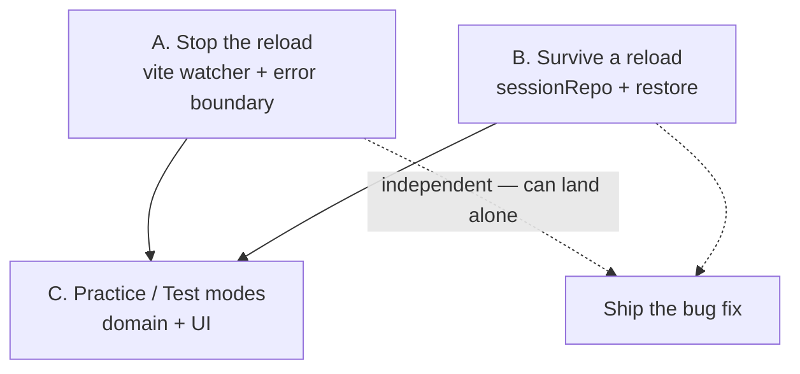
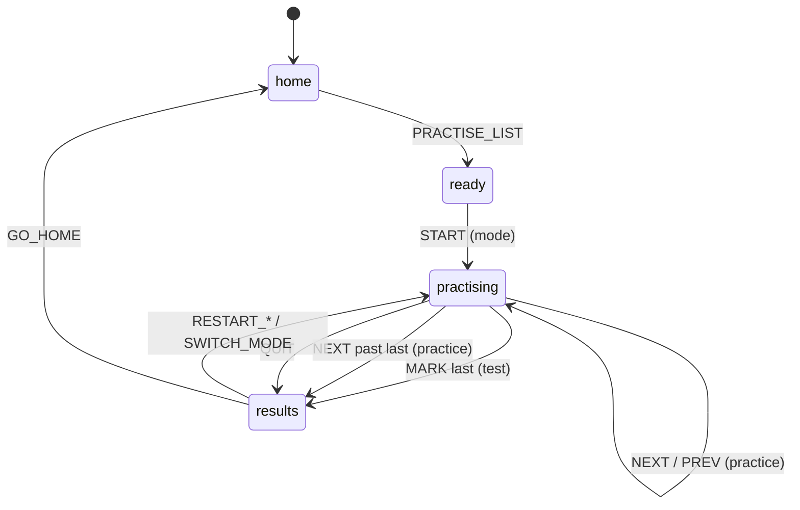

# Plan: Drill Resilience & Practice/Test Modes

**ID:** 002-drill-resilience-and-modes
**Spec:** `spec.md`

## Strategy

Three independent workstreams, deliberately sequenced so the bug fix ships before the feature:



A and B both address request #1 and are independently shippable. C depends on B only because both
touch `Session` and `appMachine`; doing B first means the mode field is persisted from day one
rather than retrofitted.

## Pragmatic Programmer review

| Principle | Application here |
|-----------|------------------|
| **Fix the cause, not the symptom** | The tempting fix for "it's too quick" was a timer setting. That would have shipped a knob that does nothing while the real defect kept firing. The investigation came first. |
| **DRY** | Session serialisation lives in exactly one module (`sessionRepo`). `PracticeCard` and `StudyCard` share nothing but the domain — no shared "card" abstraction is invented before there are two real users of it. |
| **Broken windows** | `PracticeCard` currently means "the test card". Shipping a *Practice mode* alongside a `PracticeCard` that is not it guarantees a permanent naming trap → rename it `TestCard` now, while it is a mechanical change with green tests. |
| **Design for change** | `mode` is a field on `Session`, not a fork of it. A third mode (typed answers, timed) adds a union member and a component, touching no existing branch. |
| **Crash early** | The corrupt-payload path is the exception: storage reads are total functions returning `null`, matching `listRepo`'s existing contract. A bad key must never white-screen the app. |
| **Automate** | Every task carries a runnable VALIDATE. The reload defect itself gets a regression test (persist → reload → restore), so it cannot silently return. |

## Workstream A — Stop the reload

### A1. Vite watcher

`vite.config.ts` currently passes no `server` options. Add:

```ts
server: {
  watch: {
    // This repo lives in iCloud Drive, which touches files continuously as it
    // syncs. Vite's default watcher reads that churn as source edits and issues
    // a full page reload, which wipes in-memory app state mid-drill.
    ignored: ['**/node_modules/**', '**/dist/**', '**/.git/**', '**/coverage/**'],
    usePolling: false,
  },
},
```

**Why this and not `usePolling: true`:** polling is the usual iCloud/network-drive workaround for
*missed* events. Here the problem is the opposite — too many events — so polling would make it
worse.

**Honest limitation:** if iCloud is touching files under `src/` itself, ignoring `node_modules` will
not be enough. Task 1 measures before Task 2 changes anything.

### A2. Error boundary

There is no error boundary anywhere. Any render-time throw unmounts the tree to a blank page, which
is both a bad experience and a diagnostic dead end. A minimal class component wrapping `<App/>` in
`main.tsx` renders the message plus a "Start over" button.

React 19 note: `componentDidCatch` remains the mechanism; there is still no hook equivalent.

## Workstream B — Survive a reload

### Storage design

New module `src/storage/sessionRepo.ts`, modelled directly on `listRepo`'s contract — total reads,
`WriteResult` writes, versioned payload, its own key.

| Decision | Choice | Reasoning |
|----------|--------|-----------|
| Key | `pvt.session.v1` | Separate from `pvt.lists.v1`, so a session bug can never corrupt saved lists. |
| Store | `localStorage` | `sessionStorage` dies with the tab; iOS evicts backgrounded tabs, which is one of the very cases this must survive. |
| Freshness | `savedAt` + 24 h TTL | Stale drills are discarded rather than ambushing the user (spec A5). |
| Payload | `{ schemaVersion, savedAt, screen, list, session }` | The **list is stored with the session**, not referenced by id — a drill must survive its source list being deleted mid-run, exactly as the in-memory snapshot already does (`session.ts:42`). |
| Failure | Read → `null`. Write → `WriteResult`, ignored by callers. | Persistence is a convenience layer; losing it degrades to today's behaviour (FR-6). |

### Restore and the iOS gesture chain

This is the subtle part. 001's central constraint is that `speak()` must descend from a user
gesture, which is why nothing speaks from a mount effect (`tts.ts:112`, `PracticeCard.tsx:17`).

A restore happens at page load, with **no gesture in scope**. So:

- Restore rehydrates the screen and card, and **never calls `speak()`**.
- The card renders a "Resumed — tap 🔊 to hear it again" hint.
- The next tap re-establishes the chain and everything proceeds normally.

Writing a restore that auto-speaks would appear to work on desktop Chrome and fail silently on the
iPhone this app is mostly used on. Do not do it.

### Wiring in `App.tsx`

`act()` (`App.tsx:77`) is already the single choke point through which every state transition flows.
Persistence hangs off it — one `persistSession(next)` call, not a `useEffect` that fires a render
late:

```ts
const act = useCallback((action: AppAction) => {
  const next = reduce(state, action)
  setState(next)
  if (next.screen === 'practising') sessionRepo.save(next)
  else sessionRepo.clear()
  const advances = /* unchanged */
  if (advances) speakCurrent(next)
}, [state, speakCurrent])
```

Restore is the `useState` initialiser, so there is no first-paint flash of the home screen:

```ts
const [state, setState] = useState<AppState>(() => sessionRepo.load() ?? initialState)
```

## Workstream C — Practice / Test modes

### Domain model

`Session` gains one field:

```ts
export type DrillMode = 'practice' | 'test'

export interface Session {
  mode: DrillMode
  listId: string
  pairs: WordPair[]
  order: string[]
  index: number
  revealed: boolean
  marks: Record<string, MarkResult>
}
```

`createSession(pairs, rng, listId, mode)`:
- `test` → Fisher-Yates shuffle, as today.
- `practice` → list order preserved (spec A3). The `rng` argument is simply unused.

`revealed` and `marks` stay on the type for both modes rather than being split into a union. A
practice session leaves them at `false` / `{}`; `score()` on one therefore reports `total: 0`, which
is correct and is never displayed.

### State machine



Action changes:

| Action | Change |
|--------|--------|
| `START` | Gains `mode: DrillMode`. |
| `NEXT` | **New.** Practice only. Advances; past the last card → `results`. |
| `PREV` | **New.** Practice only. Decrements, floored at 0. |
| `REVEAL`, `MARK` | Guarded to `session.mode === 'test'` — a no-op in practice, consistent with the machine's existing "illegal transition returns state unchanged" rule (`appMachine.ts:53`). |
| `RESTART_SHUFFLED`, `RESTART_WRONG_ONLY` | Carry the existing mode through. |
| `SWITCH_MODE` | **New.** From `results`, restart the same list in the other mode. |

Guarding rather than splitting the state keeps the exhaustive `switch` intact and means an
out-of-mode action degrades to a no-op instead of a type error at a call site that cannot know the
mode.

### Components

| File | Change |
|------|--------|
| `PracticeCard.tsx` → `TestCard.tsx` | Mechanical rename. Add the "Resumed" hint (FR-3). Behaviour otherwise untouched. |
| `StudyCard.tsx` | **New.** Prompt label, written prompt word, answer, replay, Previous/Next, position counter. No marking, no tally. |
| `ReadyScreen.tsx` | Start → two buttons. Each is the gesture that starts that mode's first utterance. |
| `ResultsScreen.tsx` | Branch on `session.mode`: practice → completion panel (no score); test → today's score panel. Both gain "Switch to <other mode>". |
| `App.tsx` | Route `practising` on `session.mode`; persistence in `act`; restore in the initialiser. |
| `main.tsx` | Wrap in the error boundary. |

### Keyboard

`TestCard` keeps Space / Enter / Y / N. `StudyCard` gets:

| Key | Action |
|-----|--------|
| `Space` | Replay |
| `→` or `Enter` | Next |
| `←` | Previous |

**GOTCHA:** the existing handler re-registers on every render (no dependency array,
`PracticeCard.tsx:33`). Preserve that shape in `StudyCard` — with `index` in a closure, a `[]`
dependency array would freeze the handler on card 1 and every arrow press would navigate from the
wrong card.

## Testing strategy

| Layer | Coverage |
|-------|----------|
| `session.test.ts` | Practice preserves order; test shuffles; mode survives restart; `score()` on practice is `total: 0`. |
| `appMachine.test.ts` | `START` with each mode; `NEXT`/`PREV` bounds; `NEXT` past the end → results; `MARK`/`REVEAL` are no-ops in practice; `SWITCH_MODE` flips and reshuffles. |
| `sessionRepo.test.ts` | Round-trip; TTL expiry; corrupt JSON → `null`; wrong schema version → `null`; quota throw → `{ok:false}`; `clear()`. |
| `App.test.tsx` | **The regression test for this bug:** start a drill, unmount, remount, assert the same card is showing and `speak` was *not* called. Plus: finishing clears storage; practice never renders a score. |
| `StudyCard.test.tsx` | Word + answer both visible; Previous disabled on card 1; no Right/Wrong buttons exist; replay calls `speak`. |
| Manual | The dev-server idle test (Task 2) and an iOS Safari pass — neither is expressible in jsdom. |

Existing speech stubs in `src/test/setup.ts` already record call order, which is what the
"restore must not speak" assertion needs.

## Risks

| # | Risk | Mitigation |
|---|------|-----------|
| R1 | Task 1 shows the reload still happens under `npm run preview` — so it isn't Vite. | Workstream B makes the symptom invisible regardless. Task 1 then continues into the browser console/crash log to find the real trigger, but the user is unblocked either way. |
| R2 | Restore lands on a card and the user taps Right without having heard the word. | The "Resumed — tap 🔊" hint is on the card; the word is one tap away and the reveal step is unchanged. |
| R3 | Session + lists together exceed the localStorage quota. | Writes already return `WriteResult`; a failed session write is ignored and the drill continues in memory (FR-6). |
| R4 | The `PracticeCard` → `TestCard` rename collides with in-flight work. | It is a rename plus import updates with 172 green tests as the safety net. Do it in its own commit. |
| R5 | A stored session references a list the user has since deleted. | The list is stored *inside* the payload, so it cannot dangle. |

## Files

**New:** `src/storage/sessionRepo.ts` (+test) · `src/components/StudyCard.tsx` (+test) · `src/components/ErrorBoundary.tsx`

**Modified:** `vite.config.ts` · `src/main.tsx` · `src/App.tsx` (+test) · `src/state/types.ts` · `src/state/session.ts` (+test) · `src/state/appMachine.ts` (+test) · `src/components/ReadyScreen.tsx` · `src/components/ResultsScreen.tsx`

**Renamed:** `src/components/PracticeCard.tsx` → `TestCard.tsx` (+test)

**Untouched:** all of `src/parse/**`, `src/lang/**`, `src/speech/**`, `src/storage/listRepo.ts` — no list-schema migration is required (FR-10).
