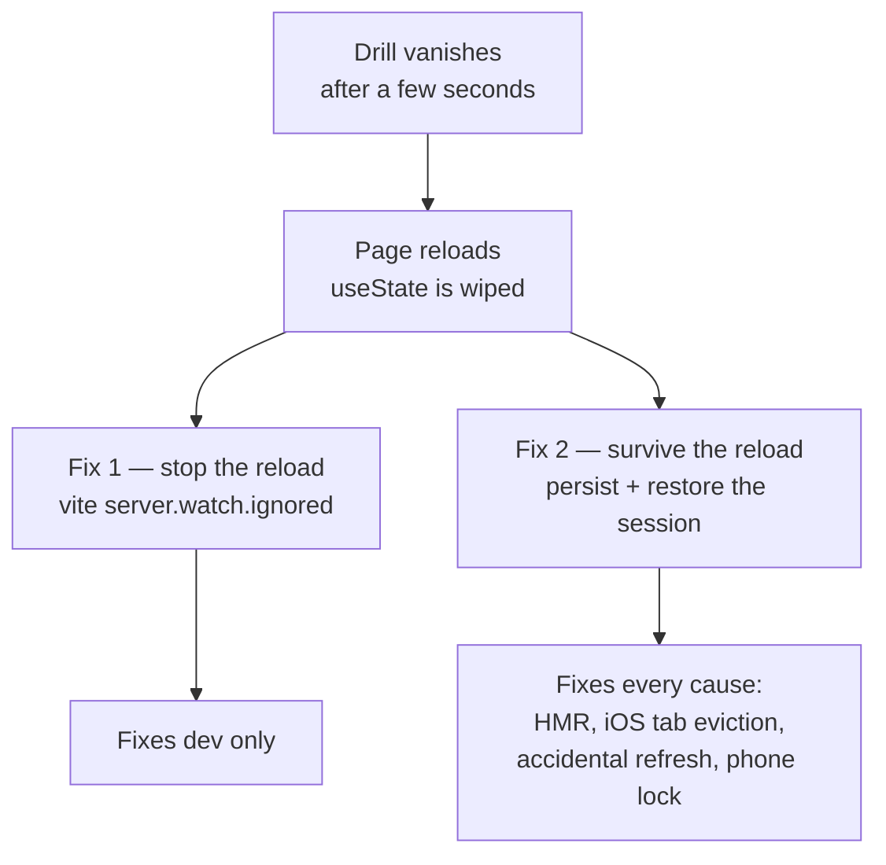
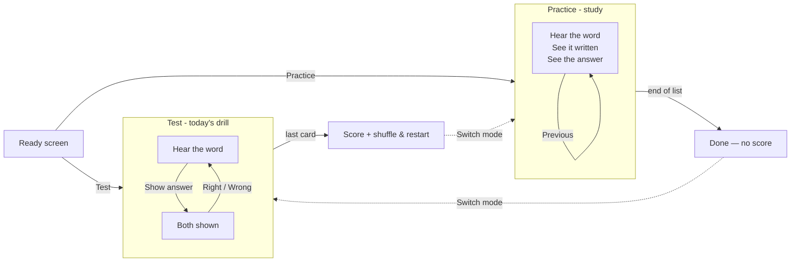

# Quickstart: Drill Resilience & Practice/Test Modes

**Feature ID:** 002-drill-resilience-and-modes
**Builds on:** `001-vocab-trainer`

## The headline

**"It's too quick, I have no time to answer" is not a pacing problem — it's a bug.**

The app has no timer. `PracticeCard` waits forever for a tap; there is no `setTimeout`, no
auto-advance, and no code path that navigates home by itself. The only thing that can produce
"the test stopped and went back to the main page" is a **full page reload**, which wipes the
`useState` that holds all app state and resets to `{ screen: 'home' }`.

Prime suspect: this repo lives in **iCloud Drive**, `vite.config.ts` sets no `server.watch` options,
and iCloud touches files constantly as it syncs. Vite reads that churn as source edits and issues a
full reload every few seconds. Task 1 confirms this in ten minutes.

## The two fixes for one bug



Fix 2 is the load-bearing one. It works **even if the diagnosis is wrong**, which is why it is in
the plan rather than betting everything on the watcher theory.

## The two modes



## Decisions already made

| Question | Answer |
|----------|--------|
| Where do you choose the mode? | On the Ready screen, **per run**. Nothing is saved on the list, so no storage migration. |
| Does practice mode score you? | No. Next/Previous only — it's revision, not assessment. |
| Does practice shuffle? | No — list order. Test shuffles. (Assumption A3, one line to flip.) |
| Does practice speak? | Yes. It's a listening app; you just also see the word. |
| Where is the session stored? | `localStorage`, key **`pvt.drill.v1`** via **`storage/drillRepo.ts`**, separate from the lists, 24-hour freshness window. |
| Does a restored drill speak on its own? | **No** — iOS drops speech without a user gesture. You get a "tap 🔊" hint instead. |
| Speech-rate slider? | Not in this feature. The "too quick" report turned out to be the reload bug. |

## The three things most likely to bite

1. **Restoring must not auto-speak.** A restore happens at page load with no user gesture in scope.
   An auto-speak would work perfectly on desktop Chrome and fail silently on iOS — the single
   constraint 001 is built around (`tts.ts:112`).
2. **Persist inside `act()`, not in a `useEffect`.** An effect runs a render later; a reload in that
   gap loses the card, which is the exact bug being fixed.
3. **`StudyCard`'s keydown effect needs no dependency array.** `index` lives in the closure — a `[]`
   array freezes the handler on card 1 and every arrow press navigates from the wrong card. Mirror
   `TestCard.tsx:33`.

## Rename to expect

`PracticeCard.tsx` → `TestCard.tsx`. It renders the *test*, and shipping a real practice mode next
to a `PracticeCard` that isn't it would be a permanent trap. Mechanical rename, own commit, Task 11.

## Files

**New:** `storage/drillRepo.ts` · `components/StudyCard.tsx` · `components/ErrorBoundary.tsx` (+ tests)
**Modified:** `vite.config.ts` · `main.tsx` · `App.tsx` · `state/{types,session,appMachine}.ts` · `components/{ReadyScreen,ResultsScreen}.tsx`
**Untouched:** `parse/**` · `lang/**` · `speech/**` · `storage/listRepo.ts` — no list-schema migration.

> **Naming correction, made during execution:** the plan called the new module
> `storage/sessionRepo.ts`, but **that name was already taken** — `sessionRepo` stores finished-drill
> *history* (key `pvt.sessions.v1`), which landed with the accounts feature after this plan was
> written. The resume module is therefore **`drillRepo`** (key `pvt.drill.v1`): "the drill in
> progress", clearly distinct from "the drills you have finished".

## Commands

```bash
npm run dev          # then leave idle 5 min — no "[vite] page reload" should appear
npm run preview      # production build, no HMR — the Task 1 control experiment
npm run typecheck && npm run lint && npm test && npm run build
```

**Baseline:** ~~172 tests across 12 files~~ → **428 tests across 31 files** at execution time. The
plan was written before the user-accounts work (auth, Firestore, score history) merged. After this
feature: **568 tests across 36 files**.

## Where to start

`tasks.md` **Task 1** — measure the reload before fixing it. Phases 1–2 (Tasks 1–7) fix the reported
bug and are shippable on their own; modes come after.

## Read next

`spec.md` (what & why, including why request #1 was re-framed) → `plan.md` (how) → `tasks.md` (do)
