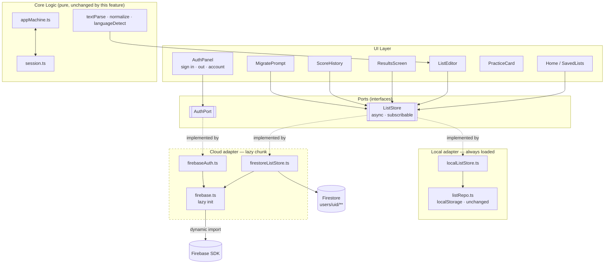
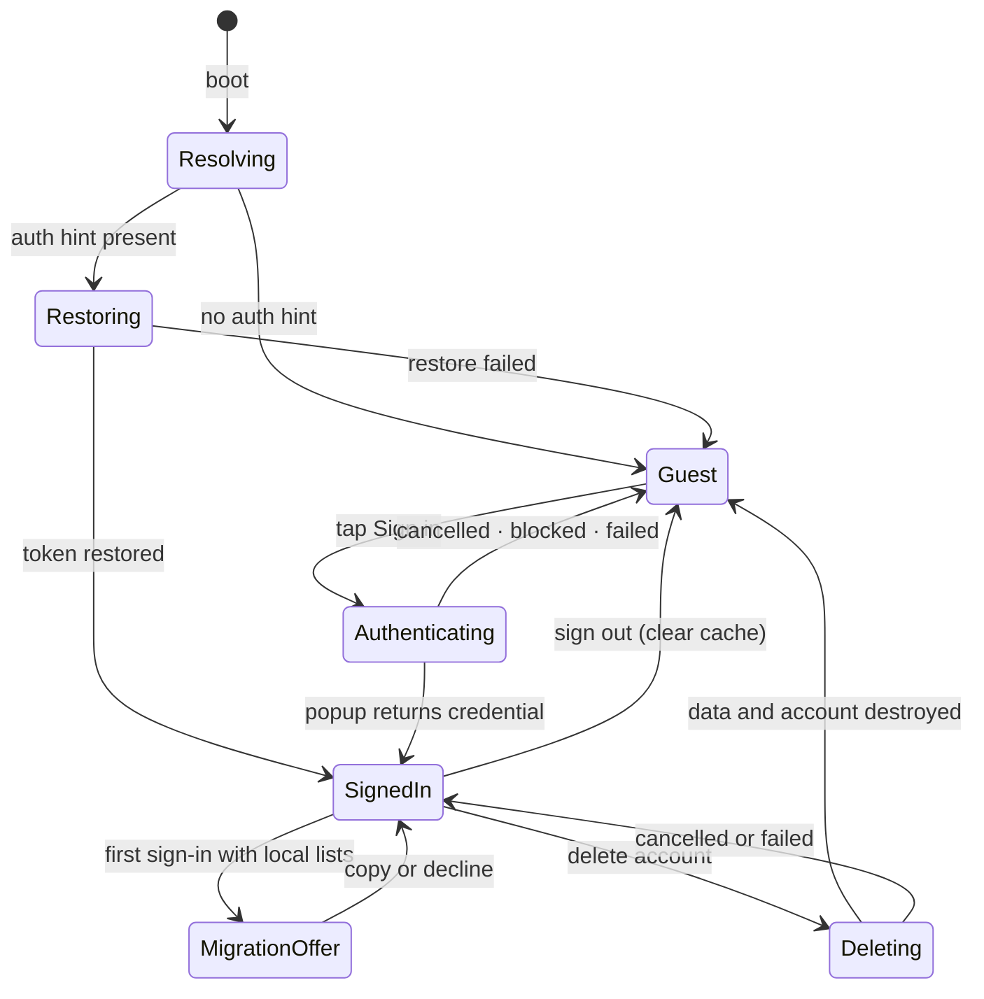

# Plan: User Accounts & Cloud-Saved Lists

**Feature ID:** 003-user-accounts
**Status:** DRAFT
**Created:** 2026-09-05
**Builds on:** `001-vocab-trainer` (React 19 · TS 6 · Vite 8 · Tailwind 4 · Vitest · oxlint)

## Technical Approach

The whole feature turns on one observation about the existing code: **`src/storage/listRepo.ts` is
already the only thing in the app that knows where lists live.** Nothing else touches
`localStorage`. That module is the seam, and this feature is largely the work of widening it from a
concrete module into an interface with two implementations.

Three genuinely separate problems:

1. **Identity.** Firebase Auth with the Google provider. Small surface, but with two sharp
   cross-browser hazards (popup vs redirect, and the resolving-auth-state flash).
2. **A second storage implementation.** Firestore, behind the same interface as `localStorage`.
   The real cost here is not Firestore — it is that the current interface is **synchronous** and a
   networked one cannot be.
3. **Getting a guest's data into an account.** A one-time, opt-in, idempotent copy.

Score history is a fourth, much smaller addition that rides on the same interface.

### The three ordering decisions that de-risk this

- **Async-ify the storage interface first, against `localStorage` only.** This is a pure refactor with
  no behaviour change, fully covered by the existing `listRepo` and `App` tests. Doing it as its own
  step means that when Firestore arrives, every async bug is unambiguously a Firestore bug. Merging
  the two would produce a change where a failure could be either, which is the expensive kind.
- **Lazy-load Firebase from the very first commit that adds it.** Retrofitting a bundle budget is a
  broken window that never gets fixed. See § Bundle budget.
- **Write security rules and their tests before the client that depends on them.** The rules are the
  *only* server-side protection this app will ever have — there is no backend to double-check them.

## Architecture



The dashed subgraph is the entire network surface, and it is behind a dynamic `import()`. A
signed-out user never fetches a byte of it.

`Core` — the reducer, the session logic, the parsers — is **completely untouched** by this feature.
That is the payoff from v1's decision to keep them pure, and it should stay true: if this work starts
editing `session.ts`, something has gone wrong.

### Auth state machine



`Resolving` is not cosmetic — see § R2. Rendering `Guest` while auth is still resolving is *the*
classic Firebase bug, and it looks to the user like their data was lost.

### Storage port

```ts
// src/storage/types.ts
export interface ListStore {
  /** Emits the full list set on subscribe and after every change. Returns an unsubscribe fn. */
  subscribeLists(onChange: (lists: WordList[]) => void, onError: (e: StoreError) => void): () => void
  saveList(list: WordList): Promise<WriteResult>
  renameList(id: string, name: string): Promise<WriteResult>
  removeList(id: string): Promise<WriteResult>

  subscribeSessions(listId: string | null, onChange: (r: SessionRecord[]) => void): () => void
  recordSession(record: SessionRecord): Promise<WriteResult>

  /** Release listeners and any cached data. Called on sign-out. */
  dispose(): Promise<void>
}
```

Two deliberate choices:

- **Subscription, not `getAll()`.** Firestore's natural shape is a live query, and the local store can
  emit-on-write in three lines. Modelling *both* as subscriptions removes `App.tsx`'s manual
  `refresh()` calls entirely and gives cross-tab sync for free. Forcing Firestore into a `getAll()`
  shape instead would mean polling — strictly worse code in both implementations.
- **`WriteResult`, not exceptions.** The existing `listRepo` already returns
  `{ ok: false, reason: 'quota' | 'missing' | 'unavailable' }` and `App.tsx` already renders a toast
  from it. Extending that union with `'offline' | 'permission' | 'network'` reuses a working pattern
  rather than introducing a second, parallel error style.

`listRepo.ts` itself is **not rewritten**. `localListStore` wraps it. Its 100%-covered test suite
keeps passing untouched, which is what makes the async refactor safe to do quickly.

## Data Model

```
users/{uid}                            { displayName, email, photoURL, createdAt, lastSeenAt }
users/{uid}/lists/{listId}             WordList  (listId === the existing client-generated uuid)
users/{uid}/sessions/{sessionId}       SessionRecord
```

Everything a user owns lives under `users/{uid}/`, which collapses the entire security model into a
single recursive rule. Any other shape (top-level `lists` with an `ownerId` field) needs a rule per
collection and a field check on every write, and gets one wrong eventually.

**`listId` reuses the client-generated uuid the app already puts on every list.** This is what makes
migration idempotent for free: copying the same list twice writes the same document twice, rather
than creating two.

New type, added to `src/state/types.ts`:

```ts
export interface SessionRecord {
  id: string
  listId: string
  /** Denormalised on purpose — the list may be deleted; the history must still read sensibly. */
  listName: string
  right: number
  wrong: number
  total: number
  pct: number
  /** Snapshot. Also the raw material for a future per-word mastery feature. */
  wrongPairs: WordPair[]
  finishedAt: number
  mode: 'full' | 'wrong-only'
  /** True when the user quit before the last card. Keeps partial runs out of averages. */
  partial: boolean
}
```

`listName` denormalisation is the one place this design accepts redundancy over normalisation, and
Story 5 requires it: history must survive deleting the list.

## Security

**The security rules are the entire server-side defence.** There is no backend to validate anything, so
a rule that is too permissive is exploitable by anyone who opens DevTools. Rules get written and
tested before the client code that relies on them.

```javascript
rules_version = '2';
service cloud.firestore {
  match /databases/{database}/documents {

    function isOwner(uid) {
      return request.auth != null && request.auth.uid == uid;
    }

    match /users/{uid} {
      allow read: if isOwner(uid);
      allow create, update: if isOwner(uid)
        && request.resource.data.keys().hasOnly(
             ['displayName','email','photoURL','createdAt','lastSeenAt']);
      allow delete: if isOwner(uid);

      match /lists/{listId} {
        allow read, delete: if isOwner(uid);
        allow create, update: if isOwner(uid)
          && request.resource.data.pairs.size() <= 500
          && request.resource.data.name is string
          && request.resource.data.name.size() <= 200;
      }

      match /sessions/{sessionId} {
        allow read, create, delete: if isOwner(uid);
        // History is a log. Nothing may rewrite the past.
        allow update: if false;
      }
    }

    // Anything not matched above is denied. Do not add a catch-all.
  }
}
```

The size caps are not paranoia about malice so much as about cost and blast radius: without them a
single client bug can write an unbounded document and there is no server to stop it.

### The Firebase API key is public, and that is fine

`apiKey` in the web config is **not a secret** — it identifies the project, it does not authorise
anything. It ships in the bundle by design and Google documents it as such. Two consequences worth
stating so nobody "fixes" it later:

- Do **not** attempt to hide it, proxy it, or keep it out of the repo for secrecy reasons. It will be
  in the built JS regardless.
- It still goes in `.env` as `VITE_FIREBASE_*` — for environment separation (dev project vs prod
  project), not for secrecy. Check in a `.env.example`.

What *does* protect the project: the security rules above, the Firebase **authorised domains** list,
and an HTTP-referrer restriction on the browser key in the Google Cloud console.

## Risks & Mitigations

### R1 — `signInWithRedirect` is broken for this app's deployment (HIGHEST)

This app is hosted on **Cloudflare Pages**, not Firebase Hosting. The `authDomain` will therefore be
`<project>.firebaseapp.com` while the app runs on `practice-vocabulary.pages.dev` — a different
origin. `signInWithRedirect` completes through a cross-origin iframe against `authDomain`, and
**Safari 16.1+, Firefox 109+ and Chrome M115+ all block that third-party storage access**. The result
is a sign-in that appears to work and then silently drops the user back signed-out.

**Mitigation: use `signInWithPopup`, exclusively.** It has no cross-origin storage dependency. The
tradeoff is popup blockers, which is a visible, explainable failure with a retry — vastly better than
an invisible one. Firebase's own alternatives (self-hosting the auth handler under `/__/auth/`, or a
reverse proxy) are real but add deployment machinery this project does not otherwise need.

Do not "improve" this to `signInWithRedirect` on mobile. That is the documented advice for Firebase
Hosting deployments and it is wrong here.

### R2 — The signed-out flash

`onAuthStateChanged` fires with `null` before it restores a persisted session. Rendering on that first
emission shows a signed-in user the guest home screen, with none of their lists — indistinguishable
from data loss.

**Mitigation:** the `Resolving` state in the auth machine. `AuthPanel` renders a neutral placeholder,
and `Home` renders nothing list-shaped, until the first *settled* auth emission. Covered by a test that
asserts the guest UI is never rendered before resolution.

### R3 — Bundle budget (NFR4)

`firebase/auth` (~40 KB gz) plus `firebase/firestore` (~90 KB gz) roughly **doubles** v1's entire
bundle. Loading it eagerly would break NFR4 for every guest, to serve a feature they are not using.

**Mitigation, and it shapes the module layout:**

- All Firebase imports live behind `src/auth/firebase.ts`, which does a dynamic `import()`. No
  top-level `from 'firebase/...'` anywhere else. Enforce with an oxlint `no-restricted-imports` rule
  so a future edit cannot quietly undo it.
- Returning users still need Firebase on boot. A tiny `pvt.auth.hint` flag in `localStorage`, set on
  sign-in and cleared on sign-out, tells the app whether to load the chunk at all. Guests: never.
- A `build` check asserts the main chunk stays under the v1 budget.

The hint flag is a cache of "this device has signed in before", not an auth claim. Forging it gains an
attacker a wasted download.

### R4 — The sync→async refactor touching more than expected

`App.tsx` currently calls `listRepo.getAll()` synchronously inside `useState`'s initialiser and calls
`refresh()` after every write. Every one of those becomes an effect plus a subscription.

**Mitigation:** do it as its own phase against `localStorage` only, with the existing `App.test.tsx`
as the regression net, before Firestore exists. Any test that breaks in that phase is a genuine
behaviour change, not a networking artefact.

### R5 — Offline writes and conflicting devices

Firestore's offline cache queues writes and replays them on reconnect. Two devices editing the same
list offline produce a whole-document last-write-wins outcome.

**Mitigation:** accept it, per assumption A4, and **document it in the UI** rather than in a comment —
a sync-status indicator (FR16) so "offline" is a visible state rather than a mystery. Field-level
merging or CRDTs would be disproportionate for a single-user personal app.

### R6 — Free-tier constraints

Cloud Functions require the paid Blaze plan, so **no server-side code exists** — including for account
deletion, which is the one place it would be conventional. Recursive subcollection deletion has to
happen client-side, document by document, before `deleteUser()`.

**Mitigation:** an explicit client-side delete loop that is safe to re-run (Story 7's partial-failure
criterion). Batched in chunks of ≤500 writes, which is also Firestore's batch limit.

### R7 — Firestore rejects `undefined`

`tsconfig.app.json` has `exactOptionalPropertyTypes`, and `RawRow` carries an optional `conf`.
Firestore throws on any `undefined` field value rather than skipping it.

**Mitigation:** strip undefined at the adapter boundary in `firestoreListStore`, and pin it with a test
using a list built from rows that have no `conf`. Do **not** set `ignoreUndefinedProperties` globally —
that hides real bugs elsewhere.

## Technology Choices

| Concern | Choice | Rationale |
|---|---|---|
| Auth + database | **Firebase** (`firebase@^12.18`) | Google sign-in is a first-class built-in provider — no separate Google Cloud OAuth client to wire up. Free Spark tier, and unlike Supabase's free tier it does not pause an idle project, which matters for an app whose whole premise is "practise again next week". |
| Sign-in flow | `signInWithPopup` | See R1. Non-negotiable for a non-Firebase-Hosting deployment. |
| Offline | `persistentLocalCache` + `persistentMultipleTabManager` | Delivers FR8 and cross-tab sync (FR7) as configuration rather than code. Note `enableIndexedDbPersistence` is the legacy API — do not use it. |
| Auth state → React | A small context + `useSyncExternalStore` | The auth object is an external mutable store; this is exactly the hook's purpose and it avoids a tearing bug under React 19 concurrent rendering. |
| Rules testing | `@firebase/rules-unit-testing` + Firebase emulator | NFR8. Rules are the only server-side check; untested rules are a guess. |
| Cloud state in React | Hand-rolled subscription in `App.tsx` | Resisting TanStack Query / Zustand deliberately: Firestore's `onSnapshot` *is* the cache and the subscription. A query library on top would be a second cache to keep coherent. |

## Pragmatic Programmer Review

- **DRY.** The one real duplication risk is list-shaped logic existing twice, once per store. Avoided by
  keeping both behind `ListStore` and keeping *all* pure logic (validation, sorting, capping) above the
  interface, so neither adapter re-implements it.
- **Orthogonality.** `session.ts`, `appMachine.ts` and the parsers must not change. If a task starts
  editing them, the abstraction has leaked.
- **Broken windows.** Two things get fixed rather than accumulated: the lint rule banning direct
  `firebase/*` imports (R3), and rules tests landing with the rules (NFR8). Both are near-impossible to
  retrofit.
- **Design for change.** The port/adapter split means swapping Firestore later, or adding an export
  feature, is one new implementation rather than a rewrite. It also means the whole feature is testable
  with an in-memory `ListStore` and no emulator.
- **Automate.** The emulator runs in CI; rules tests gate the build alongside the existing typecheck,
  lint, test and build steps.

## Testing Strategy

| Layer | How | Notes |
|---|---|---|
| `listRepo.ts` | Existing tests, unchanged | The canary for the async refactor |
| `localListStore` | Unit, real `localStorage` (jsdom) | Including the emit-on-write subscription contract |
| `firestoreListStore` | Emulator, `@firebase/rules-unit-testing` | Real client, real rules, no network |
| Security rules | Emulator | **Both** allow and deny per rule; the deny cases are the point |
| Auth context | Unit, faked `AuthPort` | Resolving-flash (R2), cancelled popup, blocked popup |
| Migration | Unit, in-memory stores | Idempotency: run it twice, assert the count is unchanged |
| `App.tsx` | Existing tests + new | Guest path must stay green with zero Firebase involvement |
| Bundle budget | Build-time assertion | Guards NFR4a against future eager imports |

The in-memory `ListStore` fake is what keeps the emulator off the critical path for most tests — only
the Firestore adapter and the rules genuinely need it.

## Deployment Impact

Additive to `deployment.md`; the Cloudflare Pages setup is otherwise unchanged.

1. Create the Firebase project; enable **Authentication → Google** and **Firestore** (production mode).
2. **Authorised domains** must include `localhost` and `practice-vocabulary.pages.dev`. Missing the
   production domain is the single most likely deploy-day failure — sign-in works locally and fails
   live.
3. Add `VITE_FIREBASE_*` variables to the Cloudflare Pages build environment. They are not secrets, but
   they must be present at build time or the built app points at nothing.
4. Deploy rules — `firebase deploy --only firestore:rules` — as a step that cannot be forgotten. Rules
   are not part of the Pages build.
5. Restrict the browser API key by HTTP referrer in the Google Cloud console.
6. **PR previews cannot sign in** (wildcard domains are not supported). Verify auth on `localhost` and
   production only. Noted in spec.md § Deferred.

## Open Questions

None blocking. Backend, guest-mode policy and scope were settled before this plan was written; the two
knowingly-deferred items are recorded in spec.md § Deferred.
