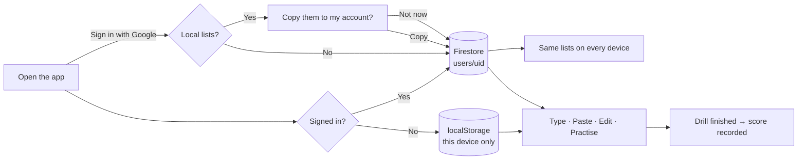

# Quickstart: User Accounts & Cloud-Saved Lists

**Feature ID:** 003-user-accounts
**Extends:** 001-vocab-trainer (shipped)

## What it does

Sign in with Google and your word lists follow you between devices instead of being stuck in one
browser. Every finished drill is recorded, so you can see whether you're actually improving.

The app still works **completely without an account** — signing in is an upgrade, not a gate.

## The flow



## Decisions already made

| Question | Answer |
|---|---|
| Sign-in provider | Google only — no email/password, no magic links |
| Backend | Firebase (Auth + Firestore), free Spark tier |
| Why not Supabase | Its free tier pauses idle projects after 7 days; this app's premise is "practise again next week" |
| Signed-out users | Fully supported, `localStorage`, exactly as v1. Zero Firebase downloaded |
| Existing local lists | Opt-in one-time copy on first sign-in. Never deleted from the device |
| What's stored per user | Word lists + score history. *Not* preferences or per-word stats (deferred) |
| Sharing between users | None. Every user's data is private to them |
| Offline | Works — Firestore's IndexedDB cache. Edits replay on reconnect |
| Two devices editing at once | Whole-document last-write-wins, with an explicit offline indicator |
| Hosting | Cloudflare Pages, unchanged |

## The three things most likely to bite

1. **`signInWithPopup`, never `signInWithRedirect`.** This app is on Cloudflare Pages, so Firebase's
   `authDomain` is a different origin. Redirect sign-in silently fails on Safari 16.1+, Firefox 109+
   and Chrome M115+. Most Firebase tutorials recommend redirect on mobile — that advice assumes
   Firebase Hosting and is wrong here. *(plan.md R1)*

2. **`onAuthStateChanged` fires `null` before it restores your session.** Render the guest UI on that
   first emission and a signed-in user sees an empty home screen — indistinguishable from losing all
   their data. Hence a distinct `resolving` state. *(plan.md R2)*

3. **Firebase roughly doubles the bundle.** `auth` + `firestore` ≈ 150 KB gzipped against v1's total
   budget of 150 KB. Everything Firebase is behind a dynamic `import()`, gated on a
   `pvt.auth.hint` flag, so guests download none of it. A lint rule enforces it. *(plan.md R3)*

## Data model

```
users/{uid}                       name, email, timestamps
users/{uid}/lists/{listId}        WordList — listId is the existing client uuid
users/{uid}/sessions/{sessionId}  SessionRecord — append-only
```

Everything under `users/{uid}/` means the whole security model is one recursive rule. Reusing the
client's existing uuid as the document id is what makes migration idempotent for free.

## Architecture in one line

`listRepo.ts` was already the only module that knew where lists live. This feature widens that seam
into a `ListStore` interface with two implementations — `localStorage` and Firestore — and picks one
based on auth state. `session.ts`, `appMachine.ts` and `src/parse/` are not touched at all.

## Build order (do not reorder)

| Phase | What | Why it's here |
|---|---|---|
| 1 | Firebase project + bundle guard | Guard lands before the code it guards |
| 2 | **Async storage port, `localStorage` only** | Isolates the sync→async refactor from networking |
| 3 | Firebase bootstrap + auth | |
| 4 | **Security rules + their tests** | The only server-side check — written before clients depend on it |
| 5 | Firestore store | Every async bug here is now unambiguously a Firestore bug |
| 6 | Migration | |
| 7 | Score history | |
| 8 | Account deletion, docs, deploy | |

## Heads-up: this reverses two v1 promises

Spec 001 says, deliberately, **"no backend"** (NFR1) and **"no user data leaves the device"** (NFR2).
This feature knowingly reverses both — for signed-in users only. Task 25 annotates the 001 spec so the
two documents don't quietly contradict each other.

## Stack additions

| | |
|---|---|
| Runtime dep | `firebase@^12.18` (lazy-loaded) |
| Dev deps | `@firebase/rules-unit-testing`, `firebase-tools` |
| New npm scripts | `test:rules`, `check:bundle` |
| New env | `VITE_FIREBASE_*` — public config, **not** secrets |

## Done when

```bash
npm run typecheck && npm run lint && npm test && npm run test:rules && npm run check:bundle && npm run build
```

…plus, on the live URL and **on a phone**: sign in, save a list, see it on a second device, go offline
and still practise, finish a drill and see the score in history, sign out and confirm nothing of yours
is left behind.
