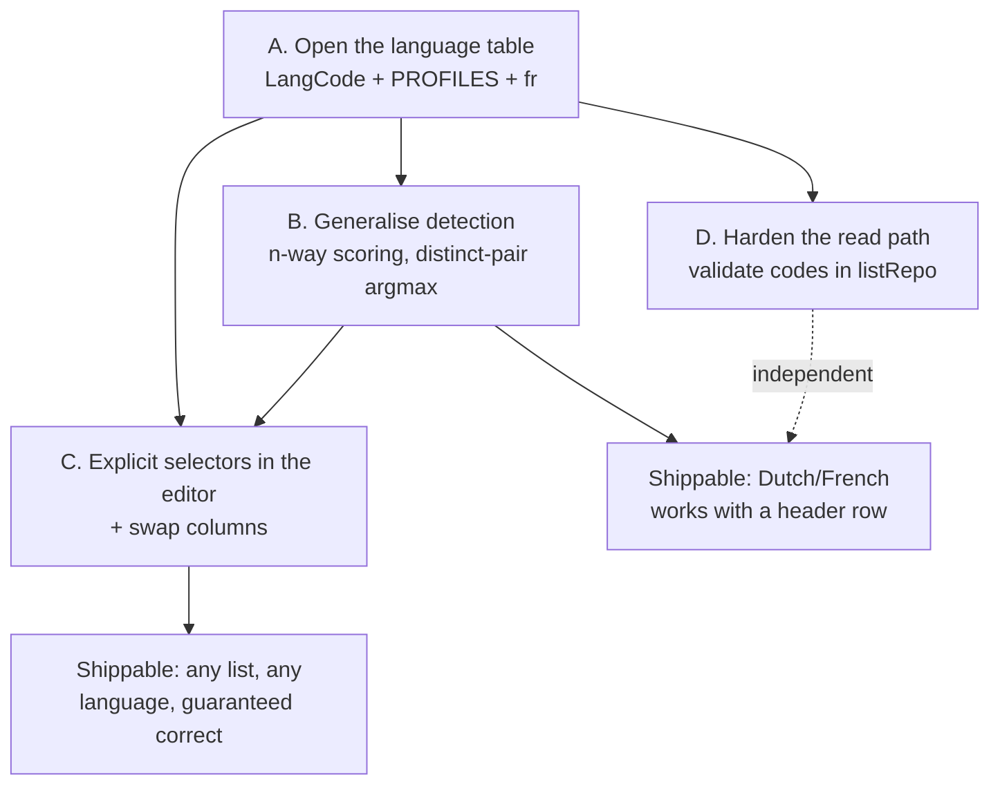

# Plan: Multi-Language Lists (Dutch↔French and beyond)

**ID:** 004-multi-language-lists
**Spec:** `spec.md`

## Strategy

Three workstreams. A is data and is a prerequisite for everything. B fixes the defect and is
**independently shippable**. C is the design improvement that makes the defect impossible rather
than merely less likely.



C depends on B only for its prefill values, not for its correctness. If you stop after B you have a
detector that can name French; if you stop after C you have a UI that makes detection advisory.
Both are honest stopping points. C is where the feature actually pays off.

## Pragmatic Programmer review

| Principle | Application here |
|-----------|------------------|
| **DRY** | The language table is already the single source of truth — the work is to finish the job by folding `DUTCH_DIGRAPHS` / `DUTCH_SUFFIXES` / `MARKER_WORDS` into one `PROFILES` record, so a new language cannot be half-added. |
| **Orthogonality** | Detection, speech, storage and the editor each touch language through exactly one export. The measure of success is that adding German afterwards touches one file. |
| **Fix the cause, not the symptom** | The cause of "the wrong voice speaks" is not a missing enum member — it is that the app *guesses* something the user knows. Adding `'fr'` to a binary detector would make the guess wrong in new ways. Hence the selectors. |
| **Broken windows** | `dutchness()` is a two-language shape wearing a general name. Adding a third language beside it would cement it permanently. Replace it in the same change. |
| **Crash early** | The exception, deliberately: `listRepo`'s read path stays total and coerces bad data. A corrupt key must never white-screen the app — that contract is already established (`listRepo.ts:29`). |
| **Automate** | The marker-overlap rule (FR-9) is a test that fails when a future language introduces a shared function word — not a comment asking the next person to be careful. |
| **Design for change** | `LANG_CODES` becomes the thing every consumer iterates. After this feature, a language is data. |

## Workstream A — Open the language table

### A1. `LangCode` and the profile record

`src/lang/languages.ts` today exports three Dutch-specific constants alongside the general table.
Replace them with one profile per language:

```ts
export type LangCode = 'en' | 'nl' | 'fr'
export const LANG_CODES: readonly LangCode[] = ['en', 'nl', 'fr'] as const

export interface LangProfile {
  /** High-frequency function words. Strongest signal, when exclusive. */
  markers: readonly string[]
  /** Spelling sequences typical of the language. Carries short noun lists. */
  digraphs: readonly string[]
  /** Word endings common in dictionary/infinitive forms. Weakest signal. */
  suffixes: readonly string[]
}

export const PROFILES: Record<LangCode, LangProfile> = { … }
```

**Keep `MARKER_WORDS`, `DUTCH_DIGRAPHS` and `DUTCH_SUFFIXES` deleted, not deprecated.** They have
exactly one consumer (`languageDetect.ts`) plus their own tests; leaving them behind would give the
next person two places to add a language to.

### A2. The French profile

```ts
fr: {
  markers: ['le', 'la', 'les', 'un', 'une', 'du', 'des', 'est', 'et',
            'dans', 'pour', 'avec', 'je', 'il', 'elle', 'ne', 'pas',
            'que', 'qui', 'ce', 'sur', 'son', 'sa', 'au', 'aux'],
  digraphs: ['é', 'è', 'ê', 'ç', 'à', 'â', 'ù', 'û', 'ô',
             'eau', 'ai', 'oi', 'qu', 'gn', 'ill', 'eux', 'ez'],
  suffixes: ['er', 'ir', 'tion', 'ment', 'eux', 'euse', 'ée'],
},
```

**The accents are the load-bearing signal.** Neither English nor Dutch vocabulary uses `é è ê ç à`
in any quantity, so a single accented character is worth more evidence than any function word — and
a school vocabulary list is mostly content words with no function words at all (`dochter / daughter`
has none, which is why `DUTCH_DIGRAPHS` exists in the first place).

`de` is deliberately **absent** from the French markers even though it is one of the commonest French
words: it is equally common in Dutch, so A3 would strip it anyway. Leaving it out of the source data
makes that visible to a reader.

### A3. Cross-profile marker overlap — REVISED DURING IMPLEMENTATION

**The plan originally called for excluding markers shared between profiles (`EXCLUSIVE_MARKERS`).
That was wrong and was not built.** Recorded here rather than quietly dropped.

Global exclusion throws away real signal. `de` fails to discriminate Dutch *from French* — but it
discriminates both from English perfectly well. Removing it globally would have made every
Dutch/English list harder to call in order to help Dutch/French lists.

What was built instead: **score each language independently against its full marker list**, and
choose the winning pair jointly (§ B2). A shared marker then lifts both candidates equally and
cancels out of the comparison *between them*, while still separating both from a language that
lacks it. The overlap handles itself, and no data has to be pruned.

The integrity test changed accordingly. Instead of asserting the exclusive sets are disjoint, it
asserts that **every language has at least one marker no other language claims** — the property that
actually matters, because a language whose markers are all shared could never win on function words
alone. `de` belonging to both Dutch and French is asserted as the documented, expected case.

## Workstream B — Generalise detection

### B1. The scoring function

`dutchness(text): number` becomes:

```ts
/**
 * How much `text` looks like `lang`, per token.
 *
 * Independent per language — no cross-subtraction. The old binary form scored
 * Dutch markers +3 and English markers -3, which is a two-language trick with no
 * three-language equivalent: with three candidates, "not English" no longer
 * implies "Dutch".
 */
function profileScore(text: string, lang: LangCode): number
```

Weights carry over unchanged (`marker +3`, `digraph +1`, `suffix +0.5`, divided by token count) so
that existing English/Dutch detection tests keep passing. **The weights are not the interesting part
and should not be tuned in this feature** — changing them and the algorithm at once makes a
regression impossible to attribute.

### B2. Distinct-pair argmax

```ts
// Every ordered pair of DISTINCT languages, scored as one assignment. Choosing
// the columns jointly rather than classifying each on its own is what guarantees
// two different languages — the property the old comparative form got for free
// and an independent argmax would lose.
for (const a of LANG_CODES)
  for (const b of LANG_CODES)
    if (a !== b) candidates.push({ a, b, total: score1[a] + score2[b] })
```

Six candidates for three languages. Sort, take the best, and compare against the runner-up:

```ts
export const MARGIN = 0.15   // score units per token
if (best.total - runnerUp.total < MARGIN) return DEFAULT_DETECTION
```

**Why a margin and not a floor:** an absolute floor punishes short lists, where every score is small
because most tokens are content words that match nothing. What matters is whether one assignment
*stands out*, which is a relative question. `DEFAULT_DETECTION` keeps `source: 'default'`, so the UI
already renders it amber and the user is asked rather than misled.

`MARGIN` is exported so its tests can state the boundary rather than guess at it.

### B3. Header matching

One line, but the one that makes the table authoritative:

```diff
-  for (const lang of ['en', 'nl'] as const) {
+  for (const lang of LANG_CODES) {
```

**Gotcha — `matchHeaderCell` strips non-`a-z`:** `value.replace(/[^a-z]/g, '')` at
`languageDetect.ts:57` turns `français` into `franais`. Add `francais` **and** `franais` to the
aliases, or relax the strip to `[^a-zà-ÿ]`. The alias route is safer: relaxing the strip changes how
every existing alias matches, and the fuzzy tolerance is calibrated against the stripped forms.

**Gotcha — `tolerance()` and short aliases:** `fr` is two characters, so `tolerance('fr') === 0` and
it must match exactly. That is correct and intended — a budget of even 1 would let `fr` match `er`,
`or` and `de`. Do not widen it.

## Workstream C — Explicit selectors

### C1. `LangSource` gains a member

```ts
export type LangSource = 'header' | 'heuristic' | 'default' | 'manual'
```

`'manual'` outranks everything. `ListEditor` currently derives its badge colour from
`detection.source !== 'header'` (`ListEditor.tsx:161`); that becomes a check against a set of
authoritative sources so the two green cases are named in one place.

**Storage impact: none.** `langSource` is already persisted as a free string and never validated —
old lists carry `'header'`/`'heuristic'`/`'default'` and keep working.

### C2. Editor state

The editor currently derives languages from rows on every keystroke, with no override:

```ts
const detection = useMemo(() => detectLanguages(normalizeRows(rows)), [rows])
```

Add an override that, once set, wins:

```ts
const [override, setOverride] = useState<{ col1: LangCode; col2: LangCode } | null>(
  // Editing a saved list that was set manually starts pinned.
  initialLangSource === 'manual' && initialLangs ? initialLangs : null,
)
const detected = useMemo(() => detectLanguages(normalizeRows(rows)), [rows])
const effective = override
  ? { col1Lang: override.col1, col2Lang: override.col2, source: 'manual' as const,
      headerConsumed: detected.headerConsumed }
  : detected
```

**`headerConsumed` must still come from detection even when overridden.** It answers "is row 0 a
header?", which is a question about the *rows*, not about the languages. Taking it from the override
would silently re-admit the header row as a practisable word pair — a bug that shows up as one
nonsense card at the end of a drill.

**Gotcha — the editor must accept the saved languages as props.** `ListEditor` takes
`initialRows`/`initialName`/`listId` but not `col1Lang`/`col2Lang`/`langSource`, so re-opening a
saved list currently re-detects from scratch and would discard a manual choice. Two new optional
props; `App.tsx`'s `EDIT_LIST` call site passes them.

### C3. Distinct-language enforcement (FR-16)

When the user sets column 2 to the language column 1 already holds, move column 1 to the value
column 2 just had — an exchange, not a rejection:

```
before: [Dutch] [French]   user sets col2 → Dutch
after:  [French] [Dutch]
```

A disabled option would leave the user unable to express "swap these", which is exactly what they
are usually trying to do. Do not `alert()`, and do not silently ignore the change.

### C4. Swap columns (FR-19)

```ts
function handleSwap() {
  setRows((c) => c.map((r) => ({ ...r, col1: r.col2, col2: r.col1 })))
  setOverride({ col1: effective.col2Lang, col2: effective.col1Lang })
}
```

Note it sets the override — swapping the contents would otherwise cause the next detection pass to
swap the languages back, and the two changes would cancel out to a no-op that looks like a broken
button.

**Gotcha — `conf` must be preserved** when it exists (`RawRow.conf`, reserved for the deferred OCR
path). `{ ...r, col1: r.col2, col2: r.col1 }` does that; `{ col1: r.col2, col2: r.col1 }` does not.

## Workstream D — Harden the read path

`isWordList` (`listRepo.ts:16`) gains a language check, and the read path coerces rather than rejects:

```ts
function toLangCode(value: unknown, fallback: LangCode): LangCode {
  return typeof value === 'string' && (LANG_CODES as readonly string[]).includes(value)
    ? (value as LangCode)
    : fallback
}
```

**Coerce, do not filter.** Dropping the list would lose the user's words over a bad two-character
field; coercing to `en`/`nl` loses at most the accent on one drill, which the amber badge and the
selects then let them fix. This matches the module's existing contract that the worst acceptable
outcome is degraded, not destructive (`listRepo.ts:24`).

**Gotcha — this is `listRepo`, which `localListStore` wraps and whose tests are the safety net for
the 003 storage refactor.** Extend those tests; do not restructure the module.

## Files

**Modified**
`src/lang/languages.ts` · `src/parse/types.ts` · `src/parse/languageDetect.ts` ·
`src/components/ListEditor.tsx` · `src/App.tsx` (pass saved languages to the editor) ·
`src/state/appMachine.ts` · `src/storage/listRepo.ts` · `src/test/fixtures/text.ts` · `README.md`

**`src/state/appMachine.ts` was NOT in this list originally, and the plan was wrong.** `EDIT_LIST`
projects a `WordList` down to `RawRow[]` and drops the language fields on the floor, so there is no
route by which a saved list's languages can reach the editor without the `editing` state carrying
them. The fix is two optional fields (`langs`, `langSource`) alongside the `name` and `listId` that
state already denormalises for exactly the same reason — the existing pattern, extended.

The alternative — having `App` look the list up by `state.listId` — was rejected: it would be a
second, inconsistent route for list data to reach the editor, and it would break silently if
`EDIT_LIST` ever became reachable for a list not yet in `lists`.

**New**
`src/lang/languages.test.ts` — the profile-integrity suite (FR-5, FR-9). There is no test file for
`languages.ts` today because it was pure data; once it carries a derived export it needs one.

**Untouched — and the plan is wrong if any of these change**
`src/speech/**` · `src/state/**` · `src/storage/{sessionRepo,localListStore,memoryStore,types}.ts` ·
`src/auth/**` · `src/parse/{textParse,normalize}.ts` · `src/components/{PracticeCard,ReadyScreen,VoiceWarning,SavedLists,Home,PastePanel}.tsx`

## Risks

| Risk | Mitigation |
|------|-----------|
| Generalising the scorer regresses English/Dutch detection. | The 241-test baseline includes `languageDetect.test.ts`. Port it **unchanged** first (Task 4), watch it go red, make it green, and only then add French cases. Any English/Dutch assertion that needs editing to pass is a regression, not a stale test. |
| French/English confusion on Latinate nouns (`nation / nation`). | The accent digraphs carry it. Where they cannot, `MARGIN` sends it to `default` and the selects settle it — which is precisely why C exists. |
| `MARGIN` tuned to the fixtures rather than to reality. | Pick it from the observed gap on the real fixtures (Task 5 records the numbers), and accept `default` readily. An amber badge is a good outcome; a confident wrong answer is not. |
| Editor re-render cost with three languages on a 200-row list. | Scoring is 3 languages × 2 columns over the same token stream — a constant-factor increase on work already done per keystroke. Measure only if the long-list warning path feels slow. |
| Scope creep into German/Spanish. | A5. The table is open; the data is not written. |
