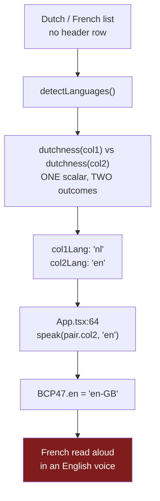
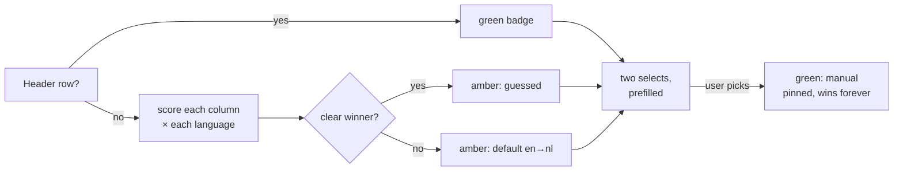

# Quickstart: Multi-Language Lists (Dutch↔French)

**Feature ID:** 004-multi-language-lists
**Builds on:** `001-vocab-trainer`

## The headline

**Yes, changes are needed — and one of them is a bug, not a missing enum member.**

`LangCode` is `'en' | 'nl'`, so the obvious answer is "add `'fr'`". That is fifteen lines and it is
not the problem. The problem is that `detectLanguages` is *structurally* binary: it scores each
column with a single scalar called `dutchness()` and hands `nl` to the higher one and `en` to the
other. **No input can make it return `'fr'`.**

So a Dutch/French list pasted without a header row is labelled Dutch → English, and `App.tsx:64`
reads the French column with `utterance.lang = 'en-GB'`. French words, English accent, and a badge
that looks confident about it.

It gets worse: `DUTCH_DIGRAPHS` contains `oe`, `eu`, `ee`, `ui` — all common French (`coeur`, `peu`,
`année`). French text scores as *positively Dutch*, so the guess is not random, it is wrong with
conviction.

## What breaks, in one picture



## What does NOT break — and this is most of the app

| Area | Why it is already fine |
|---|---|
| **Storage** | `isWordList()` (`listRepo.ts:16`) validates `id`, `name`, `pairs` — never the language codes. `'fr'` round-trips through `localStorage` and Firestore with **no schema bump, no migration**. |
| **Speech** | `pickVoice` (`tts.ts:81`) is generic: exact BCP-47 tag, then language prefix. Add `fr: 'fr-FR'` and it finds `fr-FR`, `fr-CA` or bare `fr` unchanged. |
| **The drill** | `session.ts`, `appMachine.ts`, `Score` — no language anywhere. |
| **Components** | `ReadyScreen`, `PracticeCard`, `VoiceWarning` all render `LANG_NAMES[…]` generically. |
| **Tokeniser** | `/[a-zà-ÿ]+/g` already covers `é è ê ç à û`. |

The single source of truth in `src/lang/languages.ts` did its job. The work is to finish it.

## The decision worth arguing about

**Stop guessing. Add two language dropdowns to the editor.**

With two languages a coin flip is right half the time by accident. With three it is right a third of
the time, and French-vs-English on Latinate school nouns (`nation / nation`) is genuinely hard.

The user knows the answer with certainty. Asking costs one glance; guessing wrong costs a whole drill
in the wrong accent. It is ~30 lines in a component already on screen, and it makes German or Spanish
a data-only change afterwards.

Detection stays — generalised to n languages, and demoted to a **prefill**, which is what a heuristic
should have been all along.



## Decisions already made

| Question | Answer |
|---|---|
| Just French, or German and Spanish too? | **French only.** Every added language dilutes the heuristic, and no one asked for the others. The table is open; the data is not written. |
| Storage migration? | **None.** Language codes were never validated on read, so `'fr'` just works. |
| Does column 2 stay the spoken side? | **Yes.** Changing it would rewrite `App.tsx`, `ReadyScreen`, `PracticeCard` and every fixture — to solve what a **Swap columns** button solves in one tap. |
| Keep the spelling heuristic at all? | Yes, as a prefill. It saves a click when confident and defers when not. |
| What if it is not confident? | `MARGIN` sends it to `source: 'default'`, which already renders amber. **An amber badge is a good outcome; a confident wrong answer is not.** |
| Do the weights get retuned? | No. Same `+3 / +1 / +0.5`. Changing the algorithm and the weights together makes a regression impossible to attribute. |

## The five things most likely to bite

1. **`français` arrives as `franais`.** `matchHeaderCell` strips everything outside `a-z`
   (`languageDetect.ts:57`), so the cedilla *and* the `ç` are gone. Put both `francais` and `franais`
   in the aliases and comment why, or someone will delete the "typo".
2. **`de` is as Dutch as it is French.** So is `en`. So is `a` (English and French). The old scorer
   dodged this by subtracting English markers from the Dutch score — a two-language trick with no
   three-language equivalent. Markers shared across profiles must be excluded, and a **test**
   enforces it so the next language cannot silently reintroduce one.
3. **`headerConsumed` must never come from the manual override.** It answers "is row 0 a header?" —
   a question about the *rows*, not the languages. Get it from detection even when the user has
   overridden. Getting it wrong admits the header row as a word pair: one nonsense card at the end
   of a drill.
4. **`handleConfirm` re-detects.** `ListEditor.tsx:137` calls `detectLanguages` again on save and
   uses *that*, not what is rendered. Miss it and the manual choice is discarded at the exact moment
   it matters.
5. **Swap must set the override.** Swap the contents only, and the next detection pass swaps the
   languages back — the two cancel out and the button looks broken.

## Files

**Modified:** `lang/languages.ts` · `parse/{types,languageDetect}.ts` · `components/ListEditor.tsx` ·
`App.tsx` · `storage/listRepo.ts` · `test/fixtures/text.ts` · `README.md`
**New:** `lang/languages.test.ts` (profile-integrity suite)
**Untouched — the plan is wrong if these change:** `speech/**` · `state/**` · `auth/**` ·
`parse/{textParse,normalize}.ts` · every other component

## Commands

```bash
npm test -- languageDetect      # the defect lives here
npm test -- languages           # the "adding a language is data" guarantee
npm run typecheck && npm run lint && npm test && npm run check:bundle
```

**Baseline: 241 tests across 18 files, all green.** No bundle growth beyond noise — two word arrays
against a 150 KB budget.

## Where to start

`tasks.md` **Task 4** is the pivot: port the scorer to the new profile table and run the *existing*
`languageDetect` tests unchanged. Green there proves the data move changed nothing, so any later
failure belongs to the new algorithm. If an existing English/Dutch assertion needs editing to pass,
that is a regression, not a stale test.

**Phase 2 (Tasks 4–7) is independently shippable** — Dutch/French works with a header row. Phase 3 is
what makes a wrong guess impossible rather than rarer.

## Read next

`spec.md` (what & why, including the five defects) → `plan.md` (how) → `tasks.md` (do)
