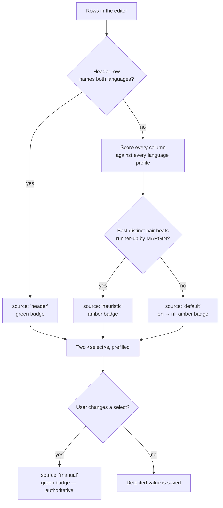

# Spec: Multi-Language Lists (Dutch↔French and beyond)

**ID:** 004-multi-language-lists
**Status:** DRAFT
**Created:** 2026-09-05
**Builds on:** `001-vocab-trainer`
**Feature Type:** Enhancement + Bug Fix (latent)
**Complexity:** Low-Medium

## The question asked

> "Do we need to change anything to support Dutch↔French practice as well?"

**Yes.** Five things, and one of them is a correctness defect rather than a missing enum member.

## Overview

The app is built around a two-language world. `src/lang/languages.ts` is an excellent single source
of truth — BCP-47 tags, header aliases and marker words all live in one file, exactly so they cannot
drift — but the *type* it exports is a closed union of two members, and the detector built on it is
structurally binary, not merely two-valued.

Adding French is therefore two jobs of very different size:

| Job | Size | Risk |
|---|---|---|
| Add `'fr'` to the language table (tag, name, header aliases) | ~15 lines | None |
| Make column-language detection work with more than two candidates | Rewrite of `dutchness()` | **This is the whole feature** |

Everything else — speech, storage, the drill, the score, the components — is already language-generic
and needs no change beyond copy.

## What actually breaks today

### D-1 — The detector cannot ever return French (defect)

`detectLanguages` (`src/parse/languageDetect.ts:99`) works by scoring each column with a single
scalar, `dutchness()`, and then assigning `nl` to the higher-scoring column and `en` to the other:

```ts
return left > right
  ? { col1Lang: 'nl', col2Lang: 'en', source: 'heuristic', … }
  : { col1Lang: 'en', col2Lang: 'nl', source: 'heuristic', … }
```

There is no branch that can produce `'fr'`. A Dutch/French list pasted **without a header row** is
therefore labelled `nl` / `en`, and `App.tsx:64` hands the French column to the speech synthesiser
with `utterance.lang = 'en-GB'`. The user hears French words read in an English voice, with a badge
that says "Dutch → English".

### D-2 — French scores as Dutch, so the guess is confidently wrong

`DUTCH_DIGRAPHS` (`languages.ts:48`) contains `oe`, `eu`, `ee`, `ui`, `aa`. Three of those are common
French spellings — `coeur`, `peu`, `année` — so French text earns a *positive* dutchness score. In a
Dutch/French list both columns score similarly, which lands on either a coin-flip or the
`left === right → DEFAULT_DETECTION` path that returns `en` / `nl`.

This is worse than no detection: it produces a wrong answer that looks deliberate.

### D-3 — Marker words collide across languages

`de` and `en` are high-frequency function words in **both** Dutch and French. `a` is English and
French. The current binary scorer sidesteps this by subtracting English markers from the Dutch score
(`languageDetect.ts:80`), which is a two-language hack that has no three-language equivalent.

### D-4 — Two hardcoded language literals outside the language table

- `DEFAULT_DETECTION` (`languageDetect.ts:18`) hardcodes `en`/`nl`.
- `matchHeaderCell` (`languageDetect.ts:59`) iterates a literal `['en', 'nl'] as const` rather than
  `LANG_CODES`, so a French header alias would never be matched even once added to the table.

### D-5 — UI copy names the two languages

`ListEditor.tsx:190` tells the user: *"Add a first row reading "English" and "Dutch" to set this
exactly."* For a Dutch/French list this instruction is actively misleading.

## What does *not* break — verified

This is the good news, and it is why the change is small.

| Area | Why it is already fine |
|---|---|
| **Storage schema** | `WordList.col1Lang` serialises as a plain string. `isWordList()` (`listRepo.ts:16`) validates only `id`, `name` and `pairs` — it never inspects the language codes. `'fr'` round-trips through `localStorage` and the planned Firestore store with **no schema-version bump and no migration**. |
| **Speech** | `pickVoice` (`tts.ts:81`) is written against `BCP47[lang]` plus a language-prefix fallback. Give it `fr: 'fr-FR'` and it finds `fr-FR`, `fr-CA` or bare `fr` with no code change. |
| **The drill** | `session.ts`, `appMachine.ts` and `Score` never mention a language. |
| **Components** | `ReadyScreen`, `PracticeCard` and `VoiceWarning` all render `LANG_NAMES[…]` generically. Only `ListEditor`'s hint string is hardcoded. |
| **Parsing** | `textParse.ts` is delimiter logic only. `normalize.ts` is whitespace only. The tokeniser `/[a-zà-ÿ]+/g` (`languageDetect.ts:74`) already covers `é è ê ç à û`. |
| **Bundle budget** | Two extra word arrays are a few hundred bytes against a 150 KB gzipped budget. |

## The design decision: stop guessing, let the user choose

The heuristic exists because v1 had no UI for setting the language. With two languages a coin flip is
right half the time by accident. With three it is right a third of the time, and the confusable pair
(French vs English, which share a great deal of Latin vocabulary) is genuinely hard to separate on a
40-word list of nouns.

**This feature adds two explicit language selectors to the list editor**, prefilled by detection.

Rationale:

- It removes an entire category of bug permanently rather than pushing the failure rate down a bit.
- The user knows the answer with certainty. Asking them costs one glance; guessing wrong costs a
  whole drill read in the wrong accent.
- It is roughly thirty lines in a component that is already open in front of the user.
- Adding German or Spanish afterwards becomes a data-only change: one entry in `languages.ts`.

Detection is **kept and generalised**, demoted to what a heuristic should be — a prefill that saves a
click when it is confident, and defers to the user when it is not.



## User Stories

**US-1 — I can practise French from Dutch**
> As a Dutch-speaking learner studying French
> I want to build a Dutch/French list and hear the French read in a French voice
> So that I am practising pronunciation and not a French word in an English accent

**US-2 — I set the languages myself when the guess is wrong**
> As someone whose list the detector misread
> I want to pick each column's language from a dropdown
> So that I can fix it in one tap instead of retyping a header row and hoping

**US-3 — My existing English/Dutch lists are untouched**
> As an existing user with saved lists
> I want everything I already saved to keep working exactly as before
> So that adding a language costs me nothing

**US-4 — A fourth language is a data change, not a project**
> As the person maintaining this
> I want adding German or Spanish to mean one entry in `languages.ts`
> So that this is the last time language support needs designing

## Requirements

### Functional — the language table

| # | Requirement |
|---|-------------|
| FR-1 | `LangCode` gains `'fr'`. `LANG_CODES` becomes the single enumeration every consumer iterates. |
| FR-2 | `BCP47.fr = 'fr-FR'`; `LANG_NAMES.fr = 'French'`. |
| FR-3 | `HEADER_ALIASES.fr` covers `french`, `frans`, `français`, `francais`, `fr`. Dutch aliases gain `nederlands`-adjacent forms already present; no existing alias is removed. |
| FR-4 | The per-language spelling profile (markers / digraphs / suffixes) moves from three top-level Dutch-only constants into a single `PROFILES: Record<LangCode, LangProfile>` table. |
| FR-5 | Adding a language means adding one entry to `PROFILES`, `BCP47`, `LANG_NAMES` and `HEADER_ALIASES` — and nothing else, anywhere. |

### Functional — detection

| # | Requirement |
|---|-------------|
| FR-6 | `matchHeaderCell` iterates `LANG_CODES`, not a literal list, so every language in the table is matchable from a header row. |
| FR-7 | The heuristic scores **each column against each language independently**. The cross-subtraction of English markers is removed. |
| FR-8 | The chosen assignment is the highest-scoring pair of **distinct** languages across both columns. |
| FR-9 | A marker word that appears in more than one profile is excluded from scoring, because it carries no discriminating signal. This is enforced by a test, not by discipline. |
| FR-10 | When the winning pair does not beat the runner-up by `MARGIN`, detection returns `source: 'default'` rather than a low-confidence guess. |
| FR-11 | `DEFAULT_DETECTION` stays `en` → `nl` — the commonest case for existing users. |
| FR-12 | Detection remains a pure function of `RawRow[]`. No I/O, no React, no locale sniffing. |

### Functional — the editor

| # | Requirement |
|---|-------------|
| FR-13 | The editor shows two labelled `<select>`s, one per column, listing every `LANG_CODES` entry by `LANG_NAMES`. |
| FR-14 | The selects are prefilled from detection and update live while detection is still `header`/`heuristic`/`default`. |
| FR-15 | Changing a select sets `langSource: 'manual'`, which **pins** the choice — later edits to the rows must not overwrite it. |
| FR-16 | Selecting the same language for both columns is prevented (the other select swaps to the previous value), because a list has two sides by definition. |
| FR-17 | The badge shows green for `header` and `manual`, amber "(guessed)" for `heuristic` and `default`. |
| FR-18 | The hardcoded "English"/"Dutch" hint is replaced by copy that names no specific language. |
| FR-19 | A **Swap columns** control exchanges both the column contents and their languages, so a list pasted the wrong way round is fixed in one tap rather than retyped. |

### Non-Functional

| # | Requirement |
|---|-------------|
| NFR-1 | No new runtime dependencies. `react`, `react-dom` and the lazily-loaded `firebase` remain the only ones. |
| NFR-2 | No `localStorage` schema-version bump. Existing saved lists load unchanged. |
| NFR-3 | `npm run check:bundle` stays within the 150 KB eager budget. |
| NFR-4 | Detection stays O(tokens × languages) and imperceptible on a 200-row list typed character by character — it runs in a `useMemo` on every keystroke (`ListEditor.tsx:99`). |
| NFR-5 | Every touch target stays ≥ 44 px. |
| NFR-6 | All **241** existing tests keep passing. |

### Defensive hardening (small, and now worth doing)

| # | Requirement |
|---|-------------|
| FR-20 | `isWordList()` validates that `col1Lang` and `col2Lang` are members of `LANG_CODES`, coercing an unknown code to the default rather than admitting it. |

**Why now:** today an unrecognised code cannot occur, because nothing writes one. Once the code set is
open — a list saved by a newer build, a hand-edited `localStorage` key, a Firestore document written
by another device — an unknown code reaches `BCP47[lang]` and yields `undefined`, which sets
`utterance.lang = undefined` and renders an empty language name in three components. Silent, and
confusing to diagnose.

## Assumptions

| # | Assumption | Rationale |
|---|-----------|-----------|
| A1 | "Dutch-frans" means **Dutch↔French**, `frans` being Dutch for French. | The app's existing pair is English↔Dutch and the requester writes Dutch. |
| A2 | French means metropolitan French, `fr-FR`. | `pickVoice`'s prefix fallback already serves `fr-CA` or `fr-BE` when that is all the device has, so this choice costs nothing. |
| A3 | **Column 2 stays the spoken side**, unchanged from v1. | Changing the convention would rewrite `App.tsx`, `ReadyScreen`, `PracticeCard` and every fixture, to solve a problem FR-19's swap control solves in one tap. |
| A4 | Explicit selectors are worth more than a better heuristic. | See § The design decision. If you disagree, Tasks 9–11 are separable and the generalised detector alone still fixes D-1 and D-2. |
| A5 | Only French is added now. | German and Spanish are one `PROFILES` entry each afterwards — the point of FR-5 — but every added language dilutes the heuristic, and there is no request for them. |
| A6 | A manual choice survives row edits but not reloading the editor on a saved list. | The saved `langSource: 'manual'` is read back from the list, so it does survive; a *new* list starts from detection again. |

## Out of Scope

- German, Spanish, or any language beyond French (A5 — the table is open, the data is not written).
- Automatic translation, or validating that a pair actually *is* a translation.
- Per-language speech rate or accent selection.
- Detecting the language of an individual word rather than a column.
- Changing which column is spoken (A3 — FR-19 covers the real need).
- Any Firestore rules change; language codes are ordinary document fields.

## Acceptance Criteria

- [ ] Paste a Dutch/French list with a `Nederlands / Frans` header → badge reads "Dutch → French", green, and Start speaks the French column in a French voice.
- [ ] Paste the same list **without** a header → the badge is amber and the selects are usable; whatever it guessed, two taps fix it.
- [ ] Change a select → the badge turns green, `langSource` is `manual`, and typing another row does **not** revert it.
- [ ] Set both selects to the same language → the other one moves; the list is never single-language.
- [ ] Swap columns → contents and languages exchange together, and the spoken side changes accordingly.
- [ ] An existing saved English/Dutch list loads, drills and scores exactly as before, with no re-save prompt.
- [ ] A `localStorage` payload hand-edited to `col1Lang: "xx"` loads without a blank badge or a silent utterance.
- [ ] A device with no French voice shows the existing `VoiceWarning`, naming **French**.
- [ ] `npm run typecheck && npm run lint && npm test && npm run check:bundle` all exit 0.

## Success Metrics

1. A Dutch/French list is practisable end to end, with correct voices, in under a minute from a paste.
2. No user can end a drill having heard the wrong accent without having been shown an amber badge first.
3. Adding a fifth language is a single-file diff.
4. Zero regressions: all 241 existing tests green, no storage migration, no bundle growth beyond noise.
