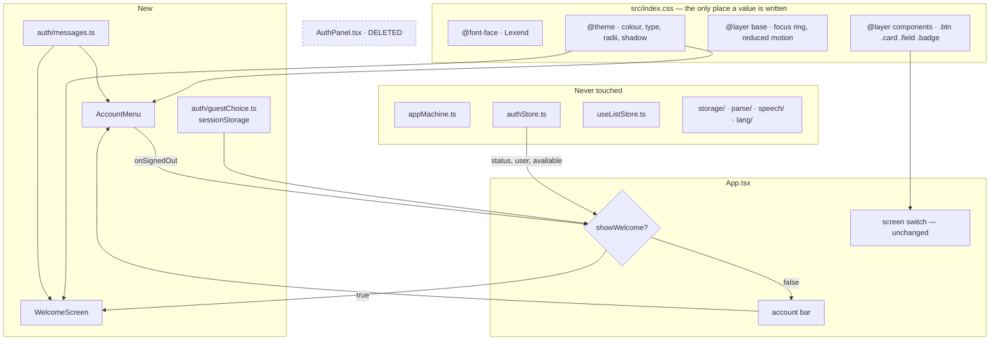

# Plan: Look and Feel

**Feature ID:** 005-look-and-feel
**Status:** DRAFT
**Created:** 2026-09-05
**Baseline:** `main` @ `d64aabc` — 381 tests, 28 files
**Complexity:** Medium — wide and shallow. ~18 files, most of the diff is `className` strings.

## Technical approach in one paragraph

Put every visual decision in `src/index.css` — a Tailwind 4 `@theme` block for tokens, an
`@layer components` block for the class strings this codebase retypes, one `@font-face` for a
self-hosted Lexend. Add a **welcome gate** in `App.tsx` — three booleans wide — and a **bar
beside the screen switch** holding one account control. Split `AuthPanel` along the seam it
already has: guest half → `WelcomeScreen`, signed-in half → `AccountMenu`, `messageFor` →
`src/auth/messages.ts`. Then sweep the thirteen components against the lookup table in § E.
`appMachine.ts` is never touched; the drill stays auth-free, which is what keeps 381 tests
alive through all of it.

## Architecture



## A — `src/index.css`

The whole design system. Written once, in this order.

```css
@import "tailwindcss";

/* ---------------------------------------------------------------------------
   Lexend, self-hosted.

   Not a CDN and not an npm font package: index.html's CSP has no font-src and so
   inherits `default-src 'self'`, meaning a local file needs NO policy change —
   and csp.test.ts:96 asserts fonts.googleapis never appears in the policy. The
   project has three runtime dependencies and a habit of not adding a fourth. And
   a file under src/assets is fingerprinted by Vite, so it can be cached
   immutably in a way a public/ file cannot.

   Regenerate with:
     pyftsubset "Lexend[wght].ttf" --flavor=woff2 --layout-features="*" \
       --unicodes="U+0000-00FF,U+0100-024F,U+0131,U+0152-0153,U+02BB-02BC,\
U+02C6,U+02DA,U+02DC,U+0259,U+1E00-1EFF,U+2000-206F,U+2074,U+20AC,U+2122,\
U+2191,U+2193,U+2212,U+2215,U+FEFF,U+FFFD" \
       --output-file=lexend-variable.woff2
   Source: https://github.com/googlefonts/lexend (SIL Open Font License 1.1).
--------------------------------------------------------------------------- */
@font-face {
  font-family: 'Lexend';
  src: url('./assets/fonts/lexend-variable.woff2') format('woff2-variations');
  font-weight: 100 900;
  font-style: normal;
  font-display: swap;
  /* Latin + Latin Extended. 004 is live, so é ê ç à ë œ is production data and
     the drill's whole job is drawing it (E-12). */
  unicode-range: U+0000-00FF, U+0100-024F, U+0131, U+0152-0153, U+02BB-02BC,
    U+02C6, U+02DA, U+02DC, U+0259, U+1E00-1EFF, U+2000-206F, U+2074, U+20AC,
    U+2122, U+2191, U+2193, U+2212, U+2215, U+FEFF, U+FFFD;
}

@theme {
  /* --- Type -------------------------------------------------------------
     The fallback is metric-chosen, not decorative: the swap must not reflow a
     drill card under the user's thumb (E-8). */
  --font-sans: 'Lexend', ui-sans-serif, system-ui, -apple-system, 'Segoe UI',
    Roboto, 'Helvetica Neue', Arial, sans-serif;

  --text-xs: 0.75rem;      --text-xs--line-height: 1.5;
  --text-sm: 0.875rem;     --text-sm--line-height: 1.5;
  --text-base: 1rem;       --text-base--line-height: 1.6;
  --text-lg: 1.125rem;     --text-lg--line-height: 1.5;
  --text-xl: 1.375rem;     --text-xl--line-height: 1.35;
  --text-2xl: 1.75rem;     --text-2xl--line-height: 1.25;
  --text-3xl: 2.25rem;     --text-3xl--line-height: 1.15;
  /* The word under test. Its own token because it is the point of the app, and
     so it can be tuned without dragging every heading with it. */
  --text-word: 2.5rem;     --text-word--line-height: 1.1;

  /* --- Colour -----------------------------------------------------------
     Ratios are against --color-ground, calculated rather than eyeballed; Task 15
     verifies them with a real checker.

     Two values differ from the agreed direction, both forced by contrast. Do NOT
     "correct" them back:
       primary is teal-700, not teal-600  — white on teal-600 is ~3.7:1, under AA.
       right   is green-700, not green-600 — white on green-600 is ~3.3:1.
     And accent NEVER carries white text: white on orange-500 is ~2.8:1, failing
     even the large-text threshold. It is a tint behind ink, or a border.       */
  --color-ground: #f6fbfa;          /* faint mint. A white page reads as a document. */
  --color-surface: #ffffff;
  --color-surface-sunken: #edf6f4;
  --color-ink: #14343a;             /* ~12.7:1 */
  --color-ink-muted: #557079;       /* ~5.0:1  */
  --color-ink-faint: #7c949b;       /* large + UI text only */
  --color-primary: #0f766e;         /* fills, links. white on it ~5.5:1 */
  --color-primary-bright: #0d9488;  /* focus ring, icons, active */
  --color-primary-soft: #ccfbf1;
  --color-primary-ink: #ffffff;
  --color-accent: #f97316;
  --color-accent-soft: #fff3e9;
  --color-right: #15803d;           /* white on it ~5.0:1 */
  --color-wrong: #e11d48;           /* white on it ~4.7:1 */
  --color-wrong-soft: #fff1f3;
  --color-line: #dceae8;
  --color-line-strong: #bfd8d4;

  /* --- Shape and depth ---------------------------------------------------
     Generous radii are most of what separates "friendly" from "administrative".
     Shadows are tinted with the ink hue rather than pure black — that tint is
     the difference between a designed surface and a default one. */
  --radius-sm: 0.5rem;
  --radius-md: 0.75rem;
  --radius-lg: 1rem;
  --radius-xl: 1.5rem;

  --shadow-card: 0 1px 2px rgb(20 52 58 / 0.04), 0 4px 12px rgb(20 52 58 / 0.06);
  --shadow-lift: 0 2px 4px rgb(20 52 58 / 0.06), 0 12px 28px rgb(20 52 58 / 0.10);
}

@layer base {
  /* `color-scheme: light dark` is GONE. Left in place once the dark: classes are
     removed, the browser paints form controls dark on light surfaces — the worst
     of both (E-9). */
  html {
    background-color: var(--color-ground);
    color: var(--color-ink);
    -webkit-text-size-adjust: 100%;
  }

  /* P-3: no focus style exists anywhere in the app today, and the drill is
     explicitly keyboard-driven (PracticeCard.tsx:33-49). */
  :focus-visible {
    outline: 2px solid var(--color-primary-bright);
    outline-offset: 2px;
    border-radius: var(--radius-sm);
  }

  @media (prefers-reduced-motion: reduce) {
    *, *::before, *::after {
      transition-duration: 0.01ms !important;
      animation-duration: 0.01ms !important;
    }
  }
}

@layer components {
  /* P-2: min-height lives HERE, so the 44px rule that specs 001-004 all restate
     as an NFR stops depending on whoever is typing remembering it. */
  .btn {
    display: inline-flex; align-items: center; justify-content: center;
    gap: 0.5rem;
    min-height: 2.75rem;
    padding-inline: 1rem;
    border-radius: var(--radius-md);
    font-weight: 500;
    transition: background-color 120ms ease, box-shadow 120ms ease, border-color 120ms ease;
  }
  .btn:disabled { opacity: 0.5; cursor: not-allowed; }

  .btn-primary { background-color: var(--color-primary); color: var(--color-primary-ink); }
  .btn-quiet   { background-color: var(--color-surface); color: var(--color-ink);
                 border: 1px solid var(--color-line-strong); }
  .btn-danger  { background-color: var(--color-wrong); color: #fff; }
  /* The drill's two big answers. Tall, because they are hit under time pressure. */
  .btn-lg      { min-height: 3.5rem; font-size: var(--text-lg); border-radius: var(--radius-lg); }

  .card {
    background-color: var(--color-surface);
    border: 1px solid var(--color-line);
    border-radius: var(--radius-lg);
    box-shadow: var(--shadow-card);
  }

  .field {
    min-height: 2.75rem; width: 100%;
    padding-inline: 0.75rem;
    background-color: var(--color-surface);
    border: 1px solid var(--color-line-strong);
    border-radius: var(--radius-md);
  }

  .badge {
    display: inline-flex; align-items: center; gap: 0.375rem;
    padding: 0.25rem 0.625rem;
    border-radius: 9999px;
    font-size: var(--text-sm);
  }
}
```

**Tailwind 4 note.** Every `--color-*` generates `bg-*`, `text-*`, `border-*`, `ring-*`;
`--text-*` generates `text-*`; `--radius-*` → `rounded-*`; `--shadow-*` → `shadow-*`. So
`bg-ground`, `text-ink-muted`, `rounded-lg`, `shadow-card` all just work. **Do not add a
`tailwind.config.js`** — `vite.config.ts` passes `@tailwindcss/vite` zero options and the
system should stay legible in one language.

**Font placement.** `src/assets/fonts/`, not `public/`. A `public/` file is copied unhashed,
so it can never be cached immutably. **No `<link rel="preload">`:** Vite fingerprints the
filename at build time, so a hardcoded href is right in dev and a 404 in production — worse
than no preload. `swap` plus the fallback is enough for a 45 KB file.

## B — The welcome gate

### B1. Why not a sixth screen in `appMachine`

`{ screen: 'welcome' }` is the obvious move and it is wrong. `appMachine.reduce` is pure,
total and synchronous, and its comment (`appMachine.ts:14-20`) states why: modelling screens
as a union is what makes "the answer is unreachable while prompting" a compile-time property.
A `welcome` member would be entered and left by *auth* transitions, which arrive
asynchronously from outside React — meaning either an impure reducer or an effect that
dispatches on auth change, and the second reintroduces the flash-of-wrong-state class of bug
`AuthStatus.resolving` exists to prevent (`types.ts:8`).

The gate is a derived boolean in `App.tsx`. It composes with the machine rather than joining
it: while the gate is up, the machine's state is simply not rendered.

### B2. The derivation

```ts
const { status, user, available } = useAuth()
const [guestChosen, setGuestChosen] = useState(readGuestChoice)

/**
 * The front door.
 *
 * Deliberately NOT shown while `resolving`: that status means a device hint exists,
 * so this visitor is almost certainly about to resolve to signed-in. Showing the
 * welcome screen in that window asks a returning user to log in again — the same
 * false alarm AuthStatus.resolving was introduced to prevent (types.ts:8). Falling
 * through is already correct there: `store` is null, so Home renders `loading`.
 */
const showWelcome = available && status === 'guest' && !guestChosen
```

Three properties, each a test:

- `available === false` short-circuits **first**, so an unconfigured build has no gate and no
  bar. Every `renderApp()` call site in `App.test.tsx` uses `configured: false`, which is why
  the existing suite needs no edit.
- `resolving` falls through, not into the gate (E-1).
- `guestChosen` is React state seeded from `sessionStorage`, not re-read per render — so
  clearing it on sign-out re-renders the gate with no subscription or storage event.

### B3. The render split

```tsx
<main className="min-h-dvh bg-ground text-ink">
  {showWelcome ? (
    <WelcomeScreen onContinueAsGuest={() => { writeGuestChoice(true); setGuestChosen(true) }} />
  ) : (
    <>
      {(toast ?? storeError) && <p role="alert" …>{toast ?? storeError}</p>}
      <SyncStatus active={authStatus === 'signed-in'} />
      {voiceMissing && promptLang && <VoiceWarning lang={promptLang} />}
      {available && (
        <div className="mx-auto flex max-w-xl justify-end px-4 pt-3">
          <AccountMenu drillInProgress={state.screen === 'practising'} onSignedOut={handleSignedOut} />
        </div>
      )}
      {/* the existing screen switch, unchanged */}
    </>
  )}
</main>
```

The toast, `SyncStatus` and `VoiceWarning` move **inside** the non-welcome branch: a store
error over the front door is noise about a store the visitor has not chosen yet.

### B4. `src/auth/guestChoice.ts`

```ts
/**
 * "I'll carry on without an account" — remembered for this browser session only.
 *
 * sessionStorage, not localStorage, deliberately (D-5): a reload inside the tab
 * should not re-ask, but a fresh visit is a fresh decision. It is a UI preference
 * and nothing else — it grants no access and gates no data, so a forged value buys
 * an attacker one skipped screen.
 *
 * Kept out of auth/types.ts, where its sibling readAuthHint lives, because that
 * module is the auth PORT's vocabulary, consumed by authStore. This is a view
 * concern consumed by App.
 */
export const GUEST_CHOICE_KEY = 'pvt.auth.guest'

export function readGuestChoice(): boolean {
  try { return sessionStorage.getItem(GUEST_CHOICE_KEY) === '1' } catch { return false }
}

export function writeGuestChoice(chosen: boolean): void {
  try {
    if (chosen) sessionStorage.setItem(GUEST_CHOICE_KEY, '1')
    else sessionStorage.removeItem(GUEST_CHOICE_KEY)
  } catch { /* A device that cannot store it meets the front door once per load (E-7). */ }
}
```

### B5. Sign-out is a reset, not a navigation

```ts
const handleSignedOut = useCallback(() => {
  writeGuestChoice(false)
  setGuestChosen(false)   // status is 'guest' → gate goes up → welcome renders (D-7)
  setState(initialState)  // not act(GO_HOME): no reducer trip, no record-session branch
  setSavedIds(new Set())  // keyed by list id — currently outlives an identity change
  setToast(null)
}, [])
```

`setSavedIds(new Set())` is a **latent bug fixed in passing**. `savedIds` (`App.tsx:26`)
renders "Saved ✓" on `ReadyScreen`; nothing clears it on identity change, so a list id saved
under account A shows as saved under account B. Unreachable before this feature because there
was no reliable path back to a fresh identity.

## C — `AccountMenu`

### C1. The bar, and why not a fixed overlay

`PracticeCard`'s header is `flex justify-between` with **Quit** as its right-hand item
(`PracticeCard.tsx:55-65`). A `fixed top-2 right-2` avatar lands on it. Padding every screen's
header to dodge an overlay is four edits to four unrelated components, plus one more each time
a screen is added.

The bar is in **normal flow** (§ B3), `mx-auto max-w-xl px-4` to match every screen's
container (`Home.tsx:33`, `ReadyScreen.tsx:14`, `PracticeCard.tsx:54`) so the control aligns
with the content edge, not the viewport edge. It costs the drill ~44 px of height — accepted
over a stacking-context fight with `SyncStatus`, which is also at the top of `App`.

### C2. Shape

```tsx
interface Props {
  /** A drill is running, so signing out destroys it — ask first (FR-26). */
  drillInProgress: boolean
  /** Fired after a successful sign-out OR a successful deletion. */
  onSignedOut: () => void
}
```

Hooks first, **then** `if (!available) return null` and `if (status === 'resolving') return
<Placeholder/>`. `AuthPanel` gets away with an early return at line 31 because its state is
declared above it; keep that ordering.

### C3. The popover — hand-rolled, per NFR-1

```ts
useEffect(() => {
  if (!open) return
  const onKey = (e: KeyboardEvent) => {
    if (e.key === 'Escape') { setOpen(false); triggerRef.current?.focus() }
  }
  const onDown = (e: PointerEvent) => {
    if (!popoverRef.current?.contains(e.target as Node) &&
        !triggerRef.current?.contains(e.target as Node)) setOpen(false)
  }
  document.addEventListener('keydown', onKey)
  document.addEventListener('pointerdown', onDown)
  return () => {
    document.removeEventListener('keydown', onKey)
    document.removeEventListener('pointerdown', onDown)
  }
}, [open])
```

Four notes that each otherwise cost an hour:

- Exclude the **trigger** from the outside check, or its own click closes and immediately
  reopens the popover — which presents as "the menu never opens".
- `pointerdown`, not `click`: `userEvent` dispatches pointer events, and a document `click`
  fires after React's synthetic handler, giving an order that is awkward to reason about.
- **Do not** use the native `popover` attribute or `showPopover()`. jsdom's support is partial
  and the failure mode is a test that passes for the wrong reason.
- `PracticeCard` registers a **global `keydown`** for Space / Enter / Y / N
  (`PracticeCard.tsx:47`), with no dependency array, live whenever a drill renders. With the
  menu open, typing `n` marks the card wrong. Fix in `PracticeCard`: return early when
  `event.target` is inside `[role="menu"],[role="dialog"]`. That does not couple the drill to
  the account feature — it just says "not while a menu owns the keyboard".

### C4. The avatar

```tsx
const label = user.displayName ?? user.email ?? 'your account'
const initial = (user.displayName ?? user.email ?? '?').trim().charAt(0).toUpperCase()

{user.photoURL && !photoFailed ? (
   setPhotoFailed(true)}
       className="size-9 rounded-full" width={36} height={36} />
) : (
  <span aria-hidden="true"
        className="grid size-9 place-items-center rounded-full bg-primary text-sm font-semibold text-primary-ink">
    {initial}
  </span>
)}
```

- `alt=""` with the accessible name on the **button** (`aria-label={label}`) — otherwise a
  screen reader announces the name twice (FR-20).
- `referrerPolicy="no-referrer"` — `lh3.googleusercontent.com` 403s some referrers, and the
  symptom is an intermittently blank avatar that is maddening to reproduce. It also stops the
  app's URL being sent to Google on every render.
- `onError` is the E-2 fallback: a photo URL valid at sign-in can rot.
- The button is `size-11` (44 px) with the 36 px image centred (NFR-5).
- The CSP already allows `https://*.googleusercontent.com` under `img-src` (`index.html:29`).
  **No CSP change** (NFR-2).

### C5. The delete dialog

Lift `AuthPanel.tsx:72-121` into a modal, **copy unchanged**: `role="dialog"`,
`aria-modal="true"`, on `bg-wrong-soft` with a `border-wrong`. Focus moves to **Cancel**, not
to the destructive button — a dialog that opens with "Yes, delete everything" focused is one
Enter keypress from an unrecoverable deletion. `Escape` cancels; the overlay is not
click-to-dismiss. Outcome handling is unchanged from `AuthPanel.tsx:83-98`.

### C6. Sign-out mid-drill

```tsx
if (drillInProgress && !window.confirm(
  "You're in the middle of a drill. Signing out will end it and it won't be recorded. Sign out anyway?",
)) return
```

`window.confirm` rather than a second modal, matching the existing precedent for destructive
list actions (`App.tsx:185`). Stubbable in tests, consistent with the codebase.

## D — `WelcomeScreen`

One prop: `{ onContinueAsGuest: () => void }`. It reads auth itself, as `AuthPanel` does. A
successful sign-in flips `status` to `signed-in` and the gate closes on its own — no success
callback.

In order: `<h1>Vocabulary Trainer</h1>`, the tagline from `Home.tsx:36`, **Sign in with
Google** (`.btn .btn-primary .btn-lg`, inline Google mark), **Continue as guest**
(`.btn .btn-quiet .btn-lg` — *not* a text link; it is a first-class choice), the privacy
paragraph verbatim from `AuthPanel.tsx:143-148`, then the error region.

The Google mark is inline SVG — an external asset would need a CSP `img-src` addition and a
network request on first paint:

```tsx
<svg viewBox="0 0 48 48" className="size-5" aria-hidden="true">
  <path fill="#4285F4" d="M45.12 24.5c0-1.56-.14-3.06-.4-4.5H24v8.51h11.84c-.51 2.75-2.06 5.08-4.39 6.64v5.52h7.11c4.16-3.83 6.56-9.47 6.56-16.17z"/>
  <path fill="#34A853" d="M24 46c5.94 0 10.92-1.97 14.56-5.33l-7.11-5.52c-1.97 1.32-4.49 2.1-7.45 2.1-5.73 0-10.58-3.87-12.31-9.07H4.34v5.7C7.96 41.07 15.4 46 24 46z"/>
  <path fill="#FBBC05" d="M11.69 28.18C11.25 26.86 11 25.45 11 24s.25-2.86.69-4.18v-5.7H4.34C2.85 17.09 2 20.45 2 24s.85 6.91 2.34 9.88l7.35-5.7z"/>
  <path fill="#EA4335" d="M24 10.75c3.23 0 6.13 1.11 8.41 3.29l6.31-6.31C34.91 4.18 29.93 2 24 2 15.4 2 7.96 6.93 4.34 14.12l7.35 5.7c1.73-5.2 6.58-9.07 12.31-9.07z"/>
</svg>
```

`aria-hidden="true"` matters: without it the four paths can surface in the button's accessible
name and break `getByRole('button', { name: /sign in with google/i })`.

**`src/auth/messages.ts`** is a straight move of `AuthPanel.tsx:5-21`, exported as
`signInFailureMessage`, mirroring `src/storage/messages.ts`. Two sign-in entry points exist
after this feature; two copies of that `switch` would drift the moment one message improves.

## E — The sweep: old → new

The lookup table that makes 170 replacements mechanical.

| Today | Becomes |
|---|---|
| `bg-white` / `dark:bg-slate-900` | `bg-ground` on `<main>`, `bg-surface` on cards |
| `text-slate-900` / `dark:text-slate-100` | `text-ink` |
| `text-slate-600` / `dark:text-slate-400` | `text-ink-muted` |
| `text-slate-500` | `text-ink-faint` (captions only) |
| `border-slate-300` / `dark:border-slate-600` | `border-line-strong` on controls, `border-line` on surfaces |
| `bg-slate-100` / `dark:bg-slate-800` | `bg-surface-sunken` |
| `bg-slate-200` / `dark:bg-slate-700` | `bg-surface-sunken` + `border-line` |
| `bg-emerald-700 text-white` | `.btn .btn-primary` |
| `text-emerald-700` / `dark:text-emerald-400` | `text-right` where it means a correct answer, `text-primary` where it means "go" — two meanings sharing one colour today |
| `bg-rose-700` | `.btn .btn-danger` |
| `bg-red-700` / `text-red-700` / `dark:text-red-400` | the same `wrong` token — **FR-9**, `rose` and `red` collapse |
| `bg-amber-100 text-amber-900` / `dark:bg-amber-900/40` | `bg-accent-soft text-ink` |
| `border-red-400` / `dark:border-red-600` | `border-wrong` |
| `min-h-11 rounded border …` | `.btn .btn-quiet` |
| `min-h-14 rounded-lg … text-lg` | `.btn .btn-primary .btn-lg` |
| `text-4xl` (the score) | `text-3xl` |
| the revealed word, `text-2xl` | `text-word` — **FR-10** |
| `rounded-xl border … p-6` (the drill card) | `.card p-6` |

Per-file `dark:` line counts, as a checksum for the diff:

| File | Lines with `dark:` | Note |
|---|---|---|
| `ListEditor.tsx` | 15 | 368 lines since 004; inputs and both selects → `.field` |
| `AuthPanel.tsx` | 9 | **deleted** — Task 11 |
| `PastePanel.tsx` | 8 | |
| `SavedLists.tsx` | 7 | rows → `.card` |
| `ResultsScreen.tsx` | 6 | score → `text-3xl` |
| `MigratePrompt.tsx` | 5 | `bg-accent-soft` |
| `PracticeCard.tsx` | 5 | the word → `text-word`; Right/Wrong → `.btn-lg` |
| `ReadyScreen.tsx` | 4 | |
| `ScoreHistory.tsx` | 4 | |
| `App.tsx` | 2 | `<main>` → `bg-ground text-ink` |
| `Home.tsx` · `SyncStatus.tsx` · `VoiceWarning.tsx` | 1 each | |
| **Total** | **68 lines / 83 occurrences** | |

## F — The guards

### F1 + F2. No `dark:`, no raw palette (FR-28, FR-29)

```ts
// src/test/theme.test.ts
const sources = import.meta.glob('../**/*.{ts,tsx}', {
  query: '?raw', import: 'default', eager: true,
}) as Record<string, string>
```

`import.meta.glob` with `?raw`, following `csp.test.ts:2`'s precedent and its reasoning:
`tsconfig.app.json` deliberately omits Node types so app code cannot reach for `node:fs`, and
a test should not be the reason that restriction is loosened.

Palette regex:
`/\b(?:bg|text|border|ring|from|to|via)-(?:slate|gray|zinc|neutral|stone|emerald|green|amber|yellow|rose|red|blue|indigo)-\d{2,3}\b/`.
Report the file **and the matched class**, so a failure is actionable. Allowlist the Google
mark's four brand fills, with a comment saying why.

**Gotcha:** exclude `theme.test.ts` itself from both, or its own regex source fails it.

### F3. The bundle guard sees CSS and fonts (FR-30)

`scripts/check-bundle.mjs` gathers only `<script type="module">` and `rel="modulepreload"`
(lines 36-37) — blind to exactly the two asset types this feature adds. Extend it to collect
`rel="stylesheet"` hrefs and `url(...)` font references from the emitted CSS:

```
  eager JS      112.4 KB gz   (budget 150)
  CSS             6.1 KB gz
  fonts          44.8 KB      (woff2 — already compressed, count raw bytes)
  ------------------------------------------
  total eager   163.3 KB      (budget 220)
```

Keep the eager-JS figure and its 150 KB budget **separate and intact**: it is what proves the
Firebase chunk is still lazy (003's NFR4a), and folding it into a total would quietly retire
that guarantee.

## Files

### Created

`src/assets/fonts/lexend-variable.woff2` · `src/assets/fonts/OFL.txt` ·
`src/auth/guestChoice.ts` + test · `src/auth/messages.ts` ·
`src/components/WelcomeScreen.tsx` + test · `src/components/AccountMenu.tsx` + test ·
`src/test/theme.test.ts`

### Updated

| File | Change |
|---|---|
| `src/index.css` | 5 lines → the whole design system |
| `index.html` | `theme-color` `#0f172a` → `#f6fbfa`. **One line. No CSP change.** |
| `src/App.tsx` | the gate, the bar, `handleSignedOut`, and its own restyle |
| `src/App.test.tsx` | **added** tests using a configured store; existing ones untouched |
| `src/components/Home.tsx` | drop the `AuthPanel` import and render site; restyle |
| `src/components/PracticeCard.tsx` | ignore keys from inside an open menu; restyle |
| 10 other components | `className` only |
| `src/test/renderApp.tsx` | `configuredGuestStore` / `signedInStore` helpers |
| `scripts/check-bundle.mjs` | count CSS and fonts |
| `README.md` | the Accounts section describes a panel that will not exist |

### Deleted

`src/components/AuthPanel.tsx` · `src/components/AuthPanel.test.tsx`

### Untouched — assert with `git diff --stat`

`src/state/*` · `src/parse/*` · `src/speech/*` · `src/lang/*` · `src/storage/*` ·
`src/auth/authStore.ts` · `useAuth.ts` · `types.ts` · `firebaseAuth.ts` · `firebase.ts` ·
`config.ts` · `deleteAccount.ts` · `firestore.rules` · `tests/rules/` · `vite.config.ts` ·
`package.json`

`package.json` is on that list deliberately: NFR-1 says no new dependency, and a diff there
means the font came from npm after all.

## Pragmatic Programmer review

**DRY.** This feature *is* the DRY fix: a colour has thirteen definitions today and a button
has eight; afterwards each has one. `messageFor` would otherwise exist twice, once per sign-in
entry point. `guestChoice.ts` deliberately mirrors `readAuthHint` rather than inventing a
second idiom for "small persisted flag". `AccountMenu` serves guest *and* signed-in states so
there is one popover mechanism, not two.

**Broken windows.** Five, fixed rather than filed: `rose` and `red` both meaning "wrong"
(P-1); no focus ring on a keyboard-driven drill (P-3); `savedIds` surviving an identity change
(§ B5); `PracticeCard`'s unconditional global key handler (§ C3); and a bundle guard blind to
CSS and fonts (§ F3). `AuthPanel` is deleted rather than left as an unrendered 157-line file.

**Automate.** The two guard tests are the point — a sweep across thirteen files regresses one
file at a time, inside a `className` nobody reviews closely. The 16 `AuthPanel` assertions are
*ported*, not rewritten; a rewrite is how behaviour quietly changes during a move.

**Design for change.** Every value has one home, so dark mode returns as a second `:root`
block rather than 83 hand-picked pairs. The gate is a boolean in one file, so "remember across
sessions" is a one-line swap in `guestChoice.ts`. Keeping `appMachine` auth-free is what makes
381 tests survive this.

## Risks

| Risk | Likelihood | Mitigation |
|---|---|---|
| The popover and `PracticeCard`'s global key handler fight | **High** — it is live on the drill screen | § C3, with a test that opens the menu mid-drill and presses `n`. |
| The font subset misses a diacritic | Medium | Task 3 renders 004's French fixtures and inspects them. A missing glyph in the word under test is the worst bug this app can have — and it substitutes **silently**. |
| A test asserting on a class name breaks | Low — the suite queries by role, name and text | If one breaks, check it is not asserting something real before editing. NFR-7 says none should need editing. |
| Contrast fails somewhere despite § A | Medium | Task 15 checks in situ, not tokens in isolation. `ink-faint` on `surface-sunken` is the likeliest failure. |
| Focus lost to `<body>` when the menu closes | Medium | Assert `document.activeElement`, not merely that the menu is gone. |
| The deletion copy drifts while being moved | Medium | Cut and paste the strings; keep the four copy assertions verbatim. |
| The mint ground reads as a washed-out screen on a cheap panel | Low | `#f6fbfa` is faint by design. Look at it on a real budget phone in Task 15 before defending it. |
| Scope creeps into layout | Medium | D-3 was explicit. Anything changing DOM structure is out — file it, do not fold it in. |

## Security

Nothing here touches an authorisation boundary.

- `guestChoice` is a UI preference in `sessionStorage`: it grants no access and gates no data,
  and a forged value skips one screen. Said in the module comment so nobody later mistakes it
  for an auth claim — the care `types.ts:44` takes over `AUTH_HINT_KEY`.
- **No CSP change** (NFR-2). The profile-photo origin is already allowed, the Google mark is
  inline, and a self-hosted font is covered by `default-src 'self'`. `index.html`'s policy must
  come out of this feature byte-identical, and `csp.test.ts`'s assertions are what prove it.
- No Firestore rules change. Access is still governed by `request.auth.uid`; the UI has never
  been what enforces it.
- Deletion keeps its two-step confirmation and existing outcome handling. Making it easier to
  *reach* is a UX change, not a safety one, and the modal is the compensating interruption.
</content>
