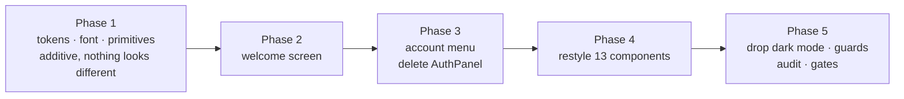

# Quickstart: Look and Feel

**Feature ID:** 005-look-and-feel
**Status:** DRAFT — not yet executed
**Baseline:** `main` @ `d64aabc` — 381 tests, 28 files

## What this does

Gives the app the design layer it has never had — light-only teal-and-mint palette, self-hosted
Lexend, type scale, shared button/card primitives, a focus ring, all defined once in
`src/index.css` — and moves the account surface out of the middle of the home screen into a
**welcome screen** plus a **corner avatar**.

## Decisions

| | |
|---|---|
| Dark mode | **Dropped entirely.** 83 `dark:` occurrences deleted, `color-scheme` removed |
| Palette | **Friendly tutor** — teal primary, faint-mint ground, orange accent |
| Depth | **Tokens + restyle every screen.** Layouts and copy unchanged |
| Type | **Self-hosted Lexend variable**, latin + latin-ext, ~45 KB |
| Welcome screen | Shown **once per browser session** |
| Avatar | **Every screen**, including the drill |
| After sign-out | **Back to the welcome screen** |
| Guest re-entry | Compact **Sign in** in the same corner slot |

Two colours differ from the direction as previewed, both forced by contrast: teal-**700** and
green-**700** for filled buttons, and orange never under white text. `plan.md` § A says why in
a comment so they don't get "corrected" back.

## The starting point

`src/index.css` is five lines. No `@theme`, no font, no type scale, no radii, no shadows, no
focus style. All colour is ad-hoc utilities — **170 of them** — which is why `rose` and `red`
both currently mean "wrong".

## Order



16 tasks. Phase 1 is additive, so the app is shippable throughout. Phases 2–3 build the new
screens **in the new language**, so nothing gets styled twice. Dark mode comes out in **one**
sweep in Phase 5.

## Files

**Created:** `src/assets/fonts/lexend-variable.woff2` + `OFL.txt` · `src/auth/guestChoice.ts` ·
`src/auth/messages.ts` · `src/components/WelcomeScreen.tsx` · `src/components/AccountMenu.tsx` ·
`src/test/theme.test.ts` (+ tests for each)

**Updated:** `src/index.css` (5 lines → the whole system) · `index.html` (**one line** —
`theme-color`) · `src/App.tsx` · `src/components/Home.tsx` · `src/components/PracticeCard.tsx` ·
10 other components (`className` only) · `src/test/renderApp.tsx` ·
`scripts/check-bundle.mjs` · `README.md`

**Deleted:** `src/components/AuthPanel.tsx` + its test

**Never touched:** `src/state/` · `src/parse/` · `src/speech/` · `src/lang/` · `src/storage/` ·
most of `src/auth/` · `firestore.rules` · `vite.config.ts` · `package.json`

## The five things most likely to bite

1. **`PracticeCard` has a global `keydown` listener** ([PracticeCard.tsx:47](src/components/PracticeCard.tsx#L47))
   with no dependency array, mapping Y/N to right/wrong. With the account menu open mid-drill,
   typing `n` marks the card. Task 10 fixes it.
2. **`color-scheme: light dark` must come out with the *last* `dark:` class, not the first.**
   Remove it early and the browser paints form controls dark against light surfaces.
3. **`theme-color` in `index.html` is still `#0f172a`.** Forget it and the app opens with a
   black address bar above a mint page. Change that line and *only* that line — the CSP must
   come out byte-identical and `csp.test.ts` has 14 assertions proving it.
4. **The font goes in `src/assets/`, not `public/`** — `public/` files are copied unhashed and
   can never be cached immutably.
5. **`sessionStorage` is not cleared between tests.** `App.test.tsx` clears only
   `localStorage`. Add it, or the guest choice leaks and test order decides the result.

## Commands

```bash
npm test                                    # baseline: 381 tests, 28 files
npm run build && npm test                   # after Task 2 — nothing should look different
npm test -- guestChoice WelcomeScreen AccountMenu App
npm test -- theme csp                       # the guards, once Phase 5 lands
npm run typecheck && npm run lint && npm test && npm run check:bundle
npm run dev                                 # Task 15's by-hand audit — no substitute for it
```

## Note on 004

`004-multi-language-lists` **is already merged** (PR #4). French is live, `LangCode` is
`'en' | 'nl' | 'fr'`, and the editor has two language selects — so Task 13 styles those selects
and Task 3 must confirm the font draws `é ê ç à ë œ` against real production data. There is
nothing left to sequence around.

## Confidence

**8 / 10** for one-pass execution. The token layer and the sweep are mechanical, `plan.md` § E
is a complete lookup table, and the two guard tests catch a missed file automatically. The
point comes off for the popover — focus return, outside-click and the `PracticeCard` key
conflict are three fiddly interactions that usually want a real browser, not just jsdom — and
for the two judgements only an eye settles: whether the mint ground reads as designed or
washed-out on a cheap panel, and whether `text-word` at 2.5 rem suits the longest French words.
</content>
