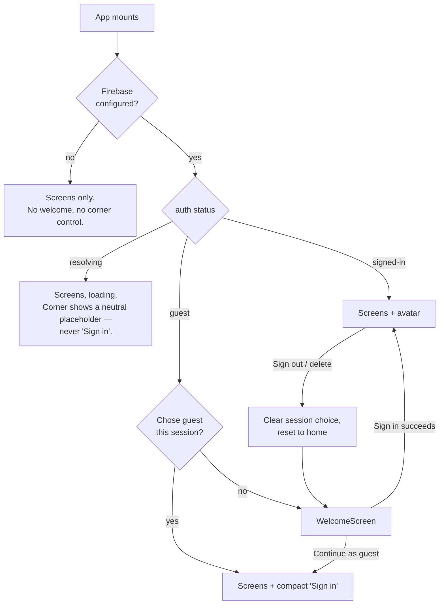

# Spec: Look and Feel — light, educational, modern

**ID:** 005-look-and-feel
**Status:** DRAFT
**Created:** 2026-09-05
**Baseline:** `main` @ `d64aabc` — **381 tests across 28 files, all green**
**Feature Type:** Design (presentation) + one small UI restructure
**Complexity:** Medium — wide, not deep

> **Supersedes** the earlier `005-account-ui-and-welcome` and `006-visual-refresh` drafts.
> They split one design change across two specs and were written against
> `feature/user-accounts`, before `004-multi-language-lists` merged. Both facts are fixed here.

## What is on main today

`main` carries four merged features: the drill (001), drill modes and score history (002),
Google accounts (003, PR #3) and multi-language lists (004, PR #4). So French **is**
supported, `LangCode` is `'en' | 'nl' | 'fr'`, and the list editor already has its two
language selects.

What it does **not** have is any design layer at all. `src/index.css` is five lines:

```css
@import "tailwindcss";

:root {
  color-scheme: light dark;
}
```

No `@theme`, no font, no type scale, no radii, no shadows, no focus style. Measured on `main`:

| | Count |
|---|---|
| `dark:` variant occurrences | **83**, across 13 files |
| Raw palette utilities (`bg-slate-800`, `text-emerald-700`, …) | **170** |
| Colour families in use | 5 — `slate`, `emerald`, `amber`, `rose`, `red` |
| Custom focus style | **none** |
| Web font | **none** — the OS default, so the app looks different on every device |
| Shared button or card class | **none** — `min-h-14 rounded-lg bg-emerald-700 text-lg text-white` is retyped at each site |

So this is not a repaint. It is **introducing the design layer the app has never had**, and
then expressing the screens in it.

## The two asks

> "It should be more light theme, educational, and modern."
> "The first screen should be 'login' or 'continue as guest' — we should not have the 2
> functionality on the same page. A google icon on the side if you are logged in, with an
> option to disconnect, like modern apps."

They are the same ask. `AuthPanel` (`src/components/AuthPanel.tsx`, 157 lines) is rendered
inline at `Home.tsx:41`, so a first-time visitor's first screen is the *list* screen with a
sign-in offer and a six-line privacy paragraph wedged above their word lists. The account
surface is page furniture where every modern app makes it a corner control plus a front door.

## Three defects, not matters of taste

Having no design layer has produced real bugs, and they are what justify a system rather than
a coat of paint.

### P-1 — Two colours mean "wrong"

`PracticeCard.tsx:106` marks a wrong answer `bg-rose-700`. `AuthPanel.tsx:65,99` uses
`text-red-700` / `bg-red-700` for account deletion. Two families, one meaning, and no rule
saying which — because there is nowhere to write a rule down.

### P-2 — The 44 px touch target is held together by memory

`min-h-11` is retyped at every control. It is a stated non-functional requirement of specs
001–004 and it survives entirely on whoever is typing remembering it. One omission is
invisible in review and untestable.

### P-3 — Keyboard users get the browser default

There is no `:focus-visible` rule anywhere. The drill is explicitly keyboard-driven —
`PracticeCard.tsx:33-49` binds Space, Enter, Y and N — so this is the one app where a
designed focus ring is not decoration.

## Decisions taken

| # | Decision | |
|---|---|---|
| D-1 | **Dark mode is dropped entirely.** All 83 `dark:` occurrences deleted, `color-scheme: light dark` removed, `theme-color` changed from its current dark slate. | |
| D-2 | **Friendly tutor** — teal primary, faint-mint ground, orange accent. | |
| D-3 | **Tokens plus a restyle of every screen.** Layouts and copy stay as they are. | |
| D-4 | **One self-hosted variable font: Lexend**, latin + latin-ext. | |
| D-5 | Welcome screen recurrence: **once per browser session**. | |
| D-6 | The account control appears on **every screen**, including the drill. | |
| D-7 | Sign-out and account deletion land **back on the welcome screen**. | |
| D-8 | A guest keeps a **compact Sign in control in the same corner** — not a panel, not the privacy paragraph. | |

**On dropping dark mode.** It removes something users on a dark-preference OS have today.
There is no technical reason to drop it; the reasons are that the request was for a light
theme, that one palette gets designed well where two get designed adequately, and that the
tokens are structured so dark could return as a second `:root` block rather than 83 more
hand-picked class pairs. Reversing it later costs a token block, not a sweep.

**On Lexend.** The brief was "educational". Lexend is the one widely-available face whose
design brief is literally reading proficiency, so the choice is functional rather than
decorative. Self-hosted, because `index.html`'s CSP has no `font-src` and inherits
`default-src 'self'` — a local file needs **no policy change**, and `csp.test.ts:96` asserts
`fonts.googleapis` never appears in the policy.

## The design system

### Colour

Two values differ from the direction as previewed. Both are forced by contrast, and both are
stated here so they are not "corrected" back later.

| Previewed | Shipped | Why |
|---|---|---|
| `#0D9488` teal-600 as the button fill | `#0F766E` teal-700 | White on teal-600 is ≈ 3.7:1 — below AA. Teal-700 is ≈ 5.5:1. Teal-600 stays as the brand hue for rings and icons. |
| `#16A34A` green-600 for **Right** | `#15803D` green-700 | ≈ 3.3:1 vs ≈ 5.0:1 with white. |
| `#F97316` orange as an accent | **never under white text** | ≈ 2.8:1 — fails even the large-text threshold. Orange is a tint behind ink, a border, or a dot. |

```
ground          #F6FBFA   the page. Faint mint — a white page reads as a document
surface         #FFFFFF   cards lift off the ground
surface-sunken  #EDF6F4   input wells, table headers
ink             #14343A   body text            ≈ 12.7:1 on ground
ink-muted       #557079   secondary text       ≈ 5.0:1 on ground
ink-faint       #7C949B   captions             large / UI text only
primary         #0F766E   filled buttons, links
primary-bright  #0D9488   focus ring, icons, active states
primary-soft    #CCFBF1   selected rows, badges
accent          #F97316   never a fill under white text
accent-soft     #FFF3E9   banner and badge backgrounds, with ink
right           #15803D
wrong           #E11D48   the single "wrong" colour — P-1
wrong-soft      #FFF1F3
line            #DCEAE8   surfaces
line-strong     #BFD8D4   inputs and anything interactive
```

### Type

Lexend variable, `font-display: swap`, with a metric-chosen system fallback.

| Token | Size / line-height | For |
|---|---|---|
| `text-xs` | 0.75 / 1.5 | metadata, the keyboard hint |
| `text-sm` | 0.875 / 1.5 | secondary copy |
| `text-base` | 1 / 1.6 | body |
| `text-lg` | 1.125 / 1.5 | primary button labels |
| `text-xl` | 1.375 / 1.35 | section headings |
| `text-2xl` | 1.75 / 1.25 | screen titles |
| `text-3xl` | 2.25 / 1.15 | the score |
| `text-word` | 2.5 / 1.1 | **the practice word** — its own token, because it is the point of the app |

Today the revealed word is `text-2xl` — the same size as the list name on the screen before
it. It should be the first thing the eye lands on.

### Primitives

P-2 gets fixed structurally. `.btn`, `.btn-primary`, `.btn-quiet`, `.btn-danger`, `.btn-lg`,
`.card`, `.field` and `.badge` are defined once in `index.css`, with the **44 px minimum baked
into `.btn`**. The touch-target rule stops being something to remember and becomes a property
of the code.

## The two new screens



### WelcomeScreen

The front door, and the app's most look-and-feel-bearing surface. It replaces the entire
render while showing — no toast, no sync banner, no lists behind it.

The app name and its tagline, **Sign in with Google** (primary, with the Google mark),
**Continue as guest** (secondary, *equally* a real choice — same height, a button not a link),
the privacy paragraph moved verbatim from `AuthPanel.tsx:143-148`, and an error region.

### AccountMenu

The corner control, in a bar above every screen.

| Auth state | Renders |
|---|---|
| unavailable | `null` — the bar collapses to nothing |
| `resolving` | a neutral, non-interactive placeholder |
| `guest` | a compact **Sign in** button, opening a popover with the Google button and one line of context |
| `signed-in` | the Google profile photo (initials fallback), opening a menu with the name, email, **Sign out** and **Delete my account** |

Deletion moves out of the page flow into a modal. Its copy is unchanged.

## What must survive

003 got several things right that a UI reshuffle can easily destroy.

| Behaviour | Where | Why |
|---|---|---|
| `resolving` never renders the signed-out UI | `AuthPanel.tsx:33` | Firebase fires `null` before restoring a session; "Sign in" in that window reads as being silently logged out |
| An unconfigured build shows nothing account-shaped | `AuthPanel.tsx:31` | A button that cannot work is worse than no button |
| A guest never downloads Firebase | `authStore.ts:48` | The whole point of the 150 KB eager budget |
| Deletion says what is destroyed **and what is not** | `AuthPanel.tsx:74-78` | Device lists were never part of the account |
| Every failure has human copy | `AuthPanel.tsx:5-21` | `cancelled` is a normal choice, not an error |

Sixteen tests in `AuthPanel.test.tsx` encode these. **None of it changes — all of it moves**,
and the tests move with it.

## Requirements

### The system

| # | Requirement |
|---|---|
| FR-1 | `src/index.css` holds the full token set in a Tailwind 4 `@theme` block. Every value above lives there and **nowhere else**. |
| FR-2 | Lexend variable is self-hosted from `src/assets/fonts/`, with `font-display: swap` and a `unicode-range` covering latin + latin-ext. |
| FR-3 | `index.html`'s `theme-color` becomes the ground colour. It is `#0f172a` today — a dark slate that paints a black address bar above a mint page. |
| FR-4 | `.btn`, `.btn-primary`, `.btn-quiet`, `.btn-danger`, `.btn-lg`, `.card`, `.field`, `.badge` are defined once, in `@layer components`. `.btn` carries `min-height: 2.75rem`. |
| FR-5 | A global `:focus-visible` ring — 2 px `primary-bright`, 2 px offset — on every focusable element. |
| FR-6 | Transitions limited to colour and shadow, disabled under `prefers-reduced-motion`. |

### The sweep

| # | Requirement |
|---|---|
| FR-7 | All 83 `dark:` occurrences deleted; `color-scheme: light dark` removed. |
| FR-8 | No component references a raw palette colour. All 170 occurrences become tokens. |
| FR-9 | "Wrong" is one colour everywhere — `rose` and `red` collapse (P-1). |
| FR-10 | The practice word uses `text-word`; the score uses `text-3xl`. |
| FR-11 | Layout, DOM structure, ARIA roles, accessible names and **all copy** are unchanged. A test that breaks is a bug in the change. |

### The welcome screen

| # | Requirement |
|---|---|
| FR-12 | The gate is `available && status === 'guest' && !choseGuestThisSession`. When true, `WelcomeScreen` is the only thing rendered. |
| FR-13 | `resolving` must **not** raise the gate — it falls through to the app exactly as today. |
| FR-14 | `available === false` disables the gate entirely: an unconfigured build renders precisely what it renders today, with no extra DOM. |
| FR-15 | "Continue as guest" persists to `sessionStorage` and reveals the app. No reload, no auth call, no Firebase load. |
| FR-16 | A failed sign-in leaves the welcome screen up with a human message, **Continue as guest** still working. |
| FR-17 | The gate lives in `App.tsx`. `appMachine.ts` gains no `welcome` member and no auth awareness. |

### The account control

| # | Requirement |
|---|---|
| FR-18 | A bar renders above the screen switch on every screen, and renders **nothing at all** when `available === false` — zero layout delta for an unconfigured build. |
| FR-19 | `signed-in` shows `photoURL` as a round avatar; absent **or failing to load**, the first letter of `displayName ?? email` on a coloured disc. |
| FR-20 | The avatar's accessible name is the user's name or email — not "avatar". |
| FR-21 | `guest` shows a compact **Sign in** control in the same slot. The six-line privacy paragraph stays on the welcome screen. |
| FR-22 | `resolving` shows a neutral placeholder and **never** the guest control. |
| FR-23 | The popover closes on `Escape`, on an outside click, and after any action; focus returns to its trigger. `aria-haspopup` and a live `aria-expanded`. |
| FR-24 | **Delete my account** opens a `role="dialog"` modal with the existing copy verbatim, focus on **Cancel**, `Escape` to cancel. |
| FR-25 | Sign-out and successful deletion clear the session guest choice, reset the app to `initialState`, and clear the `savedIds` cache — which is keyed by list id and currently outlives an identity change. |
| FR-26 | Signing out mid-drill confirms first, naming the consequence: the drill ends and is not recorded. |
| FR-27 | `AuthPanel.tsx` and `AuthPanel.test.tsx` are **deleted**. Their behaviour and 16 assertions are redistributed. |

### Guards

| # | Requirement |
|---|---|
| FR-28 | A test asserts no file under `src/` contains a `dark:` class. |
| FR-29 | A test asserts no component uses a raw palette colour, with an allowlist for the Google mark's brand fills. |
| FR-30 | `scripts/check-bundle.mjs` counts **CSS and fonts**, not only eager JS. It would not notice a 200 KB font today. |

### Non-functional

| # | Requirement |
|---|---|
| NFR-1 | **No new npm dependencies**, runtime or dev. The font is a committed asset; the popover is hand-rolled; the Google mark is inline SVG. |
| NFR-2 | **No CSP change.** `csp.test.ts` must stay green and unedited. |
| NFR-3 | Font ≤ 60 KB. Eager JS within its existing 150 KB budget; total eager including CSS and fonts budgeted at 220 KB. |
| NFR-4 | Body text meets WCAG AA (4.5:1); large and UI text 3:1. Verified with a checker, not by eye. |
| NFR-5 | Every interactive element ≥ 44 px — now enforced by `.btn`. |
| NFR-6 | The account bar must not overlap or displace `PracticeCard`'s **Quit** button, which owns the top-right of that screen (`PracticeCard.tsx:62`). |
| NFR-7 | All **381** existing tests pass. The 16 `AuthPanel` ones move; the rest are **unedited**. |

## Edge cases

| # | Case | Behaviour |
|---|---|---|
| E-1 | Boot with a device hint (`resolving`) | The app renders with `loading`; the corner shows the placeholder. The welcome screen must never flash. |
| E-2 | `photoURL` 403s or rots | `onError` swaps to the initials disc. No broken-image icon. |
| E-3 | `displayName` and `email` both null | A neutral glyph; the menu says "your account", as today. |
| E-4 | Popup blocked, from either entry point | "allow popups", in place. The user is not ejected anywhere. |
| E-5 | Two rapid taps on Sign in | Disabled while in flight — the visible half of "one popup at a time". |
| E-6 | Sign out mid-drill | Confirm first; on accept the session is discarded and **no** `SessionRecord` is written. |
| E-7 | `sessionStorage` throws (Safari private) | Reads `false`, writes are a no-op: the welcome screen appears once per load rather than once per session. Degraded, never broken. |
| E-8 | Font still loading / fails entirely | `swap` plus a metric-matched fallback. Nothing is font-dependent for meaning. |
| E-9 | OS set to dark | The app is light. `color-scheme` **must** be removed, or the browser paints form controls dark on light surfaces. |
| E-10 | Forced-colors mode | Right and Wrong keep their ✓ and ✗ glyphs — colour is never the sole carrier of meaning. |
| E-11 | 375 × 667 | No horizontal scroll, and the drill's Right/Wrong stay above the fold **with** the account bar present. |
| E-12 | A French word with diacritics | The latin-ext subset must cover `é è ê ç à û ï ë œ`. 004 is live, so this is production data, not hypothetical. |

## Out of scope

- **Layout changes** (D-3). List cards with last-practised metadata, a redesigned results
  screen, progress visuals — all deferred.
- **Copy changes.** Not one string.
- A dark theme, a theme toggle, per-user theming.
- Icons. `public/icons.svg` is untouched.
- Any auth provider, account setting or storage change. This feature adds no data path.
- Animation beyond colour and shadow transitions.

## Acceptance criteria

- [ ] A first visit with Firebase configured shows the welcome screen and nothing else.
- [ ] "Continue as guest" reveals the app; a reload in the same tab goes straight in; a fresh browser session shows the front door again.
- [ ] The avatar is present on home, editing, ready, practising and results, and never overlaps the drill's Quit button.
- [ ] Sign out returns to the welcome screen; mid-drill it asks first and the abandoned drill produces no history entry.
- [ ] A guest on home has a compact corner **Sign in** and no sign-in panel or privacy paragraph in the page body.
- [ ] **Delete my account** opens a modal, still spells out what is and is not destroyed, still needs a second confirmation.
- [ ] With no Firebase configured, the app is exactly what it is today: no welcome screen, no bar, no account DOM.
- [ ] `grep -r "dark:" src/` returns nothing, and a test enforces it.
- [ ] `grep -rE "(bg|text|border)-(slate|emerald|amber|rose|red)-[0-9]" src/` returns nothing but the Google mark.
- [ ] Every screen renders in the teal/mint palette with Lexend, on a phone and a desktop; tabbing shows a visible ring throughout.
- [ ] A French list renders `l'été`, `la fenêtre` and `le garçon` with no fallback glyph.
- [ ] With the OS in dark mode, the app is fully light and no form control is dark.
- [ ] `AuthPanel.tsx` and its test no longer exist and nothing imports them.
- [ ] `npm run typecheck && npm run lint && npm test && npm run check:bundle` all exit 0, with **≥ 381 tests** green.

## Success metrics

1. Someone shown the app cold describes it as designed, and as a study tool.
2. The word under test is the first thing the eye lands on.
3. The home screen's body contains word lists and nothing else.
4. The privacy copy is shown once, at the moment of the decision — not on every visit forever.
5. Every colour, size and radius in the app has exactly one definition.
6. Zero behavioural regressions: 381 tests green, no copy changed, no CSP change, no new dependency.
</content>
