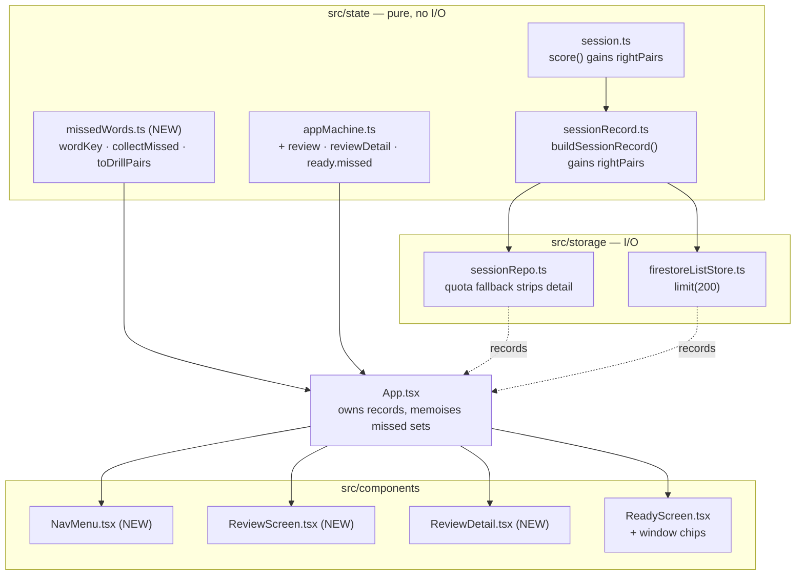

# Plan: Practice Review

**Feature ID:** 006-practice-review
**Baseline:** `feature/look-and-feel` @ `1087eb9` — 428 tests, 31 files
**Companion:** [spec.md](spec.md) for WHAT · [tasks.md](tasks.md) for the order

---

## Architecture at a glance



**The rule this follows, unchanged from 001–005:** everything decidable is a pure function in
`src/state/`; `App.tsx` owns the wiring and the only side effects; components render props.
`collectMissed` takes `now` as an argument for exactly the reason `buildSessionRecord` does.

---

## § A — The data change

### A1. `src/state/types.ts`

```ts
export interface Score {
  right: number
  wrong: number
  total: number
  pct: number
  wrongPairs: WordPair[]
  /** The complement of `wrongPairs` over the marked cards. */
  rightPairs: WordPair[]
}
```

```ts
export interface SessionRecord {
  // ... unchanged fields ...

  /**
   * Snapshot of the pairs answered correctly.
   *
   * OPTIONAL, and absent means "this drill predates right-answer recording" —
   * never "nothing was right". Records are append-only (`allow update: if false`
   * in firestore.rules), so there is no backfill and never will be: every record
   * written before 006 is permanently blind here, and the review screens say so
   * rather than rendering an empty Right section.
   *
   * Also omitted above MAX_RIGHT_PAIRS, and stripped from older records under
   * localStorage quota pressure — both of which degrade into exactly the same
   * "not recorded" path the legacy records take, which is why that path is worth
   * having rather than an edge case to apologise for.
   */
  rightPairs?: WordPair[]
}
```

> `exactOptionalPropertyTypes` is on. `rightPairs: undefined` is a **type error**, not a
> synonym for absent. Every producer uses a conditional spread.

### A2. `src/state/session.ts` — `score()`

```ts
export function score(session: Session): Score {
  const marked = Object.entries(session.marks)
  const right = marked.filter(([, r]) => r === 'right').length
  const wrongIds = new Set(marked.filter(([, r]) => r === 'wrong').map(([id]) => id))
  const rightIds = new Set(marked.filter(([, r]) => r === 'right').map(([id]) => id))
  return {
    right,
    wrong: marked.length - right,
    total: marked.length,
    pct: marked.length === 0 ? 0 : Math.round((right / marked.length) * 100),
    // Partitioned over session.pairs, so both arrays come back in the list's own
    // order rather than the shuffle's — which is what makes the review screen
    // readable and keeps `restartWrongOnly` behaving exactly as it does today.
    wrongPairs: session.pairs.filter((p) => wrongIds.has(p.id)),
    rightPairs: session.pairs.filter((p) => rightIds.has(p.id)),
  }
}
```

`Set` rather than the current `wrongIds.includes(p.id)`: it is O(n) instead of O(n²), and this
now runs over a 500-word list twice.

> **Do not change `wrongPairs`' contents or order.** `restartWrongOnly` and `ResultsScreen`
> both read it, and `session.test.ts` pins it.

### A3. `src/state/sessionRecord.ts`

```ts
/**
 * Above this many right answers, a record stores its misses only.
 *
 * A record is a log entry, not an archive. 300 right answers is already a longer
 * drill than this app is built for, and the cap is what stops MAX_RECORDS (200)
 * × a 500-word list from turning history into megabytes of localStorage.
 */
export const MAX_RIGHT_PAIRS = 300

export function buildSessionRecord(...): SessionRecord | null {
  const result = score(session)
  if (result.total === 0) return null
  const finishedAt = options.now ?? Date.now()

  return {
    // ... unchanged ...
    wrongPairs: result.wrongPairs,
    // Conditional spread, NOT `rightPairs: undefined` — exactOptionalPropertyTypes.
    ...(result.rightPairs.length <= MAX_RIGHT_PAIRS ? { rightPairs: result.rightPairs } : {}),
    finishedAt,
    mode: options.mode,
    partial: options.partial,
  }
}
```

### A4. `src/storage/sessionRepo.ts` — the quota fallback

```ts
/** Newest N records keep their right-answer detail when space runs short. */
export const DETAIL_KEEP = 20

function withoutDetail(record: SessionRecord): SessionRecord {
  const { rightPairs: _dropped, ...rest } = record
  return rest
}

function write(records: SessionRecord[]): WriteResult {
  const capped = [...records].sort((a, b) => b.finishedAt - a.finishedAt).slice(0, MAX_RECORDS)

  const attempt = (rows: SessionRecord[]): WriteResult => {
    try {
      localStorage.setItem(
        SESSION_STORAGE_KEY,
        JSON.stringify({ schemaVersion: SCHEMA_VERSION, records: rows } satisfies Payload),
      )
      return { ok: true }
    } catch (error) {
      const isQuota = error instanceof DOMException && error.name === 'QuotaExceededError'
      return { ok: false, reason: isQuota ? 'quota' : 'unavailable' }
    }
  }

  const first = attempt(capped)
  if (first.ok || first.reason !== 'quota') return first

  /*
   * Out of room. Shed DETAIL before shedding HISTORY.
   *
   * 006 roughly doubled what a record weighs, and the thing a user would
   * actually miss is the record — the score, the date, that they practised at
   * all. Right-answer detail on a month-old drill is the cheapest thing here,
   * and dropping it lands those records in exactly the same "recorded before
   * right answers were saved" path that every pre-006 record already takes. The
   * degradation is one the UI is already built for rather than a new failure mode.
   */
  return attempt(capped.map((r, i) => (i < DETAIL_KEEP ? r : withoutDetail(r))))
}
```

> `isRecord()` needs **no change**. It never validated `wrongPairs`' element shape and must not
> start now: a stricter guard would discard records that a future build wrote.

### A5. `firestore.rules` + `tests/rules/`

```
match /sessions/{sessionId} {
  allow read, delete: if isOwner(uid);
  allow create: if isOwner(uid)
    && request.resource.data.listId is string
    && request.resource.data.finishedAt is number
    && request.resource.data.wrongPairs is list
    && request.resource.data.wrongPairs.size() <= 500
    && (!('rightPairs' in request.resource.data.keys())
        || (request.resource.data.rightPairs is list
            && request.resource.data.rightPairs.size() <= 500));

  // History is a log, not a document. This is also why rightPairs can never be
  // backfilled onto a pre-006 record — by design, not by omission.
  allow update: if false;
}
```

- `500` matches the `lists` cap. A session cannot legitimately exceed its list.
- `!('rightPairs' in ...keys())` — `rightPairs` is **optional**. A rule requiring it would
  reject every write from a build that omitted it under the cap.
- **`in` operates on `.keys()`**, not on the map, in the rules language. Getting this wrong
  fails in confusing ways; the deny test is what catches it.

### A6. NFR-4 — bound the cloud subscription

`FirestoreSdk` in `src/auth/firebase.ts` gains `limit: typeof import('firebase/firestore').limit`
and the corresponding entry in `initialise()`'s `fs` object. Then:

```ts
subscribeSessions(listId, onChange, onError): Unsubscribe {
  if (disposed) return () => {}
  const base = fs.collection(db, sessionsPath)
  /*
   * Bounded, matching sessionRepo.MAX_RECORDS.
   *
   * This subscribed to an UNBOUNDED collection before, which was survivable only
   * because nothing read more than the newest ten. 006 reads all of it, on every
   * window recomputation — so local and cloud must agree on how much history
   * exists, or the same user gets different missed sets on two devices.
   */
  const q =
    listId === null
      ? fs.query(base, fs.orderBy('finishedAt', 'desc'), fs.limit(MAX_RECORDS))
      : fs.query(
          base,
          fs.where('listId', '==', listId),
          fs.orderBy('finishedAt', 'desc'),
          fs.limit(MAX_RECORDS),
        )
  ...
}
```

> `tests/rules/firestoreListStore.test.ts` fakes `fs`. Add `limit` to the fake, or every session
> test throws `fs.limit is not a function`.

---

## § B — `src/state/missedWords.ts` (new)

The heart of the feature. Pure, dependency-free, and the module that F-2 exists to protect.

```ts
import type { MarkResult, SessionRecord, WordList, WordPair } from './types'

export type ReviewWindow = 'day' | 'week' | 'month' | 'all'

export const REVIEW_WINDOWS: readonly ReviewWindow[] = ['day', 'week', 'month', 'all']

/** Chip labels. Prose labels ("today", "the last week") live in the components. */
export const WINDOW_LABELS: Record<ReviewWindow, string> = {
  day: 'Today',
  week: 'This week',
  month: 'This month',
  all: 'All time',
}

const DAY_MS = 86_400_000

/**
 * Rolling from `now`, deliberately — not calendar-aligned. "The last week" at
 * 09:00 on Monday should include last Tuesday, not four days.
 */
const WINDOW_MS: Record<ReviewWindow, number | null> = {
  day: DAY_MS,
  week: 7 * DAY_MS,
  month: 30 * DAY_MS,
  all: null,
}

/**
 * The key separator: a NUL, written as the escape.
 *
 * It cannot occur in a pasted vocabulary list, so no pair of words can key
 * the same. A SPACE here would NOT be safe: ("a", "b c") and ("a b", "c")
 * would both fold to "a b c" and merge two different words into one.
 */
const SEP = '\u0000'

/**
 * Word identity ACROSS sessions and across list edits.
 *
 * NOT `WordPair.id`. ListEditor.handleConfirm re-mints every pair id on every
 * save (ListEditor.tsx:215), so the same untouched word has a different id
 * before and after any edit to its list — and two records that straddle an edit
 * disagree about a word neither of them touched. Keying on id makes the missed
 * set silently empty the first time a user fixes a typo: no error, no symptom
 * until weeks later, when it reads as "it forgot everything".
 *
 * Content keying is also the more correct rule on its own terms. Change what a
 * word SAYS and it is genuinely a different word to practise; the old one should
 * fall out of the set and the new one should start clean. That is spec E-4, and
 * it comes for free here.
 *
 * NFC, not NFD: a French list can carry an accented letter precomposed from one
 * paste and decomposed from another, and those must be one word.
 *
 * `toLowerCase`, not `toLocaleLowerCase`: locale casing would make the key
 * depend on the device's locale rather than on the words, and Turkish dotless-i
 * would key the same word two ways on two phones.
 */
export function wordKey(pair: Pick<WordPair, 'col1' | 'col2'>): string {
  const fold = (value: string) => value.normalize('NFC').trim().toLowerCase().replace(/\s+/g, ' ')
  return fold(pair.col1) + SEP + fold(pair.col2)
}

export interface MissedWord {
  pair: WordPair
  /** Times marked wrong within the window. */
  misses: number
  /** Times seen at all within the window. Captured for a future mastery view. */
  attempts: number
  lastMissedAt: number
}

export interface MissedSet {
  words: MissedWord[]
  /**
   * At least one record in the window predates right-answer recording, so a word
   * the user has since fixed may still be here. Surfaced as one line of copy —
   * the alternative is presenting a stale set as a fresh one.
   */
  degraded: boolean
  /** Records considered. Distinguishes "no practice in this window" from "nothing missed". */
  records: number
}

export const EMPTY_MISSED: MissedSet = { words: [], degraded: false, records: 0 }

export function collectMissed(
  records: readonly SessionRecord[],
  options: {
    listId: string
    window: ReviewWindow
    now: number
    /** The live list, when it still exists. See FR-14 / FR-15. */
    list?: WordList | null
  },
): MissedSet {
  const span = WINDOW_MS[options.window]
  const cutoff = span === null ? Number.NEGATIVE_INFINITY : options.now - span

  const inWindow = records.filter((r) => r.listId === options.listId && r.finishedAt >= cutoff)

  /*
   * OLDEST FIRST. The whole of decision D-2 lives in this sort: a later drill's
   * verdict must overwrite an earlier one, so "still missed" means "missed the
   * last time you saw it" rather than "missed once, ever". Reverse this and the
   * set stops shrinking as the user learns, which is the entire point.
   */
  const ordered = [...inWindow].sort((a, b) => a.finishedAt - b.finishedAt)

  interface Entry {
    pair: WordPair
    misses: number
    attempts: number
    last: MarkResult
    lastMissedAt: number
  }
  const seen = new Map<string, Entry>()

  const visit = (record: SessionRecord, pair: WordPair, result: MarkResult) => {
    const key = wordKey(pair)
    const entry = seen.get(key) ?? { pair, misses: 0, attempts: 0, last: result, lastMissedAt: 0 }
    // Keep the freshest spelling: a later drill saw a later version of the word.
    entry.pair = pair
    entry.attempts += 1
    entry.last = result
    if (result === 'wrong') {
      entry.misses += 1
      entry.lastMissedAt = record.finishedAt
    }
    seen.set(key, entry)
  }

  for (const record of ordered) {
    for (const pair of record.wrongPairs) visit(record, pair, 'wrong')
    /*
     * A record with no rightPairs contributes wrong marks and never a right one.
     * So for pre-006 history the still-missed rule degrades, ON ITS OWN, into
     * "every word missed at least once" — no branch, no special case, no second
     * code path to keep correct. `degraded` below is the only thing that has to
     * know, and all it does is choose a sentence.
     */
    for (const pair of record.rightPairs ?? []) visit(record, pair, 'right')
  }

  // Live text wins over the snapshot: a corrected translation should be what
  // gets drilled. A word absent from the live list was deleted by the user, and
  // you cannot practise a word you removed.
  const live = options.list
    ? new Map(options.list.pairs.map((p) => [wordKey(p), p] as const))
    : null

  const words: MissedWord[] = []
  for (const entry of seen.values()) {
    if (entry.last !== 'wrong') continue
    let pair = entry.pair
    if (live) {
      const current = live.get(wordKey(entry.pair))
      if (!current) continue
      pair = current
    }
    words.push({
      pair,
      misses: entry.misses,
      attempts: entry.attempts,
      lastMissedAt: entry.lastMissedAt,
    })
  }

  // Worst first, then most recent — the order a user would choose to practise in.
  words.sort((a, b) => b.misses - a.misses || b.lastMissedAt - a.lastMissedAt)

  return {
    words,
    degraded: ordered.some((r) => r.rightPairs === undefined),
    records: ordered.length,
  }
}

/**
 * Pairs for the drill, with FRESH, UNIQUE ids.
 *
 * A missed set is assembled from several snapshots taken across several list
 * versions, so nothing guarantees its source ids are distinct — and
 * `currentPair` finds by id (session.ts:63), so a duplicate renders the wrong
 * card and marks the wrong word. Re-minting removes the whole class of bug.
 *
 * Safe because identity here is content, not id (see wordKey): the resulting
 * SessionRecord's ids mean nothing to anyone and are never compared again.
 */
export function toDrillPairs(words: readonly MissedWord[]): WordPair[] {
  return words.map((w, i) => ({ id: `missed-${i}`, col1: w.pair.col1, col2: w.pair.col2 }))
}

/** Counts for every chip, one pass per window. */
export function missedCounts(
  records: readonly SessionRecord[],
  options: { listId: string; now: number; list?: WordList | null },
): Record<ReviewWindow, number> {
  return Object.fromEntries(
    REVIEW_WINDOWS.map((w) => [w, collectMissed(records, { ...options, window: w }).words.length]),
  ) as Record<ReviewWindow, number>
}
```

---

## § C — `src/state/appMachine.ts`

### C1. States

```ts
export type MissedSource =
  | { kind: 'window'; window: ReviewWindow }
  | { kind: 'session'; finishedAt: number }

export type AppState =
  | { screen: 'home' }
  | { screen: 'editing'; /* unchanged */ }
  | {
      screen: 'ready'
      list: WordList
      /**
       * Present when the user picked a missed-words source on this screen.
       *
       * Carried BESIDE the list rather than as a synthetic WordList with the
       * subset as its pairs: that shape shares the real list's id, so "Save this
       * list" would overwrite forty words with twelve. Keeping them separate
       * makes that mistake unrepresentable rather than merely avoided.
       */
      missed?: { pairs: WordPair[]; source: MissedSource }
    }
  | { screen: 'practising'; list: WordList; session: Session }
  | { screen: 'results'; list: WordList; session: Session }
  | { screen: 'review' }
  | { screen: 'reviewDetail'; recordId: string }
```

> `reviewDetail` holds the **id**, not the record. State stays serialisable and can never carry
> a stale copy of a record the subscription has since replaced.

### C2. Actions

```ts
| { type: 'OPEN_REVIEW' }
| { type: 'OPEN_REVIEW_DETAIL'; recordId: string }
| { type: 'PRACTISE_MISSED'; list: WordList; pairs: WordPair[]; source: MissedSource }
| { type: 'PRACTISE_FULL' }        // clears `missed`, staying on ready
```

`GO_HOME` already works from anywhere. `CLOSE_REVIEW_DETAIL` is not needed — Back dispatches
`OPEN_REVIEW`.

### C3. Transitions

```ts
case 'OPEN_REVIEW':
  return { screen: 'review' }

case 'OPEN_REVIEW_DETAIL':
  return { screen: 'reviewDetail', recordId: action.recordId }

case 'PRACTISE_MISSED':
  return {
    screen: 'ready',
    list: action.list,
    missed: { pairs: action.pairs, source: action.source },
  }

case 'PRACTISE_FULL':
  return state.screen === 'ready' ? { screen: 'ready', list: state.list } : state

case 'START':
  if (state.screen !== 'ready') return state
  return {
    screen: 'practising',
    list: state.list,
    // The list id is kept even for a missed drill, so the record attributes to
    // the right list and the next missed set can read this drill back.
    session: createSession(state.missed?.pairs ?? state.list.pairs, rng, state.list.id),
  }

case 'PRACTISE_LIST':
  // Explicitly WITHOUT `missed` — arriving from Home is always the full list.
  return { screen: 'ready', list: action.list }
```

> `OPEN_REVIEW` from `practising` is a **legal** transition and the reducer permits it. The
> confirm belongs in `NavMenu`, exactly as the mid-drill sign-out confirm belongs in
> `AccountMenu` rather than in the reducer. A pure function must not open a dialog.

> `RESTART_WRONG_ONLY` from a missed drill's results already works: it reads the session, not
> the source. Nothing to add.

---

## § D — Components

### D1. `NavMenu.tsx` (new)

Modelled directly on `AccountMenu`'s guest branch — trigger, popover, Escape, outside
`pointerdown`, focus return. Do not abstract a shared popover: two call sites is not three,
and 005 hand-rolled this deliberately.

```tsx
interface Props {
  screen: AppState['screen']
  /** 'drill' and 'edit' each cost the user something on the way out. */
  guard: 'drill' | 'edit' | null
  onHome: () => void
  onReview: () => void
}
```

- `role="menu"` on the popover — **required**, not decorative: `PracticeCard`'s window
  `keydown` handler bails on `document.querySelector('[role="menu"],[role="dialog"]')`
  ([PracticeCard.tsx:48](src/components/PracticeCard.tsx#L48)), which is the only thing
  stopping `n` from marking a card wrong while this is open (FR-24).
- Items are `role="menuitem"`, with `aria-current="page"` on the current one.
- The guard:

```ts
const CONFIRM: Record<'drill' | 'edit', string> = {
  drill:
    "You're in the middle of a drill. Leaving will end it and it won't be recorded. Leave anyway?",
  edit: 'You have a list open. Leaving will discard anything you have not saved. Leave anyway?',
}

const leave = (go: () => void) => {
  if (guard && !window.confirm(CONFIRM[guard])) return
  setOpen(false)
  go()
}
```

- Trigger label: **Menu**, `.btn .btn-quiet text-sm` — the same weight as the guest **Sign in**
  control it sits opposite, so the bar reads as one row.

### D2. `App.tsx` — the bar

```tsx
{/*
  Always rendered now. This supersedes 005 FR-18: the bar existed only to hold
  the account control, so it collapsed when Firebase was unconfigured. It now
  also holds navigation, which every build needs. AccountMenu still returns null
  when `available === false`, so an unconfigured build gains a menu and no
  account DOM — which is the invariant 005 actually cared about.
*/}
<div className="mx-auto flex max-w-xl items-center justify-between gap-2 px-4 pt-3">
  <NavMenu
    screen={state.screen}
    guard={state.screen === 'practising' ? 'drill' : state.screen === 'editing' ? 'edit' : null}
    onHome={() => act({ type: 'GO_HOME' })}
    onReview={() => act({ type: 'OPEN_REVIEW' })}
  />
  <AccountMenu drillInProgress={state.screen === 'practising'} onSignedOut={handleSignedOut} />
</div>
```

`justify-between` with `AccountMenu` returning `null` leaves the nav flush left, which is what
we want — no placeholder needed.

### D3. `ReviewScreen.tsx` (new)

```tsx
interface Props {
  records: SessionRecord[]
  loading?: boolean
  onOpen: (recordId: string) => void
  onHome: () => void
}
```

Local state: `filter: string | null` (a `listId`). Options come from the **records**, not from
saved lists (FR-27) — deduped `{ listId, listName }`, the most recent name winning, so a
deleted list stays selectable.

Grouping:

```ts
/** 'Today' / 'Yesterday' / en-GB date, matching formatDate elsewhere. */
function dayLabel(ms: number, now: number): string {
  const startOf = (t: number) => new Date(t).setHours(0, 0, 0, 0)
  const days = Math.round((startOf(now) - startOf(ms)) / 86_400_000)
  if (days === 0) return 'Today'
  if (days === 1) return 'Yesterday'
  return new Date(ms).toLocaleDateString('en-GB')
}
```

> `setHours(0,0,0,0)` on a local `Date`, deliberately — "yesterday" is a local-calendar idea,
> and the rolling windows in `missedWords.ts` are a separate and deliberately different concept.
> Do not unify them.

Rows are `<button>` (FR-26). Empty states split three ways: loading (E-13), no records at all,
and none matching the filter (FR-28).

### D4. `ReviewDetail.tsx` (new)

```tsx
interface Props {
  record: SessionRecord | null
  /** The live list, when it still exists — gates "Practise these misses". */
  list: WordList | null
  onPractiseMisses: () => void
  onBack: () => void
}
```

- `record === null` → the not-available state with a working Back (FR-34).
- **Wrong (n)** first, then **Right (n)** — the misses are why anyone opened this.
- `record.rightPairs === undefined` → one line in place of the Right section (FR-32):
  *"This drill was recorded before right answers were saved, so only the misses are listed."*
- Row markup mirrors `ResultsScreen`'s "Worth another look" list, with a leading glyph and
  `text-correct` / `text-incorrect`. Colour is never the only carrier of meaning (005 E-10).
- **Practise these N missed words** — disabled at zero, and disabled with
  *"This list has been deleted."* when `list === null` (FR-33, E-6).

### D5. `ReadyScreen.tsx` — the picker

```tsx
interface Props {
  list: WordList
  saved: boolean
  /** Non-null when a missed source is selected. */
  missed: { count: number; source: MissedSource } | null
  counts: Record<ReviewWindow, number>
  /** Any record in the widest window lacks right-answer detail. */
  degraded: boolean
  onStart: () => void
  onPickWindow: (window: ReviewWindow) => void
  onPractiseFull: () => void
  onSave: () => void
  onBack: () => void
}
```

Layout, in order: title · word count · the languages panel · **Start** · the missed block ·
Save / Back.

```
Practise words you missed
[ Today 0 ] [ This week 12 ] [ This month 18 ] [ All time 23 ]
```

- Chips are `.btn .btn-quiet` (44 px via `.btn`, NFR-6); `disabled` at zero (FR-35, E-15); the
  selected one gets `bg-primary-soft` and `aria-pressed`.
- With `missed` set: the languages panel is replaced by *"Practising 12 words you missed in the
  last week."*, **Save this list** is hidden (FR-38), and a **Practise the full list instead**
  button appears.
- `degraded` adds one line (FR-40).
- **Start stays exactly where it is and keeps doing exactly what it does** (FR-37). It is the
  gesture the iOS speech chain descends from.

### D6. `Home.tsx`

The **Recent practice** heading gains a **See all →** control (FR-29). One new optional prop,
`onSeeAllHistory?: () => void`, rendered only when supplied, so `Home.test` stays valid.

---

## § E — `App.tsx` wiring

### E1. The memo

```ts
/*
 * Recomputed only when the records or the chosen list change.
 *
 * `Date.now()` is read HERE and threaded down, so the pure layer stays pure and
 * the whole screen agrees on one "now" — chips computed against four different
 * milliseconds is the kind of thing that produces a count of 12 and a drill of 11.
 */
const readyList = state.screen === 'ready' ? state.list : null
const missedCountsForReady = useMemo(() => {
  if (!readyList) return null
  return missedCounts(visibleRecords, {
    listId: readyList.id,
    now: Date.now(),
    list: visibleLists.find((l) => l.id === readyList.id) ?? readyList,
  })
}, [readyList, visibleRecords, visibleLists])
```

> `visibleLists.find(...) ?? readyList` — a brand-new unsaved list is not in `visibleLists`
> yet, and passing `null` there would mean "the list was deleted" and drop every word.

### E2. Picking a window

```ts
const pickWindow = (window: ReviewWindow) => {
  if (state.screen !== 'ready') return
  const live = visibleLists.find((l) => l.id === state.list.id) ?? state.list
  const set = collectMissed(visibleRecords, {
    listId: state.list.id,
    window,
    now: Date.now(),
    list: live,
  })
  if (set.words.length === 0) return // the chip is disabled; belt and braces
  act({
    type: 'PRACTISE_MISSED',
    list: live,
    pairs: toDrillPairs(set.words),
    source: { kind: 'window', window },
  })
}
```

### E3. `sessionMode` — FR-39

```ts
// BEFORE:
//   else if (action.type === 'START' || action.type === 'RESTART_SHUFFLED') setSessionMode('full')

if (action.type === 'RESTART_WRONG_ONLY') setSessionMode('wrong-only')
else if (action.type === 'START') {
  // A missed-words drill is a harder subset and must not flatter the average —
  // the same reasoning that made RESTART_WRONG_ONLY its own mode in 002.
  setSessionMode(state.screen === 'ready' && state.missed ? 'wrong-only' : 'full')
} else if (action.type === 'RESTART_SHUFFLED') setSessionMode('full')
```

`state` here is the **pre-action** state, which is `ready` at the moment `START` is dispatched.
That is exactly what is needed, and it is why this cannot move after `setState`.

### E4. Rendering the two screens

```tsx
{state.screen === 'review' && (
  <ReviewScreen
    records={visibleRecords}
    loading={store === null}
    onOpen={(recordId) => act({ type: 'OPEN_REVIEW_DETAIL', recordId })}
    onHome={() => act({ type: 'GO_HOME' })}
  />
)}

{state.screen === 'reviewDetail' &&
  (() => {
    const record = visibleRecords.find((r) => r.id === state.recordId) ?? null
    const list = record ? (visibleLists.find((l) => l.id === record.listId) ?? null) : null
    return (
      <ReviewDetail
        record={record}
        list={list}
        onBack={() => act({ type: 'OPEN_REVIEW' })}
        onPractiseMisses={() => {
          if (!record || !list || record.wrongPairs.length === 0) return
          // One record, so still-missed does not apply — these ARE the misses of
          // that drill. Run through collectMissed anyway, for the live-list
          // resolution: corrected text wins, deleted words drop out.
          const set = collectMissed([record], {
            listId: record.listId,
            window: 'all',
            now: Date.now(),
            list,
          })
          if (set.words.length === 0) return
          act({
            type: 'PRACTISE_MISSED',
            list,
            pairs: toDrillPairs(set.words),
            source: { kind: 'session', finishedAt: record.finishedAt },
          })
        }}
      />
    )
  })()}
```

---

## § F — Testing strategy

| Layer | File | Focus |
|---|---|---|
| Pure | `src/state/missedWords.test.ts` | **The bulk.** `wordKey` folding; still-missed vs union; the legacy degrade; live-list resolution; deleted words; window boundaries; `toDrillPairs` uniqueness. |
| Pure | `src/state/session.test.ts` | `rightPairs` partitions with `wrongPairs`; both in list order; `wrongPairs` unchanged. |
| Pure | `src/state/sessionRecord.test.ts` | `rightPairs` captured; **key absent** above the cap (`'rightPairs' in record === false`, not `=== undefined`). |
| Pure | `src/state/appMachine.test.ts` | New transitions; `START` uses `missed.pairs`; `PRACTISE_LIST` clears `missed`; illegal actions are reference-identical no-ops. |
| Storage | `src/storage/sessionRepo.test.ts` | Quota fallback sheds detail, **never a record**; a second genuine failure still returns `quota`. |
| Rules | `tests/rules/firestore.rules.test.ts` | Allow with and without `rightPairs`; **deny** at 501 in either array; update still denied. |
| Component | `NavMenu` · `ReviewScreen` · `ReviewDetail` · `ReadyScreen` | Rendering, empty and degraded states, the guards, `aria-current`. |
| Integration | `src/App.test.tsx` | Drill → review → detail → practise misses → recorded as `wrong-only`. Mid-drill nav confirm. Unconfigured build has a menu and no account control. |

### Time in tests

`collectMissed` and `missedCounts` take `now`, so the pure tests need **no** fake timers.
`App.test.tsx` does not either: seed records with `finishedAt: Date.now() - 2 * DAY` relative to
real time. Reach for `vi.setSystemTime` only for `dayLabel`'s Today/Yesterday boundary.

### The F-2 regression guard (FR-43)

```ts
it('never keys word identity on WordPair.id', () => {
  // ListEditor re-mints every pair id on every save, so an id comparison across
  // records is always wrong and always silent. wordKey is the only sanctioned
  // route; this fails the build if a second one appears.
  const offenders = appSources()
    .filter(([path]) => !path.includes('missedWords'))
    .filter(([, src]) => /wrongPairs[\s\S]{0,120}\.id\s*===/.test(src))
    .map(([path]) => path)
  expect(offenders).toEqual([])
})
```

Put it beside `theme.test.ts`'s `appSources()` helper or in a new `src/test/invariants.test.ts`.
It is a coarse net; its job is to make the next person read the comment.

---

## § G — Risks

| # | Risk | Mitigation |
|---|---|---|
| R-1 | **F-2 keying on id.** The single most likely way to ship this broken, and it is silent. | `wordKey` is the only comparison route, its comment says why, FR-43 guards it, and `missedWords.test.ts` has an explicit "ids differ across an edit" case. |
| R-2 | 005 FR-18 asserted the bar renders nothing when unconfigured. FR-23 supersedes it. | Grep `App.test.tsx` and `AccountMenu.test.tsx` for that assertion **before** editing `App.tsx`. Update the ones about the *bar*; the ones about *account controls* must stay green untouched. |
| R-3 | `exactOptionalPropertyTypes` + `rightPairs?`. `rightPairs: undefined` is a type error. | Conditional spread everywhere. `stripUndefined` at the Firestore boundary already handles the rest. |
| R-4 | `SCHEMA_VERSION` bumped by reflex. | `read()` returns `[]` for a version mismatch — bumping **deletes every user's history**. FR-5 says don't. An additive optional key needs no bump. |
| R-5 | Adding `fs.limit` breaks the fake in `tests/rules/firestoreListStore.test.ts`. | Add it to the fake in the same task. |
| R-6 | `n` marks a card wrong while the nav menu is open mid-drill. | `role="menu"` on the popover (FR-24). Test it. |
| R-7 | Storage growth — records roughly doubled in weight. | `MAX_RIGHT_PAIRS`, the quota fallback (§ A4), and `limit(200)` on the cloud path. |
| R-8 | The Firestore `in` operator on a map vs on `.keys()`. | A deny test that would also pass under a wrong rule is worthless — assert the 501 case specifically. |
| R-9 | Four chips recomputing `collectMissed` on every render. | One `useMemo` keyed on `(list, records, lists)`; `missedCounts` does one pass per window over ≤ 200 records. |
| R-10 | A missed drill whose list was renamed mid-flight. | `listName` is captured at record time, as always. Nothing new. |

## Definition of done

```bash
npm run typecheck && npm run lint && npm test && npm run check:bundle
npm run test:rules
```

All exit 0, ≥ 428 tests green, plus the by-hand pass in [tasks.md](tasks.md) Task 16.
