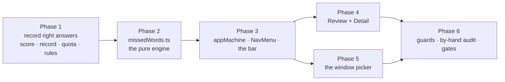

# Quickstart: Practice Review

**Feature ID:** 006-practice-review
**Status:** DRAFT — not yet executed
**Baseline:** `feature/look-and-feel` @ `1087eb9` — 428 tests, 31 files

## What this does

Three things, from one request:

1. **A review surface** — a Review screen listing your finished drills, and a detail screen per
   drill showing what you got **right** and what you got **wrong**.
2. **A menu** in the top-left corner, opposite the account avatar, on every screen.
3. **A missed-words drill** — per list, practise the words you're still getting wrong, from
   **Today / This week / This month / All time**.

## Decisions

| | |
|---|---|
| Which words | **Still-missed only** — a word drops out once you get it right |
| Windows | **Today · This week · This month · All time**, rolling from now |
| Review | **Two screens** — index of sessions, detail per session |
| Menu | **Corner nav opposite the avatar**, every screen |
| Picker lives on | **`ReadyScreen`**, not a fifth button on the list row |
| Missed drill scores as | **`mode: 'wrong-only'`** — cannot flatter the average |
| Leaving a drill via the menu | Confirm, then discard **without recording** |

## The two findings that shape it

### F-1 — Right answers aren't recorded

`SessionRecord` stores `wrongPairs` and nothing about what was right. "See what you had right"
is a **missing field**, not a rendering problem. Records are append-only by Firestore rule, so
there will be **no backfill** — every existing record is permanently right-answer-blind and the
screens say so in one line rather than pretending.

### F-2 — `WordPair.id` is not a word identity

[ListEditor.tsx:215](src/components/ListEditor.tsx#L215) re-mints **every pair id on every
save**, updates included. So two records straddling an edit disagree about the id of a word
neither touched. Key on `id` and the missed set silently empties the first time a user fixes a
typo — no error, no symptom, until weeks later when it reads as *"it forgot everything."*

**Word identity is a content key** (`wordKey`), never `id`. Which is also the more correct rule:
change what a word says and it genuinely is a different word to practise.

## Order



17 tasks. Phase 1 makes the data exist; Phase 2 is finished and fully tested **before** any
component imports it, because it holds the one genuinely subtle bug. Phases 4 and 5 are
independent branches off Phase 3.

## Files

**Created:** `src/state/missedWords.ts` · `src/components/NavMenu.tsx` ·
`src/components/ReviewScreen.tsx` · `src/components/ReviewDetail.tsx` ·
`src/test/invariants.test.ts` (+ a test for each)

**Updated:** `src/state/types.ts` · `src/state/session.ts` · `src/state/sessionRecord.ts` ·
`src/state/appMachine.ts` · `src/storage/sessionRepo.ts` · `src/storage/firestoreListStore.ts` ·
`src/auth/firebase.ts` (one SDK entry) · `src/App.tsx` · `src/components/ReadyScreen.tsx` ·
`src/components/Home.tsx` · `firestore.rules` · `tests/rules/*` · `README.md`

**Never touched:** `src/parse/` · `src/speech/` · `src/lang/` · `src/storage/listRepo.ts` ·
`src/auth/` (beyond one `FirestoreSdk` line) · `src/index.css` · `index.html` ·
`vite.config.ts` · `package.json`

## The six things most likely to bite

1. **Keying on `WordPair.id`.** F-2. The one defect here that ships silently and surfaces weeks
   later. `wordKey` is the only sanctioned comparison; Task 15 guards it.
2. **`sessionMode` is forced to `'full'` on every `START`**
   ([App.tsx:167](src/App.tsx#L167)). Miss it and every missed-words drill counts as a full run
   and quietly poisons the user's average — with every test green.
3. **Do not bump `SCHEMA_VERSION`.** `sessionRepo.read()` returns `[]` on a mismatch, so a
   reflex bump **deletes every user's history**. An additive optional key needs none.
4. **`exactOptionalPropertyTypes` is on.** `rightPairs: undefined` is a type error, not a
   synonym for absent. Conditional spread everywhere, and assert with `'rightPairs' in record`,
   never `toBeUndefined()` — which passes for both and proves nothing.
5. **The nav popover must be `role="menu"`.** It is what makes `PracticeCard`'s window `keydown`
   handler stand down ([PracticeCard.tsx:48](src/components/PracticeCard.tsx#L48)); without it,
   typing `n` with the menu open mid-drill marks the card wrong underneath it.
6. **005 FR-18 is superseded.** The top bar now renders even when Firebase is unconfigured,
   because it carries navigation. `AccountMenu` still returns `null` there — the assertions
   about *account controls* must stay green untouched; only the ones about the *bar* change.

## Commands

```bash
npm test                                       # baseline: 428 tests, 31 files
npm test -- session sessionRecord sessionRepo  # Phase 1
npm run test:rules                             # Phase 1, Task 4 — needs the emulator
npm test -- missedWords                        # Phase 2 — the engine, on its own
npm test -- appMachine NavMenu App             # Phase 3
npm test -- ReviewScreen ReviewDetail          # Phase 4
npm test -- ReadyScreen App                    # Phase 5
npm test -- invariants theme                   # the guards
npm run dev                                    # Task 16 — no substitute for it

npm run typecheck && npm run lint && npm test && npm run check:bundle
```

## Confidence

**7.5 / 10** for one-pass execution. The data change is three small additive edits, the engine
is one pure function with a plan that spells it out line by line, and the components follow
patterns already written twice in this repo.

The points come off for three things. **F-2 is a trap that hides**: content keying is written
down here and guarded by a test, but any hurried edit that reaches for `.id` reintroduces it
without a single failure. **The still-missed rule is a sequence, not a state** — "wrong Monday,
right Wednesday, gone Thursday" needs three drills across an edit to verify properly, which is
Task 16 steps 3–6 and genuinely cannot be done in jsdom. And the **`degraded` path only exists
for records this build will never write**, so it is testable only against a hand-seeded
`localStorage` entry — easy to write, easy to forget, and the first thing a real user with
existing history will meet.
