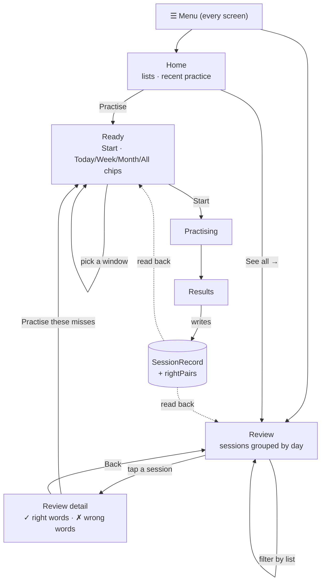

# Spec: Practice Review — see what you got wrong, then fix it

**ID:** 006-practice-review
**Status:** IMPLEMENTED
**Created:** 2026-09-05
**Baseline (as planned):** `feature/look-and-feel` @ `1087eb9` — 428 tests across 31 files
**Baseline (as executed):** `main` @ `d24ec53` — **604 tests across 38 files, all green**
**Status at execution:** IMPLEMENTED on `feature/practice-review` — 742 tests across 44 files

> ## Drift between planning and execution
>
> Two features merged to `main` after this spec was written, and both touch it. The spec
> below is left as it was drafted; these are the points where execution diverged.
>
> | # | Planned against `1087eb9` | Actual on `d24ec53` | Consequence |
> |---|---|---|---|
> | D-a | `Session` had no mode | 002 added `DrillMode` (`practice` / `test`), and `ReadyScreen` offers **Practice** and **Test** instead of one **Start** | The picker sits alongside both buttons; `START` carries `action.mode` through. A practice run marks nothing and writes no record, so only test runs feed the missed set. |
> | D-b | FR-23: the top bar collapsed when Firebase was unconfigured, and this feature had to change that | 007 already made the bar unconditional to house `ThemeToggle` | **FR-23 and risk R-2 were already satisfied.** No 005-era test needed editing. |
> | D-c | FR-24 named `PracticeCard.tsx` | 002 split it into `TestCard` / `StudyCard`, both of which already carry the `[role="menu"]` guard | Nothing to add; the integration is now tested. |
> | D-d | FR-44 assumed the "no `dark:`" guard was the whole story | 007 brought dark mode back as a second token block | New components use tokens only and inherit both themes. The guard still passes unchanged. |
> | D-e | § A5 required `wrongPairs` on a session write | The rules suite's `aSession` fixture has no `wrongPairs` | Both arrays are **capped if present** rather than required — same blast-radius goal, and no existing rules test needed editing. |
> | D-f | Task 3 assumed `sessionRepo.test.ts` existed | It did not | Created; the repo now has coverage it was missing. |
> | D-g | Not foreseen | 002 added `drillRepo`, which parks a running drill in localStorage | Navigating away via the menu clears it through `act`'s existing branch. Pinned by a test. |
> | D-h | § E1 read `Date.now()` inside a `useMemo` | oxlint's `react(purity)` rule rejects that, and the baseline is warning-free | One clock reading is held in state and refreshed on arriving at `ready` or `review`, and **shared by the chips and the drill** — which also closes the "chip says 12, drill deals 11" hazard the plan itself warned about. |

**Feature Type:** Enhancement — one new data field, two new screens, one new drill source
**Complexity:** Medium-High — the UI is routine; the word-identity problem underneath it is not

## The ask

> "I'd like to add another screens to review latest practices — to see what the user had right
> and what was wrong. For that — let's add menu so we can move to the latest practices screen.
> Also, per list — I'd like to be able to practice the words I previously got wrong — from the
> practice lists from latest week/month/day (choose by the user)"

Three things: a **review surface**, a **menu** to reach it, and a **missed-words drill** scoped
to a time window the user picks.

## What is on the branch today

`feature/look-and-feel` carries 001–005: the drill, drill modes and score history, Google
accounts, multi-language lists, and the design system. The relevant machinery already exists:

| Already there | Where |
|---|---|
| A finished drill is written as a `SessionRecord` | [sessionRecord.ts](src/state/sessionRecord.ts) |
| Records are subscribed to app-wide, newest first | [App.tsx:100](src/App.tsx#L100) |
| Records survive their list being deleted (`listName` denormalised) | [types.ts:53](src/state/types.ts#L53) |
| Records are append-only, enforced server-side | [firestore.rules:52](firestore.rules#L52) |
| A wrong-only drill already exists and is scored separately | [session.ts:110](src/state/session.ts#L110) |
| A corner popover with escape / outside-click / focus-return | [AccountMenu.tsx](src/components/AccountMenu.tsx) |
| `ScoreHistory` renders the last 10 records as one-line summaries | [ScoreHistory.tsx](src/components/ScoreHistory.tsx) |

So this feature is not starting from nothing. It is finishing something 002 deliberately left
half-built — `SessionRecord.wrongPairs` carries the comment *"the raw material for a future
per-word mastery feature"* ([types.ts:66](src/state/types.ts#L66)). **This is that feature.**

## Two findings that shape everything

### F-1 — Right answers are not recorded anywhere

`SessionRecord` stores `right`, `wrong`, `total`, `pct` and `wrongPairs`. It does **not** store
which words were right. "See what the user had right" is therefore not a rendering problem; it
is a **missing field**.

`score()` ([session.ts:82](src/state/session.ts#L82)) computes `wrongPairs` and throws the
complement away. Both the shape function and the record need it.

Records are append-only by rule (`allow update: if false`). There will be **no backfill**. Every
record written before this feature ships is permanently right-answer-blind, and the review
screens have to say so rather than pretend.

### F-2 — `WordPair.id` is not a word identity

[ListEditor.tsx:215](src/components/ListEditor.tsx#L215):

```ts
.map((row) => ({ id: nextId(), col1: row.col1, col2: row.col2 }))
```

`handleConfirm` re-mints **every pair id on every save**, including an update. So:

- The same word has a different id before and after any edit to its list.
- Two `SessionRecord`s that straddle an edit disagree about the id of a word neither of them
  touched.
- Matching a record's snapshot against the live list by id silently finds nothing.

Any design that keys word identity on `id` produces a missed-words drill that is quietly wrong
the first time a user fixes a typo — a bug that presents as "it forgot everything", weeks later,
with no error.

**Word identity must be keyed on content**, via a normalised `col1 + col2` fold. That is also
the more correct rule on its own terms: change what a word *says* and it genuinely is a
different word to practise. Fixing `nextId` to preserve ids would not remove the need for
content keying, so it stays **out of scope**.

## Decisions taken

| # | Decision | |
|---|---|---|
| D-1 | `SessionRecord` gains **`rightPairs?: WordPair[]`** — additive, optional, no backfill. | |
| D-2 | The missed set is **still-missed only**: a word is included when its **most recent** mark in the window was wrong. Get it right later and it drops out. | |
| D-3 | Word identity is a **content key**, never `WordPair.id` (F-2). | |
| D-4 | Windows are **Today / Week / Month / All time**. | |
| D-5 | Review is **two screens** — an index of sessions, and a detail screen for one. | |
| D-6 | Navigation is a **corner menu opposite the account avatar**, on every screen. | |
| D-7 | The missed-words picker lives on **`ReadyScreen`** — the per-list launch pad — not as a fifth button on an already four-button list row. | |
| D-8 | A missed-words drill is recorded as **`mode: 'wrong-only'`**, so it cannot flatter the average. | |
| D-9 | Leaving a running drill through the menu **discards it without recording**, after a confirm — matching sign-out (005 E-6). | |

**On D-2 and legacy records.** A record without `rightPairs` contributes wrong marks and never a
right mark. So for old history the still-missed rule degrades, on its own, into "every word
missed at least once" — no branch, no special case. The screens surface that with one line of
copy; they do not silently present a stale set as a fresh one.

**On D-7.** `SavedLists` rows already carry Practise / Edit / Rename / Delete. A fifth control
with a nested window chooser turns a list row into a toolbar. `ReadyScreen` is where a list is
already chosen, already knows its languages, and already owns the Start tap that iOS needs the
speech chain to descend from.

## The shape of it



## Requirements

### The data (F-1)

| # | Requirement |
|---|---|
| FR-1 | `Score` gains `rightPairs: WordPair[]` — the complement of `wrongPairs` over the marked cards, in the session's pair order. |
| FR-2 | `SessionRecord` gains **optional** `rightPairs?: WordPair[]`. Absent means "this drill predates right-answer recording", never "nothing was right". |
| FR-3 | `buildSessionRecord` populates `rightPairs` when the drill has ≤ `MAX_RIGHT_PAIRS` (300) right answers, and **omits the key entirely** above that. `exactOptionalPropertyTypes` is on, so it is a conditional spread, not `rightPairs: undefined`. |
| FR-4 | `sessionRepo.write` retries once on `QuotaExceededError`, having stripped `rightPairs` from all but the newest 20 records, before reporting `{ ok: false, reason: 'quota' }`. Records must never be *lost* to make room for detail. |
| FR-5 | No migration, no backfill, no schema version bump. `SCHEMA_VERSION` stays `1` — a v1 reader that ignores an unknown key is exactly the forward compatibility already designed for, and bumping it would make `read()` discard every existing record. |
| FR-6 | `firestore.rules` caps `wrongPairs` and `rightPairs` at 500 entries each on create, and keeps `allow update: if false`. |

### Word identity (F-2)

| # | Requirement |
|---|---|
| FR-7 | `wordKey(pair)` returns a content key: NFC-normalised, trimmed, lower-cased, inner whitespace collapsed, `col1` and `col2` joined by a separator that cannot occur in either. |
| FR-8 | Nothing in the missed-words path compares `WordPair.id` across records or against a list. |
| FR-9 | Pairs handed to `createSession` for a missed drill are re-minted with fresh, guaranteed-unique ids. A missed set is assembled from several snapshots, and `currentPair` finds by id — duplicate ids would render the wrong card. |

### The missed-words engine

| # | Requirement |
|---|---|
| FR-10 | `collectMissed(records, { listId, window, now, list })` is **pure**, lives in `src/state/`, and takes `now` as an argument. No `Date.now()`, no store access. |
| FR-11 | Records are filtered to `listId` and `finishedAt >= cutoff`, then walked **oldest first**, so a later drill's verdict overwrites an earlier one. |
| FR-12 | A word is in the result when its last verdict in the window is `wrong` (D-2). |
| FR-13 | Each result carries `misses`, `attempts` and `lastMissedAt`, sorted by most misses, then most recently missed. |
| FR-14 | When the live list is supplied, each word is resolved against it by `wordKey` and the **live pair** is used — so a corrected translation is drilled, not the stale snapshot. A word no longer in the list is **dropped**: the user deleted it. |
| FR-15 | When the list is absent (`null`), the snapshots are used as-is, so a deleted list's history is still readable. |
| FR-16 | The result reports `degraded: true` when any record in the window lacks `rightPairs`, so the UI can say the set may include words since fixed. |
| FR-17 | Windows: `day` = 24 h, `week` = 7 days, `month` = 30 days, `all` = no cutoff. Rolling from `now`, not calendar-aligned. |

### The menu (D-6)

| # | Requirement |
|---|---|
| FR-18 | A `NavMenu` renders in the top bar on **every** screen, opposite the account control. Items: **Home**, **Review**. |
| FR-19 | The current screen's item carries `aria-current="page"` and is not a navigation no-op that closes silently — it closes the menu and stays put. |
| FR-20 | Escape, outside click, focus return to trigger, `aria-haspopup="menu"` and a live `aria-expanded` — the same contract `AccountMenu` already meets (005 FR-23). |
| FR-21 | Navigating away from `practising` confirms first, naming the consequence: the drill ends and is **not** recorded. Accepting discards it (D-9). |
| FR-22 | Navigating away from `editing` confirms first: unsaved list changes are lost. |
| FR-23 | The top bar now renders **unconditionally**. This supersedes 005 FR-18 ("renders nothing at all when `available === false`"). `AccountMenu` still returns `null` when Firebase is unconfigured, so an unconfigured build gains a menu and **no** account DOM. |
| FR-24 | `PracticeCard`'s window `keydown` handler already bails while a `[role="menu"]` or `[role="dialog"]` exists ([PracticeCard.tsx:48](src/components/PracticeCard.tsx#L48)). The nav popover must use `role="menu"` so `n` cannot mark a card wrong while it is open. |

### The review index

| # | Requirement |
|---|---|
| FR-25 | `ReviewScreen` lists finished drills newest first, grouped under **Today**, **Yesterday**, then `en-GB` dates — matching `formatDate` elsewhere. |
| FR-26 | Each row shows the list name, score as `right / total (pct%)`, and badges for `wrong-only` and `partial`, and is a **button** opening that session's detail. |
| FR-27 | A filter selects **All lists** or one list that appears in the history. Lists are drawn from the records, not from saved lists, so a deleted list's history stays reachable. |
| FR-28 | Empty state distinguishes "no practice yet" from "no practice for this filter". |
| FR-29 | Home's **Recent practice** heading gains a **See all →** control into the review screen. The menu is the primary route; this is the discoverable one. |

### The review detail

| # | Requirement |
|---|---|
| FR-30 | `ReviewDetail` shows one record: list name, date and time, score, mode and partial badges. |
| FR-31 | Two sections — **Right (n)** and **Wrong (n)** — each listing `col2 · col1` in the same visual language `ResultsScreen` already uses for "Worth another look". |
| FR-32 | When `rightPairs` is absent the Right section is replaced by one line saying this drill was recorded before right answers were saved. It does **not** render an empty "Right (0)". |
| FR-33 | A **Practise these N missed words** control, disabled when the record has no misses, and disabled with an explanation when the record's list no longer exists. |
| FR-34 | A record id that resolves to nothing renders a "that drill is no longer available" state with a working Back, rather than a blank screen. |

### The missed-words drill

| # | Requirement |
|---|---|
| FR-35 | `ReadyScreen` shows four window chips — **Today**, **This week**, **This month**, **All time** — each labelled with its count, and disabled at zero. |
| FR-36 | Choosing a window stays on `ReadyScreen` and swaps the drill source. The screen then states what will be drilled and offers **Practise the full list instead**. |
| FR-37 | `Start` remains the only entry to `practising`, from either source. It is the tap the iOS speech chain descends from ([ReadyScreen.tsx:29](src/components/ReadyScreen.tsx#L29)) and nothing may bypass it. |
| FR-38 | **Save this list** is hidden while a missed source is selected. The subset must never be able to overwrite the real list. |
| FR-39 | The resulting `SessionRecord` has `mode: 'wrong-only'` (D-8). `App`'s `sessionMode` is currently set to `'full'` on every `START` ([App.tsx:167](src/App.tsx#L167)) — that must become source-dependent. |
| FR-40 | When `degraded`, the picker shows one line: some of these drills predate right-answer recording, so a word since fixed may still appear. |
| FR-41 | Counts are computed from the records already subscribed app-wide. **No new store method, no per-list subscription.** |

### Guards

| # | Requirement |
|---|---|
| FR-42 | `tests/rules/firestore.rules.test.ts` covers both new caps with an **allow and a deny** case each — the file's own stated contract ([firestore.rules:9](firestore.rules#L9)). |
| FR-43 | A test asserts no module outside `missedWords.ts` compares pair ids across records (F-2 regression guard). |
| FR-44 | `src/test/theme.test.ts` globs `src/**`, so the new components are covered automatically. No new `dark:` class, no raw palette utility. |

### Non-functional

| # | Requirement |
|---|---|
| NFR-1 | **No new npm dependencies.** The picker is chips, the menu is the popover pattern already written, grouping is `toLocaleDateString`. |
| NFR-2 | **No CSP change.** `csp.test.ts` stays green and unedited. |
| NFR-3 | Eager JS within its existing 150 KB budget; total eager within 220 KB. `check:bundle` exits 0. |
| NFR-4 | `subscribeSessions` gains `fs.limit(200)` on the cloud path, matching `sessionRepo.MAX_RECORDS`. Today it subscribes to an unbounded collection, and this feature is what starts reading all of it. Requires `limit` in `FirestoreSdk`. |
| NFR-5 | The review path adds **no** Firestore composite index. Filtering by list happens client-side over the existing `orderBy('finishedAt')` subscription; a `where('listId') + orderBy` query would need an index that has never been exercised in production. |
| NFR-6 | Every interactive element ≥ 44 px, via `.btn`. Chips included. |
| NFR-7 | All **428** existing tests pass. Tests that change are the ones whose subject changed — `sessionRecord`, `session`, and any asserting the bar's absence. Everything else is unedited. |
| NFR-8 | Review of 200 records × up to 500 pairs must not block a tap. `collectMissed` is O(records × pairs) with map lookups; memoise per `(listId, window)` in `App`. |

## Edge cases

| # | Case | Behaviour |
|---|---|---|
| E-1 | Every record predates `rightPairs` | Review detail says so per record; the missed set degrades to union-of-misses and says so once. Never an empty "Right (0)". |
| E-2 | A word was missed Monday, right Wednesday | Excluded (D-2) — but only if Wednesday's record has `rightPairs`. Otherwise included, and `degraded` explains why. |
| E-3 | The list was edited between two drills | Content keying matches the word across both (F-2). Ids differing is expected, not an error. |
| E-4 | A word's translation was corrected | Its key changed, so it is a different word: the old one drops out, the new one has no history. Correct, and stated so nobody "fixes" it. |
| E-5 | A word was deleted from the list | Dropped from the missed set (FR-14). You cannot drill what you removed. |
| E-6 | The list itself was deleted | History and detail still render from snapshots (FR-15). "Practise these misses" is disabled with a reason (FR-33). |
| E-7 | A 500-word drill, all right | `rightPairs` omitted above 300 (FR-3). Detail shows the count and the same "not recorded" line as E-1. |
| E-8 | localStorage full | Oldest records lose their right-answer detail; **no record is dropped** (FR-4). Degrades into E-1, which is already handled. |
| E-9 | Menu opened mid-drill, user types `n` | Ignored — the popover is `role="menu"` and `PracticeCard` bails (FR-24). |
| E-10 | Menu → Review while practising | Confirm, then discard without recording (FR-21). Cancel leaves the drill exactly where it was. |
| E-11 | Menu → Review from a dirty editor | Confirm (FR-22). |
| E-12 | Firebase unconfigured | Menu present, account control absent (FR-23). |
| E-13 | Signed in, records still arriving | Review shows its loading state, not "no practice yet" — the same reasoning as `SavedLists`' loading branch. |
| E-14 | Detail open, the record is deleted under it (account deletion) | FR-34's not-available state. |
| E-15 | A window with zero misses | Its chip is disabled and shows `0`. The picker points at the wider windows rather than going nowhere. |
| E-16 | A missed drill is quit early | Recorded `mode: 'wrong-only'`, `partial: true`. Its own misses feed the next missed set — the loop closes. |
| E-17 | Two lists contain the same word | Keys are scoped by `listId` first, so they never merge. |
| E-18 | A word marked right in the same drill it was marked wrong | Impossible — one mark per card per session. Within a record the two arrays are disjoint. |

## Out of scope

- **Backfilling `rightPairs`.** Records are append-only by rule and that stays true.
- **Stable pair ids.** `nextId` keeps re-minting (F-2). Content keying makes it irrelevant here; changing it is its own change with its own risk.
- **Cross-list review.** A missed set is per list (FR-10). A global "my weakest words" screen is a different feature.
- **Spaced repetition, streaks, mastery scores, charts.** `misses` and `attempts` are captured so this is possible later; nothing is built on them now.
- **Editing or deleting a session record.** Append-only.
- **Exporting history.**
- **A router.** `appMachine` gains two states; the URL does not change. Deep-linking a review is a separate decision.

## Acceptance criteria

- [ ] Finishing a drill writes a record whose `rightPairs` holds exactly the words marked right.
- [ ] The menu appears on home, editing, ready, practising, results, review and review detail, and never overlaps the drill's Quit button.
- [ ] Menu → Review mid-drill asks first; accepting produces **no** history entry; cancelling leaves the card untouched.
- [ ] Review lists finished drills grouped by day, filterable by list, and a deleted list's drills are still listed under their captured name.
- [ ] Opening a session shows its right words and its wrong words in full.
- [ ] A record written before this feature shows its wrong words and one line explaining the missing right ones — never an empty Right section.
- [ ] On `ReadyScreen`, the four window chips show live counts and disable at zero.
- [ ] Picking a window and pressing Start drills exactly the still-missed words for that window, in a fresh shuffle, with the first word spoken.
- [ ] A word missed last week and answered right yesterday does **not** appear in the week's set.
- [ ] Editing an unrelated word in the list does not empty the missed set (F-2).
- [ ] Correcting a missed word's translation removes it from the set; the corrected word starts clean.
- [ ] A missed drill appears in history as `missed words only` and does not move the full-run average.
- [ ] **Save this list** is unreachable while a missed source is selected.
- [ ] With Firebase unconfigured, the menu works and no account control exists.
- [ ] `npm run typecheck && npm run lint && npm test && npm run check:bundle` all exit 0, with **≥ 428** tests green, plus `npm run test:rules`.

## Success metrics

1. After a drill, the answer to "which ones did I get wrong?" takes one tap, not a re-run.
2. The missed set **shrinks as the user learns** — that is the whole difference between D-2 and a union, and it is the reason to store right answers at all.
3. A user who fixes a typo in a list does not lose their practice history for it.
4. Missed-word drills never distort the full-run average.
5. Every degradation — old records, quota pressure, a deleted list — is stated on screen in a sentence, never silently presented as fresh data.
6. Zero regressions: 428 tests green, no CSP change, no new dependency, no composite index.
