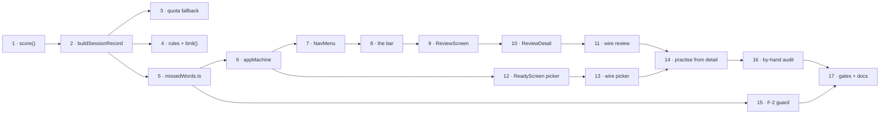

# Tasks: Practice Review

**Feature ID:** 006-practice-review
**Baseline:** `feature/look-and-feel` @ `1087eb9` — **428 tests across 31 files, all passing**
**Total:** 17 tasks across 6 phases
**Legend:** `[P]` = parallelisable with its siblings · every task ends in a runnable VALIDATE

> **TDD throughout**, as in 001–005: failing test (RED), minimal code (GREEN), refactor green.
> Almost all of this feature is behaviour, so unlike 005 there is no presentation-only phase
> where the rule relaxes.

> **Order matters.** Phase 1 makes the data exist — without it Phase 2 has nothing to compute
> from and Phase 4 has nothing to show. Phase 2 is the pure engine, finished and fully tested
> **before** any component imports it, because it is where the one genuinely subtle bug lives
> (F-2). Phases 3–5 are UI over a settled foundation.

> **Read [plan.md](plan.md) § B before Task 5.** It is the module verbatim, comments included,
> and those comments are the only thing standing between the next reader and re-introducing
> id-based matching.

---

## Phase 1 — Record the right answers (Tasks 1–4)

### Task 1: EXTEND `score()` with `rightPairs`
- **TEST FIRST:** in `src/state/session.test.ts`:
  - `rightPairs` holds exactly the pairs marked `right`.
  - `rightPairs` and `wrongPairs` are disjoint, and together equal the marked pairs.
  - Both come back in **`session.pairs` order**, not shuffle order.
  - An unfinished session scores only what was marked — `rightPairs` excludes unseen cards.
  - **Existing `wrongPairs` assertions are unedited and still green.**
- **IMPLEMENT:** [plan.md](plan.md) § A2 — add `rightPairs` to `Score` in `src/state/types.ts`,
  then partition in `score()` using two `Set`s.
- **WHY:** FR-1. This is the missing half of F-1; everything else in the feature reads it.
- **GOTCHA:** Do **not** alter `wrongPairs`' contents or order. `restartWrongOnly`
  ([session.ts:110](src/state/session.ts#L110)) and `ResultsScreen` both consume it.
- **GOTCHA:** Swap `includes` for `Set.has` while you are here — `score()` now walks the pairs
  twice, and a 500-word list makes O(n²) measurable.
- **VALIDATE:** `npm test -- session`

### Task 2: CAPTURE `rightPairs` in `buildSessionRecord`
- **TEST FIRST:** in `src/state/sessionRecord.test.ts`:
  - A finished drill's record carries `rightPairs` matching the right answers.
  - Above `MAX_RIGHT_PAIRS`, the key is **absent** — assert
    `expect('rightPairs' in record).toBe(false)`, **not** `toBeUndefined()`, which passes for
    both and so proves nothing.
  - `wrongPairs` is unaffected by the cap.
  - `total === 0` still returns `null`.
- **IMPLEMENT:** [plan.md](plan.md) § A1 + § A3 — `rightPairs?: WordPair[]` on `SessionRecord`,
  `MAX_RIGHT_PAIRS = 300`, conditional spread in `buildSessionRecord`.
- **WHY:** FR-2, FR-3.
- **GOTCHA:** `exactOptionalPropertyTypes` is on. `rightPairs: undefined` is a **type error**.
  Use `...(cond ? { rightPairs } : {})`.
- **GOTCHA:** Do **not** touch `SCHEMA_VERSION` (FR-5). `sessionRepo.read()` returns `[]` on a
  version mismatch ([sessionRepo.ts:57](src/storage/sessionRepo.ts#L57)) — bumping it silently
  **deletes every user's history**. An additive optional key needs no bump.
- **GOTCHA:** Do **not** tighten `isRecord()`. It has never validated element shape, and a
  stricter guard would discard records written by a future build.
- **VALIDATE:** `npm test -- sessionRecord session`

### Task 3: SHED DETAIL, NOT HISTORY, under quota pressure [P]
- **TEST FIRST:** in `src/storage/sessionRepo.test.ts`, stub
  `vi.spyOn(Storage.prototype, 'setItem')` to throw a `DOMException(..., 'QuotaExceededError')`
  on the first call and succeed on the second:
  - `add()` returns `{ ok: true }`.
  - The payload written on the **second** call still holds every record.
  - Records beyond `DETAIL_KEEP` have **no** `rightPairs` key; the newest ones keep theirs.
  - Throwing on **both** calls still returns `{ ok: false, reason: 'quota' }`.
  - A non-quota `DOMException` returns `unavailable` on the **first** attempt — no retry.
- **IMPLEMENT:** [plan.md](plan.md) § A4 — `DETAIL_KEEP = 20`, `withoutDetail`, the
  `attempt()` / retry shape.
- **WHY:** FR-4. Records now weigh roughly double; what a user would actually miss is the
  record itself, not the right-answer detail on a month-old drill.
- **GOTCHA:** `withoutDetail` must **delete the key**, not set it to `undefined` — the same
  `exactOptionalPropertyTypes` trap as Task 2, and `JSON.stringify` drops `undefined` anyway,
  so the test would pass while the type is wrong.
- **GOTCHA:** Restore the spy in `afterEach`. A leaked `setItem` stub takes down every later
  file that touches `localStorage`.
- **VALIDATE:** `npm test -- sessionRepo`

### Task 4: BOUND the cloud subscription and cap the rules [P]
- **TEST FIRST:** in `tests/rules/firestore.rules.test.ts`, all four:
  - **allow** a session create carrying `rightPairs`;
  - **allow** one omitting it entirely;
  - **deny** `wrongPairs` at 501 entries;
  - **deny** `rightPairs` at 501 entries;
  - and confirm `allow update: if false` still denies a rewrite.
- **IMPLEMENT:** [plan.md](plan.md) § A5 for `firestore.rules`, then § A6 — add
  `limit` to `FirestoreSdk` and to `initialise()`'s `fs` object in
  [firebase.ts](src/auth/firebase.ts), and `fs.limit(MAX_RECORDS)` to **both** branches of
  `subscribeSessions`.
- **WHY:** FR-6, NFR-4. `subscribeSessions` subscribes to an unbounded collection today, which
  was survivable only while nothing read past the newest ten. 006 reads all of it.
- **GOTCHA:** In the rules language `in` operates on **`.keys()`**, not on the map. Write
  `!('rightPairs' in request.resource.data.keys())`. The deny test is what catches getting this
  wrong.
- **GOTCHA:** `tests/rules/firestoreListStore.test.ts` fakes `fs`. Add `limit` to the fake in
  this task or every session test throws `fs.limit is not a function`.
- **GOTCHA:** `test:rules` needs the Java on `PATH` that the npm script already sets up — run
  the script, not `vitest` directly.
- **VALIDATE:** `npm run test:rules && npm test -- firestoreListStore`

---

## Phase 2 — The missed-words engine (Task 5)

### Task 5: CREATE `src/state/missedWords.ts`
- **TEST FIRST:** `src/state/missedWords.test.ts`. This is the largest new test file in the
  feature and it earns it:

  **`wordKey`**
  - Case, surrounding whitespace and doubled inner spaces all fold to one key.
  - NFC and NFD spellings of the same accented word produce the **same** key.
  - `('a', 'bc')` and `('ab', 'c')` produce **different** keys.
  - Two pairs with **different ids and identical text** key the same. *(F-2, the core case.)*

  **still-missed (D-2)**
  - Wrong Monday, right Wednesday → **excluded**.
  - Wrong Monday, wrong Wednesday → included, `misses === 2`.
  - Right Monday, wrong Wednesday → included.
  - Records fed in **newest-first order** produce the same answer as oldest-first — the
    function sorts, it does not trust its input.

  **the legacy degrade (E-1)**
  - Records without `rightPairs` yield union-of-misses and `degraded === true`.
  - A mix of legacy and new records is `degraded === true`.
  - All-new records are `degraded === false`.

  **windows (FR-17)**
  - A record at `now - 25h` is out of `day`, in `week`.
  - A record at exactly `now - 7 * DAY` is **in** `week` (inclusive boundary).
  - `all` includes a record from a year ago.
  - Another list's records never appear (E-17).

  **the live list (FR-14/15)**
  - A corrected translation in the live list is what comes back, not the snapshot.
  - A word deleted from the live list is dropped (E-5).
  - `list: null` returns the snapshots unchanged (E-6).

  **ordering and output**
  - Sorted by `misses` desc, then `lastMissedAt` desc.
  - `toDrillPairs` returns unique ids even when every input pair shares one id (FR-9).
  - `missedCounts` returns a count for all four windows in one call.

- **IMPLEMENT:** [plan.md](plan.md) § B **verbatim, comments included.**
- **WHY:** FR-7 through FR-17. This module is the feature.
- **GOTCHA:** **Never compare `WordPair.id` across records.**
  [ListEditor.tsx:215](src/components/ListEditor.tsx#L215) re-mints every pair id on every save,
  so an id comparison is always wrong and always silent — the symptom is an empty missed set
  weeks after the user fixed a typo. `wordKey` is the only sanctioned route.
- **GOTCHA:** Sort **oldest first** before folding. The whole of D-2 lives in that sort; reverse
  it and "still missed" becomes "missed once, ever" and the set never shrinks.
- **GOTCHA:** `now` is a parameter. No `Date.now()` in this file — that is what makes the whole
  suite run without fake timers.
- **GOTCHA:** `normalize('NFC')`, not NFD, and `toLowerCase()`, not `toLocaleLowerCase()`. The
  reasons are in the doc comment; both make the key device-independent.
- **VALIDATE:** `npm test -- missedWords`

---

## Phase 3 — Navigation (Tasks 6–8)

### Task 6: EXTEND `appMachine` with the new states and actions
- **TEST FIRST:** in `src/state/appMachine.test.ts`:
  - `OPEN_REVIEW` from every screen lands on `review`.
  - `OPEN_REVIEW_DETAIL` carries the `recordId`.
  - `PRACTISE_MISSED` lands on `ready` **with** `missed`.
  - `PRACTISE_FULL` from `ready` clears `missed` and keeps the list; from anywhere else it is a
    reference-identical no-op.
  - `START` from `ready` **with** `missed` builds the session from `missed.pairs`; **without**
    it, from `list.pairs`. Both keep `session.listId === list.id`.
  - `PRACTISE_LIST` always lands on `ready` with **no** `missed`, even arriving from a `ready`
    that had one.
  - `GO_HOME` from `review` and `reviewDetail` lands on `home`.
- **IMPLEMENT:** [plan.md](plan.md) § C.
- **WHY:** FR-18–FR-24 need somewhere to navigate to; FR-36–FR-39 need `missed` to live
  somewhere.
- **GOTCHA:** `missed` is carried **beside** the list, never as a synthetic `WordList` whose
  `pairs` are the subset. Such a list shares the real one's id, so **Save this list** would
  overwrite forty words with twelve. The separate shape makes that unrepresentable.
- **GOTCHA:** `OPEN_REVIEW` from `practising` is a **legal** transition — the reducer permits
  it and the confirm lives in `NavMenu`. A pure reducer must not open a dialog; that is why
  `AccountMenu` owns its own mid-drill confirm.
- **GOTCHA:** `reviewDetail` holds the **id**, not the record. A copied record goes stale the
  moment the subscription re-emits.
- **VALIDATE:** `npm test -- appMachine`

### Task 7: CREATE `src/components/NavMenu.tsx`
- **TEST FIRST:** `NavMenu.test.tsx`:
  - Trigger has `aria-haspopup="menu"` and a live `aria-expanded`.
  - Opening reveals **Home** and **Review** as `menuitem`s.
  - The current screen's item carries `aria-current="page"`.
  - Escape closes and **returns focus to the trigger**.
  - An outside `pointerdown` closes it; a click on the trigger itself does **not** immediately
    reopen-then-close.
  - `guard="drill"` → `window.confirm` is called and, on decline, `onReview` is **not**.
  - `guard="drill"` → on accept, `onReview` fires once.
  - `guard="edit"` uses the unsaved-list wording.
  - `guard={null}` never calls `confirm`.
- **IMPLEMENT:** [plan.md](plan.md) § D1, modelled on
  [AccountMenu.tsx:36-98](src/components/AccountMenu.tsx#L36-L98).
- **WHY:** FR-18–FR-22.
- **GOTCHA:** The popover **must** be `role="menu"`. `PracticeCard`'s window `keydown` handler
  bails on `document.querySelector('[role="menu"],[role="dialog"]')`
  ([PracticeCard.tsx:48](src/components/PracticeCard.tsx#L48)) — that check is the only thing
  stopping `n` from marking the current card wrong while this menu is open mid-drill (FR-24).
- **GOTCHA:** `pointerdown`, not `click`, and exclude the trigger from the outside-click check —
  both for the reasons written out in `AccountMenu`. Copy the pattern; do not re-derive it.
- **GOTCHA:** Do **not** extract a shared `Popover` from `AccountMenu`. Two call sites is not
  three, and the abstraction would have to carry `AccountMenu`'s modal-layering special case.
- **VALIDATE:** `npm test -- NavMenu`

### Task 8: WIRE the bar in `src/App.tsx`
- **TEST FIRST:** grep `App.test.tsx` and `AccountMenu.test.tsx` for anything asserting the bar
  is absent when Firebase is unconfigured **before** editing. Then in `App.test.tsx`:
  - The default (unconfigured) render has a **Menu** trigger and **no** account control.
  - Menu → Review reaches the review screen from home.
  - Menu → Review mid-drill confirms; declining leaves the card on screen; accepting reaches
    review and writes **no** `SessionRecord`.
  - The menu is present on ready, practising and results.
- **IMPLEMENT:** [plan.md](plan.md) § D2 — the bar becomes unconditional and `justify-between`.
- **WHY:** FR-23. `AccountMenu` still returns `null` when unavailable, so an unconfigured build
  gains a menu and no account DOM.
- **GOTCHA:** This **supersedes 005 FR-18**. Update the tests that assert the *bar* is absent;
  the ones asserting *account controls* are absent must stay green **unedited** — if one of
  those breaks, the change is wrong, not the test.
- **GOTCHA:** Leaving mid-drill must **not** record (D-9, matching 005 E-6). `act` only builds a
  record on `practising → results`, and `OPEN_REVIEW` does not pass through `results`, so this
  is already true — add the assertion anyway, because it is a property worth pinning.
- **GOTCHA:** NFR-6 / 005 NFR-6 — the bar must not overlap `PracticeCard`'s Quit button. It is
  in normal flow, above the screen switch. Keep it there.
- **VALIDATE:** `npm test -- App AccountMenu`

---

## Phase 4 — The review screens (Tasks 9–11)

### Task 9: CREATE `src/components/ReviewScreen.tsx`
- **TEST FIRST:** `ReviewScreen.test.tsx`:
  - Records group under **Today**, **Yesterday** and a dated heading.
  - A row shows the list name and `right / total (pct%)`, and badges `wrong-only` and `partial`.
  - Clicking a row calls `onOpen` with that record's id.
  - The filter lists each distinct `listId` **from the records**, including one whose list has
    been deleted.
  - Filtering narrows the rows; clearing restores them.
  - Three empty states: `loading`, no records at all, and none for the current filter.
- **IMPLEMENT:** [plan.md](plan.md) § D3.
- **WHY:** FR-25–FR-28.
- **GOTCHA:** Filter options come from **records**, never from saved lists. `listName` is
  denormalised precisely so a deleted list's history stays readable
  ([types.ts:53](src/state/types.ts#L53)) — reading options from `lists` would throw that away.
- **GOTCHA:** `dayLabel` compares **local midnights** via `setHours(0,0,0,0)`. Subtracting raw
  milliseconds calls 23:30 and 00:30 the same day.
- **GOTCHA:** Pin `now` in the test with `vi.setSystemTime`, or the Today/Yesterday assertions
  fail whenever CI runs near midnight.
- **GOTCHA:** Rows are `<button>`, not `<li onClick>` — keyboard reachability, and the tests
  query by role.
- **VALIDATE:** `npm test -- ReviewScreen`

### Task 10: CREATE `src/components/ReviewDetail.tsx`
- **TEST FIRST:** `ReviewDetail.test.tsx`:
  - Renders list name, date, score, and the mode/partial badges.
  - **Wrong (n)** lists every `wrongPairs` entry; **Right (n)** every `rightPairs` entry.
  - `rightPairs` absent → the explanatory line, and **no** "Right (0)" heading (FR-32).
  - `rightPairs: []` present → "Right (0)" **is** shown. Absent and empty are different things,
    and this test is what keeps them different.
  - **Practise these N missed words** calls `onPractiseMisses`; disabled at zero misses;
    disabled with the deleted-list message when `list === null`.
  - `record === null` → the not-available state, Back still works (FR-34).
- **IMPLEMENT:** [plan.md](plan.md) § D4.
- **WHY:** FR-30–FR-34. This is the screen the whole request is about.
- **GOTCHA:** Wrong first, then Right. The misses are why anyone opened this.
- **GOTCHA:** Never render colour as the sole carrier of meaning — each row keeps its ✓ / ✗
  glyph (005 E-10).
- **GOTCHA:** Match `ResultsScreen`'s "Worth another look" row markup so the two screens read as
  one app.
- **VALIDATE:** `npm test -- ReviewDetail`

### Task 11: WIRE both screens into `src/App.tsx`
- **TEST FIRST:** in `App.test.tsx`, end to end against a seeded store: finish a drill → Menu →
  Review → the drill is listed → open it → its right and wrong words are both shown.
- **IMPLEMENT:** [plan.md](plan.md) § E4, plus `Home`'s **See all →** (§ D6, FR-29).
- **GOTCHA:** Resolve the record from `visibleRecords` **at render time**, never by copying it
  into state — a record from a re-emitted subscription must win.
- **GOTCHA:** `Home`'s new prop is optional and rendered only when supplied, so `Home.test.tsx`
  needs no edit.
- **VALIDATE:** `npm test -- App Home`

---

## Phase 5 — Practise the missed words (Tasks 12–14)

### Task 12: ADD the window picker to `ReadyScreen`
- **TEST FIRST:** `ReadyScreen.test.tsx` (new file — this component has none today):
  - The four chips render with their counts.
  - A zero-count chip is `disabled`.
  - Clicking a chip calls `onPickWindow` with that window.
  - With `missed` set: the summary line names the count and the window, **Save this list** is
    **absent**, and **Practise the full list instead** calls `onPractiseFull`.
  - Without `missed`: Save is present and the existing languages panel is unchanged.
  - `degraded` renders its one line; not degraded renders nothing extra.
  - **Start** calls `onStart` in both modes.
  - The existing Start / Save / Back behaviour is untouched.
- **IMPLEMENT:** [plan.md](plan.md) § D5.
- **WHY:** FR-35, FR-36, FR-38, FR-40.
- **GOTCHA:** **Start must not move and must not change what it does** (FR-37). It is the user
  gesture the iOS speech chain descends from
  ([ReadyScreen.tsx:29](src/components/ReadyScreen.tsx#L29)); routing a missed drill through any
  other entry point produces a silent first card on iPhone and passes every test in jsdom.
- **GOTCHA:** Save is **hidden**, not disabled, while `missed` is set. A disabled Save invites
  the question; a hidden one closes it.
- **GOTCHA:** Chips use `.btn` so the 44 px target comes for free (005 FR-4). Do not hand-roll a
  smaller pill.
- **VALIDATE:** `npm test -- ReadyScreen`

### Task 13: WIRE the picker in `src/App.tsx`
- **TEST FIRST:** in `App.test.tsx`, seeding `sessionRepo` directly with records for a saved
  list:
  - Practise → the chips show the expected counts.
  - Picking a window and pressing Start drills exactly the still-missed words.
  - The resulting record has **`mode: 'wrong-only'`** (FR-39) — this is the assertion that
    catches the `sessionMode` bug.
  - A word missed in an older record but right in a newer one is **not** drilled.
  - **Practise the full list instead** restores the whole list and Save reappears.
- **IMPLEMENT:** [plan.md](plan.md) § E1, § E2, § E3.
- **WHY:** FR-39, FR-41.
- **GOTCHA:** `sessionMode` is currently forced to `'full'` on every `START`
  ([App.tsx:167](src/App.tsx#L167)). Missing this is the single easiest way to ship a feature
  that silently poisons the user's average — and every test passes without it.
- **GOTCHA:** Read `state.missed` from the **pre-action** state inside `act`, before `setState`.
- **GOTCHA:** `visibleLists.find(...) ?? state.list` when resolving the live list. A brand-new
  unsaved list is not in `visibleLists`, and passing `null` there means "deleted" and drops
  every word.
- **GOTCHA:** One `Date.now()` per computation, threaded down (§ E1). Four chips against four
  different milliseconds is how you get a count of 12 and a drill of 11.
- **VALIDATE:** `npm test -- App`

### Task 14: WIRE **Practise these misses** from `ReviewDetail` [P]
- **TEST FIRST:** in `App.test.tsx`: review → open a session → **Practise these N missed words**
  → lands on ready with that record's misses → Start drills them → recorded as `wrong-only`.
- **IMPLEMENT:** the `onPractiseMisses` branch in [plan.md](plan.md) § E4.
- **WHY:** FR-33.
- **GOTCHA:** Run the single record through `collectMissed` rather than using `wrongPairs`
  directly — that is what applies live-list resolution, so a corrected translation is drilled
  and a since-deleted word is dropped.
- **GOTCHA:** Guard on `list === null` (deleted list) before dispatching. The button is already
  disabled there; do not rely on that alone.
- **VALIDATE:** `npm test -- App ReviewDetail`

---

## Phase 6 — Guards and finish (Tasks 15–17)

### Task 15: ADD the F-2 regression guard [P]
- **TEST FIRST:** the guard **is** the test — write it, watch it pass, then deliberately add an
  id comparison in a scratch file and watch it fail. A guard never seen to fail is not a guard.
- **IMPLEMENT:** [plan.md](plan.md) § F, in `src/test/invariants.test.ts` (or beside
  `theme.test.ts`'s `appSources()` helper).
- **WHY:** FR-43. F-2 is the one defect here that ships silently, survives review, and surfaces
  weeks later as "it forgot everything".
- **GOTCHA:** Exclude the guard's own file from its glob, exactly as `theme.test.ts` does
  ([theme.test.ts:29](src/test/theme.test.ts#L29)) — its own regex source would otherwise match.
- **GOTCHA:** `theme.test.ts` already globs `src/**`, so the four new components are covered for
  `dark:` and raw palette utilities automatically (FR-44). Nothing to add there — but run it.
- **VALIDATE:** `npm test -- invariants theme`

### Task 16: AUDIT by hand in a real browser
- **IMPLEMENT:** `npm run dev`, and walk it:
  1. Build a list, drill it, get some wrong. Menu → Review → open the drill. Right and wrong
     words both listed.
  2. Practise → the chips show counts. Pick **This week**. Start. Confirm the first word is
     **spoken** — this is the one thing jsdom cannot tell you.
  3. Get one of them right. Return to Practise. That word is **gone** from the count. *(D-2, the
     feature's whole point.)*
  4. Edit the list — fix a typo in an **unrelated** word, save. The missed count is
     **unchanged**. *(F-2. If it drops to zero, something is keying on `id`.)*
  5. Correct a **missed** word's translation. It leaves the set; the corrected word starts
     clean. *(E-4.)*
  6. Delete a missed word from the list. It leaves the set. *(E-5.)*
  7. Open the menu mid-drill and type `n`. The card must **not** advance. *(FR-24.)*
  8. Menu → Review mid-drill. Confirm appears. Accept; the drill is absent from history.
  9. On a phone-width viewport: no horizontal scroll on either review screen; Right/Wrong stay
     above the fold in the drill with the bar present.
- **WHY:** Steps 3–6 are the behaviours that make this feature worth building, and each is a
  multi-step sequence across an edit — the kind of thing that passes in jsdom and fails on a
  device.
- **GOTCHA:** Seed a **pre-006** record by hand in DevTools — a `pvt.sessions.v1` entry with no
  `rightPairs` — and confirm the review detail shows its explanatory line and the picker shows
  its degraded line. Nothing else exercises E-1, because every record the app now writes has
  the field.
- **VALIDATE:** all nine steps behave as described.

### Task 17: GATES and documentation
- **IMPLEMENT:** update `README.md` — the menu, the two review screens, the missed-words drill,
  and the `rightPairs` field with its "no backfill, ever" note. Then run every gate.
- **GOTCHA:** `check:bundle` — four new components with no new dependency should barely move the
  number. A jump means something got statically imported that should not have been; check for a
  stray `firebase/*` import.
- **GOTCHA:** If any pre-existing test needed editing, justify it in the commit message against
  NFR-7. The only sanctioned edits are `session`, `sessionRecord`, `appMachine`, `sessionRepo`,
  the rules suite, and the 005 assertions about the **bar** (R-2).
- **VALIDATE:**
  ```bash
  npm run typecheck && npm run lint && npm test && npm run check:bundle
  npm run test:rules
  ```
  All exit 0, **≥ 428 tests green**.

---

## Dependency graph



Tasks 3 and 4 are parallel with each other and with Task 5. Tasks 9–11 and 12–13 are two
independent branches once Task 8 lands.
