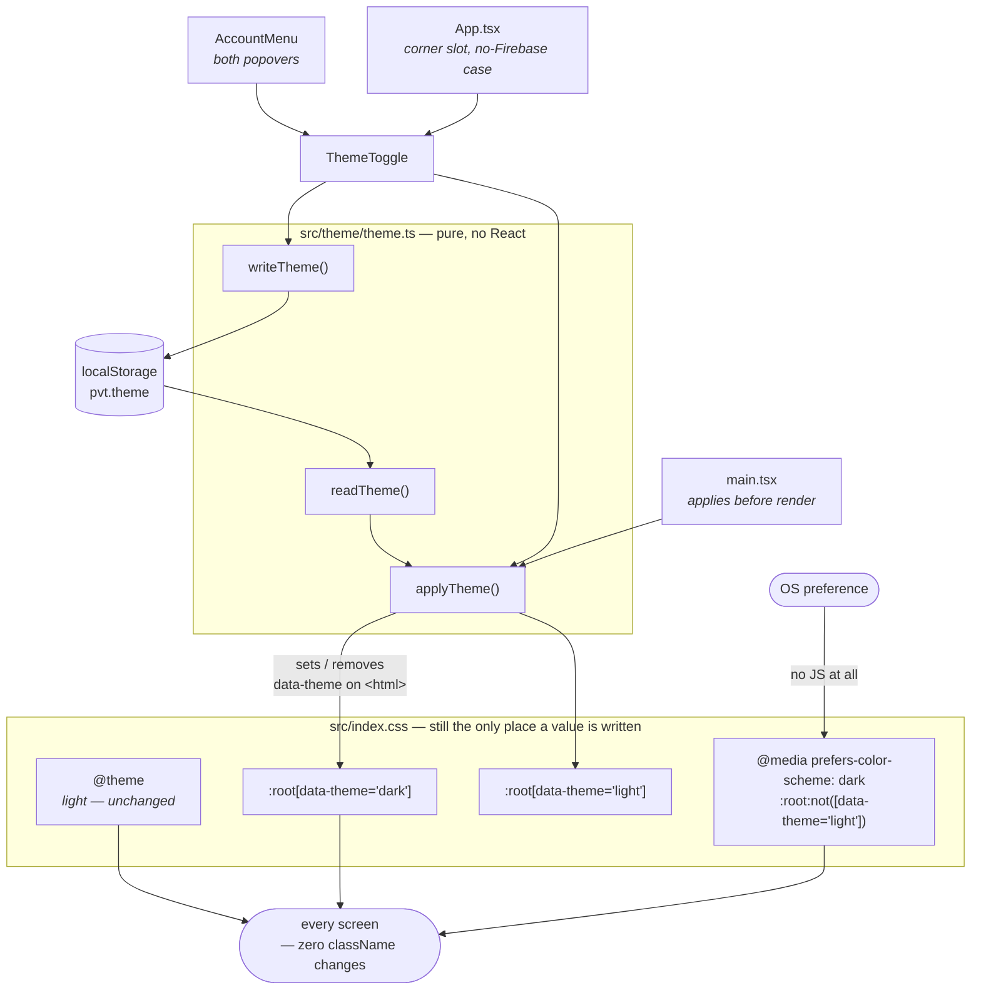

# Plan: Dark mode

**Feature ID:** 007-dark-mode
**Status:** DRAFT
**Baseline:** `main` @ `1848d6c` — 428 tests, 31 files
**Complexity:** Low-Medium. ~6 files. The design work is real; the code is not.

## Technical approach in one paragraph

Add a second block of the seventeen colour tokens to `src/index.css`, under two selectors:
`@media (prefers-color-scheme: dark) { :root:not([data-theme='light']) }` for the OS default,
and `:root[data-theme='dark']` for an explicit choice. Because every Tailwind colour utility in
this project compiles to `var(--color-*)`, that re-colours the whole app with **no component
touched**. Add `src/theme/theme.ts` — four pure functions over `localStorage` and one attribute
on `<html>`, modelled on `auth/guestChoice.ts` — and `src/components/ThemeToggle.tsx`, a
three-way radio group. Mount it inside `AccountMenu`'s two popovers, and standalone in the
corner slot when there is no account system. Three tokens are added (`--color-correct-ink`,
`--color-incorrect-ink`, and `color-scheme`'s return); two `className` strings in `PracticeCard`
and one hard-coded `#fff` in `.btn-danger` are fixed, because they are the one place the token
layer leaks.

## Architecture



## § A — Why this needs no component changes (verified, not assumed)

From the built stylesheet on `main` @ `1848d6c`:

```
:root,:host{--font-sans:…}          ← @theme emits here, unlayered, at byte 717
.card{background-color:var(--color-surface);…}          byte 6901
.bg-ground{background-color:var(--color-ground)}        byte 10541
```

Two consequences drive the whole design:

1. **Every utility and every primitive resolves through `var()`.** Nothing is inlined. So the
   override needs to win the cascade for seventeen custom properties on one element, and
   nothing else.
2. **Tailwind 4.3 flattens its layers** — the output has only a `properties` layer, and
   `:root,:host` is emitted *unlayered*. So do **not** reach for `@layer base` to win; it would
   not be the mechanism. What wins is **specificity plus source order**:

   | Selector | Specificity | |
   |---|---|---|
   | `:root,:host` (Tailwind's `@theme`) | (0,1,0) | |
   | `:root:not([data-theme='light'])` | (0,2,0) | wins, and comes later |
   | `:root[data-theme='dark']` | (0,2,0) | wins, and comes later |

   Write the override blocks at the **top level of `index.css`, immediately after `@theme`**.
   Not inside `@theme` (which has its own semantics and would not accept a media query).

## § B — The dark palette

Same seventeen names, plus two new on-colour tokens. Ratios computed against
`--color-ground: #0b1a1d`; every text value clears AA with room to spare.

| Token | Light (unchanged) | Dark | Dark contrast |
|---|---|---|---|
| `--color-ground` | `#f6fbfa` | `#0b1a1d` | — the page |
| `--color-surface` | `#ffffff` | `#12262a` | 1.13:1 vs ground |
| `--color-surface-sunken` | `#edf6f4` | `#0a1618` | recedes *below* the ground |
| `--color-ink` | `#14343a` | `#e6f2f1` | **15.5:1** |
| `--color-ink-muted` | `#557079` | `#a7c0c4` | **9.3:1** |
| `--color-ink-faint` | `#7c949b` | `#83a0a6` | **6.4:1** |
| `--color-primary` | `#0f766e` | `#2dd4bf` | 9.6:1 as text |
| `--color-primary-bright` | `#0d9488` | `#5eead4` | 12.0:1 — the focus ring |
| `--color-primary-soft` | `#ccfbf1` | `#134e4a` | ink on it **8.3:1** |
| `--color-primary-ink` | `#ffffff` | `#04211f` | on primary **9.1:1** |
| `--color-accent` | `#f97316` | `#fdba74` | 10.6:1 as text |
| `--color-accent-soft` | `#fff3e9` | `#3a2410` | ink on it **12.7:1** |
| `--color-correct` | `#15803d` | `#4ade80` | 10.2:1 as text |
| `--color-correct-ink` | `#ffffff` *(new)* | `#052e16` | on correct **8.6:1** |
| `--color-incorrect` | `#e11d48` | `#fda4af` | 9.4:1 as text |
| `--color-incorrect-ink` | `#ffffff` *(new)* | `#4c0519` | on incorrect **8.3:1** |
| `--color-incorrect-soft` | `#fff1f3` | `#3f1220` | ink on it **13.9:1** |
| `--color-line` | `#dceae8` | `#22403f` | 1.6:1 vs ground |
| `--color-line-strong` | `#bfd8d4` | `#33534f` | 2.1:1 vs ground |

**The inversion is not literal, and three of these are the reason.** `primary` goes *lighter*
in dark (teal-400, not teal-700), which flips `primary-ink` from white to near-black. Same for
`correct` and `incorrect`. That is E-1 from the spec, and it is why the two on-colour tokens
have to exist.

**Surfaces barely separate by lightness** (1.13:1) and that is intended: in dark mode
`--color-line` does the work that `--shadow-card` does in light. Hence the shadow change below.

### The block to add, verbatim

```css
/* ---------------------------------------------------------------------------
   Dark.

   The second block 005 promised (see the note above): the SAME seventeen names,
   redefined. Not one `dark:` class, and not one component touched — every colour
   utility in this project compiles to `var(--color-…)`, so re-pointing the
   variables re-colours every screen at once.

   Two selectors, in this order, and the order is the feature:

     the @media block   the OS preference, applied with NO JavaScript. This is
                        what makes the default path flash-free — a dark-OS user's
                        FIRST paint is already dark, before React exists. An
                        inline <head> script (the usual trick) is not available
                        to us anyway: script-src forbids 'unsafe-inline' and
                        csp.test.ts pins that.
     [data-theme='…']   an explicit choice, which must beat the media query. It
                        does so on specificity, (0,2,0) against Tailwind's
                        (0,1,0) `:root,:host` — NOT on layer order. Tailwind 4.3
                        flattens its layers, so `@layer base` would win nothing.

   The inversion is deliberately not literal. primary, correct and incorrect all
   get LIGHTER, because on a dark ground they have to be readable as text — which
   is why each fill now names its own foreground (`--color-*-ink`) instead of the
   call site typing `text-white`. White on #4ade80 is 1.6:1.
--------------------------------------------------------------------------- */
@media (prefers-color-scheme: dark) {
  :root:not([data-theme='light']) {
    color-scheme: dark;

    --color-ground: #0b1a1d;
    --color-surface: #12262a;
    --color-surface-sunken: #0a1618;
    --color-ink: #e6f2f1;
    --color-ink-muted: #a7c0c4;
    --color-ink-faint: #83a0a6;
    --color-primary: #2dd4bf;
    --color-primary-bright: #5eead4;
    --color-primary-soft: #134e4a;
    --color-primary-ink: #04211f;
    --color-accent: #fdba74;
    --color-accent-soft: #3a2410;
    --color-correct: #4ade80;
    --color-correct-ink: #052e16;
    --color-incorrect: #fda4af;
    --color-incorrect-ink: #4c0519;
    --color-incorrect-soft: #3f1220;
    --color-line: #22403f;
    --color-line-strong: #33534f;

    /* Ink-tinted shadows vanish on a dark ground, so depth is carried by the
       border instead and the shadow only deepens the well beneath it. */
    --shadow-card: 0 1px 2px rgb(0 0 0 / 0.3), 0 4px 12px rgb(0 0 0 / 0.36);
    --shadow-lift: 0 2px 4px rgb(0 0 0 / 0.36), 0 12px 28px rgb(0 0 0 / 0.5);
  }
}

:root[data-theme='dark'] {
  /* Identical to the block above. Duplicated rather than shared via a third
     selector because `@media` cannot be combined with a plain selector in one
     rule, and a CSS-only theme cannot use a preprocessor to DRY it. The guard in
     theme.test.ts asserts the two stay in step — that is the mechanism that
     makes the duplication safe. */
  color-scheme: dark;

  --color-ground: #0b1a1d;
  --color-surface: #12262a;
  --color-surface-sunken: #0a1618;
  --color-ink: #e6f2f1;
  --color-ink-muted: #a7c0c4;
  --color-ink-faint: #83a0a6;
  --color-primary: #2dd4bf;
  --color-primary-bright: #5eead4;
  --color-primary-soft: #134e4a;
  --color-primary-ink: #04211f;
  --color-accent: #fdba74;
  --color-accent-soft: #3a2410;
  --color-correct: #4ade80;
  --color-correct-ink: #052e16;
  --color-incorrect: #fda4af;
  --color-incorrect-ink: #4c0519;
  --color-incorrect-soft: #3f1220;
  --color-line: #22403f;
  --color-line-strong: #33534f;

  --shadow-card: 0 1px 2px rgb(0 0 0 / 0.3), 0 4px 12px rgb(0 0 0 / 0.36);
  --shadow-lift: 0 2px 4px rgb(0 0 0 / 0.36), 0 12px 28px rgb(0 0 0 / 0.5);
}
```

And in `@theme`, alongside the existing colours (light values for the two new names) —

```css
  --color-correct-ink: #ffffff;    /* on --color-correct. See § C */
  --color-incorrect-ink: #ffffff;  /* on --color-incorrect */
```

And `color-scheme` returns to `@layer base`, replacing the "no color-scheme, deliberately"
comment at `index.css:127-134`:

```css
  /*
   * `color-scheme` is back, and now per state.
   *
   * 005 removed it, correctly, BECAUSE the app was light-only: `light dark` on a
   * page with no dark theme invites the browser to paint form controls dark
   * against permanently light surfaces. With two real themes the reasoning
   * inverts — without this, scrollbars, date pickers and autofill stay light on
   * a near-black page.
   */
  :root { color-scheme: light; }
  /* `:root[data-theme='light']` needs no rule — it inherits the line above, and
     the two dark selectors each declare their own. */
```

## § C — The token-layer leaks, and their fix

Three call sites bypass the token layer today. All three are invisible in light mode and all
three break in dark. This is E-1/E-2.

| File | Now | Becomes |
|---|---|---|
| `PracticeCard.tsx:112` | `btn btn-lg flex-1 bg-correct text-white` | `… bg-correct text-correct-ink` |
| `PracticeCard.tsx:119` | `btn btn-lg flex-1 bg-incorrect text-white` | `… bg-incorrect text-incorrect-ink` |
| `index.css:206` (`.btn-danger`) | `color: #fff;` | `color: var(--color-incorrect-ink);` |

`theme.test.ts`'s `RAW_PALETTE` regex requires a numeric suffix (`-\d{2,3}`), so `text-white`
slipped through it. Task 9 closes that gap.

## § D — `src/theme/theme.ts`

Deliberately shaped like `auth/guestChoice.ts`: pure functions, a named key, every storage
access in a `try/catch`, no React. It is a view concern and lives nowhere near auth.

```ts
export type Theme = 'light' | 'dark'
/** What the control offers. `null` is "follow the system" — the default. */
export type ThemeChoice = Theme | null

export const THEME_KEY = 'pvt.theme'
```

- `readTheme(): ThemeChoice` — `'light'`/`'dark'` from `localStorage`, else `null`. Any other
  stored value reads as `null`, so a hand-edited key degrades to System rather than to a
  half-applied theme.
- `writeTheme(choice: ThemeChoice): void` — sets the key, or **removes** it for `null`. Storing
  `'system'` would be a third state that means the same as absence; the absence *is* the state.
- `applyTheme(choice: ThemeChoice): void` — sets `data-theme` on `document.documentElement`, or
  removes the attribute for `null`. Idempotent (E-7).
- `initTheme(): ThemeChoice` — `applyTheme(readTheme())`, returning what it read. Called once
  from `main.tsx` **before** `createRoot(...).render(...)`.

**`localStorage`, not `sessionStorage`** — and the contrast with its sibling is the point.
`guestChoice.ts` uses `sessionStorage` precisely so a fresh visit is a fresh decision. A theme
is the opposite: it is set once and expected to hold. Worth a comment, because the two modules
otherwise look identical and the difference is the whole behaviour.

## § E — `src/components/ThemeToggle.tsx`

A three-way choice, so a **radio group**, not a switch. `role="switch"` and a checkbox both
model two states, and this has three.

```tsx
<fieldset>
  <legend>Theme</legend>
  {/* three <label><input type="radio" name="theme" …/></label> */}
</fieldset>
```

- Local `useState<ThemeChoice>` seeded from `readTheme` **by reference** (`useState(readTheme)`,
  not `useState(readTheme())` — the latter re-reads storage on every render; App.tsx:45 makes
  the same point).
- On change: `writeTheme(next)` then `applyTheme(next)` then `setState(next)`.
- No store, no context, no `useSyncExternalStore`. **Exactly one instance is ever mounted** —
  either inside `AccountMenu`'s popover or standalone in the corner slot, never both — so
  there is no second copy to keep in sync. If that ever stops being true, this is the moment to
  reach for `authStore`'s `subscribe`/`getSnapshot` shape; not before.
- Native radios give keyboard support, grouping and screen-reader state for free (FR-9). Style
  them; do not rebuild them.

## § F — Mount points

**`AccountMenu.tsx`** — into *both* popovers, above the existing actions:

- the signed-in popover (`AccountMenu.tsx:199`), in a bordered section above "Sign out";
- the guest popover (`AccountMenu.tsx:125`), below the sign-in copy.

The `!available` early return at line 95 stays exactly as it is — the "renders nothing at all"
test and its comment are still right.

**`App.tsx:227`** — the corner bar currently renders only when `authAvailable`. It becomes
unconditional, holding whichever control applies:

```tsx
<div className="mx-auto flex max-w-xl justify-end px-4 pt-3">
  {authAvailable ? (
    <AccountMenu drillInProgress={state.screen === 'practising'} onSignedOut={handleSignedOut} />
  ) : (
    <ThemeToggle />
  )}
</div>
```

This is FR-8, and it is the one place the plan spends bytes a local-only build did not
previously pay. Worth it: without it, `npm run dev` with no `.env.local` — and every App test —
has no way to reach the feature at all.

**`WelcomeScreen`** is deliberately *not* given a toggle. It is a front door shown once per
session; the corner slot is one screen away.

## § G — `index.html`

Two media-scoped tags replace the single `theme-color` (E-6):

```html
<meta name="theme-color" content="#f6fbfa" media="(prefers-color-scheme: light)" />
<meta name="theme-color" content="#0b1a1d" media="(prefers-color-scheme: dark)" />
```

That is correct for System — the overwhelmingly common case — and needs no JavaScript. For an
*override*, `applyTheme` additionally maintains one media-less tag: the HTML spec has the
browser take the **first** `theme-color` whose media matches, so an override tag inserted as
the first child of `<head>` wins, and removing it restores the pair. This is cosmetic (the
Android address bar and the PWA status band), so it is its own task and is not a gate.

**No CSP change.** These are `<meta>` tags, not script.

## § H — What is never touched

`appMachine.ts`, `authStore.ts`, `useListStore.ts`, `storage/`, `parse/`, `speech/`, `lang/`,
`firestore.rules`. Theme is presentation; it reaches no state machine and no port. This is what
keeps 428 tests alive through the change (E-8).

## Testing strategy

| Test | File | What it pins |
|---|---|---|
| `readTheme`/`writeTheme` round-trip, absence = `null`, junk = `null`, throwing storage | `src/theme/theme.test.ts` *(new)* | § D, NFR-6 |
| `applyTheme` sets/removes the attribute; idempotent | same | E-7 |
| Both dark blocks define **all 19** colour tokens, and define the same set | `src/test/theme.test.ts` | § B, the duplication guard |
| `color-scheme` is declared, and per state | same — **inverts** the existing assertion at :44 | E-4 |
| No `dark:` variant in `src/` | same — **kept, unchanged** | NFR-5 |
| No `text-white`/`bg-white`/`text-black` in components | same *(new)* | § C |
| Toggle renders three options, marks the active one | `src/components/ThemeToggle.test.tsx` *(new)* | FR-2 |
| Choosing Dark writes the key and sets the attribute | same | FR-3, FR-5 |
| Choosing System removes both | same | FR-4 |
| Toggle appears in the signed-in and guest popovers | `AccountMenu.test.tsx` | FR-2 |
| Corner slot shows a toggle with Firebase unconfigured | `App.test.tsx` | FR-8 |

`jsdom` does not evaluate `prefers-color-scheme` against a real OS, so FR-1/FR-6/FR-7 are
verified **manually** in a browser (Chrome DevTools → Rendering → Emulate CSS media feature).
Asserting them in jsdom would assert the mock, not the app. Tasks 12–13 cover it.

## Risks

| Risk | Likelihood | Mitigation |
|---|---|---|
| The two dark blocks drift apart | Medium — they are duplicated by necessity | The set-equality test in Task 9 is the whole answer |
| A dark value fails contrast in a pairing not in § B's table | Low | Ratios are computed, not judged; Task 12 is a real-browser sweep |
| A future component types `text-white` again | Medium | Task 9's new guard |
| Flash of light theme for override users | Low — override is the minority path | `initTheme()` runs before `render()`; accepted and documented in the spec (NFR-1 covers the default path only) |

## Rollback

Delete the two override blocks from `index.css` and the app is light again, because nothing
else knows the theme exists. `theme.ts` and `ThemeToggle.tsx` are additive files.
