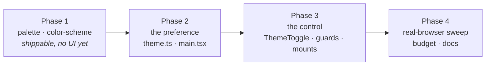

# Quickstart: Dark mode

**Feature ID:** 007-dark-mode
**Status:** DRAFT — not yet executed
**Baseline:** `main` @ `1848d6c` — 428 tests, 31 files, all green

## What this does

Brings back dark mode — the way 005 said it should come back — and puts a **System / Light /
Dark** control in the avatar menu.

## The one-sentence version

Every colour utility in this app already compiles to `var(--color-…)`, so dark mode is
**a second block of the same seventeen token names** in `src/index.css`, and **not one
component's `className` changes**.

## Why it is this small

005's commit message dropped dark mode and left the instructions for its return in the code
(`src/index.css:81-85`):

> …because every value lives here, a dark set would return as **a second block of these same
> names** rather than as 83 hand-picked `dark:` class pairs.

Verified on the current build before planning, not assumed:

```
.bg-ground{background-color:var(--color-ground)}
.card{background-color:var(--color-surface);border:1px solid var(--color-line);…}
```

## Decisions

| | |
|---|---|
| States | **System / Light / Dark**, defaulting to System |
| Default path | **Pure CSS.** A System user runs no JavaScript and sees no flash |
| Persistence | `localStorage` `pvt.theme` — absent *is* "System" |
| Synced to the account? | **No.** A theme belongs to the device you are holding |
| Where | The avatar menu — both the signed-in and the guest popover |
| Where, with no Firebase | The same corner slot, standalone. Otherwise local-only builds — and every App test — could never reach it |
| Component changes | **Two `className` strings**, both pre-existing leaks |

## The one real design problem

`--color-correct` and `--color-incorrect` do **two jobs**: a fill under white text
(`bg-correct text-white`, the drill's answer buttons) *and* text on the ground (`text-correct`,
the revealed answer). In light, one mid-dark value does both. In dark, **no single value can**:
text on a near-black ground needs a light green, and white on light green is 1.6:1.

Fixed by naming the foreground — `--color-correct-ink` / `--color-incorrect-ink` — which also
removes the literal `text-white` that `theme.test.ts`'s guard regex never caught, and the
hard-coded `#fff` in `.btn-danger`.

## What could go wrong, in one place

| | |
|---|---|
| **Bare `:root` in the media query** | Choosing Light on a dark-OS device would not work. Must be `:root:not([data-theme='light'])` |
| **Reaching for `@layer base`** | Tailwind 4.3 flattens layers. **Specificity** wins this, not layer order |
| **An inline anti-flash `<script>`** | CSP forbids `'unsafe-inline'` and `csp.test.ts` pins it. Not available — and not needed, because CSS handles the default |
| **`sessionStorage`** | That is `guestChoice.ts`, deliberately per-session. A theme must outlive the tab |
| **Editing tests to go green** | Exactly **two** assertions may change, both in Task 9. The "no `dark:` variant" guard **stays** — it is the point |

## Order



14 tasks. Task 2 (fix the leaks) comes **before** Task 3 (the dark block) — merged the other
way round, the drill's answer buttons are unreadable for exactly one commit.

## Files

**Created:** `src/theme/theme.ts` · `src/theme/theme.test.ts` ·
`src/components/ThemeToggle.tsx` · `src/components/ThemeToggle.test.tsx`

**Updated:** `src/index.css` (the dark blocks, `color-scheme`, two new tokens, and the now-wrong
"Light only" comment) · `src/main.tsx` (one call) · `src/App.tsx` (the corner slot) ·
`src/components/AccountMenu.tsx` (two mount points) · `src/components/PracticeCard.tsx`
(**two `className` strings**) · `src/test/theme.test.ts` · `src/components/AccountMenu.test.tsx`
· `src/App.test.tsx` · `index.html` (two `<meta>` tags) · `README.md`

**Never touched:** `appMachine.ts` · `authStore.ts` · `useListStore.ts` · `storage/` · `parse/`
· `speech/` · `lang/` · `firestore.rules`

## Verify

```bash
npm test                      # ≥ 428 green
npm run lint && npm run typecheck && npm run check:bundle
git grep -c "dark:" -- src    # index.css + theme.test.ts only — no component
```

Then in a browser, because jsdom cannot answer this honestly: DevTools → Rendering → *Emulate
prefers-color-scheme: dark*, and walk every screen (Task 12).

## Rollback

Delete the two override blocks from `index.css`. The app is light again — nothing else knows
the theme exists.
