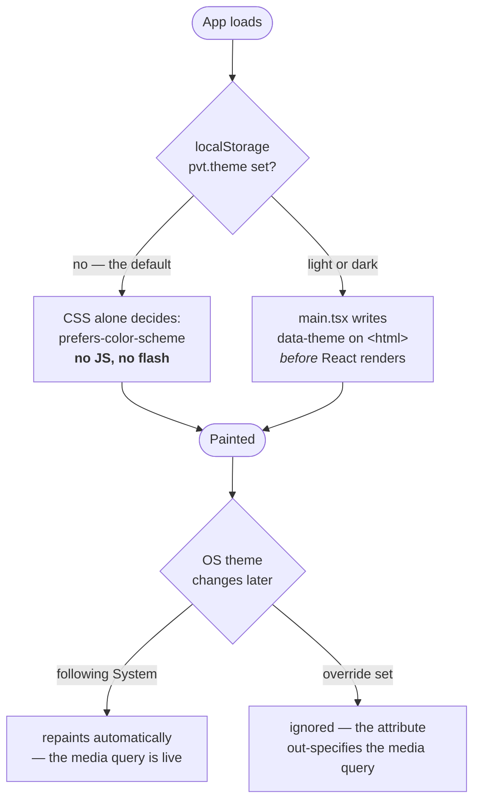
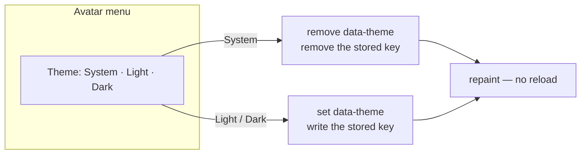

# Spec: Dark mode, chosen from the avatar menu

**ID:** 007-dark-mode
**Status:** DRAFT
**Created:** 2026-09-05
**Baseline:** `main` @ `1848d6c` (PR #5, "Feature/look and feel") — **428 tests across 31 files, all green**
**Feature Type:** Enhancement — design layer + one new control
**Complexity:** Low-Medium. Narrow and deep: ~6 files, almost all of the change is in `src/index.css`.

## Why this is a small feature

005 dropped dark mode on purpose, and said in the code how it should come back
(`src/index.css:81-85`):

> Light only. Dark mode was deliberately dropped rather than lost: one palette gets designed
> well where two get designed adequately, and because **every value lives here, a dark set
> would return as a second block of these same names** rather than as 83 hand-picked `dark:`
> class pairs.

That promise has been verified against the compiled stylesheet, not taken on trust. Every
colour utility in `dist/` resolves through a variable:

```css
.bg-ground{background-color:var(--color-ground)}
.text-ink{color:var(--color-ink)}
.card{background-color:var(--color-surface);border:1px solid var(--color-line);…}
```

So redefining seventeen custom properties under a second selector re-colours **every screen,
every component and every primitive** with no `className` touched anywhere. The 005 sweep is
what turns this from a fortnight into an afternoon.

## The ask

> "add dark mode, and an option to change to dark mode in the avatar's menu"

## User stories

**US-1 — the OS preference is honoured without being asked**
As someone whose phone switches to dark at sunset,
I want the app to already be dark when I open it,
So that I am not the one who has to keep telling it.

**US-2 — the preference can be overridden**
As someone who reads in dark everywhere but wants this app light (or the reverse),
I want to pick a theme myself from the avatar menu,
So that the app follows me rather than my operating system.

**US-3 — the override is not a trap**
As someone who has picked a theme and later regrets it,
I want a way back to "follow my system",
So that one tap does not permanently opt me out of the automatic switch.

**US-4 — the choice survives**
As a returning user,
I want the theme I picked to still be there tomorrow,
So that I set it once rather than every visit.

## Decisions

| | |
|---|---|
| States | **System / Light / Dark**, defaulting to System |
| Where | Inside the avatar menu (both the signed-in popover and the guest "Sign in" popover) |
| Where, with no Firebase | The **same corner slot**, standalone — see FR-8 |
| Persistence | `localStorage`, key `pvt.theme`. Absent = System |
| Scope | **Per device.** Not synced to Firestore — see § Non-goals |
| Mechanism | A second block of the same token names. **Zero component `className` changes** |
| Default path | Pure CSS `prefers-color-scheme`. **No JavaScript runs for a System user** |

### FR — Functional requirements

- **FR-1** The app renders in a dark palette when the OS reports `prefers-color-scheme: dark`
  and the user has set no override.
- **FR-2** The avatar menu contains a Theme control offering System, Light and Dark, showing
  which is active.
- **FR-3** Choosing Light or Dark applies immediately, with no reload, on every screen
  including a drill in progress.
- **FR-4** Choosing System removes the override and returns to following the OS, live.
- **FR-5** An override persists across reloads and across browser sessions.
- **FR-6** With an override set, changing the OS theme does **not** change the app.
- **FR-7** With System set, changing the OS theme **does** change the app, without a reload.
- **FR-8** Where Firebase is not configured — so there is no avatar and `AccountMenu` renders
  nothing — the theme control appears standalone in the same corner slot.
- **FR-9** The control is keyboard reachable and announces its state to a screen reader.

### NFR — Non-functional requirements

- **NFR-1** **No flash of the wrong theme.** A System user's first paint is already correct,
  because the OS default is served by CSS with no JavaScript involved.
- **NFR-2** **No CSP change.** `index.html` forbids `'unsafe-inline'` in `script-src` and
  `csp.test.ts` pins that. The usual anti-flash trick — a blocking inline `<script>` in
  `<head>` — is therefore **unavailable**, and the design must not need it.
- **NFR-3** Every dark foreground/background pair used for text meets **WCAG AA** (≥ 4.5:1
  body, ≥ 3:1 large/UI). Ratios are computed in `plan.md` § B, not eyeballed.
- **NFR-4** No measurable bundle growth. The budget guard (`npm run check:bundle`,
  150 KB JS / 220 KB assets) must still pass; the CSS grows by one token block.
- **NFR-5** Dark mode must not reintroduce a `dark:` variant anywhere in `src/`. The existing
  guard in `theme.test.ts` stays, and is now the mechanism that keeps this honest.
- **NFR-6** Storage that throws (Safari private browsing) degrades to System, never to a crash
  — the rule `guestChoice.ts` already follows.

## Workflows





## Acceptance criteria

- **AC-1** With `prefers-color-scheme: dark` emulated and nothing stored, the page paints dark.
- **AC-2** Choosing Dark while the OS is light paints dark, and survives a reload.
- **AC-3** Choosing System after Dark clears the stored key and returns to the OS preference.
- **AC-4** With an override stored, flipping the emulated OS preference changes nothing.
- **AC-5** The two drill answer buttons ("Right" / "Wrong") remain legible in dark — this is
  the pair that a naive inversion breaks. See § Edge cases E-1.
- **AC-6** With Firebase unconfigured, a theme control is still reachable (FR-8).
- **AC-7** `npm test` is green with **no existing assertion weakened** except the two in
  `theme.test.ts` that assert dark mode is absent — those invert, deliberately and visibly.
- **AC-8** `git grep -c "dark:" -- src` finds the variant in no component.

## Edge cases

- **E-1 — the two-jobs colours.** `--color-correct` and `--color-incorrect` are used *both* as
  a fill under white text (`bg-correct text-white`, `PracticeCard.tsx:112,119`) *and* as text
  on the ground (`text-correct`, `text-incorrect`). In light both work because the value is
  mid-dark. **In dark, no single value can do both**: text on a dark ground needs a light
  green, and white on a light green is ~1.6:1. Resolved in `plan.md` § C by tokenising the
  on-colour foreground — which also removes the literal `text-white` that the current guard
  regex does not catch.
- **E-2 — `.btn-danger` hard-codes `color: #fff`** (`index.css:206`). It is the same defect as
  E-1 and is fixed the same way.
- **E-3 — shadows.** `--shadow-card` is tinted with the *ink* hue at 4–6% alpha. On a dark
  ground that is invisible, so cards would lose their edge. In dark, borders take over the
  separation that shadows do in light.
- **E-4 — `color-scheme` must come back.** 005 removed it *because* the app was light-only
  (`index.css:127-134`), and `theme.test.ts:44` pins its absence. With two themes it must
  return, per state, or form controls and scrollbars stay light on a dark page.
- **E-5 — opacity modifiers bake a literal.** `bg-ink/50` (the delete-dialog scrim) compiles to
  a hard `#14343a80` *plus* a `@supports`-guarded `color-mix(… var(--color-ink) …)`. Modern
  browsers take the variable version and follow the theme; the literal is only an old-browser
  fallback. Correct as-is — but it means "no hex in the compiled CSS" is not a valid guard.
- **E-6 — `theme-color`.** `index.html` pins one value (`#f6fbfa`) for the Android address bar
  and the installed PWA status band. Left alone, a dark-themed PWA opens with a mint band
  above a near-black page — the exact defect 005's commit message called out, mirrored.
- **E-7 — StrictMode double-invocation.** `main.tsx` renders under `StrictMode`; applying the
  attribute must be idempotent.
- **E-8 — the drill must not restart.** Switching theme repaints via CSS only. Nothing may
  remount `PracticeCard` or touch `appMachine` state.

## Non-goals

- **Syncing the theme to Firestore.** A theme is a property of *the device you are looking at*
  — dark on the phone at night, light on the desktop at noon. Syncing it would be a
  regression disguised as a feature, and it would put a write on the critical path of a
  preference that must apply instantly.
- **Any layout, copy or component-structure change.** This is a palette and one control.
- **A dark-specific logo or favicon.** `public/favicon.svg` is a fixed-palette brand mark.
- **Theming the drill differently from the rest of the app.**

## Out of scope, noted for later

- `public/icons.svg` and `favicon.svg` are not theme-aware. Acceptable: both read fine on
  either ground.
- A transition animation on theme change. Deliberately omitted — a 200 ms cross-fade of every
  surface is the kind of thing that looks good in a demo and is tiring on the fifth toggle.
