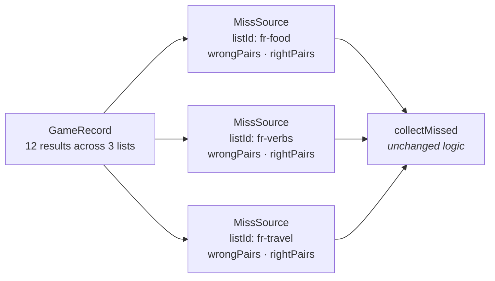
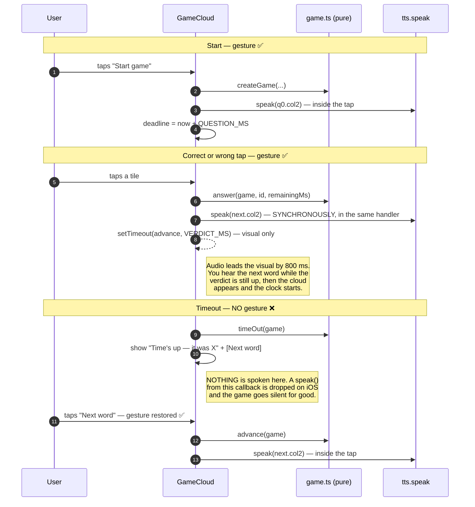
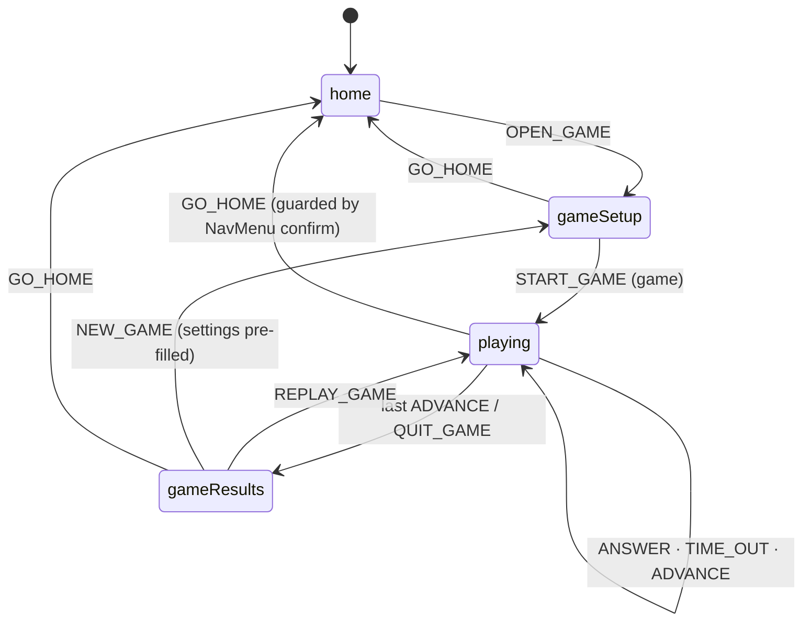
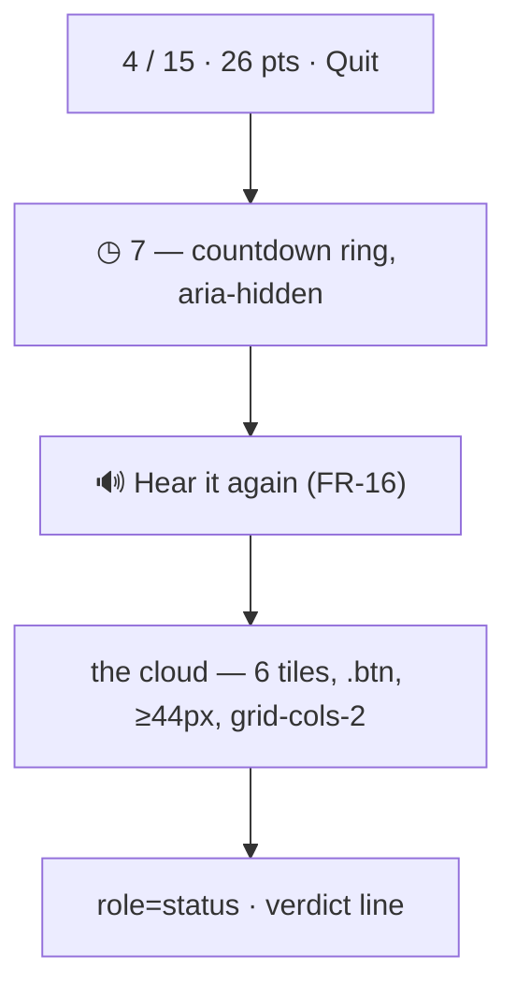

# Plan: 008-word-game

**Spec:** [spec.md](spec.md) · **Tasks:** [tasks.md](tasks.md) · **TL;DR:** [quickstart.md](quickstart.md)

---

## Approach in one paragraph

The game is a **second engine beside the drill, not a mode of it**. It gets its own pure module
directory (`src/game/`), its own record type and repository, and three new screens.

One piece deliberately does **not** live in `src/game/`. *"Which words does this setting select?"*
is a question the game asks first but will not ask last, so it becomes a shared module —
`src/state/wordPool.ts`, taking a declarative `PoolSpec` and returning `PooledWord[]` (spec D-13).
The game is its first caller, not its owner.

Beyond that, the game borrows five things and owns everything else: the new `wordPool` for
selection, 006's `wordKey` for identity, `session.ts`'s `seededRng`/`Rng` for injectable
randomness, `tts.speak` for audio, and the design tokens. Nothing in `session.ts`, `sessionRecord.ts`, `drillRepo`,
`sessionRepo`, `TestCard` or `StudyCard` changes at all. The edits to existing files are additive
and small: three members in the `AppState` union, six actions in `reduce`, two methods on
`ListStore` (and its three implementations), one `games` block in `firestore.rules`, one widened
parameter type in `missedWords.ts`, and two new entry points.

---

## Why not reuse `Session`

`Session` is `{ mode, listId, pairs, order, index, revealed, marks }` — one list, one mark per
card, no clock. A game needs options per question, a deadline and points per answer, and has no
single `listId`. Bending `Session` to fit means either a union that every existing consumer must
narrow, or optional fields that are meaningless most of the time — and `drillRepo`'s validator
([drillRepo.ts:44](src/storage/drillRepo.ts#L44)), `score()`, `buildSessionRecord`, `TestCard`,
`StudyCard` and `ResultsScreen` all read that shape today. A parallel type costs one more file and
leaves 002's resilience work untouched.

Same argument, one level up, for `SessionRecord` → `GameRecord` (spec D-7).

---

## Module map

```mermaid
flowchart TD
    subgraph existing ["Existing — additive edits only"]
        TTS["speech/tts.ts<br/><i>unchanged</i>"]
        SESS["state/session.ts<br/>+ shuffle exported"]
        MISSED["state/missedWords.ts<br/>+ MissSource, param widened"]
        STYPES["storage/types.ts<br/>+ subscribeGames · recordGame"]
        LOCAL["storage/localListStore.ts"]
        FIRE["storage/firestoreListStore.ts"]
        MEM["storage/memoryStore.ts"]
        MACHINE["state/appMachine.ts<br/>+ 3 screens · 8 actions"]
        APP["App.tsx<br/>+ wiring · the gesture chain"]
        HOME["components/Home.tsx<br/>+ Play a game"]
        NAV["components/NavMenu.tsx<br/>+ Game item"]
        RULES["firestore.rules<br/>+ games collection"]
    end

    subgraph shared ["state/wordPool.ts — SHARED, feature-agnostic (D-13)"]
        WP["PoolSpec · PooledWord<br/>buildWordPool · poolSize<br/>listOptions · poolLanguages · toPairs"]
    end

    subgraph pure ["src/game/ — pure. No React, no clock, no Math.random"]
        GTYPES["types.ts<br/>GameSettings · Question<br/>Answer · Verdict · Game · GameRecord"]
        QS["questions.ts<br/>buildQuestions · pickDistractors"]
        GAME["game.ts<br/>createGame · answer · timeOut<br/>advance · isFinished · replay"]
        SCORE["scoring.ts<br/>pointsFor · displayedSeconds · scoreGame"]
        GREC["gameRecord.ts<br/>buildGameRecord · gameMissSources"]
    end

    subgraph ui ["src/components/ — three new screens"]
        SETUP["GameSetup.tsx"]
        CLOUD["GameCloud.tsx"]
        GRES["GameResults.tsx"]
    end

    subgraph store ["src/storage/"]
        GREPO["gameRepo.ts<br/>pvt.games.v1"]
    end

    subgraph future ["Later callers — the reason this is shared"]
        F1["scheduled review"]
        F2["flashcards"]
        F3["export / print"]
    end

    MISSED -->|collectMissed| WP
    WP --> GTYPES
    WP -.-> F1 & F2 & F3
    SESS -.->|Rng · shuffle| QS
    GTYPES --> QS & GAME & SCORE & GREC
    QS --> GAME --> SCORE
    GAME --> GREC
    GREC -->|MissSource[]| MISSED
    GREPO --> LOCAL
    STYPES --> LOCAL & FIRE & MEM
    APP --> SETUP & CLOUD & GRES
    APP --> MACHINE
    APP --> WP
    SETUP -->|listOptions · poolSize| WP
    CLOUD --> TTS
    GREC --> GREPO
```

> **The dotted arrows to `future` are not a promise to build those.** They are why `wordPool` sits
> in `state/` rather than in `game/`: each of them asks the same question with a different verb.
> Nothing in this plan builds them, and nothing in `wordPool` anticipates them beyond taking a
> `PoolSpec` instead of a `GameSettings`.

---

## Data model

All of it in `src/game/types.ts`. Every field below earns its place; nothing is speculative.

```ts
/**
 * What the user chose at setup. Carried by the Game so a replay can repeat it (D-9).
 *
 * WHICH words is delegated to a `PoolSpec` rather than spelled out here (D-13): the
 * game owns "how many, and in what language", never "which words does this select".
 * Adding a misses window later (spec D-12) is then a change to `PoolSpec` alone, and
 * every other caller of the shared module gets it at the same time.
 */
export interface GameSettings {
  spec: PoolSpec
  /** How many questions to ask. Already clamped to the pool at build time. */
  count: number
  /** Fixed by the first list selected (D-6). Both are needed: one to speak, one to label. */
  col1Lang: LangCode
  col2Lang: LangCode
}

/** One question. `kind` is here so a second round type is additive, not a refactor. */
export interface Question {
  kind: 'hear-pick-meaning'
  word: PooledWord
  /** The tiles, already shuffled. Contains `word`. Length min(CLOUD_SIZE, pool). */
  options: readonly PooledWord[]
}

export interface Answer {
  /** The tile tapped, or null on a timeout. */
  choiceId: string | null
  correct: boolean
  /** 0 … MAX_POINTS. Always 0 unless `correct`. */
  points: number
  /** What was left on the clock. Kept for an honest average-speed stat later. */
  remainingMs: number
}

/**
 * A game in flight.
 *
 * `pool` is a SNAPSHOT and is carried for exactly one reason: replay re-samples from it
 * (D-9). Dropping it would make "play again" need the live lists back, and the pool the
 * user was shown a count for would silently change under them.
 */
export interface Game {
  settings: GameSettings
  pool: readonly PooledWord[]
  questions: readonly Question[]
  index: number
  /** Parallel to `questions`, filled left to right. Length === how many were answered. */
  answers: readonly Answer[]
  /** Set when the current question has been answered but not yet advanced past. */
  verdict: Verdict | null
}

/** What the screen is showing between an answer and the next question. */
export type Verdict =
  | { kind: 'right'; points: number }
  | { kind: 'wrong'; chose: PooledWord; answer: PooledWord }
  | { kind: 'timeout'; answer: PooledWord }
```

### Constants (`src/game/types.ts`)

| Name | Value | Why this value |
|------|-------|----------------|
| `QUESTION_MS` | `10_000` | The ask. |
| `MAX_POINTS` | `10` | The ask, and it must equal `QUESTION_MS / 1000` — asserted in a test so the two cannot drift. |
| `CLOUD_SIZE` | `6` | D-1. Five distractors is enough that guessing is 17%, few enough to scan in ten seconds on a phone. |
| `MIN_POOL` | `4` | Below this a cloud is a coin toss. |
| `MAX_GAME_WORDS` | `50` | 50 × 10 s ≈ 8 minutes, and it bounds what a `GameRecord` can weigh. |
| `COUNT_CHIPS` | `[10, 15, 20]` | D-2. |
| `VERDICT_MS` | `800` | Long enough to read "Wrong — it was *X*", short enough not to break the rhythm. |

---

## The shared word selector — `src/state/wordPool.ts`

**The generic piece (spec D-13).** It answers one question, for anybody who asks it:
*given these settings, which words?* It has no idea a game exists.

Placed in `state/` because that is where this project keeps pure domain logic — `session.ts`,
`missedWords.ts`, `scoreBand.ts`, `sessionRecord.ts` are all there — and because it sits directly
on top of `missedWords`, whose `collectMissed` it calls.

### The API

```ts
export type PoolSource = 'all' | 'missed'

/**
 * WHICH words a feature wants, said declaratively.
 *
 * A VALUE, not a function call, and that is the whole design. A spec can be stored in a
 * record, compared for equality, replayed, round-tripped through JSON and shown back to
 * the user as the settings they chose. 008 carries one inside every Game so "play again"
 * rebuilds the same pool (D-9); anything later that needs "the same words again" gets
 * that for free rather than inventing its own settings bag.
 */
export interface PoolSpec {
  /** Source lists, in the order the user picked them. Order decides dedupe precedence. */
  readonly listIds: readonly string[]
  readonly source: PoolSource
  /** Consulted only when `source` is 'missed'. Defaults to 'all' (008 D-12). */
  readonly window?: ReviewWindow
}

/**
 * One selected word, plus where it came from.
 *
 * NOT a WordPair, and the difference is `listId`. A pool spans lists, so a word that has
 * lost its origin cannot have a later verdict filed back against the right list — which is
 * how a game's misses reach the drill's missed chips (008 FR-29) and how anything else
 * will do the same. `listName` is denormalised for the reason SessionRecord.listName is
 * (sessionRecord.ts:39): a screen must still read sensibly after the list is deleted.
 *
 * `id` is RE-MINTED (`w0`, `w1`, …) exactly as toDrillPairs does (missedWords.ts:218).
 * Ids from different lists carry no guarantee of being distinct, and a duplicate id is a
 * silent bug wherever a caller looks a word up by it.
 */
export interface PooledWord {
  readonly id: string
  readonly col1: string
  readonly col2: string
  readonly listId: string
  readonly listName: string
}

export interface PoolContext {
  /** Every record the store holds — drills and games alike. Only read for 'missed'. */
  readonly records: readonly MissSource[]
  /** Injected, never read (NFR-1). */
  readonly now: number
  /** Prefix for the re-minted ids. Defaults to 'w'. */
  readonly idPrefix?: string
}

export function buildWordPool(
  lists: readonly WordList[],
  spec: PoolSpec,
  context: PoolContext,
): PooledWord[]

/** What `buildWordPool` would return, counted. FR-6's live number. */
export function poolSize(lists: readonly WordList[], spec: PoolSpec, context: PoolContext): number

/** The language pair a selection has fixed, or null when nothing is selected yet. */
export function poolLanguages(
  lists: readonly WordList[],
  listIds: readonly string[],
): { col1Lang: LangCode; col2Lang: LangCode } | null

/** Every list, with whether it can join the current selection and why not. */
export function listOptions(
  lists: readonly WordList[],
  listIds: readonly string[],
): PoolListOption[]

export interface PoolListOption {
  list: WordList
  selected: boolean
  selectable: boolean
  /** Null when selectable. 'language' means it would break the one-pair rule. */
  blocked: 'language' | null
}

/** Project down to plain pairs, for a caller that does not need the origin. */
export function toPairs(words: readonly PooledWord[]): WordPair[]
```

### `buildWordPool`, in order

1. Resolve `listIds` against `lists`, **preserving selection order**. A missing id is skipped —
   a list deleted between choosing and building must not throw.
2. `source: 'all'` → every pair of every resolved list.
   `source: 'missed'` → `collectMissed(records, { listId, window: spec.window ?? 'all', now, list })`
   **once per resolved list**, taking `set.words.map(w => w.pair)`.
   Per-list because `collectMissed` filters on a single `listId`
   ([missedWords.ts:122](src/state/missedWords.ts#L122)) — and calling it per list is what keeps
   006's still-missed rule *intact* rather than reimplemented over several lists. There is exactly
   one implementation of "still missed" in this codebase and this must not become the second.
3. De-duplicate by `wordKey`. **First contributing list wins** the `listId` — which is why step 1
   preserves order rather than sorting.
4. Re-mint ids from `idPrefix`.
5. Drop any word blank on either side after trimming.

`poolSize` is `buildWordPool(...).length`, deliberately rather than a cheaper count: the number
the user is shown and the pool they get must come from one computation, for the same reason 006
threads one `now` through four chips ([App.tsx:189](src/App.tsx#L189)) — a count of 12 beside a
game of 11 is the failure this avoids by construction.

### What is NOT in here (NFR-11)

No `count`, no sampling, no `Question`, no points, no clock, no `Math.random`, and no import from
`src/game/`. Sampling *n* of them is the caller's business — a game takes 15 at random, an export
would take all of them in list order, a flashcard mode would take the 20 least recently seen.
Push sampling in here and the next caller has to fight it back out.

### Relationship to 006's `toDrillPairs`

`toDrillPairs` ([missedWords.ts:218](src/state/missedWords.ts#L218)) is a strict special case:
one list, `source: 'missed'`, projected to `WordPair[]`. It is **left exactly as it is** in this
change, and `toPairs` above is the generalisation it should eventually collapse into.

Not converged now, on purpose: 006's untouched suite is the regression net for the `MissSource`
widening in T1.1, and rewriting its call sites in the same change would remove the very net that
proves the change was safe. Recorded in spec § Out of scope as the first follow-up.

---

## The pure engine (`src/game/`)

### `questions.ts`

```ts
export function buildQuestions(pool: readonly PooledWord[], count: number, rng: Rng): Question[]
```

- Shuffle the pool, take `min(count, pool.length)` — sampling **without replacement** (FR-11).
- For each, `pickDistractors(pool, word, rng)`:
  - candidates = pool minus the answer, minus anything whose **normalised `col1`** equals the
    answer's or an already-chosen distractor's (FR-13 — `wordKey`'s `fold` is the right normaliser
    and is worth exporting for it);
  - shuffle, take `CLOUD_SIZE - 1`;
  - if fewer are available (a tiny pool, or many words sharing a `col1`), the cloud is simply
    smaller. Never pad with a duplicate.
- Shuffle answer + distractors together (FR-14).

`shuffle` is Fisher-Yates over an injected `Rng`. **It is currently private to
[session.ts:24](src/state/session.ts#L24)** — export it from there and import it here rather than
writing a second one. One shuffle in the codebase, not two.

### `game.ts` — the transitions

All pure, all total, all returning a new `Game`:

| Function | Behaviour |
|---|---|
| `createGame(settings, pool, rng)` | Builds questions, `index: 0`, `answers: []`, `verdict: null`. |
| `currentQuestion(game)` | `questions[index] ?? null`. |
| `answer(game, choiceId, remainingMs)` | Appends an `Answer`, sets `verdict`. Does **not** advance — the screen has 800 ms to show the verdict. A no-op when a verdict is already set, so a double-tap cannot score twice. |
| `timeOut(game)` | Appends `{ choiceId: null, correct: false, points: 0, remainingMs: 0 }`, sets a `timeout` verdict. |
| `advance(game)` | `index + 1`, `verdict: null`. |
| `isFinished(game)` | `index >= questions.length`. Mirrors `session.isFinished`. |
| `replay(game, rng)` | `createGame(game.settings, game.pool, rng)` — same settings, same pool, new draw (D-9, FR-26). |

The double-tap guard is not hypothetical: two tiles can be hit in the same frame on a touchscreen,
and without it the second tap scores against an already-consumed question.

### `scoring.ts` — and the one identity that matters

```ts
/** Whole seconds left, clamped. THE definition — nothing else computes points. */
export function pointsFor(remainingMs: number): number {
  return Math.max(0, Math.min(MAX_POINTS, Math.ceil(remainingMs / 1000)))
}

/** What the countdown shows. Deliberately the same function (NFR-4). */
export const displayedSeconds = pointsFor

export function remainingMs(deadline: number, now: number): number {
  return Math.max(0, deadline - now)
}

export function scoreGame(game: Game): GameScore  // { correct, asked, points, available }
```

Why `ceil`, checked against the ask's own example:

| Elapsed | Remaining | `ceil(rem/1000)` | On screen |
|---|---|---|---|
| 0.0 s | 10 000 ms | **10** | 10 |
| 3.0 s | 7 000 ms | **7** ✓ *("pick after 3 seconds → 7 points")* | 7 |
| 9.5 s | 500 ms | **1** | 1 |
| 10.0 s | 0 ms | 0 → timeout | 0 |

Each digit is displayed for exactly one second, and the number the user tapped under is the number
they score. `available = asked * MAX_POINTS`.

### `gameRecord.ts`

```ts
export function buildGameRecord(
  game: Game,
  options: { partial: boolean; now?: number; id?: string },
): GameRecord | null            // null when nothing was answered

export function gameMissSources(record: GameRecord): MissSource[]
```

`GameRecord` mirrors `SessionRecord`'s discipline — a log entry, never rewritten:

```ts
export interface GameRecord {
  id: string
  finishedAt: number
  /** Denormalised, for the same reason SessionRecord.listName is. */
  listIds: readonly string[]
  listNames: readonly string[]
  source: GameSource
  correct: number
  asked: number
  points: number
  available: number
  /** Every answered word with its verdict and origin list. The raw material for FR-29. */
  results: readonly { word: PooledWord; correct: boolean }[]
  partial: boolean
}
```

`gameMissSources` groups `results` by `listId` and emits one `MissSource` per list:



Every emitted source carries `rightPairs` (never omitted), so a game can never set 006's
`degraded` flag — which is correct, since `degraded` means "recorded before right answers were
saved" and no game ever was.

---

## The 006 widening — a type-only change to landed logic

`collectMissed` and `missedCounts` currently take `readonly SessionRecord[]`. They read exactly
four fields. Introduce the structural minimum in `missedWords.ts` and widen both signatures:

```ts
/**
 * The shape collectMissed actually needs.
 *
 * `SessionRecord` satisfies this structurally, so this is a TYPE-ONLY change with no
 * call-site churn — and it is what lets a game's results be read by the same engine as
 * a drill's, without a second still-missed implementation to keep correct (008 D-3).
 */
export interface MissSource {
  listId: string
  finishedAt: number
  wrongPairs: WordPair[]
  rightPairs?: WordPair[]
}
```

Nothing else in 006 moves. `App` then passes `[...visibleRecords, ...games.flatMap(gameMissSources)]`
wherever it passes `visibleRecords` today — four call sites: `missedForReady`, its `degraded`
sibling, `pickWindow`, and `ReviewDetail`'s `onPractiseMisses`.

> **`ReviewDetail`'s call site is the exception and must stay `[record]`.** It deliberately runs
> one single record through `collectMissed` ([App.tsx:578](src/App.tsx#L578)) to get live-list
> resolution for that drill's own misses. Adding games there would answer a different question
> than the button asks.

---

## The audio gesture chain — the highest-risk part of this feature

iOS Safari drops any `speak()` that does not descend from a user gesture, **silently**
([tts.ts:13](src/speech/tts.ts#L13)). A game that speaks from a timer callback is not "slightly
degraded" — it is unplayable, because the prompt is the entire question, and it fails on exactly
one platform in a way desktop testing never shows.

Three of the four transitions have a gesture in scope. One does not, and that is what shapes FR-20.



Two rules fall out, and both belong in a comment at the call site:

1. **`speak` for question N+1 is called inside the handler that answers question N**, before the
   `setTimeout` that advances the visual. Not in the timeout callback, not in a `useEffect` —
   `App.tsx`'s `act` already establishes exactly this pattern and explains why
   ([App.tsx:237](src/App.tsx#L237)).
2. **A timeout never auto-advances.** The **Next word** button is the gesture. This is a
   correctness requirement wearing a UX costume.

The next word is read off the state `answer()` returned — computed once, spoken and stored from
the same value, for the reason [App.tsx:240](src/App.tsx#L240) gives: computing it twice re-runs
the draw and you speak a different word than you show.

---

## The clock

Owned by `GameCloud`, never by the engine (NFR-1).

```ts
const [deadline, setDeadline] = useState<number | null>(null)
const [tick, setTick] = useState(0)          // forces a re-render; the value is unused
useEffect(() => {
  if (deadline === null || game.verdict !== null) return   // frozen during a verdict
  const id = setInterval(() => setTick(t => t + 1), 100)
  return () => clearInterval(id)
}, [deadline, game.verdict])

const left = remainingMs(deadline ?? 0, Date.now())        // NFR-3: derived, never accumulated
```

- **100 ms** so the ring moves smoothly; the digit only changes ten times.
- **Derived from a deadline**, so a backgrounded tab cannot bank time (NFR-3). Coming back to an
  expired deadline lands on the timeout branch on the first tick — which is the honest outcome.
- **The interval stops during a verdict**, so the clock visibly freezes the moment a tile is
  tapped, which is what "the moment the user pick a word, it stops" looks like.
- Timeout fires from a `left <= 0 && !verdict` check inside the tick, not from a second
  `setTimeout` — one source of truth for time, and no drift between two timers.
- The ring is an SVG circle with `stroke-dashoffset` set from an inline style (NFR-8).

---

## The state machine



Additions to [appMachine.ts](src/state/appMachine.ts):

```ts
| { screen: 'gameSetup'; initial?: GameSettings }   // pre-filled by NEW_GAME (FR-27)
| { screen: 'playing'; game: Game }
| { screen: 'gameResults'; game: Game }
```

```ts
| { type: 'OPEN_GAME' }
| { type: 'START_GAME'; game: Game }   // built by App from live lists + records
| { type: 'ANSWER'; choiceId: string; remainingMs: number }
| { type: 'TIME_OUT' }
| { type: 'ADVANCE' }                  // lands on gameResults past the last question
| { type: 'QUIT_GAME' }
| { type: 'REPLAY_GAME' }              // pure: replay() only needs the rng reduce already has
| { type: 'NEW_GAME' }
```

`START_GAME` carries a **finished** `Game` rather than settings, exactly as `PRACTISE_MISSED`
carries finished `pairs` ([appMachine.ts:92](src/state/appMachine.ts#L92)): building it needs the
live lists and every record, which the reducer does not have and must not acquire. `REPLAY_GAME`
by contrast is pure — the pool is already in the state, and `reduce` already takes an `Rng`.

Guards follow the existing house style: an action on the wrong screen returns `state` **by
reference**, so an illegal transition is a no-op rather than a corrupt state.

### `NavMenu` and the quit guard

`NavMenu`'s `guard` prop is `'drill' | 'edit' | null`. Add `'game'` with its own sentence
("You're in the middle of a game. Leaving will end it. Leave anyway?"), and add a **Game** item.
`App` passes `guard={state.screen === 'playing' ? 'game' : …}`.

### What `App.tsx`'s `act` must do about `drillRepo`

`act` today saves a parked drill when `next.screen === 'practising'` and clears it otherwise
([App.tsx:315](src/App.tsx#L315)). Every game screen falls into the `else`, which **clears** any
parked drill. That is correct and needs no new branch — starting a game abandons a parked drill
just as going home does — but it must be a stated intent, not an accident, so it gets a line in
that comment and a test.

---

## Storage

### `ListStore` — two additions

```ts
/** Newest first, bounded by MAX_GAME_RECORDS (NFR-10). */
subscribeGames(
  onChange: (records: GameRecord[]) => void,
  onError: (error: StoreError) => void,
): Unsubscribe

recordGame(record: GameRecord): Promise<WriteResult>
```

No `listId` filter, unlike `subscribeSessions`: a game spans lists, so filtering by one is
meaningless. Implemented in all three stores — `localListStore` (wrapping a new `gameRepo`),
`firestoreListStore`, and `memoryStore`. Missing one is a type error, which is the point of
putting it on the interface.

### `gameRepo.ts`

A near-copy of [sessionRepo.ts](src/storage/sessionRepo.ts), and deliberately a copy rather than a
generic-over-record-type abstraction: the two differ in their shape validator, their cap and their
quota-shedding rule, so the shared part would be about six lines of `JSON.parse` wrapped in a
generic that made both harder to read.

- `GAME_STORAGE_KEY = 'pvt.games.v1'`, `SCHEMA_VERSION = 1`.
- `MAX_GAME_RECORDS = 100`.
- Total reads: every failure returns `[]`. Writes never throw and return a `WriteResult`.
- **Quota shedding**: drop `results` from the oldest records first — the same "shed detail before
  shedding history" rule sessionRepo uses ([sessionRepo.ts:89](src/storage/sessionRepo.ts#L89)).
  A record whose `results` are gone still shows its score and contributes no miss sources, which
  `gameMissSources` handles by returning `[]`.

> **Do not bump `SCHEMA_VERSION` on either repo.** A mismatch returns `[]`, which deletes the
> user's history. [invariants.test.ts:73](src/test/invariants.test.ts#L73) already guards
> `sessionRepo`; add the same guard for `gameRepo`.

### `firestore.rules`

```
match /games/{gameId} {
  allow read, delete: if isOwner(uid);
  allow create: if isOwner(uid)
    && request.resource.data.finishedAt is number
    && request.resource.data.listIds is list
    && request.resource.data.listIds.size() <= 20
    && (!('results' in request.resource.data.keys())
        || (request.resource.data.results is list
            && request.resource.data.results.size() <= 100));
  // History is a log, not a document.
  allow update: if false;
}
```

Every clause needs a **deny** test as well as an allow test — the file says so at the top, and a
rules suite that only proves the happy path proves nothing.

---

## Screens

All three follow the house container: `mx-auto flex max-w-xl flex-col gap-4 p-4`, `.btn` /
`.card` / `.field` / `.badge` from [index.css](src/index.css#L294), tokens only (NFR-5).

### `GameSetup.tsx`

Owns its own `selected: string[]`, `source`, and `count` (D-11). Props are the live lists, a
`count(spec) => number` callback supplied by `App` (which holds the records, so the component
never touches storage), an optional `initial: GameSettings` for FR-27, `onStart(settings)` and
`onBack()`.

Everything list-shaped on this screen comes from the shared module, not from local logic:
`listOptions(lists, selected)` drives the rows and their disabled state, `poolLanguages` fills the
"You'll hear X, answer in Y" line, and the count callback is `poolSize`. The screen renders a
decision it does not make — which is what keeps the next feature's picker from re-deriving the
one-language-pair rule slightly differently.

- List rows: `aria-pressed` toggles, `disabled` when `option.blocked !== null`, with the row's own
  pair as the stated reason (FR-3) — disabled rather than hidden, for the same reason 006's
  zero-count chips are
  ([ReadyScreen.tsx:124](src/components/ReadyScreen.tsx#L124)): a hidden control invites the
  question that a disabled one answers.
- Source: two `aria-pressed` buttons.
- Pool line, always visible: **"34 words in this game's pool"** (FR-6), or the FR-9 / FR-10
  sentence when it is too small.
- Length: chips from `COUNT_CHIPS.filter(n => n <= pool)`, plus an **All N** chip when `pool` is
  not already one of them, plus a `.field` number input `min=1 max=min(pool, MAX_GAME_WORDS)`.
- **Start game** is the tap that speaks the first word, so it must not navigate-then-speak
  (NFR-2). The same constraint `ReadyScreen`'s two buttons already carry
  ([ReadyScreen.tsx:65](src/components/ReadyScreen.tsx#L65)).

### `GameCloud.tsx`



Tiles carry `disabled={verdict !== null}` so a verdict cannot be over-tapped. During a verdict the
chosen tile takes `bg-incorrect text-incorrect-ink` and the answer `bg-correct text-correct-ink`,
plus a glyph — three channels, never colour alone (FR-19).

### `GameResults.tsx`

Score, `correct / asked`, `points / available`, the missed words as a list, and three buttons:
**Play again** (FR-26), **New game** (FR-27), **Done**. Reuses `bandBorder` from
[scoreBand.ts:51](src/state/scoreBand.ts#L51) by passing `{ right: correct, total: asked, pct }` —
it takes a `Pick<>`, so no change is needed there.

---

## Risks

| # | Risk | Mitigation |
|---|---|---|
| R1 | **iOS Safari silences the game after the first timeout.** The defect is invisible on desktop and in jsdom. | FR-20's **Next word** tap; the two rules stated in the sequence diagram; a test asserting `speak` is called from the answer handler and **not** from the timeout branch. |
| R2 | **The score contradicts the countdown.** Different rounding in two places; the user taps on "7" and banks 6. | `displayedSeconds === pointsFor`, one function, exported as an alias with a test asserting identity (NFR-4). |
| R3 | **Fake timers plus `Date.now()` plus `userEvent`.** `userEvent` advances timers internally; a naive `vi.useFakeTimers()` test will hang or fire the timeout mid-click. | Use `userEvent.setup({ advanceTimers: vi.advanceTimersByTime })`, and keep every timing assertion in the pure `scoring.test.ts` where there is no DOM. Component tests assert *behaviour at a time*, never the tick. |
| R4 | **A miss recorded against the wrong list**, quietly corrupting the drill's missed chips. | `listId` travels on every `PooledWord` from `buildWordPool` through to the record; a `gameRecord.test.ts` case with three lists asserts the grouping. |
| R5 | **Widening `collectMissed` breaks 006.** | It is type-only — `SessionRecord` satisfies `MissSource` structurally. 006's whole suite is the regression net and must stay green untouched. |
| R6 | **A double-tap scores twice** on a touchscreen. | `answer()` is a no-op when `verdict !== null`, plus `disabled` on the tiles. Tested in the pure layer. |
| R7 | **Tailwind compiles class names quoted in these spec files.** | Already solved — `source(none)` + `@source "."` scopes detection to `src/` ([index.css:1](src/index.css#L1)). Do not quote class names here expecting them to be inert elsewhere. |
| R9 | **`wordPool` gets over-built for imagined callers.** "Generic" turning into a plugin system with strategy objects and a registry, for features that do not exist. | The API in this plan is the whole API: one spec type, one builder, three helpers, one projection. Every field is used by 008 on day one. A second caller may *add* to `PoolSpec`; nothing is added ahead of one. YAGNI beats speculative generality, and the point of D-13 is the module boundary, not a framework behind it. |
| R8 | **A large pool makes `poolSize` run on every keystroke** in the count box. | `poolSize` takes a `PoolSpec`, which has no `count` in it — memoise on `listIds` and `source` only. At 500 words × 4 lists it is a few ms regardless. |

---

## Confidence

**8 / 10** for one-pass success.

The pure engine, the storage layer and the rules are routine work with strong local precedent, and
the tasks below order them so each is green before anything renders. The two points come off for
`GameCloud`: a countdown, fake timers, `userEvent` and a speech mock in one component test file is
the fiddliest thing in this codebase, and R1 is a defect the test suite can only approximate —
it wants ten minutes on a real iPhone before this is called done.
