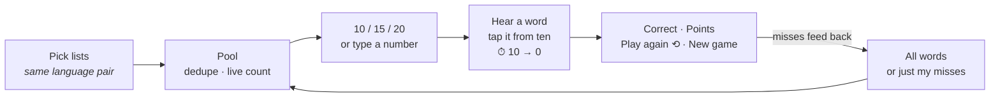
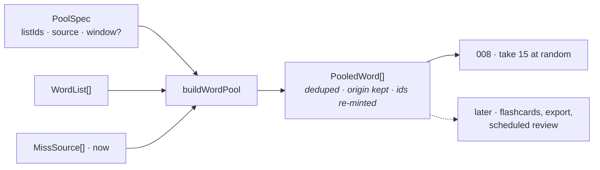

# Quickstart: 008-word-game

## What it is

Pick some lists — or just the words you keep getting wrong across them — say how many words you
want, and play. You hear a word, and grab its meaning from a cloud of ten before a ten-second
clock runs out. The clock **is** the score: tap at 7 and you bank 7.

## In one picture



## The thirteen decisions

| | |
|---|---|
| **D-1 Ten words, fresh each question** | Not one big cloud. Constant difficulty; shrinks to the pool when it has fewer. |
| **D-2 Chips 10/15/20 + a number box** | Both, capped at the pool. |
| **D-3 Games are recorded and feed the mistake pool** | A game teaches the rest of the app, or it is a toy. |
| **D-4 One shot per word** | Wrong scores nothing and moves on — loudly. |
| **D-5 Hear `col2`, tiles are `col1`** | The app already promises this on the ready screen. |
| **D-6 One language pair per pool** | `speak()` takes one language, and a lone French tile gives the answer away. |
| **D-7 `GameRecord`, not `SessionRecord`** | Auto-marked scores must not enter a self-marked average. |
| **D-8 A game does not survive a reload** | There is no honest answer to "how much clock was left", and no gesture to re-speak with. |
| **D-9 Replay re-draws from the same pool snapshot** | "A game has the settings it had." |
| **D-10 Game verdicts count both ways** | Or the missed pool only ever grows and never notices you learned. |
| **D-11 The setup form owns its own state** | `ListEditor` already sets that precedent. |
| **D-12 "Words I got wrong" means all time** | The ask is binary. The window chips are an extension point, not a feature. |
| **D-13 Word selection is a SHARED module** | `state/wordPool.ts`, not `game/pool.ts`. The game is its first caller, not its owner. |

## The one reusable piece

`state/wordPool.ts` answers *"given these settings, which words?"* and knows nothing about games.



Sampling, counting and scoring are the **caller's** business — a game takes 15 at random, an
export would take all of them in list order. Push any of that into the module and the next caller
has to fight it back out. The API in [plan.md](plan.md) is the whole API: a second caller may add
to `PoolSpec`, but nothing gets added ahead of one.

## The two things most likely to go wrong

**1 · iOS goes silent after a timeout.** `speak()` must descend from a tap. Three of four
transitions have one; a timeout does not — so a timeout shows **Next word** and that tap speaks.
Never auto-advance a timeout. It fails silently, on one platform, and the prompt is the whole
question.

**2 · The score contradicts the countdown.** `displayedSeconds` is a literal alias of `pointsFor`,
with `expect(displayedSeconds).toBe(pointsFor)` in the suite. Two functions that merely agree will
drift.

## Files

**New — shared, feature-agnostic**

| File | Holds |
|---|---|
| `src/state/wordPool.ts` | `PoolSpec` · `PooledWord` · `buildWordPool` · `poolSize` · `poolLanguages` · `listOptions` · `toPairs` |

**New — pure (`src/game/`)**

| File | Holds |
|---|---|
| `types.ts` | `GameSettings` (embeds a `PoolSpec`) · `Question` · `Answer` · `Game` · `GameRecord` + constants |
| `questions.ts` | `buildQuestions` · `pickDistractors` — sample without replacement |
| `game.ts` | `createGame` · `answer` · `timeOut` · `advance` · `replay` |
| `scoring.ts` | `pointsFor` · `displayedSeconds` · `remainingMs` · `scoreGame` |
| `gameRecord.ts` | `buildGameRecord` · `gameMissSources` |

**New — elsewhere**

`src/components/GameSetup.tsx` · `GameCloud.tsx` · `GameResults.tsx` · `src/storage/gameRepo.ts`
· `src/App.game.test.tsx` (+ a `.test.ts(x)` beside every file above)

**Changed — all additive**

`state/missedWords.ts` (+`MissSource`, two widened params — `toDrillPairs` left alone)
· `state/session.ts` (export `shuffle`)
· `state/appMachine.ts` (3 screens, 8 actions) · `storage/types.ts` + all three stores
· `firestore.rules` + both rules tests · `App.tsx` · `Home.tsx` · `NavMenu.tsx`
· `test/invariants.test.ts` · `README.md`

## Constants

```
QUESTION_MS 10_000 · MAX_POINTS 10 · CLOUD_SIZE 10 · MIN_POOL 4
MAX_GAME_WORDS 50 · COUNT_CHIPS [10,15,20] · VERDICT_MS 800 · MAX_GAME_RECORDS 100
```

## Commands

```bash
npm run typecheck && npm run lint && npm test   # the gate after every phase
npm run test:rules                              # emulator + JDK 21+
npm run dev                                     # --host, so a phone can reach it
```

**Baseline:** 45 test files, 810 tests green @ `main` `84f258a`. Expect 55 files when done (ten new).

## Order of work

1. **Shared foundations** — `MissSource` widening → export `shuffle` → **`state/wordPool.ts`**
2. **Game engine** — `types` → `questions` → `scoring` → `game` → `gameRecord`
3. **Storage** — `gameRepo` → `ListStore` → three stores → rules + rules tests
4. **Reducer** — three screens, eight actions, `NavMenu` guard
5. **Screens** — `GameSetup` → `GameCloud` → `GameResults`
6. **Wiring** — `App`, `Home`, end-to-end test
7. **Guards** — invariants, full validation, **and the iPhone pass**

Full detail in [tasks.md](tasks.md). Why, in [plan.md](plan.md). What, in [spec.md](spec.md).
