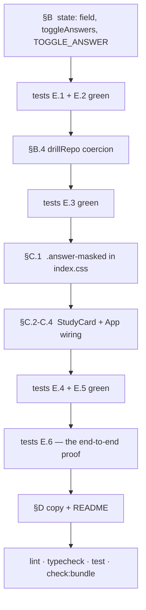

# Plan: Practice hides the answer, and an eye gives it back

**Spec:** [spec.md](spec.md)
**Baseline:** `main` @ `d24ec53` — 38 files, 604 tests, green
**Shape of the change:** one field, one pure function, one action, one CSS primitive, one button.

---

## A. Mandatory reading

Read these before writing anything. Each one contains a decision this plan depends on, written
down at the point it was made.

| File | Lines | Why |
|---|---|---|
| [src/state/types.ts](src/state/types.ts) | 25-55 | `DrillMode`'s "not to be confused with" comment — the house style for two fields that look alike. `Session` is where the new field goes |
| [src/state/session.ts](src/state/session.ts) | 50-97 | `createSession`, `nextCard`, `prevCard`. Note that `revealed` is cleared in all three |
| [src/state/appMachine.ts](src/state/appMachine.ts) | 110-140 | Why `REVEAL`/`MARK` are guarded to test and `NEXT`/`PREV` to practice, and why an out-of-mode action is a no-op rather than a type error |
| [src/storage/drillRepo.ts](src/storage/drillRepo.ts) | 44-108 | `isSession` and `read()`. The `runKind` coercion at 100-103 is the exact precedent for E-5 |
| [src/components/StudyCard.tsx](src/components/StudyCard.tsx) | all 125 | The component being changed. The `useEffect` with no dependency array is not a bug — read the comment at 38-44 |
| [src/components/TestCard.tsx](src/components/TestCard.tsx) | 103-158 | What a reveal looks like in this codebase — and the thing we are deliberately **not** copying |
| [src/index.css](src/index.css) | 294-370 | `@layer components`. The new primitive goes here, beside `.btn` and `.card` |
| [src/test/theme.test.ts](src/test/theme.test.ts) | 146-227 | The guards that keep styling in the token layer. One is being extended |
| [src/App.tsx](src/App.tsx) | 194-267, 389-416 | `act()` — the single choke point for state, persistence and speech — and the mode routing |

**Also read** [.claude/specs/002-drill-resilience-and-modes/spec.md](.claude/specs/002-drill-resilience-and-modes/spec.md)
§ FR-11. That requirement said practice mode hides nothing. This feature revokes it, and the
revocation should be explicit rather than quiet.

---

## B. The state design

### B.1 The field

`src/state/types.ts`, inside `Session`, immediately after `revealed`:

```ts
  /**
   * Practice mode's "answers are uncovered", for the whole run.
   *
   * NOT `revealed` above, and the distinction is the reason this is a second
   * field rather than a reuse. `revealed` is per CARD — test mode sets it with
   * REVEAL and `mark()` clears it on every advance. This is per RUN: opening the
   * answer on card 3 leaves it open on card 4, and only the user closes it again
   * (009 FR-4).
   *
   * Meaningless in test mode, where it stays false, exactly as `marks` stays
   * empty in practice.
   */
  answersOpen: boolean
```

### B.2 The pure layer

`src/state/session.ts`:

1. `createSession` gains `answersOpen: false` in its returned object. **This is the only place
   the field is initialised**, which is what makes FR-5 free: `restartShuffled`,
   `restartWrongOnly` and the `SWITCH_MODE` branch all route through it (E-9).

2. A new export, sitting next to `reveal`:

```ts
/**
 * Flip practice mode's answer cover.
 *
 * A toggle, not a one-way `reveal` — a peek must be reversible on the same card
 * (009 US-3), which is the one behaviour test mode deliberately does not have.
 */
export function toggleAnswers(session: Session): Session {
  return { ...session, answersOpen: !session.answersOpen }
}
```

3. `nextCard` and `prevCard` are **not changed**. They spread `...session`, so `answersOpen`
   carries automatically while `revealed` is still explicitly cleared — which is precisely FR-4.
   Add one line of comment to each saying the carry is intended, or the next reader will "fix" it.

> **Do not** add `answersOpen: false` to `mark()`. `mark()` is test-only, the field is already
> false there, and writing it would imply a coupling that does not exist.

### B.3 The action

`src/state/appMachine.ts`:

```ts
  /** Practice-mode answer cover. A no-op in test mode, which has REVEAL. */
  | { type: 'TOGGLE_ANSWER' }
```

and the case, placed directly beneath `REVEAL` so the two guards read as a pair:

```ts
    case 'TOGGLE_ANSWER':
      if (state.screen !== 'practising' || state.session.mode !== 'practice') return state
      return { ...state, session: toggleAnswers(state.session) }
```

Mirror-image of `REVEAL`'s guard. Out-of-mode returns `state` by reference, which the existing
tests assert with `toBe`.

### B.4 Persistence

`src/storage/drillRepo.ts`. Two edits, and **`SCHEMA_VERSION` stays `1`** (NFR-5).

`isSession` must **not** gain an `answersOpen` check — a drill parked by today's build has no such
key, and requiring it returns `null` and destroys every run in flight at deploy (E-5). Instead,
`read()` rebuilds the session with the field coerced, exactly as it already does for `runKind`:

```ts
    return {
      list: payload.list,
      session: {
        ...payload.session,
        // COERCED, not required. A drill parked by a build older than 009 has no
        // such key, and rejecting it would throw away a run in progress over a
        // cosmetic preference. `=== true` and not a truthiness test, so a
        // hand-edited "yes" lands closed rather than open (E-6).
        answersOpen: payload.session.answersOpen === true,
      },
      runKind: payload.runKind === 'wrong-only' ? 'wrong-only' : 'full',
    }
```

`isSession`'s predicate claims `value is Session` while the object may lack the field — that is
already true of this function's relationship to `WordList`, and the rebuild above is what makes it
honest by the time a caller sees it.

---

## C. The mask

### C.1 The primitive

`src/index.css`, in `@layer components`, after `.card`:

```css
  /*
   * Practice mode's answer cover (009).
   *
   * A filter rather than a colour or a placeholder, so the word keeps its exact
   * box and the card does not resize under the thumb when it is uncovered
   * (NFR-1). Radius is in `em` and not `px`: --text-word is 2.5rem today, and a
   * pixel radius stops covering the word the moment that changes (NFR-3).
   *
   * `user-select` is not decoration. Blur is a visual effect only — the text is
   * still in the DOM, and a drag-select would read it straight off the screen.
   * The other half of that leak, the accessibility tree, is closed in the
   * component with aria-hidden (FR-8).
   */
  .answer-masked {
    filter: blur(0.35em);
    -webkit-user-select: none;
    user-select: none;
  }

  /*
   * Windows High Contrast can discard `filter` outright, which would uncover
   * every answer with nothing to show for it. Hide the box instead — it still
   * reserves its space, so NFR-1 survives the fallback (NFR-7, E-3).
   */
  @media (forced-colors: active) {
    .answer-masked {
      visibility: hidden;
    }
  }
```

`0.35em` at `--text-word: 2.5rem` is a 14px radius on 40px glyphs — comfortably past legibility,
short of a shapeless smear. Judge it in the browser at the numbers, not from the file.

> A note on where this may **not** go: `blur-sm`/`blur-lg` at the call site. Tailwind's blur scale
> is in pixels and would violate NFR-3, and the palette guards in `theme.test.ts` exist because
> styling that lives in `className` strings drifts one component at a time. A guard is added in
> § E.5 to hold this line too.

Class detection is scoped to `src/` by `@import "tailwindcss" source(none)` plus `@source "."`
([index.css:10-11](src/index.css#L10-L11)), so class names quoted in these spec files are not
compiled into the stylesheet. The hazard `theme.test.ts:178-180` warns about is already closed.

### C.2 The card

`src/components/StudyCard.tsx`. Props gain one callback:

```ts
  onToggleAnswer: () => void
```

The answer block becomes:

```tsx
        <p className="mt-2 text-xs uppercase tracking-wide text-ink-faint">
          {LANG_NAMES[list.col1Lang]}
        </p>
        <p
          className={`text-word font-bold text-correct ${session.answersOpen ? '' : 'answer-masked'}`}
          /*
           * Out of the accessibility tree while covered, not merely blurred.
           * A filter is a picture of hiding — a screen reader would read the
           * answer aloud the moment the card appeared, which is the one user
           * for whom this feature would then do nothing at all (FR-8).
           */
          aria-hidden={!session.answersOpen}
        >
          {pair.col1}
        </p>
```

and the control, directly beneath the card block and above "Hear it again":

```tsx
      <button
        type="button"
        onClick={onToggleAnswer}
        className="btn btn-quiet"
      >
        {session.answersOpen ? 'Hide answer 👁' : 'Reveal answer 👁'}
      </button>
```

**On the accessible name.** The label changes with the state and there is deliberately **no
`aria-pressed`**. Carrying both makes a screen reader announce the state twice, once in the name
and once in the role — "Hide answer, toggle button, pressed" — which is the pattern the ARIA
Authoring Practices warn against for exactly this control. One or the other; the changing label is
the one a sighted user also gets.

**Not "Show answer".** That is Test mode's button, and
[App.test.tsx:381](src/App.test.tsx#L381) uses its absence to prove a restored practice drill came
back as practice. Keeping the two names distinct keeps that assertion meaningful instead of
accidentally breaking it.

The 44px target comes from `.btn`, which bakes `min-height: 2.75rem`
([index.css:303-313](src/index.css#L303-L313)) — do not retype `min-h-11`.

### C.3 The keyboard

Inside the existing `useEffect`, after the Space branch and before the arrows:

```ts
      } else if (event.key === 'a' || event.key === 'A') {
        event.preventDefault()
        onToggleAnswer()
      }
```

`A`, not `Enter`: `Enter` already advances in this card
([StudyCard.tsx:54](src/components/StudyCard.tsx#L54)) and re-pointing it would break both muscle
memory and an existing test (E-8). The `[role="menu"],[role="dialog"]` guard at the top of the
handler covers it for free (FR-9, E-7).

Footer hint becomes:

```tsx
        Space replays · A shows the answer · → next · ← previous
```

### C.4 Wiring

`src/App.tsx`, the practice branch:

```tsx
            onToggleAnswer={() => act({ type: 'TOGGLE_ANSWER' })}
```

**And nothing else.** Specifically:

- `TOGGLE_ANSWER` is **not** added to `advances` ([App.tsx:257-265](src/App.tsx#L257-L265)), or
  every peek re-speaks the prompt (FR-10, E-10).
- Persistence needs no change: `act` already calls `drillRepo.save` on every action that leaves
  the app on `practising` ([App.tsx:250-254](src/App.tsx#L250-L254)), and the flag rides inside
  `Session` (FR-6).
- `setResumed(false)` firing on the toggle is **correct** — a tap is a user gesture, so the speech
  chain really is re-established.

---

## D. Copy

| Where | From | To |
|---|---|---|
| [ReadyScreen.tsx:51](src/components/ReadyScreen.tsx#L51) | `Hear it, see it, see the answer` | `Hear it, try it, reveal when you want` |
| [StudyCard.tsx:18](src/components/StudyCard.tsx#L18) doc | "hear it, see it spelled, see the answer, move on" | "hear it, try it, uncover the answer when you want it" |
| [StudyCard.tsx:21-23](src/components/StudyCard.tsx#L21-L23) doc | "this one hides nothing and counts nothing" | "this one hides the answer until asked, and counts nothing" |
| [App.tsx:391-395](src/App.tsx#L391-L395) comment | "one hides the answer and counts, the other hides nothing" | "one hides the answer and counts, the other hides it until asked and counts nothing" |
| [README.md:87-93](README.md#L87-L93) | Documents test mode only | Add the practice flow and its keys |

Check [ResultsScreen.tsx:151-163](src/components/ResultsScreen.tsx#L151-L163) ("Study these") while
you are there — if its surrounding copy promises the answer is shown, it changes too.

---

## E. Tests

604 green is the floor. Every number below is *added* except the two inversions in § E.4.

### E.1 `src/state/session.test.ts`

- `createSession` returns `answersOpen: false` — in **both** modes.
- `toggleAnswers` flips false → true and true → false.
- `toggleAnswers` returns a new object and does not mutate its input (the file's house rule).
- `nextCard` **preserves** `answersOpen` while still clearing `revealed` — the assertion that
  encodes FR-4, and the one a future refactor is most likely to break.
- `prevCard` likewise.
- `restartShuffled` and `restartWrongOnly` come back with `answersOpen: false` even when the
  finished session had it open (FR-5).

### E.2 `src/state/appMachine.test.ts`

- `TOGGLE_ANSWER` flips the flag on a practising practice session.
- Twice returns to closed.
- It is a **no-op in test mode**, returned by reference (`toBe`), beside the existing
  "REVEAL is a no-op in practice mode" at line 208 — the two read as a matched pair.
- It is a no-op on `ready`, `results` and `home`.
- `SWITCH_MODE` from a finished test lands on a practice session with `answersOpen: false` (E-9).

### E.3 `src/storage/drillRepo.test.ts`

- Round-trips `answersOpen: true`.
- A payload whose `session` **has no `answersOpen` key** restores, with `false` — assert on the
  restored value, not merely on non-null (FR-7, E-5).
- `answersOpen: 'yes'` restores as `false`, not `true` (E-6).
- `SCHEMA_VERSION` is still `1` (NFR-5). A one-line guard, and the one that stops a well-meaning
  bump.

### E.4 `src/components/StudyCard.test.tsx`

The two inversions, each carrying a comment naming 002's FR-11 and why it no longer holds:

- ~~*shows the prompt word and the answer together, with no interaction*~~ → **shows the prompt
  plainly and the answer covered**: `getByText('dochter')` has no `answer-masked` class and no
  `aria-hidden`; `getByText('daughter')` has both.
- ~~*offers no reveal, because nothing is hidden*~~ → **offers a reveal, because the answer is
  hidden**.

Added:

- Clicking **Reveal answer** calls `onToggleAnswer` once.
- Rendered with `answersOpen: true`, the answer has no mask and no `aria-hidden`, and the button
  reads **Hide answer**.
- The prompt word is **never** masked in either state (E-11).
- Pressing `a` calls `onToggleAnswer`; pressing it with a `[role="menu"]` in the document does not
  (E-7) — clone the existing menu-guard test at line 189.
- Toggling adds nothing to `speechCalls` (FR-10).
- The footer hint mentions the key.

### E.5 `src/test/theme.test.ts`

Beside the existing token guards:

- `.answer-masked` is present in the compiled stylesheet, and its `filter` radius is expressed in
  `em` (NFR-3). A regex on the block, not on the whole file.
- The `forced-colors` fallback exists (NFR-7).
- **No `blur-*` utility anywhere in `src`** (NFR-2). Build the pattern from parts, for the reason
  spelled out at [theme.test.ts:176-181](src/test/theme.test.ts#L176-L181) — writing the literal
  class here would compile it into the stylesheet.

### E.6 `src/App.test.tsx`

The end-to-end proof, and the place the trap lives.

- **Strengthen** `a full practice run` at line 538: `getByText('daughter')` still passes while
  masked, so it must become an assertion about `aria-hidden` / the mask class. Leaving it as-is
  is worse than deleting it — it looks like coverage and is not.
- Reveal on card 1 → Next → **card 2 is already revealed** (AC-4).
- Hide on card 2 → Previous → **card 1 is masked** (AC-5).
- Reveal, unmount, re-render → the answer comes back **revealed** (AC-6), alongside the existing
  restore test at line 368.
- Finish a practice run revealed → **Practice again** → masked (AC-8).
- A full test-mode run is unchanged (AC-12) — the existing suite covers this; confirm it needed no
  edit.

---

## F. Pragmatic principles review

**DRY.** The reveal control is *not* extracted into a shared `<RevealButton>` with TestCard. The
two answer opposite questions — one is a one-way gate before self-marking, the other a reversible
run-level cover — and the existing comment at
[StudyCard.tsx:20-24](src/components/StudyCard.tsx#L20-L24) already argues that inventing a shared
card abstraction for two users couples them where they are most likely to diverge. This feature is
that divergence arriving on schedule. What *is* shared is `.btn` and the token layer, which is the
right level.

**Broken windows.** Two are visible from here and both are in scope, because this change is what
makes them wrong: the mode-routing comment in `App.tsx` and the doc comment on `StudyCard` both
assert "hides nothing", and a comment that lies is worse than no comment. The `App.test.tsx:550`
presence assertion is a third — a test that cannot fail is a broken window with a green tick on it.
Out of scope: `public/icons.svg` is template debris unrelated to this change and stays.

**Automate.** Three of the guards above exist because a human reviewer cannot catch the failure:
the `blur-*` sweep (NFR-2), the `em` radius (NFR-3), and the `SCHEMA_VERSION` pin (NFR-5). Each
protects a decision whose violation produces no error and no symptom for weeks, which is the
same admission criterion the sweep guards in `theme.test.ts` were written under.

**Design for change.** `Session.answersOpen` is the seam if a cross-run preference is ever wanted:
a stored default would be read once at `createSession` and nothing downstream would change. That
is *why* the initialisation is in one place, and it is as far as this plan goes toward a feature
nobody has asked for.

---

## G. Order of work



The state layer lands and is proved before any pixel moves. That ordering is not ceremony: if
`answersOpen` turns out to want a different lifetime, finding out costs three files instead of
nine.
