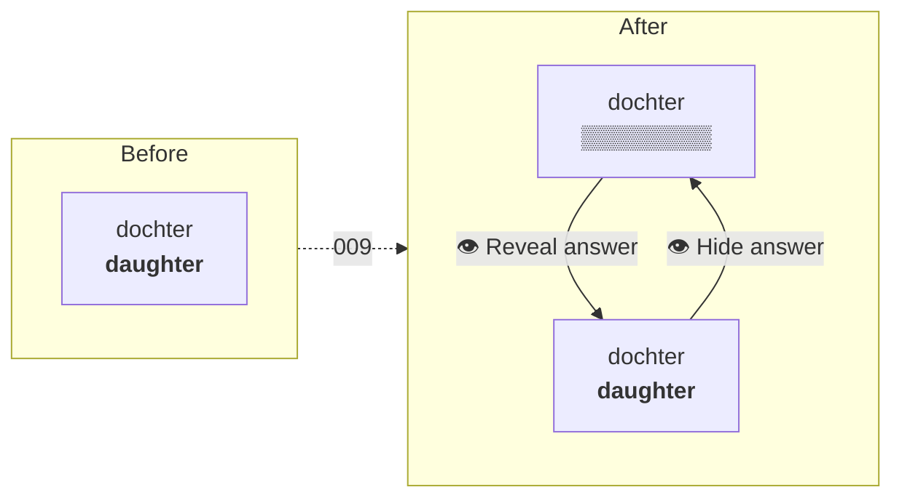

# Quickstart: 009 — Practice hides the answer

**TL;DR** Practice mode stops giving the answer away. The translation arrives blurred; an eye
button uncovers it. The choice sticks for the rest of the run and survives a reload. Test mode is
not touched.

---

## The change in one picture



## What you are actually building

| | |
|---|---|
| One field | `Session.answersOpen: boolean` — **per run**, not per card |
| One pure function | `toggleAnswers(session)` in `session.ts` |
| One action | `TOGGLE_ANSWER`, guarded to practice mode exactly as `REVEAL` is to test |
| One CSS primitive | `.answer-masked` — `filter: blur(0.35em)` + `user-select: none` |
| One control | `Reveal answer 👁` ⇄ `Hide answer 👁`, plus the `A` key |

Nine source files, six test files. Baseline is **604 tests across 38 files, green**, at `d24ec53`.

## Files, in the order you touch them

1. `src/state/types.ts` — the field
2. `src/state/session.ts` — init it, and `toggleAnswers`
3. `src/state/appMachine.ts` — `TOGGLE_ANSWER`
4. `src/storage/drillRepo.ts` — coerce it on read
5. `src/index.css` — `.answer-masked`
6. `src/components/StudyCard.tsx` — the mask, the eye, the key
7. `src/App.tsx` — one prop
8. `src/components/ReadyScreen.tsx` — the hint copy
9. `README.md` — the Practising section

## The five things that will bite you

1. **`getByText('daughter')` still passes when the answer is masked.** Blur leaves the text in
   the DOM. Every assertion about hiding must go through `aria-hidden` or the mask class —
   including [App.test.tsx:550](src/App.test.tsx#L550), which today is a test that cannot fail.

2. **Do not add `answersOpen` to `isSession` in `drillRepo`.** Every drill parked by the current
   build lacks the key. Requiring it makes `read()` return `null` and throws away every run in
   flight the moment this deploys. Coerce in `read()` with `=== true`, the way `runKind` already
   is.

3. **Do not put `TOGGLE_ANSWER` in `advances`** ([App.tsx:257-265](src/App.tsx#L257-L265)). That
   list drives `speakCurrent`, and a peek would re-speak the prompt every time.

4. **`aria-hidden` is the feature, not polish.** Without it a screen reader announces the answer
   the moment the card renders — the one user for whom the blur does literally nothing.

5. **Label it "Reveal answer", never "Show answer".** That string belongs to Test mode, and
   [App.test.tsx:381](src/App.test.tsx#L381) uses its absence to prove a restored practice drill
   came back as practice.

## Why a second boolean and not `revealed`

Different lifetimes. `revealed` is **per card** — `mark()` clears it on every advance.
`answersOpen` is **per run** — that is the whole of US-4. One field whose meaning depends on
`session.mode` reads fine today and produces an unexplainable bug the first time practice mode
grows any per-card state.

## Three tests change; everything else only grows

| File | Line | What |
|---|---|---|
| `StudyCard.test.tsx` | 47 | inverts — the answer is now covered |
| `StudyCard.test.tsx` | 88 | inverts — there is now a reveal |
| `App.test.tsx` | 550 | strengthens — presence → accessibility tree |

Any *other* red test means the change broke something. Fix the change, not the test.

## Decisions already made, so you do not have to

- **Blurred, not dots or a blank.** The text keeps its box, so nothing reflows on reveal.
- **The blur leaks word length.** Accepted — practice is not an exam, and Test mode is still the
  place where nothing is given away.
- **A toggle, not a one-way reveal.** A peek has to be reversible on the same card.
- **`A`, not `Enter`.** `Enter` already advances in this card.
- **Emoji 👁, not an SVG.** The app spells its icons as emoji (🔊, ✓, ✗).
- **No animation.** Instant, for 007's reason — a cross-fade looks good once and is tiring on the
  fortieth card.

## Run it

```bash
npm test                              # 604 green before you start
npm run dev                           # phone-sized viewport
npm run lint && npm run typecheck && npm test && npm run check:bundle   # the gate
```

## Full detail

- **WHAT and why:** [spec.md](spec.md) — user stories, FR/NFR, 11 edge cases
- **HOW:** [plan.md](plan.md) — the code, verbatim, with the reasoning attached
- **DO:** [tasks.md](tasks.md) — 13 tasks, 4 phases, each ending in a runnable VALIDATE
