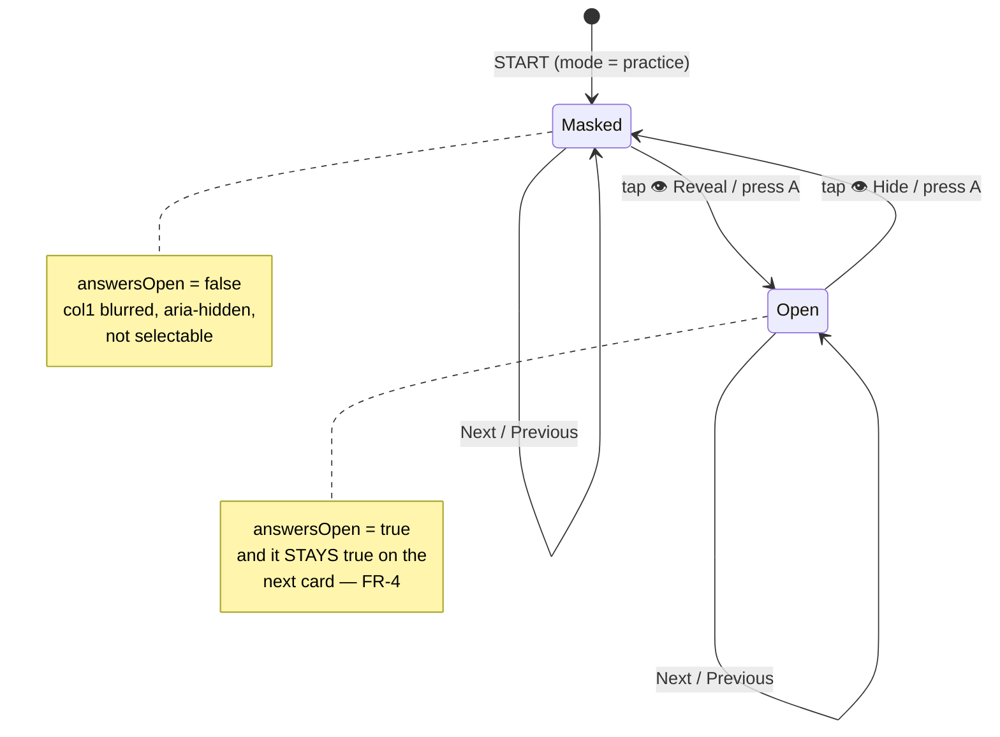
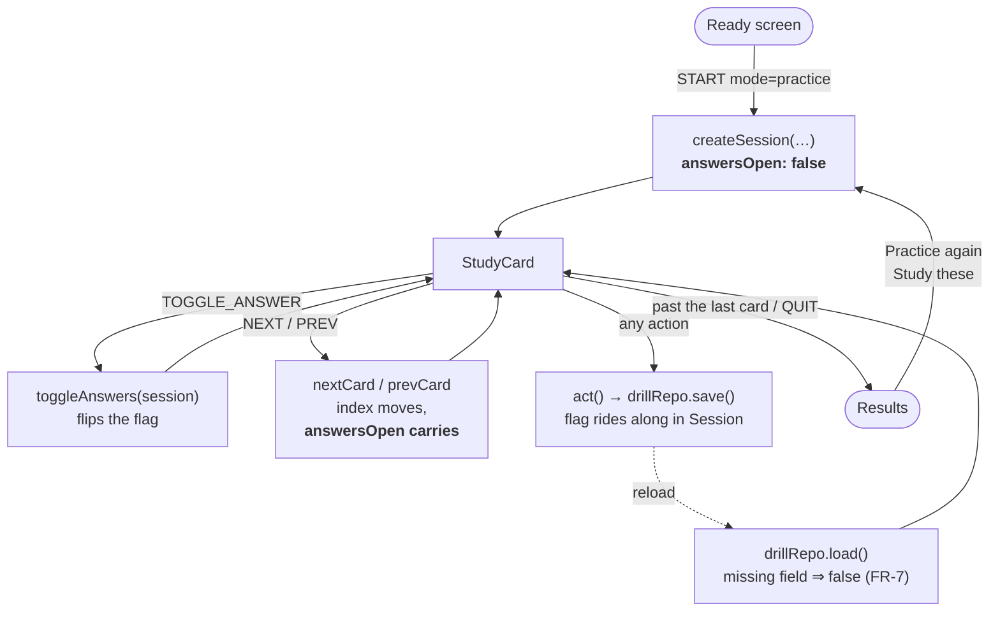
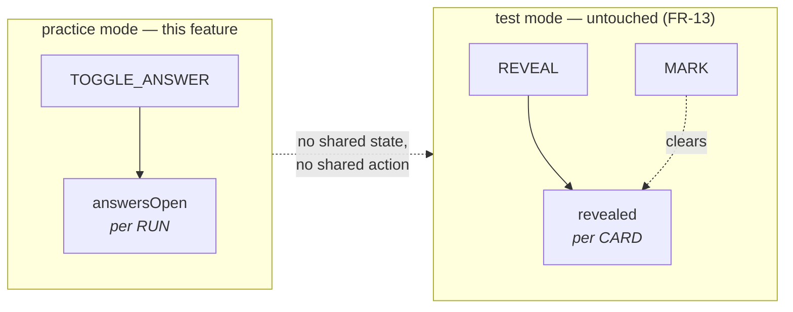

# Spec: Practice hides the answer, and an eye gives it back

**ID:** 009-practice-peek
**Status:** DRAFT
**Created:** 2026-09-06
**Baseline:** `main` @ `d24ec53` — **38 test files, 604 tests, all green**
**Feature Type:** Enhancement — one new piece of session state, one new control, one CSS primitive
**Complexity:** Low-Medium. Nine source files, none of them deeply. The interesting parts are
the *lifetime* of the new state and the fact that a blurred word is still in the DOM.

---

## The ask

> "in the practice — I want the 'answer' to be hidden, and have a 'eye' icon in which you can
> see the word if you want. (help them practice first, and then see the answer)"

## The problem, precisely

Practice mode currently shows both columns at once ([StudyCard.tsx:84-89](src/components/StudyCard.tsx#L84-L89)):

```tsx
<p className="text-word font-bold">{pair.col2}</p>        {/* dochter */}
…
<p className="text-word font-bold text-correct">{pair.col1}</p>  {/* daughter */}
```

That was deliberate — 002 wrote it down as FR-11, "the whole point of practice mode: nothing is
hidden" — and it is wrong for how people actually study. With the answer already on screen there
is no moment at which you *try*. Reading a translation is not recall, and the mode that was meant
to be gentler than Test ended up being the one where no learning is attempted at all.

Test mode already solves this, and solves it too hard: it hides the answer, then demands you mark
yourself Right or Wrong and writes the result into your history. Between "everything given" and
"graded" there is nothing, and that gap is where studying actually happens.

This feature is that middle: **hidden by default, revealed on request, never scored.**

## User stories

**US-1 — a beat to try, before the answer**
As someone working through a new list,
I want the translation covered when the card appears,
So that I get one honest attempt at recall before I am told.

**US-2 — the answer, the instant I want it**
As someone who has drawn a blank,
I want one tap to uncover the word,
So that I am not punished for not knowing — which is what Test mode is for.

**US-3 — cover it back up**
As someone who peeked and immediately wants to re-test the same card,
I want to hide the answer again without leaving the card,
So that a peek is not a one-way door.

**US-4 — decide once, not forty times**
As someone revising a list I already half-know,
I want the app to keep answers open once I have opened them,
So that I am not tapping the eye on every single card.

**US-5 — a peek survives a reload**
As someone whose phone locked mid-run,
I want the app to come back the way I left it,
So that the drill resumes rather than restarting its assumptions.

## Decisions

| | |
|---|---|
| What is hidden | The **answer column only** (`col1`). The prompt word (`col2`) is never masked |
| How it is hidden | **Blurred in place** — the text keeps its box, so nothing reflows on reveal |
| The control | A real `<button>` labelled **Reveal answer** ⇄ **Hide answer**, with 👁 |
| Direction | A **toggle**. Show and hide, any number of times, on the same card |
| Lifetime | **The run.** Opening on card 3 leaves cards 4…n open; hiding closes them again |
| Start state | **Closed**, on every new run — including a re-run and a mode switch |
| Where it lives | `Session.answersOpen`, so it is parked with the drill and survives a reload |
| Test mode | **Not touched.** Not one line of `revealed`, `REVEAL`, `MARK` or `TestCard` |
| Scoring | Still none. Practice records nothing, peeked or not |

### Why a second field and not `revealed`

`Session.revealed` already exists and is already persisted. Reusing it is tempting and is
rejected, for one reason: **the two have different lifetimes.** `revealed` is per-card — `mark()`
clears it on every advance ([session.ts:107](src/state/session.ts#L107)) — and `answersOpen` is
per-run. One boolean whose meaning depends on `session.mode` is the kind of thing that reads fine
today and produces an unexplainable bug the first time practice mode grows any per-card state.

They are orthogonal, and the type says so, in the same way `DrillMode` already carries a comment
warning it is not `SessionRecord.mode` ([types.ts:31-37](src/state/types.ts#L31-L37)).

---

## FR — Functional requirements

- **FR-1** On entering practice mode, the answer column is **masked** and the prompt column is not.
- **FR-2** A control on the card reveals the answer. It is a `<button>`, reachable by Tab, with a
  minimum 44px touch target.
- **FR-3** The control is a **toggle**: activating it while revealed masks the answer again.
- **FR-4** The reveal/mask choice **persists across cards within the run** — Next and Previous
  carry it, in both directions.
- **FR-5** Every **new** session starts masked: Practice from the ready screen, Practice again,
  and "Study these" from a finished test.
- **FR-6** The choice is **parked with the drill** and restored on reload, exactly as `index` and
  `order` already are.
- **FR-7** A drill parked by a **build that predates this feature** still restores, masked. It is
  never discarded over a missing field.
- **FR-8** The masked answer is **not exposed to assistive technology** and is **not selectable**.
  Blur is a visual effect; on its own it leaks the answer to a screen reader and to a drag-select.
- **FR-9** The keyboard shortcut `A` toggles the answer, under the same "not while a menu or dialog
  owns the keyboard" guard the existing bindings carry
  ([StudyCard.tsx:49](src/components/StudyCard.tsx#L49)).
- **FR-10** Toggling **speaks nothing**. It is not an advance, and `speakCurrent` must not run.
- **FR-11** Toggling does not change the card, the index, or anything recorded.
- **FR-12** The ready screen's description of Practice tells the truth about the new behaviour.
- **FR-13** Test mode's behaviour is **byte-for-byte unchanged**, including its one-way
  "Show answer" and its `revealed` field.

## NFR — Non-functional requirements

- **NFR-1 — No layout shift on reveal.** The masked answer occupies its final box. A card that
  resizes under the thumb is how you mis-tap Next.
- **NFR-2 — The mask lives in the primitive layer.** One class in `@layer components` in
  `src/index.css`, not a `blur-*` utility retyped at a call site — the same rule the palette
  already follows, and for the same reason (`theme.test.ts` § "colour comes from the token layer").
- **NFR-3 — The blur scales with the font.** Expressed in `em`, not `px`. `--text-word` is
  `2.5rem` today ([index.css:79](src/index.css#L79)) and a hard-coded pixel radius stops covering
  the word the moment that changes.
- **NFR-4 — No new dependency, no bundle growth.** One CSS rule and one boolean. `npm run
  check:bundle` must still pass.
- **NFR-5 — No storage schema bump.** `drillRepo.SCHEMA_VERSION` stays at `1`. Bumping it to add
  an optional field would discard every drill in flight at deploy time.
- **NFR-6 — No `dark:` variant and no raw palette class.** The existing guards stay green
  untouched.
- **NFR-7 — Works in forced-colors mode.** Windows High Contrast may drop `filter`, which would
  silently un-hide every answer.

---

## Workflows

### The card, and what the eye does



### Where the state lives, and what resets it



### The one boundary that matters



---

## Acceptance criteria

- **AC-1** Starting a practice run shows the prompt word plainly and the answer masked.
- **AC-2** The eye control reveals the answer with no change to card size or position.
- **AC-3** Activating it again re-masks the same card.
- **AC-4** Revealing on card 1 and pressing Next lands on card 2 **already revealed**.
- **AC-5** Hiding on card 2 and pressing Previous lands on card 1 **masked**.
- **AC-6** Reloading mid-run restores the same card *and* the same open/closed state.
- **AC-7** A drill parked with **no `answersOpen` key at all** restores masked, not discarded.
- **AC-8** Finishing and choosing **Practice again** starts masked, however the last run ended.
- **AC-9** Toggling adds **no** entry to `speechCalls`.
- **AC-10** While masked, the answer text is unreachable via `getByRole`/accessible-name queries
  and carries `aria-hidden`.
- **AC-11** `A` toggles; `A` while a `[role="menu"]` exists does nothing.
- **AC-12** A full test-mode run is unchanged, and `git diff` touches no line of `TestCard.tsx`.
- **AC-13** `npm test` is green with **no existing assertion weakened** except the two named in
  § "Tests that must invert" — which invert deliberately and visibly.
- **AC-14** `npm run lint`, `npm run typecheck` and `npm run check:bundle` all pass.

## Tests that must invert

Two assertions in [StudyCard.test.tsx](src/components/StudyCard.test.tsx) exist to pin the exact
behaviour this feature removes. They are not weakened; they are replaced by their opposite, with a
comment saying so — the pattern 007 used when `theme.test.ts:81` flipped from "declares no
`color-scheme`" to "declares `color-scheme`".

| File | Test | Was | Becomes |
|---|---|---|---|
| `StudyCard.test.tsx:47` | *shows the prompt word and the answer together, with no interaction* | FR-11 of 002 | shows the prompt plainly, the answer masked |
| `StudyCard.test.tsx:88` | *offers no reveal, because nothing is hidden* | FR-11 of 002 | offers a reveal, because the answer is hidden |

One assertion in [App.test.tsx](src/App.test.tsx) is **not** inverted but is **strengthened**, and
this is the trap of the whole feature: `expect(screen.getByText('daughter')).toBeInTheDocument()`
at `App.test.tsx:550` **still passes when the answer is masked** — blurring leaves the text in the
DOM. A presence assertion cannot see this feature at all. It must become an assertion about the
accessibility tree.

---

## Edge cases

- **E-1 — a blurred word is still text.** It is in the DOM, in the accessibility tree, and
  selectable. Blur alone ships the answer to every screen-reader user on card load. `aria-hidden`
  and `user-select: none` are not polish here, they are the feature (FR-8).
- **E-2 — the blur leaks word length.** A blurred blob is as wide as the word it covers, so
  "3 letters" is readable even when the letters are not. **Accepted, deliberately.** Practice is
  not an exam; a length nudge is closer to helpful than to cheating, and the alternatives
  (fixed-width dots, a solid bar) either reflow on reveal or look like a redaction. Test mode
  remains the place where nothing at all is given away.
- **E-3 — forced-colors mode may drop `filter`.** Windows High Contrast can discard filters, which
  would un-hide the answer with no visible failure. `@media (forced-colors: active)` must fall
  back to `visibility: hidden` (NFR-7).
- **E-4 — `aria-live` on the card.** The card wrapper is `aria-live="polite"`
  ([StudyCard.tsx:80](src/components/StudyCard.tsx#L80)). Revealing therefore announces the answer,
  which is correct and wanted. Masking removes a node, which screen readers do not announce.
- **E-5 — a drill parked by the current build has no `answersOpen`.** `isSession` must not
  *require* it, or `read()` returns null and everyone mid-practice at deploy time loses their run
  (FR-7). Coerce in `read()`, the same trade-off already made for an unknown `runKind`
  ([drillRepo.ts:100-103](src/storage/drillRepo.ts#L100-L103)).
- **E-6 — a hand-edited `answersOpen: "yes"`.** Coerce with `=== true`, never a truthiness test.
- **E-7 — `A` and the account menu.** The window-level binding is live while the account menu sits
  on top of the drill. Same `document.querySelector('[role="menu"],[role="dialog"]')` guard as
  Space and the arrows (FR-9).
- **E-8 — `Enter` is already Next in practice.** It cannot become the reveal key the way it is in
  Test mode; that is why the shortcut is `A`, and why the footer hint line must gain it.
- **E-9 — the mode switch.** "Study these" from a finished test builds a fresh session
  ([appMachine.ts:171-182](src/state/appMachine.ts#L171-L182)), so it starts masked for free —
  but only as long as `createSession` is the single place the field is initialised.
- **E-10 — `TOGGLE_ANSWER` must not join `advances`.** The list at
  [App.tsx:257-265](src/App.tsx#L257-L265) drives `speakCurrent`. Adding the toggle to it would
  re-speak the prompt on every peek (FR-10).
- **E-11 — the prompt column must never be masked.** `col2` is what you are being asked about and
  is spoken aloud; masking it would make the card unusable for anyone with no voice for that
  language, who is relying on the printed word.

---

## Non-goals

- **Marking, scoring or history in practice mode.** Unchanged, and the reason this is not simply
  "make Test mode gentler". A practice run still writes nothing.
- **A per-user, cross-run preference.** The choice sticks for *the run* and dies with it. A
  persisted "always open answers" setting is a settings screen and a sync question; if the pattern
  turns out to be real, `Session.answersOpen` is where it would be read from, not replaced.
- **Hiding the prompt, or a reverse direction (`col1` → `col2`).** Direction is fixed for now.
- **Any change to Test mode**, including making its reveal a toggle. The two cards stay two
  components; see [StudyCard.tsx:17-24](src/components/StudyCard.tsx#L17-L24).
- **An SVG icon set.** The app spells its icons as emoji (🔊, ✓, ✗). 👁 joins them rather than
  introducing a sprite. `public/icons.svg` is untouched template debris and stays that way.
- **Animating the reveal.** Deliberately instant, for 007's stated reason: a cross-fade of the
  answer looks good once and is tiring on the fortieth card.

## Out of scope, noted for later

- **Auto-reveal after N seconds.** A tempting "help them practice first" reading, and a different
  feature — it needs a timer, a preference, and a reason not to fight the user who is thinking.
- **Tap the blurred word itself to reveal.** A larger target than the button, and it turns the
  answer into a control, which complicates the a11y story for a gain the button already covers.
- **Carrying the choice into the word game (008).** 008 is a separate spec and a separate screen.
