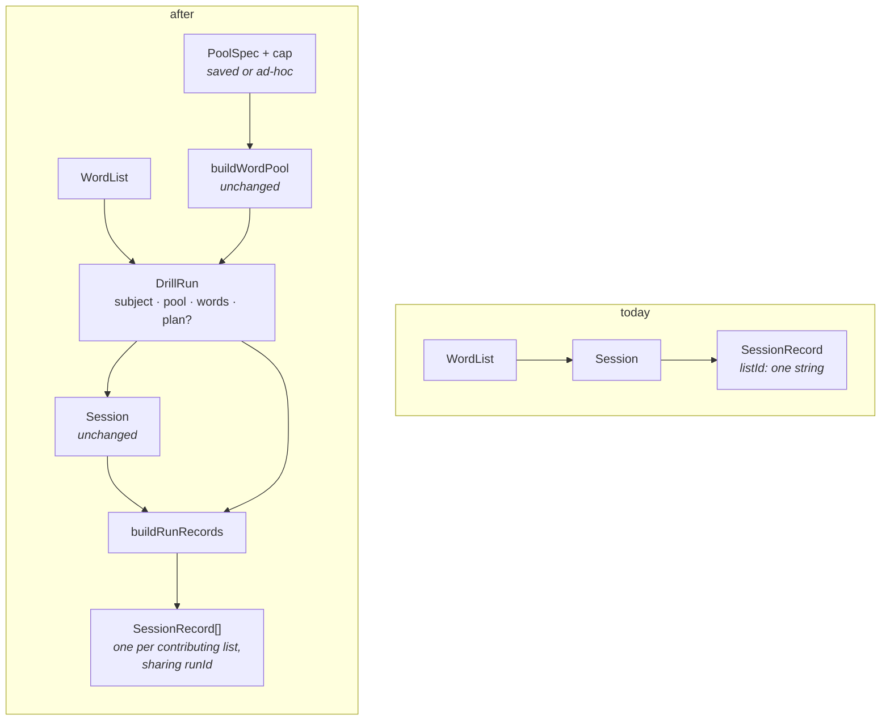
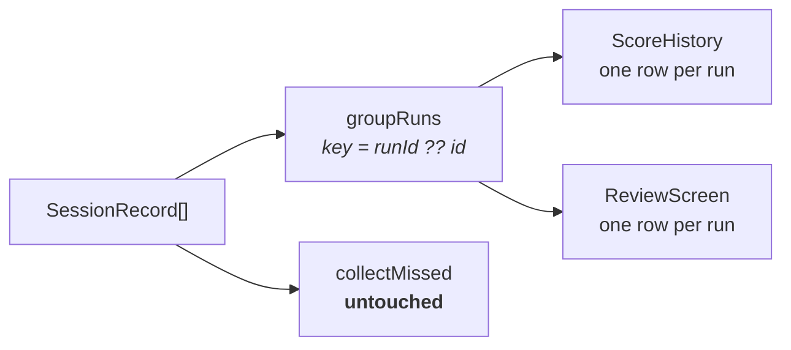
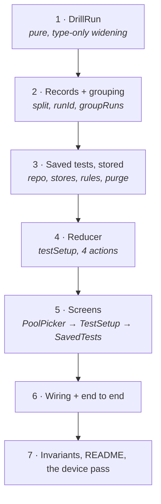

# Plan: 011-test-builder

**Spec:** [spec.md](spec.md) · **Tasks:** [tasks.md](tasks.md) · **TL;DR:** [quickstart.md](quickstart.md)
**Baseline:** `main` @ `5aaae6b` — 56 files, 1085 tests green
**Branch:** `feature/test-builder`, cut from `main` (008 landed as #11)

---

## A · The shape of the change

Today a drill is a `WordList` all the way down. The single idea in this plan is that it becomes a
**`DrillRun`** — a subject, a pool, the words actually drawn, and optionally the test plan that
drew them. A list drill is the degenerate case where the pool is one list and nothing was capped.



Everything downstream of `SessionRecord` is then unchanged — `collectMissed`, the rules, the
queries, `scoreBand` — and the only new reading rule is that history is **grouped** before it is
shown:



### Why not a new record type

Written out because it is the decision most likely to be re-litigated by whoever reads this next.

A `TestRecord` in a `tests` collection — one row per run, per-word origin, mirroring `GameRecord` —
is the cleaner data shape and was rejected on cost. It needs a repo with its own quota shedding,
two store implementations, `subscribeTests` on the `ListStore` interface, Firestore rules plus
rules tests, a miss projection alongside `gameMissSources`, a union in three history components,
and a line in `purgeUserData` — the line 008 forgot, which is why that cost is not theoretical
(see the defect note in the spec).

Splitting instead costs one optional field and one grouping function, and leaves `collectMissed`
literally unedited. Given that `collectMissed` is the engine every other feature now depends on and
its suite is the only thing proving the `MissSource` widening was safe, "do not touch it" is worth
more than a tidier row shape.

---

## B · New pure modules

### B.1 `src/state/drillRun.ts` — NEW

The whole spine of the change. Pure, no clock, no `Math.random()`.

```ts
import type { LangCode } from '../lang/languages'
import type { PoolSpec, PooledWord } from './wordPool'
import type { WordList, WordPair } from './types'
import { shuffle, type Rng } from './session'

/**
 * What a run is a run OF, for the screens that only need to name it and speak it.
 *
 * The field names are `WordList`'s ON PURPOSE, so a `WordList` satisfies this structurally
 * and widening a component's prop from `WordList` to `DrillSubject` is a TYPE-ONLY change —
 * no call site moves, no test moves (011 D-8). Exactly the move 008 made when it widened
 * `collectMissed` to `MissSource`.
 *
 * Do NOT add fields to this. The moment it needs `pairs` or `id`, every caller has to have a
 * real list again and the widening is undone.
 */
export interface DrillSubject {
  readonly name: string
  readonly col1Lang: LangCode
  readonly col2Lang: LangCode
}

/** WHICH words and HOW MANY. A definition, with no identity of its own. */
export interface TestPlan {
  readonly spec: PoolSpec
  /** null means "everything this selects", however much that turns out to be (011 D-10). */
  readonly count: number | null
}

/**
 * A drill in flight, and everything needed to re-run it.
 *
 * `pool` is a SNAPSHOT, carried for the reason `Game.pool` is (008 D-9): the results screen's
 * fresh draw must re-sample the pool the user was shown a count for, not the lists as they
 * stand now. A saved test is the opposite act and rebuilds from live lists (011 D-6).
 *
 * `words` is the ask's "make sure the practice itself knows which words you tried" — the drawn
 * words WITH their origin list, which is what lets a finished run file its misses against the
 * right list.
 */
export interface DrillRun {
  readonly subject: DrillSubject
  readonly pool: readonly PooledWord[]
  readonly words: readonly PooledWord[]
  /** Present when the run came from the builder; absent for a plain list drill. */
  readonly plan?: TestPlan
  /** The saved test this came from, when it came from one. For pre-filling, nothing else. */
  readonly savedTestId?: string
}
```

Constructors — two, one per route, and they are the only places a `DrillRun` is made:

```ts
/**
 * A whole list, or a subset of it, as a run.
 *
 * `pairs` is passed separately rather than read off the list because the ready screen's
 * missed-words subset is a strict subset of it (006), and both must arrive here as runs or
 * there are two record-writing paths again (011 D-9).
 */
export function runFromList(list: WordList, pairs: readonly WordPair[] = list.pairs): DrillRun {
  const words: PooledWord[] = pairs.map((p) => ({
    id: p.id, col1: p.col1, col2: p.col2, listId: list.id, listName: list.name,
  }))
  // pool === words: nothing was capped, so there is no other sample to draw.
  return { subject: list, pool: words, words }
}

/**
 * A pool, capped and drawn.
 *
 * The draw is `shuffle().slice()` — sampling WITHOUT replacement, the same two lines
 * `buildQuestions` uses, and for the same reason (no word asked twice). Not shared with it:
 * that function also builds distractors, and the common part is one expression.
 */
export function runFromPool(
  pool: readonly PooledWord[],
  plan: TestPlan,
  subject: DrillSubject,
  rng: Rng,
  savedTestId?: string,
): DrillRun {
  const count = plan.count ?? pool.length
  const words = shuffle(pool, rng).slice(0, Math.max(0, Math.min(count, pool.length)))
  return { subject, pool, words, plan, ...(savedTestId ? { savedTestId } : {}) }
}

/** A fresh sample of the same size from the same pool (011 D-6, FR-26). */
export function redraw(run: DrillRun, rng: Rng): DrillRun {
  return run.plan ? runFromPool(run.pool, run.plan, run.subject, rng, run.savedTestId) : run
}

/** Whether a fresh draw would differ from the one in hand. Drives the button's presence. */
export function canRedraw(run: DrillRun): boolean {
  return run.plan !== undefined && run.pool.length > run.words.length
}

/** The drawn words as plain pairs, for `createSession`. Ids are preserved. */
export function runPairs(run: DrillRun): WordPair[] {
  return run.words.map((w) => ({ id: w.id, col1: w.col1, col2: w.col2 }))
}
```

Naming the subject of a pool run — prose, so it lives beside the type rather than in a component:

```ts
/**
 * What to call a pool run.
 *
 * A saved test uses its own name. An ad-hoc one is named for what it is, because "3 lists" is
 * the only true thing available and inventing a title would put a name on screen the user
 * never chose.
 */
export function poolSubject(
  lists: readonly WordList[],
  spec: PoolSpec,
  name?: string,
): DrillSubject | null
```

Returns `null` when the spec resolves to no lists at all — the caller cannot start a run without
a language pair, and `poolLanguages` already answers that question.

### B.2 `src/state/sessionRecord.ts` — CHANGED, additively

`buildSessionRecord` keeps its name, its signature and its whole suite. It becomes the one-list
case of the new function rather than a second implementation:

```ts
/**
 * The log entries for a finished run — ONE PER CONTRIBUTING LIST (011 D-3).
 *
 * A run spans lists where `SessionRecord.listId` is one string. Rather than widen that type
 * (and with it `collectMissed`, the review filter, the Firestore query and the rules), a run
 * splits itself into the records those readers already understand. The same move
 * `gameMissSources` makes for a game, one layer earlier.
 *
 * `runId` is written ONLY when there is more than one record. A single-list drill therefore
 * stores exactly what it stores today, byte for byte, which is what makes 001-009's history
 * suites the regression net for this change.
 *
 * Returns [] when nothing was answered — an empty entry is noise, and it would drag the
 * average around for a drill nobody really took.
 */
export function buildRunRecords(
  run: DrillRun,
  session: Session,
  options: { mode: SessionRecord['mode']; partial: boolean; now?: number; runId?: string },
): SessionRecord[]
```

Implementation notes that matter:

- Group by `PooledWord.listId`, resolved through a `Map<pairId, PooledWord>` built from
  `run.words`. Pair ids are stable across `createSession` (it copies pairs), `restartShuffled`
  and `restartWrongOnly`, so the map stays correct for every re-run of the same words. A fresh
  draw makes a new run, and with it a new map.
- **Preserve list order**, which is selection order, so the records come out in the order the
  user picked the lists.
- A pair with no entry in the map cannot occur; if one does, it is dropped rather than thrown on,
  for the reason every reader in this codebase degrades rather than throws.
- Each record's `right`/`wrong`/`total`/`pct` are that list's own, computed from that list's
  marked pairs — not a share of the run's percentage. `pct` per record stays exactly what it has
  always meant, and the run's percentage is recomputed at grouping time from the summed counts.
- `MAX_RIGHT_PAIRS` applies per record, unchanged.
- `runId` is minted by the caller (`App`) or defaults here, the same way `id` does.

And:

```ts
export function buildSessionRecord(list, session, options): SessionRecord | null {
  return buildRunRecords(runFromList(list, session.pairs), session, options)[0] ?? null
}
```

Kept because 002, 006 and 008 all call it and its tests are the proof that the split did not
change the one-list case.

### B.3 `src/state/runGroup.ts` — NEW

The reading half of D-3. Pure, and the **only** place the group key is computed.

```ts
/**
 * One run, as history should show it.
 *
 * Satisfies `Pick<SessionRecord, 'right' | 'total' | 'pct'>` on purpose, so `bandBorder` and
 * `scoreBand` take a group with no change at all (the same structural trick as `DrillSubject`).
 */
export interface RunGroup {
  readonly id: string           // the group key — runId, or the single record's id
  readonly records: readonly SessionRecord[]
  readonly finishedAt: number   // the newest record's; they share an instant in practice
  readonly listNames: readonly string[]
  readonly right: number
  readonly wrong: number
  readonly total: number
  readonly pct: number          // recomputed from the sums, NEVER averaged from the parts
  readonly mode: SessionRecord['mode']  // 'wrong-only' if every part is
  readonly partial: boolean     // true if any part is
}

/** The group key. `runId ?? id`, so every record ever written is a group of one (011 D-4). */
export function groupKey(record: SessionRecord): string {
  return record.runId ?? record.id
}

/** Fold records into runs, newest first. Order within a group is selection order. */
export function groupRuns(records: readonly SessionRecord[]): RunGroup[]
```

`pct` is `Math.round((right / total) * 100)` over the sums. Averaging the parts' percentages
would weight a 2-word list the same as a 12-word one — the same class of error `score()` avoids by
partitioning over `session.pairs` rather than over the shuffle.

### B.4 `src/state/types.ts` — CHANGED, one optional field

```ts
export interface SessionRecord {
  // …
  /**
   * The run this record is one list's share of (011 D-3).
   *
   * ABSENT on every record written by a single-list drill, which is all of them before this
   * feature and most of them after it. Absent means "this record IS the run" — never "unknown"
   * — which is what makes `runId ?? id` a complete rule rather than a fallback.
   *
   * Additive and optional, so `sessionRepo.SCHEMA_VERSION` stays at 1. Bumping it would delete
   * every user's history; `invariants.test.ts` fails the build if anyone tries.
   */
  runId?: string
}
```

`PersistedDrill` changes from `list: WordList` to `run: DrillRun` — see D.3.

---

## C · The reducer

### C.1 New state member

```ts
| {
    screen: 'testSetup'
    /** Pre-fills the builder: a saved test being edited, or the last one built. */
    initial?: SavedTest | TestPlan
  }
```

### C.2 Changed members

```ts
- | { screen: 'practising'; list: WordList; session: Session }
- | { screen: 'results'; list: WordList; session: Session }
+ | { screen: 'practising'; run: DrillRun; session: Session }
+ | { screen: 'results'; run: DrillRun; session: Session }
```

The `ready` screen is **not** changed: it still holds a real `WordList`, because it needs
`pairs.length`, "Save this list", and the missed-words chips, none of which a run has.

### C.3 Actions

| Action | Purity | Notes |
|---|---|---|
| `OPEN_TEST_SETUP` | pure | Legal from anywhere, like `OPEN_GAME`. The leave-confirm stays in `NavMenu`. |
| `EDIT_TEST { test }` | pure | To `testSetup` with `initial` set. |
| `START_RUN { run; mode }` | pure | Carries a **built** run, exactly as `START_GAME` carries a built game: building one needs the live lists and every record, which a pure reducer does not have and must not acquire. |
| `RESTART_FRESH_DRAW` | pure | `results` → `practising` over `redraw(run, rng)`. `rng` is already a `reduce` parameter. |
| `START` | pure | Unchanged action, new body: builds a run via `runFromList(state.list, state.missed?.pairs ?? state.list.pairs)`. |
| `SWITCH_MODE` | pure | Now over `state.run.words` rather than `state.list.pairs`. **Behaviour-preserving for a list run** — a list run's `words` *is* the list's pairs — and correct for a pool run, where the alternative would re-drill words the user never drew. |
| `RESTART_SHUFFLED`, `RESTART_WRONG_ONLY`, `MARK`, `NEXT`, `PREV`, `REVEAL`, `TOGGLE_ANSWER`, `QUIT` | pure | Bodies unchanged; only `state.list` → `state.run` in the object they rebuild. |

Saving a test is **not** an action. It is a store write owned by `App`, exactly as `persist(list)`
is — the reducer stays free of side effects.

---

## D · Storage

### D.1 `src/state/testPlan.ts` — NEW (types + constants, no I/O)

```ts
export interface SavedTest extends TestPlan {
  readonly id: string
  readonly name: string
  readonly createdAt: number
  readonly updatedAt: number
}

/** Matches MAX_LISTS. Tests are tiny, but localStorage is not infinite. */
export const MAX_TESTS = 50

/**
 * The offered caps.
 *
 * Deliberately NOT shared with the game's `COUNT_CHIPS`, which happens to hold the same three
 * numbers today for a different reason: a game is capped by its clock (50 words x 10s is eight
 * minutes) and a test is capped only by its pool. One constant would couple two limits that
 * have nothing to do with each other, and the next change to either would silently move both.
 */
export const TEST_COUNT_CHIPS: readonly number[] = [10, 15, 20]

/** "3 lists · words I got wrong · 15 of 34" — one sentence, one place. */
export function describeTest(test: TestPlan, lists: readonly WordList[], available: number): string
```

### D.2 `src/storage/testRepo.ts` — NEW

Modelled on `listRepo`, not on `sessionRepo`: a saved test is a **document** (mutable, deletable),
not a log entry. Key `pvt.tests.v1`, `SCHEMA_VERSION = 1` frozen with the same comment
`gameRepo` carries, cap `MAX_TESTS`, and the same total defensive read — every failure mode
returns `[]` rather than throwing.

Validation on read is deliberately loose in one place: a `listId` naming a list that no longer
exists is **kept**, not filtered. A test that quietly repaired itself would silently become a
different test, and FR-17 says a broken test explains itself instead.

### D.3 `src/storage/drillRepo.ts` — CHANGED

`PersistedDrill.list: WordList` → `run: DrillRun`, and the validator follows. The version stays
at **1**, and an old payload is **coerced, not rejected**:

```ts
// A drill parked by a build older than 011 has `list` and no `run`. Rejecting it would end
// someone's practice to gain a shape we can construct ourselves — the same trade-off 009 made
// for `answersOpen` and 002 made for `runKind`.
const run = isDrillRun(payload.run)
  ? payload.run
  : isWordList(payload.list)
    ? runFromList(payload.list, payload.session.pairs)
    : null
if (!run) return null
```

Size: a pool snapshot is at most a few hundred `PooledWord`s and is already smaller than the
`WordList` this payload has always carried. No new quota strategy; the write still returns a
`WriteResult` that every caller ignores.

### D.4 `ListStore` — three additive methods

```ts
subscribeTests(onChange: (tests: SavedTest[]) => void, onError: (e: StoreError) => void): Unsubscribe
saveTest(test: SavedTest): Promise<WriteResult>
removeTest(id: string): Promise<WriteResult>
```

`localListStore` wraps `testRepo` and emits on write, as it does for lists. `firestoreListStore`
adds `testsPath = users/${uid}/tests`, an `onSnapshot` ordered by `updatedAt` desc, and
`setDoc`/`deleteDoc` — the test's client-generated id is the document id, which is what makes a
save idempotent. `memoryStore` gets the same three.

### D.5 `firestore.rules` — a fourth collection

```
match /tests/{testId} {
  allow read, delete: if isOwner(uid);

  // A document, not a log — updates are allowed, unlike sessions and games.
  allow create, update: if isOwner(uid)
    && isNonEmptyString(request.resource.data.name, 200)
    && request.resource.data.spec.listIds is list
    && request.resource.data.spec.listIds.size() <= 20;
}
```

Rules tests cover: owner create/update/read/delete; another user denied on each; an empty name
denied; a 21-list spec denied. The deny cases are the point — the rules are the entire
server-side defence, and a suite that only proves the happy path proves nothing.

### D.6 `purgeUserData` — the fix

```ts
await deleteCollection(services, `users/${uid}/lists`)
await deleteCollection(services, `users/${uid}/sessions`)
await deleteCollection(services, `users/${uid}/games`)   // ← missing since 008
await deleteCollection(services, `users/${uid}/tests`)   // ← new
```

And the invariant that makes the next omission fail the build (D-14): read the collection paths
out of `firestoreListStore.ts` by regex, read the purged paths out of `deleteAccount.ts`, and
assert the first is a subset of the second. It is a crude test and it would have caught a real
data-deletion bug that shipped.

---

## E · Screens

### E.1 `src/components/PoolPicker.tsx` — NEW, extracted from `GameSetup`

Owns the selection state and reports it up; renders nothing feature-specific.

```ts
interface Props {
  lists: WordList[]
  /** How many words a spec selects. Supplied by the parent, which holds the records. */
  count: (spec: PoolSpec) => number
  initial?: { spec: PoolSpec; count: number | null }
  limits: {
    /** Chips offered, filtered to the pool. */
    chips: readonly number[]
    /** Hard ceiling on the cap. The game's clock; a test has none, so it passes Infinity. */
    max?: number
    /** Whether "All N" means an uncapped saved value (a test) or the pool size (a game). */
    allowUncapped: boolean
  }
  onChange: (draft: { spec: PoolSpec; count: number | null; poolCount: number }) => void
}
```

What moves in: the list rows from `listOptions`, the source toggle, the count chips, the number
box (including the raw-string state and the comment explaining why it must not be a clamped
number — that comment is the single most load-bearing thing in `GameSetup`).

What stays out, in each parent: the heading, the summary sentence (the copy genuinely differs —
"a game needs at least 4" has no test equivalent), the start buttons, and the language line.

**Refit risk is contained by construction:** `GameSetup.test.tsx` is not modified. If the picker
is right, that suite stays green; if it goes red, the extraction is wrong. That is the whole
safety net and it is why the extraction happens *before* `TestSetup` is written, not after.

### E.2 `src/components/TestSetup.tsx` — NEW

`PoolPicker`, a live summary, **Practice** and **Test** buttons (each speaking its own first
word), a **Save this test** control, and Back. In edit mode the save button reads **Save changes**
and writes back to the same id.

The name prompt uses `window.prompt`, matching `Home`'s rename. Not a modal: this app has exactly
one dialog pattern and it is `window.prompt`/`window.confirm`.

### E.3 `src/components/SavedTests.tsx` — NEW

Shaped on `SavedLists`: a `<ul>` of bordered rows, name, one line of description from
`describeTest`, and the buttons. Takes `count: (spec) => number` for the live word count, computed
by the parent against **one** `now` (NFR-4).

### E.4 Changed components

| File | Change |
|---|---|
| `TestCard.tsx`, `StudyCard.tsx` | Prop `list: WordList` → `subject: DrillSubject`. **Type-only** (D-8): the body already touches only `col1Lang`/`col2Lang`. Rename the prop and every existing call site still compiles, because a `WordList` satisfies the narrower type. |
| `ResultsScreen.tsx` | Same widening for the header, plus the **Another N** button, shown only when `canRedraw(run)`. |
| `ScoreHistory.tsx` | Group with `groupRuns`; `trend` averages over groups. `bandBorder(group)` needs no change (structural). |
| `ReviewScreen.tsx` | Filter first, then group. The list filter's options still come from the records, so a deleted list's runs stay reachable. |
| `Home.tsx` | A **Build a test** button beside **Play a game**, and a `savedTests` slot below Saved lists. |
| `NavMenu.tsx` | An `onTest` entry and `'testSetup'` in the screen union. |
| `App.tsx` | The wiring: a `tests` subscription, `testPoolSize`, `startRun`, `saveTest`, `removeTest`, the record-writing branch → `buildRunRecords` in a loop. |

### E.5 The one thing to get right in `App`

The record-writing branch becomes:

```ts
if (state.screen === 'practising' && next.screen === 'results' && store) {
  const records = buildRunRecords(next.run, next.session, {
    mode: sessionMode,
    partial: action.type === 'QUIT',
  })
  for (const record of records) void store.recordSession(record)
}
```

`sessionMode` still means what it meant. A **missed-words** pool run is `'wrong-only'`, decided
where `nextRunKind` already is: `state.screen === 'ready' && state.missed` keeps its clause, and
`START_RUN` adds `action.run.plan?.spec.source === 'missed'`. A capped all-words test is
`'full'` (D-11).

---

## F · Test strategy

| Layer | What proves it |
|---|---|
| `drillRun.ts` | Unit: the draw is without replacement; `runFromList` preserves ids; `redraw` returns a different sample from a bigger pool and the same one from an equal pool; `canRedraw` is false with no plan; nothing mutates its input. |
| `sessionRecord.ts` | Unit: one list in → one record, **no `runId`**, and deep-equal to what `buildSessionRecord` produced before (the strongest single assertion in this change); three lists in → three records sharing a `runId`, each with its own pairs; nothing answered → `[]`; a list with no marks gets no record. |
| `runGroup.ts` | Unit: legacy records are groups of one; a three-record run folds to one; `pct` is summed-then-rounded, not averaged; ordering is newest-first. |
| `testRepo.ts` | Unit: the full defensive-read matrix, as `listRepo`'s suite has; cap enforcement; a test naming a dead list survives a round trip. |
| Reducer | Unit: `START_RUN` from `testSetup` only; `RESTART_FRESH_DRAW` from `results` only and produces a different word set under a pinned rng; `SWITCH_MODE` on a pool run keeps the drawn words. |
| Screens | RTL per component, as every other screen has. `PoolPicker`'s own suite is new; `GameSetup`'s is **untouched** and is the extraction's proof. |
| End to end | `src/App.test.tsx` gains: build a test over two lists → cap at 2 → Test → mark one right and one wrong → two records written → Recent practice shows **one** row → the missed word appears on its own list's ready screen. This is the only test that proves D-3 end to end. |
| Rules | `tests/rules/firestore.rules.test.ts`: the four allows and the four denies from D.5. |
| Invariants | Purity of `drillRun.ts` and `runGroup.ts`; `sessionRepo.SCHEMA_VERSION` still 1 (existing); `testRepo.SCHEMA_VERSION` is 1 (new, same reasoning); the purge-coverage guard (D-14); a guard that `groupKey` is the only place `runId` is read outside `sessionRecord.ts`. |

---

## G · Risks

| # | Risk | Mitigation |
|---|---|---|
| **R1** | **The `DrillRun` refactor breaks a drill behaviour nobody tests directly.** It touches the reducer, both cards, results, persistence and the record write. | The refactor lands in Phase 1–2 **with no new feature attached**, and the gate is "1085 tests still green". The `buildSessionRecord` deep-equal test is the specific proof for the storage half. If Phase 2 cannot go green, nothing after it is worth starting. |
| **R2** | **Double counting.** Any reader of `records` that forgets to group inflates the average and the history. | One `groupKey`, one `groupRuns`, an invariant that nothing else reads `runId`, and a test asserting the recent-average counts a three-record run once. The failure is silent and plausible-looking, which is exactly what invariants are for in this codebase. |
| **R3** | **Extracting `PoolPicker` regresses the game**, six hours after it shipped. | `GameSetup.test.tsx` is not touched. Extraction happens in its own commit with that suite as the only gate, before `TestSetup` exists to muddy the diff. |
| **R4** | **The number box regression.** Its raw-string state exists because a clamped controlled number input cannot be cleared (typing "4" over "10" gives 104). Moving it invites "simplifying" it. | The comment moves with the code, and `PoolPicker`'s suite gets an explicit "clear it and type 4, get 4" test, which `GameSetup` currently proves only implicitly. |
| **R5** | **A saved test outliving its lists.** Ids are dangling references and lists get deleted. | `buildWordPool` already skips unresolvable ids by design ("a list can be deleted between choosing it and building"). The count is computed live, so a broken test reads 0 and says why. Nothing repairs or deletes a test automatically. |
| **R6** | **Firestore rules reject a legitimate write** and the failure surfaces as a toast nobody can act on. | Rules tests run against the emulator before the client is wired (`npm run test:rules`), and `spec.listIds` is validated as a list rather than by element, so a spec shape change does not need a rules change. |
| **R7** | **iOS silence.** Two new start buttons, each of which must speak inside its own tap. | Same construction as `ReadyScreen`: the handler calls `speak` synchronously, never an effect. The existing invariant guards `GameCloud`; the manual pass in Phase 7 covers these. |
| **R8** | **The language pair drifting under a saved test.** A list edited to a different language pair would make a saved spec heterogeneous. | `poolSubject` re-derives the pair from the first resolvable list at run time and the picker re-validates on edit; words from a list that no longer matches are excluded from the pool by the same rule that excluded them at build time. |

---

## H · Phase order

Deliberate: the spine is refactored and proved before one pixel of new UI exists, and storage is
proved before the screen that writes to it.



Phases 1 and 2 are a **pure refactor**: at the end of Phase 2 the app does exactly what it does
now, through the new spine, with 1085 tests plus the new unit tests green. That is the checkpoint
worth insisting on — everything after it is additive, and if the spine is wrong it costs two
phases to find out instead of seven.

Full step-by-step in [tasks.md](tasks.md).
