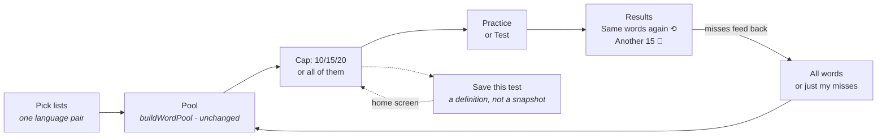
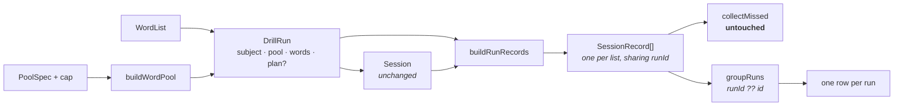

# Quickstart: 011-test-builder

## What it is

Pick several lists — or just the words you keep getting wrong across them — cap it at 15 drawn at
random, and drill it in **Practice** or **Test**. The run remembers exactly which words it used, so
you can do those same words again or draw a fresh fifteen. Give it a name and it lands on your home
screen as a **saved test** you can run every week.

## In one picture



## The fourteen decisions

| | |
|---|---|
| **D-1 A new "Build a test" screen** | The per-list ready screen is untouched. |
| **D-2 Practice or Test** | The drill already routes on mode; the second button costs one line. |
| **D-3 One record PER CONTRIBUTING LIST**, sharing a `runId` | So `collectMissed` is not touched at all. |
| **D-4 Group key is `runId ?? id`** | Every record ever written is a group of one. No migration. |
| **D-5 A test is a saved DEFINITION** | Run it in March and it means what your March mistakes are. |
| **D-6 Two re-runs, two meanings** | Results re-draws the **snapshot**; a saved test rebuilds from **live** lists. |
| **D-7 `practising` carries a `DrillRun`, not a `WordList`** | There is no honest single list, and a synthetic one would be dangerous. |
| **D-8 `DrillSubject` is `{name, col1Lang, col2Lang}`** | A `WordList` satisfies it, so widening the cards is type-only. |
| **D-9 One record path, not two** | A list drill is a run whose pool is that list, and stores what it always did. |
| **D-10 `count: number \| null`** | `null` = "all of them, however many that is later". |
| **D-11 A capped sample records as `'full'`** | An unbiased sample is not a harder subset. |
| **D-12 `PoolPicker` is shared** | The rule it renders already lives in one module; the copy is props. |
| **D-13 Saved tests do not migrate to an account** | The migrate prompt is per-list shaped; a later addition is pure. |
| **D-14 An invariant checks the purge covers every collection** | Because it currently does not — see below. |

## A bug found on the way

`purgeUserData` deletes `lists` and `sessions`. **It does not delete `games`.** 008 added that
collection three commits ago and did not add the line, and nothing failed: "delete my account"
returns ok, and every game record stays in Firestore under a uid that can never sign in again —
so nobody can ever reach it to delete it.

Task 17 fixes it. Task 27 adds the guard that would have caught it.

## The one thing this feature is really about

A drill stops being a list and becomes a **run**:



`words` is the ask's *"make sure the practice itself knows which words you tried"* — the drawn
words with their origin list. It is what lets a fifteen-word test over three lists file each miss
against the list it actually came from.

## The three things most likely to go wrong

**1 · Double counting.** Any reader of `records` that forgets to group inflates the average and
shows one test three times. Silent, plausible-looking, and exactly what the `groupKey` invariant
is for.

**2 · The number box.** Its state is a raw **string** because a clamped controlled number input
cannot be cleared — type "4" over "10" and you get 104. Moving it into `PoolPicker` is the moment
someone "simplifies" it. The comment moves with the code, and the picker's suite tests it directly.

**3 · iOS silence.** Two new start buttons. Each must call `speak` **inside its own tap handler**.
Speech that does not descend from a gesture is dropped silently, on one platform, and no test in
this suite can see it.

## Files

**New — pure**

| File | Holds |
|---|---|
| `src/state/drillRun.ts` | `DrillSubject` · `TestPlan` · `DrillRun` · `runFromList` · `runFromPool` · `redraw` · `canRedraw` · `runPairs` · `poolSubject` |
| `src/state/runGroup.ts` | `RunGroup` · `groupKey` · `groupRuns` |
| `src/state/testPlan.ts` | `SavedTest` · `MAX_TESTS` · `TEST_COUNT_CHIPS` · `describeTest` |

**New — elsewhere**

`src/storage/testRepo.ts` · `src/components/PoolPicker.tsx` · `TestSetup.tsx` · `SavedTests.tsx`
(+ a `.test.ts(x)` beside every file above)

**Changed — additive unless noted**

`state/types.ts` (+`runId`) · `state/sessionRecord.ts` (+`buildRunRecords`)
· `state/appMachine.ts` (**one screen, four actions, and `list` → `run` on two members**)
· `storage/drillRepo.ts` (**`list` → `run`, with coercion**) · `storage/types.ts` + all three stores
· `firestore.rules` + both rules suites · `auth/deleteAccount.ts` (**the games fix**)
· `components/TestCard` `StudyCard` `ResultsScreen` (**type-only widening**) · `ScoreHistory`
· `ReviewScreen` · `Home` · `NavMenu` · `App.tsx` · `test/invariants.test.ts` · `README.md`

**Not changed, deliberately:** `state/wordPool.ts` (NFR-1 — it was built for this caller) and
`state/missedWords.ts` (D-3).

## Constants

```
MAX_TESTS 50 · TEST_COUNT_CHIPS [10,15,20] · pvt.tests.v1 · users/{uid}/tests
```

## Commands

```bash
npm run typecheck && npm run lint && npm test   # the gate after every task
npm run test:rules                              # emulator + JDK 21+
npm run dev -- --host                           # so a phone can reach it
```

**Baseline:** 56 test files, 1085 tests green @ `main` `5aaae6b`. Expect 62 files.

## Order of work

1. **The spine** — `drillRun.ts` → widen the cards (type-only) → `practising`/`results` carry a run → `drillRepo`
2. **Records** — `runId` → `buildRunRecords` → write them → `groupRuns` → group the two history screens
   · **← checkpoint: every existing test green, no behaviour changed**
3. **Storage** — `testPlan` → `testRepo` → `ListStore` → three stores → rules → **the purge fix**
4. **Reducer** — `testSetup`, `OPEN_TEST_SETUP` · `EDIT_TEST` · `START_RUN` · `RESTART_FRESH_DRAW`
5. **Screens** — extract `PoolPicker` (its own commit) → `TestSetup` → `SavedTests` → **Another N**
6. **Wiring** — `App`, `Home`, `NavMenu`, the end-to-end test
7. **Guards** — four invariants, README, **and the iPhone pass**

Full detail in [tasks.md](tasks.md). Why, in [plan.md](plan.md). What, in [spec.md](spec.md).
