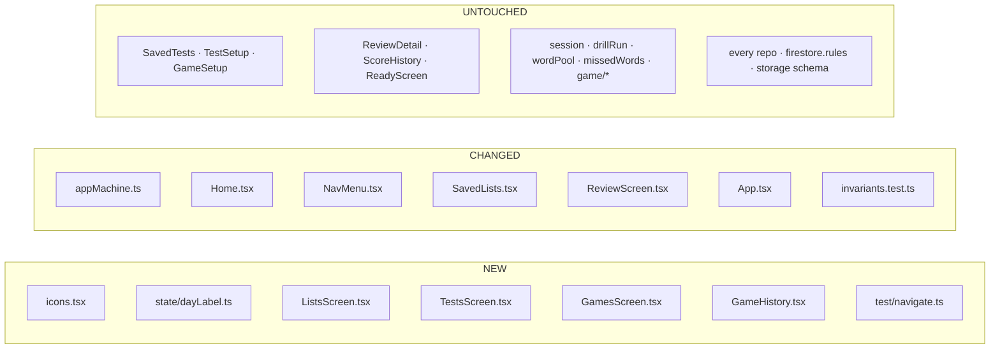

# Plan: 012-navigation-shell

**Spec:** `spec.md` · **Tasks:** `tasks.md`
**Baseline:** `main` @ `bdf73d4` — 64 test files, 1265 tests green
**Branch:** `feature/navigation-shell`

---

## Shape of the change



Nothing in `untouched` changes shape. `SavedTests`, `TestSetup`, `GameSetup` and `ReviewDetail`
move to a different parent and keep their props; the pure layer and the whole storage layer are not
opened at all.

---

## A. `src/components/icons.tsx` — NEW

Five stroked glyphs on a 24×24 grid, one shared wrapper.

```tsx
import type { ReactNode } from 'react'

/**
 * The menu's and the brief's icons.
 *
 * Inline SVG rather than a library or emoji (012 D-7). `1em` and `currentColor` are the
 * whole design: an icon then inherits the type scale and the theme token of whatever it
 * sits inside, so there is no second palette to keep in sync with 007's tokens and no
 * dark-mode variant to forget.
 *
 * Every one is `aria-hidden` and every one has a text label beside it. Nothing here is
 * ever the only carrier of meaning (012 NFR-5).
 */
function Glyph({ children }: { children: ReactNode }) {
  return (
    <svg
      viewBox="0 0 24 24"
      width="1em"
      height="1em"
      fill="none"
      stroke="currentColor"
      strokeWidth={2}
      strokeLinecap="round"
      strokeLinejoin="round"
      aria-hidden="true"
      focusable="false"
      className="shrink-0"
    >
      {children}
    </svg>
  )
}

export const HomeIcon = () => (
  <Glyph><path d="M3 10.5 12 3l9 7.5" /><path d="M5 9.5V21h14V9.5" /></Glyph>
)

export const ListsIcon = () => (
  <Glyph><path d="M8 6h13M8 12h13M8 18h13" /><path d="M3 6h.01M3 12h.01M3 18h.01" /></Glyph>
)

export const TestsIcon = () => (
  <Glyph>
    <path d="M9 3h6v3H9z" />
    <path d="M8 4.5H6a1 1 0 0 0-1 1V20a1 1 0 0 0 1 1h12a1 1 0 0 0 1-1V5.5a1 1 0 0 0-1-1h-2" />
    <path d="m9 13 2 2 4-4" />
  </Glyph>
)

export const GamesIcon = () => (
  <Glyph>
    <path d="M17 6H7a5 5 0 0 0-5 5v2a5 5 0 0 0 5 5h10a5 5 0 0 0 5-5v-2a5 5 0 0 0-5-5z" />
    <path d="M6 12h4M8 10v4" /><path d="M16 11h.01M18 14h.01" />
  </Glyph>
)

export const PracticesIcon = () => (
  <Glyph><path d="M3 21h18" /><path d="M7 21v-6M12 21v-11M17 21v-8" /></Glyph>
)
```

`shrink-0` matters: these sit in flex rows next to text that can wrap, and without it the glyph
squashes on a narrow phone.

---

## B. `src/state/dayLabel.ts` — NEW (extracted)

Moved verbatim out of `ReviewScreen.tsx`, comment and all (D-10). `ReviewScreen` imports it;
`GameHistory` imports it. Nothing about it changes.

```ts
/**
 * 'Today' / 'Yesterday' / an en-GB date.
 *
 * Compares LOCAL MIDNIGHTS rather than elapsed milliseconds. 23:30 yesterday and 00:30
 * today are an hour apart and two different days, and subtracting raw time would file
 * them together.
 *
 * Deliberately a different notion of time from `missedWords.ts`, whose windows roll from
 * `now`. A heading is a calendar idea; a window is a duration. Do not unify them.
 */
export function dayLabel(ms: number, now: number): string {
  const startOf = (t: number) => new Date(t).setHours(0, 0, 0, 0)
  const days = Math.round((startOf(now) - startOf(ms)) / 86_400_000)
  if (days === 0) return 'Today'
  if (days === 1) return 'Yesterday'
  return new Date(ms).toLocaleDateString('en-GB')
}

/** Fold rows into day buckets in the order given, which must already be newest-first. */
export function byDay<T>(rows: readonly T[], at: (row: T) => number, now: number)
  : Array<{ label: string; rows: T[] }> {
  const days: Array<{ label: string; rows: T[] }> = []
  for (const row of rows) {
    const label = dayLabel(at(row), now)
    const last = days[days.length - 1]
    if (last && last.label === label) last.rows.push(row)
    else days.push({ label, rows: [row] })
  }
  return days
}
```

`byDay` is the loop `ReviewScreen` currently writes inline ([ReviewScreen.tsx:78-84](src/components/ReviewScreen.tsx#L78-L84)).
Extracting it too is what keeps the game history from growing a second, subtly different bucketing
loop — the failure mode D-10 exists to prevent.

---

## C. `src/state/appMachine.ts` — CHANGED

### C.1 Three new states, one widened

```ts
  | { screen: 'home' }
  /**
   * The three section screens (012).
   *
   * Stateless, deliberately: what each one shows is derived in `App` from the live
   * subscriptions, exactly as `home` already derived its lists. A section that carried a
   * snapshot would go stale the moment another tab wrote.
   */
  | { screen: 'lists' }
  | { screen: 'tests' }
  | { screen: 'games' }
  | {
      screen: 'review'
      /**
       * Seeds the list filter when arriving from a list's practice line (012 FR-5).
       *
       * A SEED, not the filter: the filter's own state stays in the component, the same
       * rule `testSetup.initial` and `gameSetup.initial` follow. Absent means "all lists",
       * which is what arriving from the menu means.
       */
      listId?: string
    }
```

### C.2 Actions

```ts
  | { type: 'OPEN_LISTS' }
  | { type: 'OPEN_TESTS' }
  | { type: 'OPEN_GAMES' }
  | { type: 'OPEN_REVIEW'; listId?: string }   // widened, additively
```

### C.3 Cases

The three new ones are legal from anywhere, exactly as `OPEN_REVIEW`, `OPEN_GAME` and
`OPEN_TEST_SETUP` already are — the confirm lives in `NavMenu` because a pure reducer must not open
a dialog.

```ts
    case 'OPEN_LISTS':
      return { screen: 'lists' }
    case 'OPEN_TESTS':
      return { screen: 'tests' }
    case 'OPEN_GAMES':
      return { screen: 'games' }

    case 'OPEN_REVIEW':
      // The seed is spread rather than assigned, so an action without one produces a
      // state without the key at all — `exactOptionalPropertyTypes` is on.
      return { screen: 'review', ...(action.listId !== undefined && { listId: action.listId }) }
```

Two existing cases move:

```ts
    case 'CANCEL_EDIT':
      // My lists, not home: that is where the editor was opened from (012 D-8).
      return state.screen === 'editing' ? { screen: 'lists' } : state

    case 'START_RUN':
      // `tests`, not `home` — the saved-tests list moved (012 D-9). Guarding named screens
      // rather than "anywhere" is still the point: a run must not start on top of a drill
      // or a game already in flight.
      if (state.screen !== 'testSetup' && state.screen !== 'tests') return state
```

`GO_HOME` is unchanged and still means the brief. Everything else in the reducer is untouched.

---

## D. `src/components/Home.tsx` — REWRITTEN

Props shrink from eleven to six. Home no longer takes `lists`, nor any list action, nor a history
slot, nor a saved-tests slot.

```tsx
interface Props {
  /** Slot for account-level notices, e.g. the migration offer. Stays at the front door. */
  banner?: ReactNode
  /** True while we do not yet know whose data this is — the brief then says nothing definite. */
  loading?: boolean
  brief: Brief
  onLists: () => void
  onTests: () => void
  onGames: () => void
  onPractices: () => void
}

export interface Brief {
  lists: number
  tests: number
  /** The newest RUN, folded — never a raw record (012 D-6). */
  lastPractice: { label: string; right: number; total: number; pct: number } | null
  lastGame: { label: string; correct: number; asked: number } | null
}
```

Body: banner, `<h1>`, the at-a-glance paragraph, then a `<nav>` of four cards.

```tsx
const card = (icon: ReactNode, label: string, hint: string, go: () => void) => (
  <button type="button" onClick={go} className="btn btn-quiet btn-lg justify-start gap-3">
    {icon}
    <span className="flex flex-col items-start">
      <span>{label}</span>
      <span className="text-sm font-normal text-ink-muted">{hint}</span>
    </span>
  </button>
)
```

Hints are counts, not prose: *"3 lists"*, *"2 saved"*, *"12 rounds"*, *"18 runs"*. While `loading`,
every hint is empty rather than `0` — the `SavedLists` rule (NFR-2 of 003, restated in FR-2).

---

## E. The three section screens — NEW

Each is thin on purpose: a heading, a primary action, and an existing component.

```tsx
// ListsScreen.tsx
export function ListsScreen({ onNewList, ...listProps }: Props) {
  return (
    <section className="mx-auto flex max-w-xl flex-col gap-4 p-4">
      <h1 className="text-2xl font-semibold">My lists</h1>
      <button type="button" onClick={onNewList} className="btn btn-primary btn-lg">
        New list
      </button>
      <SavedLists {...listProps} />
    </section>
  )
}
```

`TestsScreen` is the same with `Build a test` and `<SavedTests>`; `GamesScreen` the same with
`Play a game` and `<GameHistory>`. The `max-w-xl … p-4` container matches every other screen so the
settings slot above stays aligned with the content edge.

`SavedTests` and its props are passed straight through from `App`, unchanged — including
`count={testPoolSize}`, which is where NFR-4's single `now` comes from.

---

## F. `src/components/GameHistory.tsx` — NEW

The only genuinely new rendering in this feature.

```tsx
interface Props {
  games: readonly GameRecord[]
  loading?: boolean
}

/**
 * A read-only log of finished games.
 *
 * Everything shown comes from the record itself — `listNames` is denormalised for exactly
 * this reason, so a round survives its lists being deleted. Shaped on `ReviewScreen`'s day
 * grouping and reusing its `byDay`, so the two logs cannot drift apart on what "Yesterday"
 * means (012 D-10).
 *
 * NOT grouped by run: a game IS one record. There is no `groupRuns` here because there is
 * nothing to fold — which is precisely why the invariant naming the history surfaces lists
 * this file separately rather than requiring it.
 */
```

- Sorted `finishedAt` descending **explicitly**, then `byDay`. `groupRuns` sorts for the drill
  surfaces; nothing sorts for games, so this file must.
- Row label: `[...new Set(record.listNames)]` joined — one name, or `"N lists"`, matching
  `runLabel`'s rule so the two logs read the same.
- Row score: `{correct} / {asked}`, then `· {points} pts`, then `· stopped early` when `partial`.
- Three states, like `SavedLists` and `ReviewScreen`: loading, empty, populated. "No games yet"
  shown mid-load reads as data loss.

No `bandBorder`: `scoreBand` takes `{ right, total, pct }` and a `GameRecord` has none of those
names. Making one satisfy the other structurally would mean renaming a stored field. Not worth it;
the numbers are right there.

---

## G. `src/components/SavedLists.tsx` — CHANGED

One optional prop pair, and one line in the row.

```tsx
  /**
   * This list's practice history, or null when it has none.
   *
   * Supplied by `App` from ONE computation over all lists (012 NFR-4), and computed by
   * filtering to the list and THEN grouping — the rule ReviewScreen documents, and the
   * only rule that gives a multi-list run one entry per list rather than one per record
   * (012 D-5).
   *
   * Optional, and the line renders only when both this and `onOpenPractices` are supplied:
   * several tests render SavedLists directly, the same rule `onSeeAllHistory` follows.
   */
  practices?: (listId: string) => { count: number; lastPct: number } | null
  onOpenPractices?: (list: WordList) => void
```

In the row, between the meta line and the button row:

```tsx
{summary && onOpenPractices && (
  <button
    type="button"
    onClick={() => onOpenPractices(list)}
    className="mt-1 text-sm text-primary underline"
  >
    {summary.count} {summary.count === 1 ? 'practice' : 'practices'} · last {summary.lastPct}%
  </button>
)}
```

A `<button>`, not a link: there is no URL to go to (D-12), and a link with no `href` is not
reachable by keyboard.

---

## H. `src/components/NavMenu.tsx` — CHANGED

Props go from four callbacks to five; the popover body gains icons and a section-aware
`aria-current`. Everything about the open/close behaviour, the `pointerdown` listener, the Escape
handling and the `CONFIRM` map is untouched, **including the comment explaining why this popover is
deliberately not shared with `AccountMenu`.**

```tsx
/** Which section a screen belongs to, for `aria-current` (012 FR-10). */
type Section = 'home' | 'lists' | 'tests' | 'games' | 'practices'

const SECTION: Partial<Record<AppState['screen'], Section>> = {
  home: 'home',
  lists: 'lists',
  editing: 'lists',
  ready: 'lists',
  tests: 'tests',
  testSetup: 'tests',
  games: 'games',
  gameSetup: 'games',
  playing: 'games',
  gameResults: 'games',
  review: 'practices',
  reviewDetail: 'practices',
  /*
   * `practising` and `results` are deliberately absent, and absent is the answer rather
   * than a gap: a drill can be reached from a list OR from a saved test, so there is no
   * honest section to mark. Marking one would tell the user they are somewhere they may
   * not be.
   */
}
```

The item renderer takes the icon:

```tsx
const item = (icon: ReactNode, label: string, section: Section, go: () => void) => (
  <button
    type="button"
    role="menuitem"
    {...(here === section ? { 'aria-current': 'page' as const } : {})}
    onClick={() => leave(go)}
    className={`btn btn-quiet w-full justify-start gap-2 border-0 bg-transparent ${
      here === section ? 'font-semibold text-primary' : ''
    }`}
  >
    {icon}
    {label}
  </button>
)
```

The trigger keeps its accessible name `Menu` — the end-to-end suites find it by `/^menu$/i` and,
more importantly, an icon-only trigger would violate NFR-5. A hamburger glyph goes **beside** the
word.

---

## I. `src/App.tsx` — CHANGED

### I.1 The per-list summary

One memo, one pass, feeding both `SavedLists` and the brief.

```tsx
/**
 * Each list's practice history, folded correctly.
 *
 * Bucketed by `listId` FIRST and grouped SECOND (012 D-5). A run over three lists writes
 * three records sharing a `runId`; grouping first would have to decide which list the run
 * "belongs to", and counting raw records would report three practices for one test — a
 * wrong number that looks entirely plausible and that nobody would report.
 *
 * One pass for every list, so eight rows cannot disagree (012 NFR-4).
 */
const practiceByList = useMemo(() => {
  const buckets = new Map<string, SessionRecord[]>()
  for (const record of visibleRecords) {
    const bucket = buckets.get(record.listId)
    if (bucket) bucket.push(record)
    else buckets.set(record.listId, [record])
  }
  const out = new Map<string, { count: number; lastPct: number }>()
  for (const [listId, records] of buckets) {
    const runs = groupRuns(records)
    const newest = runs[0]
    if (newest) out.set(listId, { count: runs.length, lastPct: newest.pct })
  }
  return out
}, [visibleRecords])

const practicesFor = useCallback(
  (listId: string) => practiceByList.get(listId) ?? null,
  [practiceByList],
)
```

### I.2 The brief

```tsx
const brief = useMemo((): Brief => {
  const newestRun = groupRuns(visibleRecords)[0] ?? null
  const newestGame = [...visibleGames].sort((a, b) => b.finishedAt - a.finishedAt)[0] ?? null
  return {
    lists: visibleLists.length,
    tests: visibleTests.length,
    lastPractice: newestRun && {
      label: runLabel(newestRun),
      right: newestRun.right,
      total: newestRun.total,
      pct: newestRun.pct,
    },
    lastGame: newestGame && {
      label: gameLabel(newestGame),
      correct: newestGame.correct,
      asked: newestGame.asked,
    },
  }
}, [visibleLists, visibleTests, visibleRecords, visibleGames])
```

`gameLabel` is `GameHistory`'s row-label helper, exported from that file so the brief and the log
cannot disagree about what a two-list round is called.

### I.3 Routing

`{state.screen === 'home' && <Home … />}` shrinks to the six props above. Three new blocks appear
for `lists`, `tests` and `games`, and the `SavedTests` block moves into the `tests` one verbatim —
including its rename prompt, its delete confirm and its `onRun` wiring, none of which change.

`ReviewScreen` gains `initialListId={state.listId}` and `onHome` still dispatches `GO_HOME`.

The back destinations (D-8) are one-line changes at four call sites:

| Screen | Prop | Was | Becomes |
|---|---|---|---|
| `ListEditor` | `onCancel` | `CANCEL_EDIT` → home | `CANCEL_EDIT` → `lists` (in the reducer) |
| `ReadyScreen` | `onBack` | `GO_HOME` | `OPEN_LISTS` |
| `TestSetup` | `onBack` | `GO_HOME` | `OPEN_TESTS` |
| `GameSetup` | `onBack` | `GO_HOME` | `OPEN_GAMES` |
| `ResultsScreen` | `onDone` | `GO_HOME` | unchanged |
| `GameResults` | `onDone` | `GO_HOME` | unchanged |

`TestSetup.onNewList` and `GameSetup.onNewList` keep dispatching `NEW_LIST` — the editor is reached
from there directly and cancelling it lands on My lists, which is where the new list would be.

---

## J. `src/test/navigate.ts` — NEW

```ts
/**
 * Reach a section the way a user does.
 *
 * Through the real menu rather than a shortcut into the reducer (012 D-11): ~30 end-to-end
 * tests used to find a saved list on the home screen, and rewriting each one's path by hand
 * would produce thirty slightly different paths and quietly stop testing the navigation
 * they now depend on.
 *
 * Two forms because the suites drive events two ways: `App.game.test.tsx` runs under fake
 * timers and uses `fireEvent`, because userEvent drives timers of its own and the two
 * deadlock. That is documented at the top of that file and is not negotiable here.
 */
export async function goTo(user: UserEvent, section: Section): Promise<void>
export function goToSync(section: Section): void
```

Both find the trigger by `/^menu$/i` and the item by `role: 'menuitem'` with an exact-name regex.

---

## K. `src/test/invariants.test.ts` — CHANGED

Two additions, both extending guards that already exist.

1. **`routes both history surfaces through groupRuns`** becomes **`routes every drill-history
   surface through groupRuns`**, and gains `App.tsx` — which is where the per-list fold now lives.
   The existing `lets no component reach for runId directly` guard already covers the new screens
   for free.
2. **A new guard: no component imports an icon library, and no icon is rendered without a label.**
   The cheap, honest version of the second half is a source check that `icons.tsx` contains
   `aria-hidden` on its single `<svg>` and that no `.tsx` outside it declares an inline `<svg`.

---

## What is explicitly NOT touched

`session.ts`, `drillRun.ts`, `wordPool.ts`, `missedWords.ts`, `sessionRecord.ts`, `runGroup.ts`,
`scoreBand.ts`, the whole `game/` directory, every repo in `storage/`, `firestore.rules`, and every
`auth/` file. If a diff in this feature reaches any of them, something has gone wrong: this is a
shell change, and the shell is `App.tsx`, `appMachine.ts` and `components/`.
