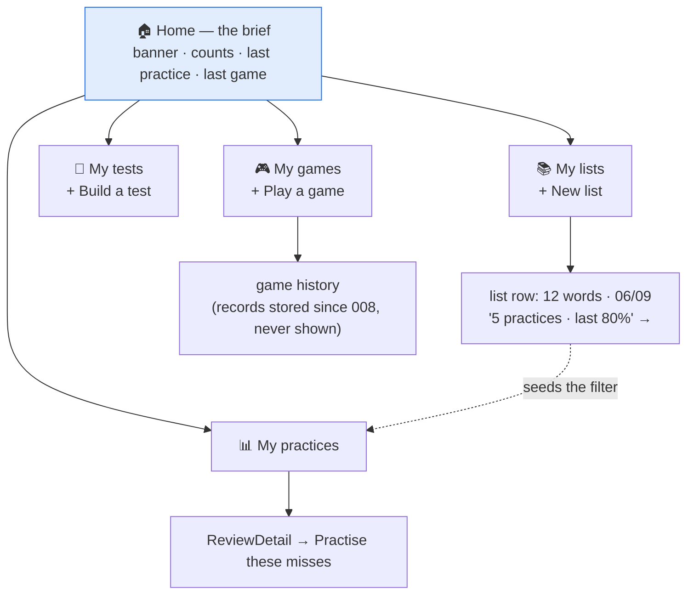

# Quickstart: 012-navigation-shell

**TL;DR** — Home becomes a brief. Four named sections behind an icon'd menu. Game history finally
gets shown. Nothing in storage changes.

---

## The whole thing in one picture



---

## Before → after

| | Before | After |
|---|---|---|
| **Home** | banner, 3 verbs, Saved lists, Saved tests, Recent practice, See all | banner, title, at-a-glance, 4 cards |
| **Menu** | Home · Review · Build a test · Play a game (text) | Home · My lists · My tests · My games · My practices (icons) |
| **New list** | home | My lists |
| **Build a test** | home + menu | My tests |
| **Play a game** | home + menu | My games |
| **Game history** | *nowhere* | My games |
| **A list's practices** | *nowhere* | a line on its row → filtered My practices |

---

## The three things most likely to bite

1. **`START_RUN`'s guard.** It allows `testSetup` and `home` today because saved tests are run from
   home. They move to `tests`; the guard must move with them. This exact guard already made the Run
   button a silent no-op once in 011, caught only end-to-end. → **Task 3**, spec **D-9**.

2. **Counting practices per list.** A test over three lists writes three records sharing a `runId`.
   Count the records and one test shows as three practices — wrong, plausible, silent. Bucket by
   `listId` **first**, then `groupRuns`. → **Task 10**, spec **D-5/D-6**.

3. **Test churn hiding a regression.** ~30 end-to-end tests open with `renderApp()` then click
   Practise, because the list is on home. One `goTo` helper, one inserted line per test, nothing
   else. Anything else in that diff is a real break. → **Tasks 13–14**, spec **D-11**.

---

## Ground rules

- **No new dependency.** Icons are five inline SVGs, `1em`, `currentColor`, `aria-hidden`, always
  beside a text label. `check:bundle` stays green.
- **No storage change.** No collection, no schema bump, no new field. This feature only *reads*.
- **`role="menu"` stays.** `TestCard`/`StudyCard` bind `Y`/`N` on `window` and stand down only while
  a menu or dialog exists. Remove it and typing `n` mid-drill marks the card wrong.
- **Back goes to the owning section. "Done" goes home.** One rule, no history stack, no router.
- **`review` keeps its screen id.** Only the copy becomes "My practices".

---

## Order of work

| Phase | Tasks | Ends with |
|---|---|---|
| 1 Foundations | 1–4 | icons, `dayLabel`, reducer, test helper |
| 2 Sections | 5–8 | three screens, game history, the list practice line, a seeded filter |
| 3 Brief | 9–10 | Home rewritten, the fold in `App` |
| 4 Menu | 11 | five icon'd sections with `aria-current` |
| 5 Wiring | 12–15 | **checkpoint: whole suite green** |
| 6 Guards | 16–18 | invariants, README, device pass |

Phases 1–2 parallelise widely; Phase 5 is the gate.

---

## Commands

```bash
npm run typecheck        # tsc -b --noEmit
npm run lint             # oxlint
npm test                 # vitest run — 1265 green at baseline bdf73d4
npm run check:bundle     # build + size guard
npm run dev              # vite --host, for the device pass
```
