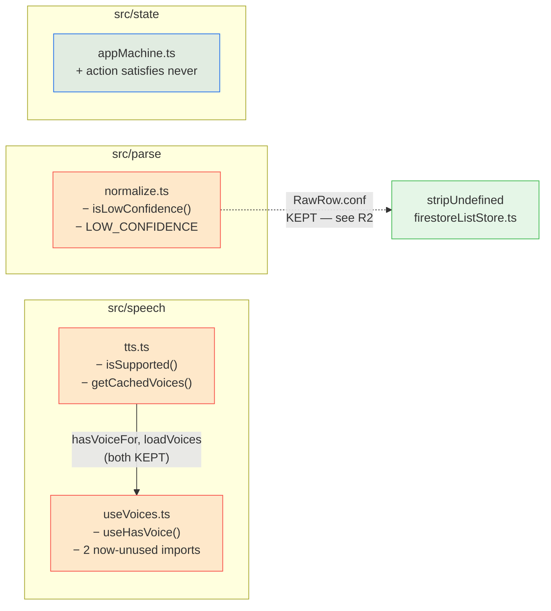

# Plan: 014-dead-code-removal

**Spec:** [spec.md](./spec.md) · **Tasks:** [tasks.md](./tasks.md)

Four files, six symbols, one commit each. Five of the six edits are pure subtraction; the sixth
(A5) adds a type-level assertion and no runtime code.

---

## Shape of the change



Only one edge between edited files: `useVoices.ts` imports from `tts.ts`. Both symbols it keeps
(`loadVoices`) and drops (`hasVoiceFor`) survive in `tts.ts` — **`hasVoiceFor` is not being deleted**,
only `useVoices.ts`'s now-pointless import of it. Confusing the two would break `App.tsx`.

---

## A — `src/speech/tts.ts` (FR-1, FR-2)

Delete two exports and their doc comments:

- **lines 23-26** — the `/** True when the browser can speak at all. */` comment and `isSupported()`.
- **lines 60-63** — the `/** The voices most recently loaded… */` comment and `getCachedVoices()`.

**Keep** `let cachedVoices` (line 17), `synth()` (lines 19-21) and the module header comment (lines
3-15). `cachedVoices` is written by `loadVoices` (lines 40, 51) and read by `effectiveVoices`
(line 73); `synth()` is called from `loadVoices`, `effectiveVoices`, `cancel` and `speak`.

The header comment documents the three cross-browser workarounds and is unaffected — none of the
three is about capability detection.

## B — `src/speech/useVoices.ts` (FR-3, FR-3a)

Delete **lines 34-38** — the `/** Convenience for the missing-voice banner… */` comment and
`useHasVoice()`. Then repair two imports the deletion strands:

```ts
// before
import { useEffect, useState } from 'react'
import type { LangCode } from '../lang/languages'
import { hasVoiceFor, loadVoices } from './tts'

// after
import { useEffect, useState } from 'react'
import { loadVoices } from './tts'
```

`LangCode` and `hasVoiceFor` appear **only** in `useHasVoice`. With `noUnusedLocals: true` this is
mandatory — see R1.

## C — `src/parse/normalize.ts` (FR-4)

Delete **lines 3-4** (the `LOW_CONFIDENCE` comment and constant) and **lines 43-46** (the
`isLowConfidence` comment and function, and the file's trailing content).

`import type { RawRow } from './types'` (line 1) **stays** — `normalizeRows` and `isComplete` both
use it. Nothing else in the file is touched, `normalizeRows`'s `conf` passthrough at line 29 least
of all (FR-4a).

## D — `src/state/appMachine.ts` (FR-5)

```ts
    default:
      action satisfies never
      return state
  }
}
```

`return state` stays, so runtime behaviour is provably identical: `satisfies` is erased at compile
time, leaving `action;` as a no-op expression statement.

**Why this form and not the usual one.** The conventional exhaustiveness idiom —
`const _exhaustive: never = action` — declares a local that is never read and so trips
`noUnusedLocals: true`, which this repo has on. `satisfies` introduces no binding. It is also
type-only and fully erasable, satisfying `erasableSyntaxOnly: true`.

Verified on a scratch copy before this plan was written: typecheck and lint both clean, and an
unhandled variant yields `TS1360` on the `satisfies` line.

---

## E — Optional: two stale test comments (D-1)

Not required, contains no assertion change, and deliberately last so the preceding commits stay
provably assertion-neutral.

- [normalize.test.ts:61-62](src/parse/normalize.test.ts#L61-L62) — comment reads "…must never be
  treated as low-confidence", describing a helper that is gone. The property it names still matters
  (v1 never sets `conf`); reword to describe the field, not the deleted flag.
- [textParse.test.ts:112](src/parse/textParse.test.ts#L112) — the test *name* is
  `'never sets conf, so v1 rows are never flagged low-confidence'`. Rename to drop the second clause.

Both tests keep asserting exactly what they assert today.

---

## Risks

| ID | Risk | Why it bites | Mitigation |
|---|---|---|---|
| **R1** | Deleting `useHasVoice` alone breaks the build | `noUnusedLocals: true` turns the two stranded imports into typecheck **errors**, not warnings. The brief scopes A3 as "trivial (3 lines)" and it is 5. | Plan § B does both in one edit; Task 2 validates with `typecheck` before `test`. |
| **R2** | Someone extends the sweep to `RawRow.conf` | It reads as dead — after A4 nothing *consumes* the value, it is only passed through. But `stripUndefined`'s doc comment cites it by name as its reason to exist, and two tests pin the passthrough. Deleting it silently weakens the Firestore boundary's rationale. | FR-4a; spec § *Out of scope*; this row. |
| **R3** | Confusing `hasVoiceFor` with `useHasVoice` | Adjacent names, one line apart in `useVoices.ts`, and only one is dead. Deleting `hasVoiceFor` from `tts.ts` would break `App.tsx:608` and four assertions in `tts.test.ts`. | Plan § A/§ B state the keep-list explicitly; Task 2 re-runs `tts.test.ts` alongside. |
| **R4** | `default:` removed outright instead of annotated | TypeScript *does* accept an exhaustive switch with no `default`, so this compiles — and then the reducer throws away its "illegal transition is a no-op by reference" contract the moment a variant is added. | FR-5 keeps `return state`; Task 4's negative check proves the guard fires. |
| **R5** | A silent behavioural change hides in a green suite | Every edit here is subtractive, so a passing suite is weak evidence on its own. | NFR-2 pins the count at **1417 in 71 files**. Any other number is a finding, not a pass. |

---

## Validation gates

```bash
npm run typecheck     # tsc -b --noEmit — catches R1 and R4
npm run lint          # oxlint
npm test              # must report 71 files / 1417 tests
npm run check:bundle  # NFR-4 regression check
```

`npm run test:rules` needs the Firestore emulator and a JRE, and nothing here touches
`firestore.rules` or any storage adapter — **not required**.

**On coverage:** `vite.config.ts` scopes coverage to `src/parse/**`, `src/speech/**`,
`src/storage/**`, `src/state/**` — which is exactly where these deletions land. Removing uncovered
lines will *raise* the reported percentage. No thresholds are configured, so no gate moves either
way; the shift is an artifact, not a result.
