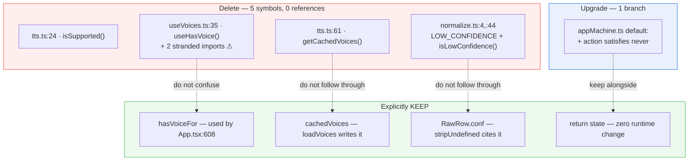

# Quickstart: 014-dead-code-removal

**TL;DR** — Delete six symbols across four files. Keep `RawRow.conf`. Turn the reducer's dead
`default:` into a compile-time exhaustiveness check. No test assertion changes; the count stays
at **1417**.

---

## The whole thing in one picture



---

## Before → after

| | Before | After |
|---|---|---|
| `tts.ts` exports | 7 | 5 |
| `useVoices.ts` exports | 2 + 1 type | 1 + 1 type |
| `normalize.ts` exports | 4 | 3 |
| A new unhandled `AppAction` | silent no-op | **compile error `TS1360`** |
| `RawRow.conf` | live passthrough | live passthrough *(unchanged)* |
| Tests | 1417 / 71 files | **1417 / 71 files** |

---

## The three things most likely to bite

1. **`useHasVoice` is not a 3-line delete — it is 5, and the other 2 are mandatory.**
   `useVoices.ts` imports `LangCode` and `hasVoiceFor` *only* for that function. With
   `noUnusedLocals: true`, deleting the function alone **fails `npm run typecheck`**.
   → **Task 2**, plan **R1**.

2. **`hasVoiceFor` ≠ `useHasVoice`.** Adjacent names, one line apart, and only one is dead. Deleting
   `hasVoiceFor` from `tts.ts` breaks `App.tsx:608` and four assertions in `tts.test.ts`.
   → **Task 2**, plan **R3**.

3. **`RawRow.conf` will look like the next obvious deletion after Task 3. It is not.**
   Once the flag helpers go, nothing *consumes* a `conf` value — it is pure passthrough. But
   `stripUndefined`'s doc comment names `RawRow.conf` as the reason it exists, and two tests pin the
   passthrough. Deleting it quietly weakens the Firestore boundary's rationale.
   → **FR-4a**, plan **R2**.

---

## Ground rules

- **No test file is opened in Tasks 1-4.** Task 5 (optional, last, own commit) fixes two stale
  comments and one test *name* — no `expect` changes anywhere.
- **1417 is the acceptance number.** Fewer means a file stopped loading; more means someone added a
  test nothing asked for. Either way, read the diff.
- **One commit per task**, so any of six small deletions can be reverted alone.
- **`satisfies never`, not `const _exhaustive: never`.** The latter trips `noUnusedLocals`.
- **Cut from `main`.** 013 merged as #14 (`9d18873`) between planning and execution, so the brief's
  `App.tsx:685` and `appMachine.ts:519` **are** `main`'s line numbers. The `:608`/`:509` variants the
  plan warned about applied to the pre-merge `main` only.

---

## Run it

```bash
git checkout main && git checkout -b chore/dead-code-removal

# Tasks 1-3 (independent, any order)   → npm run typecheck && npx vitest run <touched tests>
# Task 4  (+ verify the guard fires)   → npm run typecheck && npm run lint
# Task 5  (optional prose)             → npx vitest run src/parse/*.test.ts

# Final gate
npm run typecheck && npm run lint && npm test && npm run check:bundle
git diff --stat main    # expect 4 files, or 6 with Task 5 — actual: +16/-29
```

`npm run test:rules` is **not needed** — no `firestore.rules` or storage-adapter change.

---

## Files

| Artifact | What's in it |
|---|---|
| [spec.md](./spec.md) | The reference audit (all six symbols verified `grep`-clean), FR/NFR, the two deviations from the brief, branching |
| [plan.md](./plan.md) | Exact edits per file, why `satisfies` is the only form that works here, 5 risks |
| [tasks.md](./tasks.md) | 6 tasks, gotchas, VALIDATE commands, task→requirement map |
