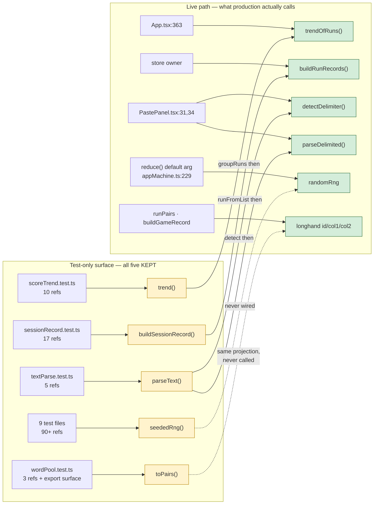

# Plan: 015-stale-comment-repair

**Spec:** [spec.md](./spec.md) · **Tasks:** [tasks.md](./tasks.md) · **TL;DR:** [quickstart.md](./quickstart.md)
**Baseline:** `main` @ `27dc31c` — 1417 tests / 71 files green, `typecheck` + `lint` clean
**Approach:** comment-only. Six files, seven commits, zero lines of logic.

---

## The shape of the problem

Every one of the five is a **test-only entry point that composes over live primitives**. That is a
legitimate pattern — the composed function is the seam where a contract can be pinned as a whole —
and it is exactly the pattern that rots into a false comment, because the comment was written when
the composed form *was* the live path.

Read the dotted edges: `toPairs` and `seededRng` are the two with **no composition relationship at
all** to the live path — a duplicate projection and an unwired injectable. They are the two whose
comments are furthest from the truth, and B5 is the one the brief cleared.

---

## Per-item technical approach

### A · B1 — `src/state/scoreTrend.ts` + `src/components/Home.tsx` (FR-1, FR-1a)

The defect is an **inverted comment weight**: 16 lines of contract on `trend` (0 prod callers), one
line on `trendOfRuns` (the live path). Reword-in-place cannot fix that.

**Move**, don't rewrite: the four contract paragraphs (full-runs-only, runs-not-records, null-below-two,
the 012/`ScoreHistory` provenance) go onto `trendOfRuns` verbatim except for one clause — "`groupRuns`
is the one place that folding happens" gains "callers that hold records reach this through `trend`
above", because after the move that sentence sits below `groupRuns`'s only caller rather than above it.

`trend` then gets a short block: no production caller, and the keep-reason — it is the **only** seam
that pins folding and averaging together, which is what catches the three-records-per-run
double-count (011 D-3). Verbatim text in [tasks.md](./tasks.md) T1.

`Home.tsx:128` is a one-symbol swap plus a pointer at where `average` comes from.

### B · B2 — `src/state/sessionRecord.ts` + `src/game/gameRecord.ts` (FR-2, FR-2a, FR-2b)

The only **outright false statement** in the change: "Kept because 002, 006 and 008 all call it."
011 re-expressed this function through `buildRunRecords` and moved those three callers with it; the
comment was not updated. Replaced with the suite reason and the line number of the assertion that
carries it (`sessionRecord.test.ts:171`).

`gameRecord.ts:9` is one word — `buildSessionRecord` → `buildRunRecords`. Same commit: it is the
same fact about the same pair of functions, and splitting it would leave the repo in a state where
one comment says the live precedent is the dead twin.

### C · B3 — `src/parse/textParse.ts` (FR-3)

The comment is accurate and still misleading, so the repair is **additive**: keep both existing
sentences, append why the obvious caller is not one. This is the only item where the comment must
prevent a future *edit* rather than a future *deletion* — "PastePanel does two calls where one
would do" is a plausible-looking simplification that silently breaks the delimiter select and the
confidence hint:

| What the panel renders | Where from | What `parseText(text, override)` returns |
|---|---|---|
| the auto-detected delimiter in the select | `detection.delimiter` (PastePanel.tsx:77) | `override` — the detection is gone |
| "best guess matched N% of lines, below the M% we need" | `detection.confidence` (PastePanel.tsx:103-108) | `1`, unconditionally |

Second, structural reason: the panel holds two `useMemo`s with **different dependency sets** —
`detection` on `[text]`, `rows` on `[text, active]`. `parseText` fuses them, so changing the
delimiter would re-run detection for a value the panel throws away.

### D · B4 — `src/state/wordPool.ts` (FR-4)

Not a stale comment so much as a **missing provenance**. 008's spec § *Out of scope* records the
convergence this function was written for ("`toDrillPairs` becomes `toPairs`"), deferred so 006's
untouched suite could stay the regression net for the `MissSource` widening. That follow-up never
landed, so `toPairs` has been waiting for its caller since 008 while two other sites wrote the same
projection out longhand: `runPairs` (drillRun.ts:142), body-identical, and `buildGameRecord`
(gameRecord.ts:87), per item inside its loop.

The repaired comment states all of it and ends with a directive — route the next caller through
this one rather than writing a fourth copy — which converts a dead export into a designated
convergence point. It also records the export-surface assertion, so a future dead-code sweep sees
the test cost before it starts.

> **Corrected during execution (spec O-4).** This section first listed `runFromList`
> (drillRun.ts:77) as a third copy. It is not: it projects `WordPair → PooledWord` and **adds** the
> origin — the inverse of `toPairs`. The landed comment names that exclusion, because drillRun.ts:77
> is precisely the line a reader would otherwise try to "converge".

### E · B5 — `src/state/session.ts` (FR-5, FR-5a) — the brief's exception

Evidence, all three checks in § *Verification*: `grep` (0 prod refs), the reducer's default argument
(`randomRng`), and `git log -S` (one commit, the first — never true, not left behind).

The clause "which wants a fresh order each time but no cryptographic quality" is not deleted; it is
**relocated onto `randomRng`**, which is what it describes. `seededRng` gains the inverse warning:
a seeded restart deals the same order twice.

---

## Risks and how each is closed

| ID | Risk | Mitigation |
|---|---|---|
| **R1** | **A comment edit becomes a code edit.** B1 moves a 16-line block between two adjacent functions; a slipped brace or a swapped body is a silent behaviour change with no failing test — both functions return `Trend \| null` and the wrong one still compiles. | Strip the comments from the `main` version and from the working version, then diff the remainder — see `tasks.md` § **COMMENT-ONLY**. **Materialised, and the original mitigation was itself wrong (spec O-1):** this cell first prescribed `git diff \| grep -vE '^[+-]\s*\*'`, which reported T1's *identical, re-anchored* declaration and body lines as changes. It cannot tell a moved block from a real edit — the one thing R1 needs told apart. Result across the seven files: 614 code lines, identical. |
| **R2** | **A new citation is wrong on arrival.** This change writes ~12 new file:line references. NFR-4 exists because a wrong one is the same defect being fixed. | Final gate re-resolves every citation with `sed -n` before commit (tasks.md T7). Prefer symbol names over line numbers wherever the symbol is unique in its file. |
| **R3** | **The keep-reason reads as an apology and the next sweep deletes it anyway.** "No production caller" is the first thing a dead-code hunter greps for. | Every one of the five comments states the keep-reason *in the same paragraph* as the absence, and B2/B4 name the specific test that goes red. B4 additionally names the export-surface assertion. |
| **R4** | **`toPairs`'s directive ages badly** if the 008 convergence lands and inlines it anyway. | The comment cites 008's out-of-scope entry rather than asserting a schedule, so it stays true whether the convergence lands or not. |
| **R5** | **Scope creep into the twin projections** while writing B4's comment (D-2's temptation, and a real DRY finding). | Spec § *Out of scope* names it. The comment documents the duplication; the PR does not touch it. Held. |
| **R6** | **`oxlint` or `tsc` object to a moved JSDoc block.** Unlikely — neither lints comment placement — but a `/** */` left orphaned above nothing would trip `tsc` only in exotic cases. | Every task's VALIDATE runs `typecheck` + `lint`, not just the local test file. |

---

## Patterns this follows

- **014's discipline, inverted.** 014 was "delete without opening a test file". This is "document
  without opening a test file". Same NFR-2, same per-task commit, same "the count must not move".
- **The house comment voice:** state the rule, then the failure it prevents, then the provenance
  spec (`011 D-3`, `008 § Out of scope`). Every repaired comment in tasks.md is written in it.
- **Absence is documented where the reader arrives**, not in a central registry. Each comment lives
  on the export it describes, and B1a/B2b point *from* the live path *at* the vestigial twin so the
  fact is reachable from either end.

## Commit sequence

Eight commits on `chore/stale-comment-repair`, all `docs(015):` — the spec artifacts, T1-T6, and the
outcome. T1-T6 are order-independent (`[P]`); T7 is the gate and produced no `src/` change. The
order puts the two substantive repairs first, so a reviewer reads the moved block and the false
claim before four small rewords: **T1 → T3 → T2 → T4 → T5 → T6 → T7.** *Landed in that order.*
