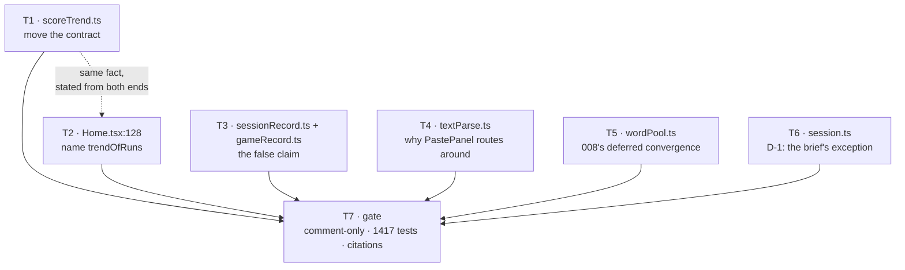

# Tasks: 015-stale-comment-repair

**Baseline:** `main` @ `27dc31c` — **1417 tests across 71 files, all green**; `typecheck` + `lint` clean
**Branch:** `chore/stale-comment-repair`, cut from `main`
**Total:** 7 tasks — 6 comment edits, 1 final gate
**Legend:** `[P]` = parallelisable with its siblings · every task ends in a runnable VALIDATE

> **Nothing outside a comment may enter the diff.** No TDD, because there is no behaviour to drive —
> and the inverse discipline is stricter than 014's: **no test file is opened, no test count moves
> (1417 → 1417), and no non-comment line appears in `git diff`.**
>
> Every task ends with the same structural check, abbreviated below as **COMMENT-ONLY**: strip the
> comments from the `main` version and from the working version, then diff what is left.
> ```bash
> strip() { node -e 'const t=require("fs").readFileSync(0,"utf8");let b=false,o=[];
> for(const l of t.split("\n")){let s="",i=0;while(i<l.length){
>  if(b){const e=l.indexOf("*/",i);if(e<0){i=l.length}else{b=false;i=e+(l[e+2]==="}"?3:2)}continue}
>  if(l.startsWith("{/*",i)){b=true;i+=3;continue}
>  if(l.startsWith("/*",i)){b=true;i+=2;continue}
>  if(l.startsWith("//",i))break; s+=l[i++]}
>  if(s.trim())o.push(s.trimEnd())} console.log(o.join("\n"))'; }
> f=src/state/scoreTrend.ts
> diff <(git show "main:$f" | strip) <(strip < "$f") && echo "✓ code identical"
> ```
> **It must report no difference.** One line of output means a code line got into a comment-only
> commit.
>
> **Do NOT use `git diff | grep -v '^[+-]\s*\*'` for this.** It was the original form of this check
> and it is wrong: shortening a comment block above a function re-anchors the hunk, so git re-emits
> the *identical* declaration and body lines on both sides and the grep reports them as changes.
> T1 tripped exactly that (spec **O-1**), and it cannot distinguish a moved block from a real edit —
> which is the one thing T1 needs distinguished. The naive grep is fine as a quick screen; the
> comment-stripped diff is the proof.
>
> **One commit per task**, all `docs(015):`. Recommended order: T1 → T3 → T2 → T4 → T5 → T6 → T7.

---

## Phase 1 — The two substantive repairs (T1, T3)

### Task 1: MOVE the trend contract onto the live function — `src/state/scoreTrend.ts` [P]

- **IMPLEMENT:** `plan.md` § A. Satisfies **FR-1**, **D-4**.
- The file has two JSDoc blocks to swap the weight of: lines **13-28** (above `trend`, 16 lines of
  contract) and line **33** (above `trendOfRuns`, one line). Replace **both**. Result:

  ```ts
  /**
   * The records-taking form: fold, then average.
   *
   * **No production caller.** `App.tsx` already holds `groupRuns` output where it needs the
   * average and calls `trendOfRuns` directly (App.tsx:363).
   *
   * Kept as the seam the unit suite drives, because it is the ONLY entry point that pins
   * folding and averaging together. A test spanning three lists writes three records
   * (011 D-3); averaging those counts one run three times — silently, and with a number
   * that still looks entirely plausible. `trendOfRuns` takes runs that are already folded
   * and cannot catch that regression. This can, and scoreTrend.test.ts does.
   */
  export function trend(records: readonly SessionRecord[]): Trend | null {
    return trendOfRuns(groupRuns(records))
  }

  /**
   * The live path — where the home screen's average comes from (App.tsx:363).
   *
   * Full runs only — a wrong-only drill is a harder subset and would drag the average down,
   * and a run stopped early is not a real attempt.
   *
   * Over RUNS, not records. `groupRuns` is the one place that folding happens; a caller
   * holding raw records reaches this through `trend` above.
   *
   * `null` from fewer than two comparable runs: a single score is not a trend, and calling
   * it one would put "averaging 80% over your last 1 full run" under a user's first drill.
   *
   * Lifted out of `ScoreHistory` when 012 emptied the home screen. The list it used to sit
   * above is `ReviewScreen`'s job now — day-grouped, filterable and openable, which the
   * ten-row log never was — but the average had nowhere else to live and is the one part of
   * that component worth keeping.
   */
  export function trendOfRuns(runs: readonly RunGroup[]): Trend | null {
  ```
- **KEEP:** both declaration lines, both bodies, the `Trend` interface, `RECENT = 5` and its comment,
  and both imports. `groupRuns` stays imported — `trend` still calls it.
- **GOTCHA — this is the one task where a slip is invisible.** `trend` and `trendOfRuns` are adjacent,
  both return `Trend | null`, and swapping their bodies still compiles and still passes most of the
  suite. Move only the text *between* the declarations; neither `export function` line may appear in
  the diff.
- **GOTCHA:** one clause changes wording rather than moving verbatim — "`groupRuns` is the one place
  that folding happens." gains "; a caller holding raw records reaches this through `trend` above."
  After the move it sits *below* `groupRuns`'s only call site instead of above it.
- **VALIDATE:**
  ```bash
  npm run typecheck && npm run lint && npx vitest run src/state/scoreTrend.test.ts
  # then COMMENT-ONLY on src/state/scoreTrend.ts
  ```

### Task 3: REPLACE the false caller claim — `src/state/sessionRecord.ts` + `src/game/gameRecord.ts`

- **IMPLEMENT:** `plan.md` § B. Satisfies **FR-2**, **FR-2a**, **FR-2b**, **D-3**.
- **COUNT IT FIRST (spec O-3).** The brief says "17-test suite"; it is **13 of the file's 20**. A
  number going into a comment must be measured (NFR-5):
  ```bash
  node -e 'const s=require("fs").readFileSync("src/state/sessionRecord.test.ts","utf8").split("\n");
  let c=null,h=new Set(),t=0;
  s.forEach((l,i)=>{if(/^\s{2}it\(/.test(l)){c=i+1;t++} if(c&&/\bbuildSessionRecord\b/.test(l))h.add(c)});
  console.log(`${h.size} of ${t}`)'   # → 13 of 20
  ```
- **Edit 1 — the false statement.** Inner block comment, lines **31-40**. The clause at **34-36**
  ("Kept because 002, 006 and 008 all call it…") is untrue: 011 re-expressed this function through
  `buildRunRecords` and took those callers with it. Replace the block with:

  ```ts
    /*
     * The ONE-LIST case of `buildRunRecords`, not a second implementation of it.
     *
     * NO PRODUCTION CALLER. 002, 006 and 008 all reach `buildRunRecords` now — 011 moved
     * them when it re-expressed this function through it. An earlier version of this
     * comment claimed they called this one; do not restore that.
     *
     * Kept for its suite, which nothing else can replace: 13 of the 20 tests in
     * sessionRecord.test.ts drive this function, one of them deep-equal against what a
     * single-list drill stored BEFORE the split, key for key and carrying no `runId`
     * (sessionRecord.test.ts:171). That assertion is the proof the split changed nothing
     * for a plain drill — 011 plan R1 names it as the regression net for the storage half.
     * If it goes red, the split is wrong.
     *
     * `session.pairs` rather than `list.pairs`: after a wrong-only re-run the session holds
     * only the pairs it drilled, and those are the ones being recorded.
     */
  ```
- **Edit 2 — the skim-level pointer (FR-2a).** In the doc block at lines **16-25**, append one line
  after "Build the log entry for a finished drill.":

  ```ts
   * Build the log entry for a finished drill.
   *
   * The one-list form, and test-only — see the note in the body. The live path is
   * `buildRunRecords` below.
  ```
  Leave the remaining two paragraphs of that block ("A pure function, kept OUT of appMachine.ts…"
  and "Returns null when nothing was answered…") untouched: both are still true of this function.
- **Edit 3 — the sixth site (FR-2b).** [gameRecord.ts:9](src/game/gameRecord.ts#L9): change
  "for the reason `buildSessionRecord` is" → "for the reason `buildRunRecords` is". One word. Same
  commit as edits 1-2 — it is the same fact about the same pair of functions, and splitting it would
  leave a commit where one comment still holds up the vestigial twin as the live precedent.
- **KEEP:** `sessionRecord.ts:64`'s "for the reason `buildSessionRecord` always was" — **do not**
  touch it. That sentence is about history, reads correctly in the past tense, and is the one place
  the lineage is recorded.
- **GOTCHA:** the inner comment is `/* */`, not `/** */`, and is indented two spaces inside the
  function body. Keep both.
- **VALIDATE:**
  ```bash
  npm run typecheck && npm run lint && npx vitest run src/state/sessionRecord.test.ts src/game/gameRecord.test.ts
  # then COMMENT-ONLY on src/state/sessionRecord.ts and src/game/gameRecord.ts
  # and confirm the deep-equal test cited actually sits at :171
  sed -n '171p' src/state/sessionRecord.test.ts
  ```

---

## Phase 2 — The four rewords (T2, T4, T5, T6 — all `[P]`)

### Task 2: NAME the right function — `src/components/Home.tsx:128` [P]

- **IMPLEMENT:** `plan.md` § A, second half. Satisfies **FR-1a**.
- One sentence inside the JSX comment at lines 123-135. Before:
  ```
   * GOING rather than what happened once. Below two full runs there is no average —
   * `trend()` returns null — and a user who has just finished their first drill would
  ```
  After:
  ```
   * GOING rather than what happened once. Below two full runs there is no average —
   * `trendOfRuns` returns null and `average` arrives here as null (App.tsx:363) — and a
   * user who has just finished their first drill would
  ```
  Re-wrap the paragraph to the file's width; the sentence gains a few words.
- **KEEP:** the `average` prop's own doc comment at [Home.tsx:38](src/components/Home.tsx#L38) —
  "How the last few full runs have gone, or null when there is not yet a trend." It names no
  function and is correct.
- **GOTCHA:** this is a `{/* … */}` JSX comment, not JSDoc. Do not convert it, and do not let the
  edit disturb the surrounding `{banner}` / `{loading ? …}` expressions.
- **GOTCHA — do not chase the two test-file mentions.** [App.test.tsx:1327](src/App.test.tsx#L1327)
  and [Home.test.tsx:164](src/components/Home.test.tsx#L164) also say "`trend()` returns null below
  two". Both are **true** and both are in test files (NFR-2). Spec § *Out of scope*.
- **VALIDATE:**
  ```bash
  npm run typecheck && npm run lint && npx vitest run src/components/Home.test.tsx
  # then COMMENT-ONLY on src/components/Home.tsx
  ```

### Task 4: DOCUMENT why PastePanel routes around it — `src/parse/textParse.ts:165` [P]

- **IMPLEMENT:** `plan.md` § C. Satisfies **FR-3**.
- The existing one-liner is accurate — **keep both its sentences** and expand the block:

  ```ts
  /**
   * Detect and parse in one step. Pass `override` to force a delimiter.
   *
   * **No production caller, and `PastePanel` is not one on purpose.** The panel calls
   * `detectDelimiter` and `parseDelimited` itself because it RENDERS the detection: the
   * delimiter select shows what auto-detection chose (PastePanel.tsx:77), and the
   * "couldn't tell" hint shows `confidence` against `CONFIDENCE_FLOOR`
   * (PastePanel.tsx:103-108). Overridden, this function reports `confidence: 1` and the
   * override as the delimiter — the real detection is gone. It also fuses two memos with
   * different dependencies (`[text]` for detection, `[text, active]` for rows), so
   * changing the delimiter would re-run detection for a value the panel discards.
   *
   * So: fine for a caller that wants the guess and the rows and nothing else — an import
   * route, a CLI — and driven as the composed contract by textParse.test.ts:117-133.
   * Do NOT "simplify" the panel's two calls onto it.
   */
  ```
- **KEEP:** `detectDelimiter`, `parseDelimited`, `CONFIDENCE_FLOOR` and every other export exactly
  as they are, including `parseDelimited`'s own doc block at lines 146-150.
- **GOTCHA:** verify the two PastePanel citations before writing them — they are the load-bearing
  half of this comment (NFR-4):
  ```bash
  sed -n '77p;103,108p' src/components/PastePanel.tsx
  ```
- **VALIDATE:**
  ```bash
  npm run typecheck && npm run lint && npx vitest run src/parse/textParse.test.ts src/components/PastePanel.test.tsx
  # then COMMENT-ONLY on src/parse/textParse.ts
  ```

### Task 5: RECORD the deferred convergence — `src/state/wordPool.ts:223` [P]

- **IMPLEMENT:** `plan.md` § D. Satisfies **FR-4**.
- Replace the one-line comment above `toPairs`:

  ```ts
  /**
   * Project down to plain pairs, for a caller that has no use for the origin.
   *
   * **No production caller yet.** Written in 008 for a convergence 008 itself deferred:
   * folding 006's per-list missed selection onto `buildWordPool`, at which point its
   * `toDrillPairs` becomes this (008 spec § Out of scope). Deferred so 006's untouched
   * suite could stay the regression net for the `MissSource` widening. It has not landed.
   *
   * Meanwhile the same projection is written out twice more, over carriers that are
   * `PooledWord` in all but name: `runPairs` (drillRun.ts:142), whose body is identical to
   * this one, and `buildGameRecord` (gameRecord.ts:87), which does it per item inside its
   * loop. This is the module-level one — route the next caller through it rather than
   * writing a fourth copy. (`runFromList` at drillRun.ts:77 is the INVERSE — it adds the
   * origin. Not a copy of this, and not a candidate for it.)
   *
   * Deleting it also costs a test edit: wordPool.test.ts asserts this module's export
   * surface by exact name list, and `toPairs` is in it.
   */
  ```
- **KEEP:** the module header (lines 5-27) untouched, and every other export. The header's
  "no `count`, and no sampling" contract is unrelated to this function.
- **GOTCHA — check the direction of each site before citing it (spec O-4).** `plan.md` § D listed
  three copies. There are two: `runFromList` (drillRun.ts:77) projects `WordPair → PooledWord` and
  **adds** the origin — the inverse of this function. The comment names the exclusion, because that
  line is exactly what a reader would otherwise "converge".
- **GOTCHA:** do not act on the duplication this comment documents. Collapsing the two real twins
  is a behaviour-touching refactor and is out of scope (plan **R5**).
- **VALIDATE:**
  ```bash
  npm run typecheck && npm run lint && npx vitest run src/state/wordPool.test.ts
  # then COMMENT-ONLY on src/state/wordPool.ts
  # and re-confirm the three citations
  sed -n '77p;142p' src/state/drillRun.ts; sed -n '87p' src/game/gameRecord.ts
  ```

### Task 6: CORRECT the claim the brief cleared — `src/state/session.ts` [P]

- **IMPLEMENT:** `plan.md` § E. Satisfies **FR-5**, **FR-5a**, and spec **D-1**. **This task is a
  deviation from the brief, which marked B5 "correct as-is".** Read spec § D-1 first.
- **Edit 1** — replace the doc block at lines **6-9**:

  ```ts
  /**
   * Small deterministic PRNG (mulberry32). **Test-only** — 98 call sites across nine test
   * files, and nothing in `src/` outside this definition.
   *
   * "Shuffle & restart" does NOT use it, though this comment used to say so. Every
   * production shuffle arrives through `reduce`'s default argument, which is `randomRng`
   * (appMachine.ts:229), and no call site overrides it. A seeded restart would deal the
   * same order every time — the opposite of what that button promises.
   *
   * Keep it exported. Determinism is what makes the shuffle, `runFromPool`'s draw and the
   * game's distractor cloud testable at all.
   */
  ```
- **Edit 2 (FR-5a)** — the clause removed above describes `randomRng`, so it moves there. Line
  **21**, currently bare:
  ```ts
  /** The production source. A fresh order each time, and no cryptographic quality needed. */
  export const randomRng: Rng = Math.random
  ```
- **KEEP:** `Rng`'s comment at line 3, `seededRng`'s body byte for byte (it is a PRNG — one changed
  constant is a different sequence and 98 pinned assertions), and `shuffle`'s doc block below.
- **GOTCHA:** the evidence is in the spec, but re-run it at HEAD before writing the claim — if a
  future branch wires a seed through, this comment becomes the stale one:
  ```bash
  grep -rn "seededRng" src --include="*.ts" --include="*.tsx" | grep -v "\.test\."   # expect only session.ts:10
  grep -n "rng" src/App.tsx                                                          # expect no output
  sed -n '229p' src/state/appMachine.ts                                              # expect the randomRng default
  ```
- **VALIDATE:**
  ```bash
  npm run typecheck && npm run lint && npx vitest run src/state/session.test.ts src/game/questions.test.ts
  # then COMMENT-ONLY on src/state/session.ts
  ```

---

## Phase 3 — Gate (T7)

### Task 7: VERIFY the whole change is comment-only and every citation resolves

- **IMPLEMENT:** the spec's *Definition of done*. Satisfies **FR-6**, **NFR-1** … **NFR-5**.
- **Structural — no code changed.** Run **COMMENT-ONLY** (top of this file) over all seven files
  with `main` as the base. **Expected: seven ✓.** *Result: 7 ✓, 614 code lines identical.*
- **No test file touched (NFR-2):**
  ```bash
  git diff --name-only main | grep -E '\.test\.(ts|tsx)$'   # expect no output
  git diff --stat main -- src                                # expect 7 files (spec O-2)
  ```
- **Gates (NFR-1):**
  ```bash
  npm run typecheck && npm run lint && npm test
  ```
  **Expected: 1417 passed, 71 files.** A different count means something behavioural moved and the
  change is not what it claims to be.
- **Citations resolve (NFR-4)** — every file:line this change *wrote into a comment*:
  ```bash
  sed -n '363p' src/App.tsx                        # trendOfRuns call        (T1, T2)
  sed -n '171p' src/state/sessionRecord.test.ts    # the deep-equal test     (T3)
  sed -n '77p;103,108p' src/components/PastePanel.tsx  # select + hint       (T4)
  sed -n '77p;142p' src/state/drillRun.ts          # two inlined projections (T5)
  sed -n '87p' src/game/gameRecord.ts              # third projection        (T5)
  sed -n '229p' src/state/appMachine.ts            # randomRng default       (T6)
  ```
- **No surviving false attribution:**
  ```bash
  grep -rn "trend()\|buildSessionRecord\|parseText\|toPairs\|seededRng" src \
    --include="*.ts" --include="*.tsx" | grep -v "\.test\."
  ```
  Read every hit. Each must be either the definition itself or a comment that states the absence of
  a production caller. **`gameRecord.ts:9` must now say `buildRunRecords`.**
- **Zero emitted-JS change (NFR-3):**
  ```bash
  npm run check:bundle    # within budget: 150 KB JS / 220 KB assets
  ```
  Byte counts should match `main`'s (88.6 KB JS / 166.5 KB total at 014's close) — comments do not
  survive minification, so a moved byte count means a real edit slipped in.
- **VALIDATE:** all of the above, then open the PR.

---

## Task graph



All of T1-T6 are independent commits on one branch; only T7 depends on them. T1/T2 state one fact
from both ends (the live path and the vestigial twin), as do T3's two files — review each as a pair.
