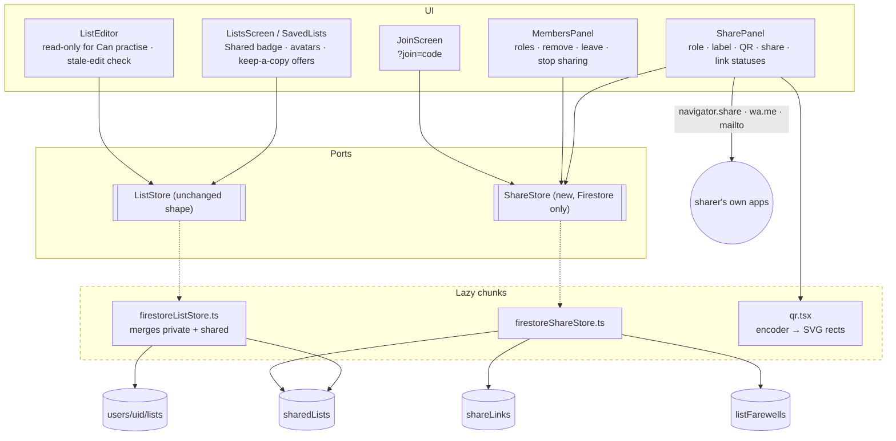

# Plan: Sharing a list with someone else

**Feature ID:** 016-list-sharing
**Status:** DRAFT, revision 2
**Created:** 2026-09-25
**Builds on:** `003-user-accounts` (Firestore, Google sign-in, `ListStore` port), `011-test-builder` (saved tests reference lists by id)

## What revision 2 removed

Revision 1 sent email from a new Cloudflare Worker route through Resend. Replacing email with a
share link and QR code (spec D-1) deletes, from the plan:

- the Worker script, `run_worker_first`, and every line of server code
- Firebase ID token verification (the riskiest code in revision 1)
- the email provider account, the verified domain, SPF/DKIM, and the `RESEND_API_KEY` secret
- the email template and its escaping, and the resend throttle
- binding invites to an email address, and the "wrong Google account" screen
- the plan's biggest unknown (R1 in revision 1: whether members can query invites through a `get()`),
  because links are now only ever queried by their creator

What it adds is small: a QR encoder, the Web Share API, and a join screen that a guest can read.

## Technical approach

Three problems, in the order they carry risk:

1. **A second, membership-based home for lists, and rules that guard roles and joins.** The rules
   are the app's only server-side check, so they are written and tested first, against the
   emulator, before any client code.
2. **Merging two sources into one list of lists.** `ListStore.subscribeLists` keeps its signature
   and emits more lists. `App` must not learn that a list can live in two places, except where the
   UI has to say "Leave" instead of "Delete".
3. **An entry point from outside the app.** `?join=<code>` must survive a sign-in, must work for a
   guest who has never loaded Firebase, and must not collide with the first-sign-in migration
   prompt.

### Ordering decisions

- **Rules and tests before the adapter**, as in 003.
- **Adapter before UI**, tested through the emulator in `tests/rules/`, where the list store's
  adapter tests already live.
- **Private lists untouched.** Their rules, `listRepo.ts` and `localListStore.ts` do not change, so
  any regression in private lists is a bug in the merge and only there.

## Architecture



`ShareStore` is a separate port, not new `ListStore` methods, because the local store has no honest
implementation of any of it. `useShareStore` returns `null` for a signed-in-less app, and every
sharing control reads that as "Sign in to share".

## Data model

```
users/{uid}/lists/{listId}     WordList             unchanged, private lists
sharedLists/{listId}           WordList + sharing   new; same id the list had when private
shareLinks/{code}              ShareLink            new; code = 22 chars base64url (128 random bits)
listFarewells/{listId}_{uid}   Farewell             new; the keep-a-copy offer (D-11)
```

```ts
// src/state/types.ts (additions)
export type ListRole = 'owner' | 'editor' | 'viewer'   // UI: Owner · Can edit · Can practise

export interface ListMember {
  role: ListRole
  displayName: string | null
  email: string | null
  photoURL: string | null
  joinedAt: number
  /** The link that let them in, for "joined via For Dana" and for the join rule. Absent for the owner. */
  viaLink?: string
  viaLabel?: string
}

export interface ListSharing {
  ownerUid: string
  /** Mirrors the keys of `members`. Exists only because Firestore can query array-contains, not map keys. */
  memberUids: string[]
  members: Record<string, ListMember>
  /** Who saved last, for the stale-edit warning (D-8). */
  updatedBy: string
}

/** A list is shared iff `sharing` is present. Private lists never carry it. */
export interface WordList {
  // ...existing fields
  sharing?: ListSharing
}
```

```ts
// src/share/types.ts
export interface ShareLink {
  code: string                // the document id; the secret in the URL
  listId: string
  role: 'editor' | 'viewer'
  label: string | null        // "For Dana"
  maxUses: number             // 1 by default; up to 20 for a group link (open question 1)
  uses: number
  declined: boolean           // single-use links only
  createdByUid: string
  createdAt: number           // server timestamp; expires createdAt + 14 days (D-7)
  /** What a guest sees on the join screen before they can read the list itself. */
  preview: { listName: string; ownerName: string | null; wordCount: number; col1Lang: LangCode; col2Lang: LangCode }
}

export interface Farewell {
  uid: string
  listId: string
  reason: 'removed' | 'stopped' | 'deleted'
  byName: string | null
  at: number
  /** The last version this member could see. A snapshot, so later edits never reach them. */
  list: WordList
}
```

**Displayed link status is derived, never stored:** `declined` → *Declined*;
`now > createdAt + 14d` → *Expired*; `uses < maxUses` → *Waiting · created 2h ago* (a group link
adds *"· 7 of 20 joined"*); used up → not shown, the person is under Members. Keeping *Expired*
derived is why D-7 needs no cleanup job.

**Why farewells are their own documents** and not a "former members" field on the shared list: a
removed member must see the list *as it was when they were removed* (D-11), and rules cannot give
someone access to an old version of a document. A snapshot written in the same batch as the
removal is the only honest way. It also means a removed member has no access at all to the live
list, which is the property that matters.

**Why `sharedLists` is top-level** and not `users/{ownerUid}/lists` with extra rules: a member's
query would then be a collection-group query across every user's lists, and one wrong rule would
expose every private list in the database.

## Rules

Sketch, not final syntax. Every clause gets an allow and a deny test.

```
function signedIn() { return request.auth != null; }
function me() { return request.auth.uid; }
function roleOf(list) { return list.members[me()].role; }
function isMember(list) { return signedIn() && me() in list.memberUids; }
function canEdit(list) { return isMember(list) && roleOf(list) in ['owner', 'editor']; }
function isListOwner(list) { return signedIn() && list.ownerUid == me(); }
function linkLive(link) {
  return link.uses < link.maxUses && !link.declined
    && request.time < link.createdAt + duration.value(14, 'd');
}
function sharedList(id) { return get(/databases/$(database)/documents/sharedLists/$(id)).data; }

match /sharedLists/{listId} {
  allow read: if isMember(resource.data);

  // Created by the owner, alone, in the first-link batch (D-5).
  allow create: if signedIn()
    && request.resource.data.ownerUid == me()
    && request.resource.data.memberUids == [me()]
    && request.resource.data.members.keys().hasOnly([me()])
    && request.resource.data.members[me()].role == 'owner'
    && contentValid(request.resource.data)
    && request.resource.data.memberUids.size() <= 20;

  allow update: if
       contentEdit()           // owner or editor changes name/pairs/langs, sets updatedBy
    || joinIsValid()           // see below
    || leaveIsValid()          // a non-owner removes exactly themself
    || ownerManages();         // owner changes a role or removes a member (with a farewell, below)

  allow delete: if isListOwner(resource.data);   // stop sharing and delete for everyone
}

match /shareLinks/{code} {
  // Readable by anyone who has the code, signed in or not: it holds only the preview, and the
  // code cannot be guessed. This is what lets a guest see who is inviting them before signing in.
  allow get: if true;
  // Only the creator lists them, and the query must filter on it (rules are not filters).
  allow list: if signedIn() && resource.data.createdByUid == me();

  allow create: if signedIn()
    && isListOwner(getAfter(/databases/$(database)/documents/sharedLists/$(request.resource.data.listId)).data)
    && request.resource.data.createdByUid == me()
    && request.resource.data.uses == 0 && request.resource.data.declined == false
    && request.resource.data.maxUses >= 1 && request.resource.data.maxUses <= 20
    && request.resource.data.role in ['editor', 'viewer']
    && request.resource.data.createdAt == request.time;

  allow update: if
       // a join uses it up by exactly one, and only alongside the matching list update
       (signedIn() && linkLive(resource.data)
         && diff().affectedKeys().hasOnly(['uses'])
         && request.resource.data.uses == resource.data.uses + 1
         && getAfter(/databases/$(database)/documents/sharedLists/$(resource.data.listId))
              .data.members[me()].viaLink == code)
       // anyone holding a single-use link may decline it
    || (signedIn() && linkLive(resource.data) && resource.data.maxUses == 1
         && diff().affectedKeys().hasOnly(['declined']) && request.resource.data.declined == true);

  allow delete: if signedIn() && resource.data.createdByUid == me();   // cancel
}

match /listFarewells/{id} {
  allow read, delete: if signedIn() && resource.data.uid == me();
  // Written by the owner, in the same batch that removes the member or ends the list.
  allow create: if signedIn()
    && id == request.resource.data.listId + '_' + request.resource.data.uid
    && isListOwner(sharedList(request.resource.data.listId))
    && request.resource.data.uid in sharedList(request.resource.data.listId).memberUids
    && request.resource.data.list.pairs.size() <= 500;
}
```

**The join rule** is the one that matters:

```
function joinIsValid() {
  let entry = request.resource.data.members[me()];
  let before = get(/databases/$(database)/documents/shareLinks/$(entry.viaLink)).data;
  let after  = getAfter(/databases/$(database)/documents/shareLinks/$(entry.viaLink)).data;
  return signedIn()
    && !(me() in resource.data.memberUids)
    && request.resource.data.memberUids == resource.data.memberUids.concat([me()])
    && request.resource.data.members.diff(resource.data.members).affectedKeys().hasOnly([me()])
    && diff().affectedKeys().hasOnly(['memberUids', 'members'])
    && before.listId == listId && linkLive(before)
    && after.uses == before.uses + 1
    && entry.role == before.role
    && resource.data.memberUids.size() < 20;
}
```

A join is **one batch**: the link's `uses + 1` and the list's new member. Each rule checks the
other's post-batch state with `getAfter`, so neither write is valid alone. That makes "link used
but nobody joined" and "joined without using a link" both impossible, and it is what makes two
people racing for one single-use link safe: the second batch sees `uses == maxUses` and is refused.

Role is copied from the link and checked (`entry.role == before.role`), so a joiner cannot promote
themselves to editor by editing the request.

Timestamps that the rules compare (`createdAt`) are Firestore server timestamps, not the app's
usual `Date.now()` numbers, because expiry must not trust the client clock. Converted to ms at the
adapter boundary so the rest of the app still sees numbers.

## Merging private and shared lists

```ts
subscribeLists(onChange, onError) {
  let mine: WordList[] = [], shared: WordList[] = [], got = { mine: false, shared: false }
  const emit = () => got.mine && got.shared &&
    onChange(dedupeById([...shared, ...mine]).sort((a, b) => b.updatedAt - a.updatedAt))
  const a = onSnapshot(query(collection(db, listsPath), orderBy('updatedAt', 'desc')), ...)
  const b = onSnapshot(query(collection(db, 'sharedLists'),
                             where('memberUids', 'array-contains', uid)), ...)
  return track(() => { a(); b() })
}
```

- **Emit only once both have answered**, or a shared list flickers in a moment after the rest.
- **Sorted client-side**, so no composite index (`array-contains` + `orderBy` would need one).
- **Deduped, shared winning.** During the first-link move a snapshot can briefly hold the list in
  both; never in neither, because both halves come from one committed batch. An emulator test
  proves it rather than this paragraph.
- **Writes route by where the list lives**, using a live `Set` of shared ids. `saveList` on a
  shared id is an `updateDoc` of content fields plus `updatedBy`. Never `setDoc`: that would
  rewrite `members` from whatever the client last saw and undo a concurrent join. The rules refuse
  it anyway (the content clause does not allow `members` to change), and a test pins that.

## Sharing for the first time (D-5)

One `writeBatch`: set `sharedLists/{id}` (the private list plus `sharing`, owner alone), delete
`users/{uid}/lists/{id}`, set `shareLinks/{code}`. Then show the QR and share options.

The share message and URL:

```
{ownerName} invited you to practise "{listName}" ({n} words, {French → English}) in Vocabulary Trainer:
https://{origin}/?join={code}
```

- **Share…** calls `navigator.share({ title, text, url })`, shown only when `navigator.canShare`
  says it will work. `AbortError` (the user closed the sheet) is not an error.
- **WhatsApp**: `https://wa.me/?text={encoded message}`. **Email**: `mailto:?subject=…&body=…`.
  Both are plain links, so no CSP change (`form-action 'none'` is irrelevant to navigation).
- **Copy link**: `navigator.clipboard.writeText`, with a visible "Copied".

## QR code

- A small MIT encoder (candidate: `uqr`; alternative `qrcode-generator`), used only for its
  `encode()` matrix. The component draws `<rect>`s itself, so there is no `innerHTML` and nothing
  for the CSP to object to.
- Lazy-loaded with the Share panel, never in the eager chunk (NFR2). If both candidates exceed
  10 KB gzipped, write a byte-mode, version 1 to 6 encoder by hand; the URL is under 60 characters,
  so it needs nothing more.
- Error correction **M**, 4-module quiet zone, dark modules on a white square **in both themes**.
  Many phone cameras fail on inverted QR codes, so dark mode must not invert it (the square is the
  one place this app deliberately does not follow the theme tokens, and the code says why).
- Full screen view: the largest square that fits, and it keeps the screen from sleeping where the
  Wake Lock API exists.

## The join screen

- `main.tsx` reads `?join=` once, stores it in `sessionStorage` (`pvt.join.pending`), and removes
  it from the URL with `history.replaceState`, so a refresh or a screenshot does not keep it.
- `appMachine` gains `{ screen: 'join'; code: string }`, `OPEN_JOIN`, `CLOSE_JOIN`. It only routes;
  loading the link is the screen's job, which keeps `appMachine.ts` pure (`invariants.test.ts`).
- **A guest is the normal case here**, and a guest has never loaded Firebase. The join screen
  loads the lazy Firebase chunk itself, reads `shareLinks/{code}` (allowed signed-out), and shows
  the preview with **Sign in with Google to join**. The eager bundle does not change; only a guest
  who opens a join link pays for the chunk, and they are about to sign in anyway.
- Boot order: auth resolves, then a stored join code opens the join screen **before** the welcome
  screen or the migration prompt. The join screen replaces the welcome screen for that visit (it
  asks the same question, better). After Join or No thanks, the stored code is cleared, and the
  existing migration prompt may then run.
- **Rejoin with a kept copy** (spec edge case): if a private list with the same id exists, it is
  given a new id in the join batch's preceding write, so the merge never has to choose.

## Leaving, removal, stop sharing, delete (D-11, D-12)

| Action | Who | One batch |
|---|---|---|
| Leave | member | remove me from `memberUids`/`members`; if keeping a copy, set `users/me/lists/{id}` |
| Remove member | owner | remove them; create `listFarewells/{id}_{them}` (reason `removed`) |
| Stop sharing | owner | set `users/me/lists/{id}` (no `sharing`); a farewell per other member (`stopped`); delete every link; delete the shared list |
| Delete for everyone | owner | a farewell per other member (`deleted`); delete every link; delete the shared list |

Farewells are read by the member's own `subscribeFarewells` and shown on My lists:
**Keep a private copy** (set `users/me/lists/{id}` from `farewell.list`, then delete the farewell)
or **Dismiss** (delete it). The copy keeps the id, so history and saved tests follow (D-11).

Batches are bounded: at most 19 farewells plus 10 links plus 2 list writes, far under Firestore's
500-write batch limit.

## Stale-edit detection and read-only editing

- `ListEditor` gets `readOnly` when the list is shared and the role is `viewer`: inputs disabled,
  a line at the top ("Dana shared this list with you to practise. Keep a copy to edit your own."),
  Save hidden, **Keep a private copy** offered.
- For editors, on Save `App` compares the opened `updatedAt` with the live list's. If they differ
  and `updatedBy` is someone else: *"{name} changed this list since you opened it."*
  **Keep theirs** / **Save mine anyway**. Advisory, client-side; the rules only guarantee the write
  is well-formed and by someone allowed to edit.

## Account deletion

`purgeUserData` gains a step **before** the owned collections:

1. Every shared list where I am not owner: leave.
2. Every shared list I own: if others remain, one `ownerManages` update making the
   longest-standing editor (else member) the owner, and removing me; else delete it and its links.
3. Delete every `shareLinks` doc I created, and every `listFarewells` doc addressed to me.

`invariants.test.ts` gets a sibling of its `OWNED_COLLECTIONS` check: every top-level collection
named in `firestoreShareStore.ts` must be handled in `deleteAccount.ts`. The same trap 008 fell
into, guarded the same way.

## Risks

| # | Risk | Mitigation |
|---|------|-----------|
| R1 | **Google sign-in is blocked inside in-app browsers** (Instagram, Facebook, some Android messengers open links in an embedded webview; Google refuses OAuth there with `disallowed_useragent`). A WhatsApp link opened in such a view would dead-end at sign-in. | Detect embedded webviews on the join screen and show **Open in your browser** with Copy link, before offering sign-in. Test on WhatsApp for iOS and Android in Task 23. |
| R2 | A forwarded link lets a stranger in (accepted with D-2). | Single-use by default; owner sees and removes; 14-day expiry; group links have a cap. Stated in the Share panel: "Anyone with this link can join." |
| R3 | `get: if true` on share links is readable without sign-in. | Holds only the preview; the code is 128 random bits; `list` is creator-only. A rules test asserts a guest cannot list. |
| R4 | QR code unreadable in dark mode or at small sizes. | Never inverted; minimum 240 px; tested with two phone cameras in Task 23. |
| R5 | A list moving collections while its editor is open in another of the owner's tabs. | Save routes by the live shared-id set, not by the list the editor opened with. Tested. |
| R6 | Offline edits by a member replayed after removal or demotion are rejected. | Expected; a toast gives the specific reason, and the keep-a-copy offer carries the last version. |
| R7 | New runtime dependency. | One, lazy, tiny, MIT; hand-written fallback (NFR5). README's "two runtime dependencies" line updated. |
| R8 | Blast radius in `App.tsx` (1,100 lines). | Sharing UI in its own components wired by props; `App` gains one hook and one route. |

## Test strategy

- **Rules** (`tests/rules/firestore.rules.test.ts`, emulator). The deny list is the important half:
  non-member read; viewer edits content; editor changes a role; member changes `ownerUid`; join
  without a link; join with a link for another list; join with an expired, declined, used-up or
  cancelled link; join claiming a different role than the link; link `uses` bumped without a join;
  two racing joins on a single-use link; guest `list` on links; farewell written by a non-owner or
  for a non-member; reading someone else's farewell.
- **Adapter** (`tests/rules/firestoreShareStore.test.ts`, emulator): first-link move, merge order
  and dedupe, join batch, decline, leave with and without copy, remove with farewell, stop sharing,
  delete for everyone, rejoin with a kept copy, account deletion handover.
- **Pure** (`src/share/*.test.ts`): link status derivation at the 14-day boundary; share message
  text; webview detection over a table of real user agents.
- **UI** (Vitest + Testing Library, fake `ShareStore`): Share panel with and without
  `navigator.share`; QR renders an `<svg>` with the right module count; each link status; join
  screen in its states (guest, ready, own link, already member, unavailable, expired, in-app
  browser); members panel by role; read-only editor; stale-edit dialog; farewell banner.
- **App flow** (`App.join.test.tsx`): `?join=` as a guest → sign in → join → list visible; the
  migration prompt comes after, not on top.
- **Bundle**: `check-bundle.mjs` green; the QR encoder is not in the eager chunk.
