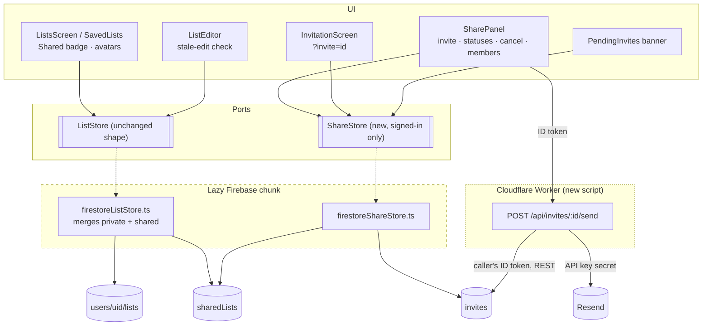

# Plan: Sharing a list with someone else

**Feature ID:** 016-list-sharing
**Status:** DRAFT
**Created:** 2026-09-25
**Builds on:** `003-user-accounts` (Firestore, Google sign-in, `ListStore` port), `011-test-builder` (saved tests reference lists by id)

## Technical approach

Four separate problems, in the order they carry risk:

1. **A second, membership-based home for lists, and the rules that guard it.** The rules are the
   app's only server-side check. Every other part of the feature is only as safe as they are, so
   they are written and tested first, against the emulator, before any client code exists.
2. **Merging two sources into one list of lists.** `App` must not learn that a list can live in
   two places. `ListStore.subscribeLists` keeps its signature and simply emits more lists.
3. **Sending an email with no backend.** A single Worker route. Small, but it is the app's first
   server code and its first secret.
4. **An entry point from outside the app.** `?invite=<id>` must survive a sign-in and must not
   collide with the first-sign-in migration prompt.

### The ordering decisions that de-risk this

- **Rules and their tests before the adapter.** Same reason as 003: nothing else double-checks them.
  One specific unknown (R1: can a `list` query on `invites` be authorised by a `get()` on the list?)
  is answered in the very first task, because the answer changes the data model.
- **The adapter before the UI, tested through the emulator.** `tests/rules/firestoreListStore.test.ts`
  already runs the adapter against real rules; the sharing adapter joins it.
- **The Worker behind a feature flag.** Until the Resend domain is verified, the client falls back to
  `mailto:` (spec D-1 fallback). The whole feature can be built and tested without the email
  provider existing yet.
- **Private lists untouched.** `users/{uid}/lists` rules, `listRepo.ts`, `localListStore.ts` do not
  change. A regression in private lists is therefore a bug in the merge, and only there.

## Architecture



`ShareStore` is a separate port rather than new methods on `ListStore`, because the local store has
no honest implementation of any of it. `useListStore` returns `share: null` for guests, and every
sharing control reads that as "Sign in to share" (spec D-10).

## Data model

```
users/{uid}/lists/{listId}     WordList                       (unchanged, private lists)
sharedLists/{listId}           SharedWordList                 (new)
invites/{inviteId}             Invite                         (new, inviteId = crypto.randomUUID())
```

```ts
// src/state/types.ts (additions)
export interface ListMember {
  displayName: string | null
  email: string
  photoURL: string | null
  joinedAt: number
  /** The invite that let them in. Absent for the owner. The join rule reads it (see Rules). */
  inviteId?: string
}

export interface ListSharing {
  ownerUid: string
  /** Mirrors the keys of `members`. Exists only because Firestore can query array-contains, not map keys. */
  memberUids: string[]
  members: Record<string, ListMember>
  /** Who saved last, for the stale-edit warning (spec D-6). */
  updatedBy: string
}

/** A list is shared iff `sharing` is present. Private lists never carry it. */
export interface WordList {
  // ...existing fields
  sharing?: ListSharing
}
```

```ts
// src/share/types.ts
export type InviteStatus = 'pending' | 'accepted' | 'declined'

export interface Invite {
  id: string
  listId: string
  /** Lowercased. Compared against request.auth.token.email in the rules. */
  email: string
  invitedByUid: string
  invitedByName: string | null
  /** Denormalised preview so the invitee sees what they are joining before they can read the list. */
  listName: string
  wordCount: number
  col1Lang: LangCode
  col2Lang: LangCode
  status: InviteStatus
  createdAt: number        // request.time on create; expiry is createdAt + 14 days (D-7)
  respondedAt?: number
  /** Email bookkeeping, written by the Worker with the owner's token. */
  lastEmailAt?: number
  emailCount: number
  emailError?: string
}
```

**Displayed status** is derived, never stored: `pending` + no `lastEmailAt` + `emailError` →
*Email not sent*; `pending` past 14 days → *Expired*; `pending` → *Invite sent · {when}*;
`declined` → *Declined*. An accepted invite is not shown at all; its person is under Members.
Keeping *Expired* derived is what makes D-7 need no cleanup job.

Why `sharedLists` is top-level and not `users/{ownerUid}/lists` with extra rules: a member's
`subscribeLists` would then need a collection-group query across every user's lists, filtered by
membership, and one wrong rule would expose every private list in the database. A separate
collection keeps the private rule exactly as it is.

## Rules

Sketch, not final syntax. Every clause gets an allow and a deny test.

```
function signedIn() { return request.auth != null; }
function myEmail() { return request.auth.token.email.lower(); }
function verified() { return request.auth.token.email_verified == true; }
function isMember(list) { return signedIn() && request.auth.uid in list.memberUids; }
function isListOwner(list) { return signedIn() && request.auth.uid == list.ownerUid; }
function contentValid(d) {
  return isNonEmptyString(d.name, 200) && d.pairs is list && d.pairs.size() <= 500;
}
const CONTENT = ['name','pairs','col1Lang','col2Lang','langSource','updatedAt','updatedBy'];

match /sharedLists/{listId} {
  allow read: if isMember(resource.data);

  // Created only by the owner, alone, as the first-invite batch (D-4).
  allow create: if signedIn()
    && request.resource.data.ownerUid == request.auth.uid
    && request.resource.data.memberUids == [request.auth.uid]
    && request.resource.data.members.keys().hasOnly([request.auth.uid])
    && contentValid(request.resource.data);

  allow update: if
    // 1. any member edits content, and says so
    (isMember(resource.data)
      && diff().affectedKeys().hasOnly(CONTENT)
      && request.resource.data.updatedBy == request.auth.uid
      && contentValid(request.resource.data))
    // 2. join: add exactly myself, with an accepted, unexpired invite to my verified email
    || (joinIsValid())
    // 3. leave: a non-owner removes exactly themself
    || (leaveIsValid())
    // 4. owner removes another member, or (account deletion) hands ownership to a member
    || (isListOwner(resource.data) && ownerMembershipChangeIsValid());

  allow delete: if isListOwner(resource.data);
}

match /invites/{inviteId} {
  allow get: if signedIn() && (
      (verified() && resource.data.email == myEmail())
      || isMember(get(/databases/$(database)/documents/sharedLists/$(resource.data.listId)).data));
  // Queries: invitee's "my pending invites", and a list's invites for its members (R1).
  allow list: if signedIn() && (
      (verified() && resource.data.email == myEmail())
      || isMember(get(/databases/$(database)/documents/sharedLists/$(resource.data.listId)).data));

  allow create: if signedIn()
    && isListOwner(getAfter(/databases/$(database)/documents/sharedLists/$(request.resource.data.listId)).data)
    && request.resource.data.invitedByUid == request.auth.uid
    && request.resource.data.status == 'pending'
    && request.resource.data.email != myEmail()
    && request.resource.data.emailCount == 0
    && memberAndInviteCountWithinCap();           // D-9, see R3

  allow update: if
    // invitee answers once, before expiry
    (verified() && resource.data.email == myEmail() && resource.data.status == 'pending'
      && request.time < resource.data.createdAt + duration.value(14, 'd')
      && request.resource.data.status in ['accepted','declined']
      && diff().affectedKeys().hasOnly(['status','respondedAt']))
    // owner's email bookkeeping, throttled here, not only in the Worker (FR8)
    || (resource.data.invitedByUid == request.auth.uid
      && diff().affectedKeys().hasOnly(['lastEmailAt','emailCount','emailError'])
      && request.resource.data.emailCount <= resource.data.emailCount + 1
      && request.resource.data.emailCount <= 4
      && (!('lastEmailAt' in resource.data) || request.time > resource.data.lastEmailAt + duration.value(10, 'm')));

  allow delete: if resource.data.invitedByUid == request.auth.uid;   // cancel (D-8)
}
```

**The join rule** is the one that matters. The member entry carries `inviteId`, so the rule can find
the invite without a parameter:

```
function joinIsValid() {
  let me = request.auth.uid;
  let entry = request.resource.data.members[me];
  let inv = getAfter(/databases/$(database)/documents/invites/$(entry.inviteId)).data;
  return signedIn() && verified()
    && !(me in resource.data.memberUids)
    && request.resource.data.memberUids == resource.data.memberUids.concat([me])
    && request.resource.data.members.diff(resource.data.members).affectedKeys().hasOnly([me])
    && diff().affectedKeys().hasOnly(['memberUids','members'])
    && inv.listId == listId && inv.email == myEmail() && inv.status == 'accepted'
    && entry.email == myEmail();
}
```

The client does accept as **one batch**: invite `status → accepted` and list `memberUids`/`members`
add. `getAfter` sees the invite's post-batch state, so neither write is valid alone. That is what
makes "accepted but not a member" and "member without an accepted invite" impossible.

`createdAt` and `lastEmailAt` are Firestore timestamps (`serverTimestamp()` on write, rules check
`== request.time`), not `Date.now()` numbers like the rest of the app. The rules must compare them
against `request.time`, and a client clock cannot be trusted for expiry. Converted to ms at the
adapter boundary so the rest of the app sees numbers.

## Merging private and shared lists

```ts
subscribeLists(onChange, onError) {
  let privateLists: WordList[] = [], shared: WordList[] = [], ready = { p: false, s: false }
  const emit = () => ready.p && ready.s &&
    onChange([...privateLists, ...shared].sort((a, b) => b.updatedAt - a.updatedAt))
  const a = onSnapshot(query(collection(db, listsPath), orderBy('updatedAt','desc')), ...)
  const b = onSnapshot(query(collection(db, 'sharedLists'),
                             where('memberUids','array-contains', uid)), ...)
  return track(() => { a(); b() })
}
```

- **Emit only once both have answered.** Otherwise a shared list flickers in a moment after the
  rest, and the "Loading your lists…" rule in `SavedLists` is defeated.
- **Sorted client-side**, so no composite index is needed (`array-contains` + `orderBy` would need
  one, and `firestore.indexes.json` does not exist yet).
- **Writes route by where the list lives.** The adapter keeps a `Set` of shared ids from snapshot
  `b`. `saveList` on a shared id is an `updateDoc` of `CONTENT` fields only, plus
  `updatedBy: uid`. It must never `setDoc` a shared list: that would overwrite `members` with
  whatever the client last saw and silently undo a concurrent join.
- `removeList` on a shared id: owner → batch delete list + its invites; member → leave. `App`'s
  confirmation copy differs by role (spec Story 7), so `App` does read `list.sharing` there, and
  only there.

## Sharing a list for the first time (D-4)

One `writeBatch`:

1. `set sharedLists/{id}` = the private list + `sharing` with the owner as the only member
2. `delete users/{uid}/lists/{id}`
3. `set invites/{newId}` pending

Then, outside the batch, `POST /api/invites/{newId}/send`. The invite exists whether or not the
email goes out, which is what makes *Email not sent · Try again* possible.

Both listeners see the move; for one snapshot the list may be in neither or both. The merge dedupes
by id (shared wins), and the "both answered" gate means it is never absent from an emitted array
after the first emit, because the private-removal and shared-add arrive from one committed batch.
Covered by an emulator test rather than argued.

## Email

`wrangler.jsonc` gains `main: "worker/index.ts"` and `assets.run_worker_first: ["/api/*"]`, so
every other path is still served as static assets with no Worker invocation (and no cost).

```
POST /api/invites/:id/send
Authorization: Bearer <Firebase ID token>

1. Verify the ID token: RS256 against Google's securetoken JWKs (cached per their Cache-Control),
   aud == project id, iss == https://securetoken.google.com/<project>, exp in the future.
2. GET the invite through the Firestore REST API with the SAME bearer token. The rules decide
   whether this caller may see it. Refuse unless invitedByUid == token.uid and status == pending.
3. PATCH lastEmailAt / emailCount with the same token. The rules enforce the throttle (FR8);
   a 403 here means "too soon", returned to the client as 429.
4. Send via Resend with a fixed template. Only listName and invitedByName are interpolated, both
   HTML-escaped and length-capped. The link is https://<origin>/?invite=<id>.
5. On provider failure, PATCH emailError and return 502.
```

- **Why the caller's token and not a service account:** the Worker then holds no power beyond the
  person calling it (spec NFR6). A service-account key would be a second, far more dangerous secret.
- **Daily cap per sender** (e.g. 20 invites/day): Cloudflare's rate-limiting binding keyed by uid.
  The per-invite throttle is in the rules; this one is only about one account spamming many
  addresses.
- **CSP**: the Worker is same-origin, so `connect-src 'self'` already covers it. No CSP change.
- **Feature flag**: `VITE_INVITE_EMAIL=worker|mailto`. `mailto` opens the sharer's mail client with
  the same text and link, and the invite shows *Invite created* instead of *Invite sent*.
- **Secrets**: `RESEND_API_KEY` via `wrangler secret put`; `FIREBASE_PROJECT_ID` and
  `INVITE_FROM` as plain vars. Local dev uses `.dev.vars` (gitignored).

## The invitation screen

- `main.tsx` reads `?invite=` once, writes it to `sessionStorage` (`pvt.invite.pending`), and
  replaces the URL (`history.replaceState`) so a refresh or a shared screenshot does not keep it.
- `appMachine` gains `{ screen: 'invitation'; inviteId: string }` and `OPEN_INVITATION` /
  `CLOSE_INVITATION`. The machine only routes; loading the invite is the screen's job.
- Boot order: auth resolves → if a pending invite id is stored, open the invitation screen
  **before** the welcome screen or migration prompt. A guest sees the sign-in version of the screen,
  which replaces the welcome screen for that visit (it is the same question, better asked).
- After Join or Decline, clear the stored id. Then the existing migration prompt may run.
- The `invariants.test.ts` rule that `appMachine.ts` is pure still holds: no storage access in it.

## Stale-edit detection (D-6)

`ListEditor` already receives the list it opened. For a shared list, on Save, `App` compares the
opened `updatedAt` with the live list's. If they differ and `updatedBy` is someone else, show:
*"{name} changed this list since you opened it."* **Keep theirs** (discard, reopen live) /
**Save mine anyway** (write). This is a client check, not a rules check, so it is advisory; the
rules only ensure a write is well-formed and by a member. Good enough for a vocabulary list.

## Account deletion

`purgeUserData` gains a step **before** the owned collections:

1. For each shared list where I'm a member and not owner: leave.
2. For each shared list I own: if other members, set `ownerUid` to the earliest `joinedAt` member
   and remove myself (one update, rule 4); else delete it and its invites.
3. Delete every invite where `invitedByUid == me`.

`OWNED_COLLECTIONS` stays per-user paths. `invariants.test.ts` gets a sibling check: every
top-level collection named in `firestoreShareStore.ts` must be handled in `deleteAccount.ts`,
the same trap 008 fell into, guarded the same way.

## Risks

| # | Risk | Mitigation |
|---|------|-----------|
| R1 | Firestore rules for a `list` query with a `get()` that depends on `resource.data.listId` may be rejected ("rules are not filters"), even when the query filters `listId ==`. | Task 1 answers it in the emulator. Fallback: denormalise `memberUids` onto each invite and rule on that; the owner updates invites on membership change. |
| R2 | `request.auth.token.email` casing differs from what the owner typed. | Lowercase on write; rules compare `.lower()`. Google emails are already lowercase in practice. |
| R3 | The 10-person cap (D-9) counts pending invites, which the rules cannot count. | Rules cap `memberUids.size() <= 10`. Pending count is client-enforced plus the Worker's daily cap. Stated as advisory. |
| R4 | A list moving collections mid-edit in another tab of the owner. | The open editor's Save routes by the adapter's live shared-id set, not by the list it opened with. Test it. |
| R5 | Offline member edits replayed after removal are rejected. | Expected; surfaced as a toast with the specific reason. Nothing else is lost. |
| R6 | ID token verification without a library. | WebCrypto supports RS256 import from JWK. If it becomes fiddly, `jose` in the Worker only (NFR7). |
| R7 | Worker cold path adds latency to Send. | One request per invite. Acceptable. |
| R8 | Email deliverability (spam folder). | Verified sending domain with SPF/DKIM via Resend; plain, short template; the in-app banner (FR14) is the backstop. |
| R9 | Blast radius in `App.tsx` (1100 lines). | Sharing UI lives in its own components, wired by props; `App` gains one hook (`useShareStore`) and the invitation route. |

## Test strategy

- **Rules** (`tests/rules/firestore.rules.test.ts`, emulator): every clause, allow and deny. The deny
  list is the important half: non-member read, member changing `ownerUid`, member adding a second
  uid, join without invite, join with someone else's invite, join after expiry, join with invite
  `pending`, invitee editing `emailCount`, owner bypassing the throttle, invite to self.
- **Adapter** (`tests/rules/firestoreShareStore.test.ts`, emulator): share-move batch, merge
  ordering and dedupe, accept batch, leave, remove, delete cascade, account deletion transfer.
- **Worker** (`worker/*.test.ts`, Vitest with `fetch` mocked): bad/expired/wrong-aud token, invite
  not mine, invite not pending, throttle 403 → 429, provider failure → `emailError`, escaping.
- **UI** (Vitest + Testing Library, fake `ShareStore`): each status label, cancel confirm, invitation
  screen in its five states (guest, ready, wrong account, unavailable, expired), stale-edit dialog,
  Leave vs Delete copy.
- **App flow** (`App.*.test.tsx`): `?invite=` → sign in → join → list visible; migration prompt
  after, not on top.
- **Bundle**: `check-bundle.mjs` unchanged and green.
