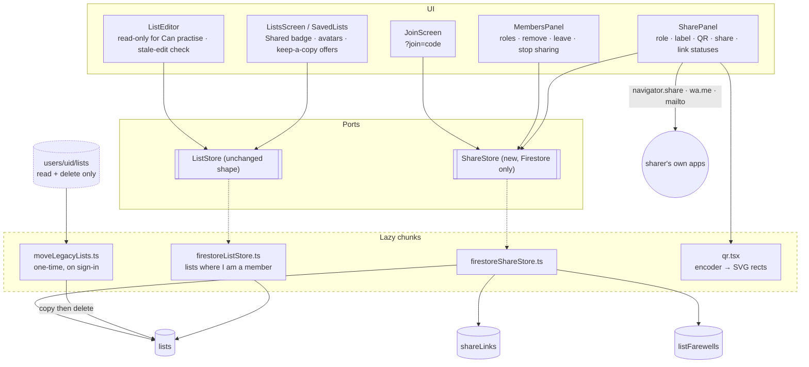

# Plan: Sharing a list with someone else

**Feature ID:** 016-list-sharing
**Status:** DRAFT, revision 3 (one `lists` collection)
**Created:** 2026-09-25
**Builds on:** `003-user-accounts` (Firestore, Google sign-in, `ListStore` port), `011-test-builder` (saved tests reference lists by id)

## What revision 3 changed

Revision 2 kept private lists at `users/{uid}/lists` and moved a list to a separate `sharedLists`
collection when it was first shared. Revision 3 puts **every** cloud list in one `lists`
collection, associated with users by membership. That removes, from the plan:

- the private-to-shared move batch, and the moment where a list could be in both places
- merging two live queries into one list of lists (except, temporarily, during the move below)
- rebuilding a private list when the owner stops sharing
- re-keying a kept copy when its owner rejoins
- routing every write by "which collection is this list in"

It adds one thing: a **one-time move** of existing cloud lists from `users/{uid}/lists` to `lists`
(§ Moving existing lists), and it makes the `lists` read rule the one thing keeping every private
list private.

## What revision 2 removed

Revision 1 sent email from a new Cloudflare Worker route through Resend. Replacing email with a
share link and QR code (spec D-1) deletes, from the plan:

- the Worker script, `run_worker_first`, and every line of server code
- Firebase ID token verification (the riskiest code in revision 1)
- the email provider account, the verified domain, SPF/DKIM, and the `RESEND_API_KEY` secret
- the email template and its escaping, and the resend throttle
- binding invites to an email address, and the "wrong Google account" screen
- the plan's biggest unknown (R1 in revision 1: whether members can query invites through a `get()`),
  because links are now only ever queried by their creator

What it adds is small: a QR encoder, the Web Share API, and a join screen that a guest can read.

## Technical approach

Four problems, in the order they carry risk:

1. **One membership-based home for every list, and rules that guard roles and joins.** The rules
   are the app's only server-side check, and after this change the `lists` read rule is the only
   thing between one user's private list and another user. They are written and tested first,
   against the emulator, before any client code.
2. **Moving existing lists without anyone noticing.** Every signed-in user's lists change location
   once. It must be invisible, idempotent, interruptible and work offline.
3. **Keeping history attached to a kept copy**, which has a new id (D-11).
4. **An entry point from outside the app.** `?join=<code>` must survive a sign-in, must work for a
   guest who has never loaded Firebase, and must not collide with the first-sign-in migration
   prompt.

### Ordering decisions

- **Rules and tests before the adapter**, as in 003.
- **The move ships in the same release as the new store**, not before and not after: the new
  store reads `lists`, and the move is what fills it. The move runs, and is tested, before any
  sharing UI exists, so Phase 2 can be merged on its own as a pure storage change with no visible
  difference.
- **Guests untouched.** `listRepo.ts` and `localListStore.ts` do not change. The `ListStore` port
  keeps its exact shape, so `App` cannot tell that cloud lists moved.

## Architecture



`ShareStore` is a separate port, not new `ListStore` methods, because the local store has no honest
implementation of any of it. `useShareStore` returns `null` for guests, and every sharing control
reads that as "Sign in to share".

## Data model

```
lists/{listId}                 WordList + sharing   every cloud list; listId = the existing client uuid
shareLinks/{code}              ShareLink            code = 22 chars base64url (128 random bits)
listFarewells/{listId}_{uid}   Farewell             the keep-a-copy offer (D-11)
users/{uid}                    unchanged
users/{uid}/sessions|games|tests   unchanged: personal data stays with the person
users/{uid}/lists/{listId}     LEGACY: read + delete only, emptied by the move (D-14)
```

```ts
// src/state/types.ts (additions)
export type ListRole = 'owner' | 'editor' | 'viewer'   // UI: Owner · Can edit · Can practise

export interface ListMember {
  role: ListRole
  displayName: string | null
  email: string | null
  photoURL: string | null
  joinedAt: number
  /** The link that let them in, for "joined via For Dana" and for the join rule. Absent for the owner. */
  viaLink?: string
  viaLabel?: string
}

/** Present on every cloud list. Absent on guests' local lists, which have no members. */
export interface ListSharing {
  ownerUid: string
  /** Mirrors the keys of `members`. Exists only because Firestore can query array-contains, not map keys. */
  memberUids: string[]
  members: Record<string, ListMember>
  /** Who saved last, for the stale-edit warning (D-8). */
  updatedBy: string
}

export interface WordList {
  // ...existing fields
  sharing?: ListSharing
  /**
   * Ids this list was copied from (D-11). History recorded against any of them counts as this
   * list's history. Empty or absent for every list that is not a kept copy.
   */
  previousIds?: string[]
}

/** A list is shared iff it has more than one member. Derived, never stored. */
export const isShared = (l: WordList) => (l.sharing?.memberUids.length ?? 0) > 1
```

`sharing` is optional in the type only because guests' local lists never have it. Every document
in `lists` has it, and the rules require it.

```ts
// src/share/types.ts
export interface ShareLink {
  code: string                // the document id; the secret in the URL
  listId: string
  role: 'editor' | 'viewer'
  label: string | null        // "For Dana"
  maxUses: number             // 1 by default; up to 20 for a group link (open question 1)
  uses: number
  declined: boolean           // single-use links only
  createdByUid: string
  createdAt: number           // server timestamp; expires createdAt + 14 days (D-7)
  /** What a guest sees on the join screen before they can read the list itself. */
  preview: { listName: string; ownerName: string | null; wordCount: number; col1Lang: LangCode; col2Lang: LangCode }
}

export interface Farewell {
  uid: string
  listId: string
  reason: 'removed' | 'stopped' | 'deleted'
  byName: string | null
  at: number
  /** The last version this member could see. A snapshot, so later edits never reach them. */
  list: WordList
}
```

**Displayed link status is derived, never stored:** `declined` → *Declined*;
`now > createdAt + 14d` → *Expired*; `uses < maxUses` → *Waiting · created 2h ago* (a group link
adds *"· 7 of 20 joined"*); used up → not shown, the person is under Members. Keeping *Expired*
derived is why D-7 needs no cleanup job.

**Why farewells are still their own documents**, even with one `lists` collection: a removed member
must see the list *as it was when they were removed* (D-11), and rules cannot give someone access
to an old version of a document. A snapshot written in the same batch as the removal is the only
honest way, and it means a removed member has no access at all to the live list.

**Why a top-level `lists` and not `users/{ownerUid}/lists` with members added.** That shape keeps
lists "under" their owner, but a member could then only find them with a collection-group query
across every user's `lists`, which needs a collection-group index (a console or
`firestore.indexes.json` change) and a recursive `{path=**}/lists` rule that would apply to every
list in the database anyway. A top-level collection gives the same single rule with a plain query
and no index.

## Rules

Sketch, not final syntax. Every clause gets an allow and a deny test.

```
function signedIn() { return request.auth != null; }
function me() { return request.auth.uid; }
function roleOf(list) { return list.members[me()].role; }
function isMember(list) { return signedIn() && me() in list.memberUids; }
function canEdit(list) { return isMember(list) && roleOf(list) in ['owner', 'editor']; }
function isListOwner(list) { return signedIn() && list.ownerUid == me(); }
function linkLive(link) {
  return link.uses < link.maxUses && !link.declined
    && request.time < link.createdAt + duration.value(14, 'd');
}
function listDoc(id) { return get(/databases/$(database)/documents/lists/$(id)).data; }

match /lists/{listId} {
  // THE privacy rule for every cloud list, shared or not. Queries must filter on
  // memberUids array-contains me, or they are refused (rules are not filters).
  allow read: if isMember(resource.data);

  // Every list starts private: its creator, alone, as owner. Covers new lists and the move (D-14).
  allow create: if signedIn()
    && request.resource.data.ownerUid == me()
    && request.resource.data.memberUids == [me()]
    && request.resource.data.members.keys().hasOnly([me()])
    && request.resource.data.members[me()].role == 'owner'
    && request.resource.data.updatedBy == me()
    && contentValid(request.resource.data);

  allow update: if
       contentEdit()           // owner or editor changes content fields only, sets updatedBy
    || joinIsValid()           // see below
    || leaveIsValid()          // a non-owner removes exactly themself
    || ownerManages();         // owner changes a role, removes a member (with a farewell), or hands over ownership

  allow delete: if isListOwner(resource.data);
}

// Legacy, emptied by the move (D-14). Nothing new may be written here.
match /users/{uid}/lists/{listId} {
  allow read, delete: if isOwner(uid);
  allow create, update: if false;
}

match /shareLinks/{code} {
  // Readable by anyone who has the code, signed in or not: it holds only the preview, and the
  // code cannot be guessed. This is what lets a guest see who is inviting them before signing in.
  allow get: if true;
  // Only the creator lists them, and the query must filter on it.
  allow list: if signedIn() && resource.data.createdByUid == me();

  allow create: if signedIn()
    && isListOwner(listDoc(request.resource.data.listId))
    && request.resource.data.createdByUid == me()
    && request.resource.data.uses == 0 && request.resource.data.declined == false
    && request.resource.data.maxUses >= 1 && request.resource.data.maxUses <= 20
    && request.resource.data.role in ['editor', 'viewer']
    && request.resource.data.createdAt == request.time;

  allow update: if
       // a join uses it up by exactly one, and only alongside the matching list update
       (signedIn() && linkLive(resource.data)
         && diff().affectedKeys().hasOnly(['uses'])
         && request.resource.data.uses == resource.data.uses + 1
         && getAfter(/databases/$(database)/documents/lists/$(resource.data.listId))
              .data.members[me()].viaLink == code)
       // anyone holding a single-use link may decline it
    || (signedIn() && linkLive(resource.data) && resource.data.maxUses == 1
         && diff().affectedKeys().hasOnly(['declined']) && request.resource.data.declined == true);

  allow delete: if signedIn() && resource.data.createdByUid == me();   // cancel
}

match /listFarewells/{id} {
  allow read, delete: if signedIn() && resource.data.uid == me();
  // Written by the owner, in the same batch that removes the member or ends the list.
  allow create: if signedIn()
    && id == request.resource.data.listId + '_' + request.resource.data.uid
    && isListOwner(listDoc(request.resource.data.listId))
    && request.resource.data.uid in listDoc(request.resource.data.listId).memberUids
    && request.resource.data.list.pairs.size() <= 500;
}
```

`contentEdit()` allows only `name`, `pairs`, `col1Lang`, `col2Lang`, `langSource`, `updatedAt`,
`updatedBy`, plus `previousIds` for the owner. It never allows `ownerUid`, `memberUids` or
`members`, which is what makes a stale `setDoc` from a member fail instead of silently undoing a
concurrent join.

**The join rule** is the one that matters for sharing:

```
function joinIsValid() {
  let entry = request.resource.data.members[me()];
  let before = get(/databases/$(database)/documents/shareLinks/$(entry.viaLink)).data;
  let after  = getAfter(/databases/$(database)/documents/shareLinks/$(entry.viaLink)).data;
  return signedIn()
    && !(me() in resource.data.memberUids)
    && request.resource.data.memberUids == resource.data.memberUids.concat([me()])
    && request.resource.data.members.diff(resource.data.members).affectedKeys().hasOnly([me()])
    && diff().affectedKeys().hasOnly(['memberUids', 'members'])
    && before.listId == listId && linkLive(before)
    && after.uses == before.uses + 1
    && entry.role == before.role
    && resource.data.memberUids.size() < 20;
}
```

A join is **one batch**: the link's `uses + 1` and the list's new member. Each rule checks the
other's post-batch state with `getAfter`, so neither write is valid alone. That makes "link used
but nobody joined" and "joined without using a link" both impossible, and it is what makes two
people racing for one single-use link safe: the second batch sees `uses == maxUses` and is refused.

Role is copied from the link and checked (`entry.role == before.role`), so a joiner cannot promote
themselves to editor by editing the request.

Timestamps that the rules compare (`createdAt`) are Firestore server timestamps, not the app's
usual `Date.now()` numbers, because expiry must not trust the client clock. Converted to ms at the
adapter boundary so the rest of the app still sees numbers.

## Reading and writing lists

```ts
subscribeLists(onChange, onError) {
  const q = query(collection(db, 'lists'), where('memberUids', 'array-contains', uid))
  return track(onSnapshot(q, (snap) =>
    onChange(withLegacy(snap.docs.map(toWordList)).sort((a, b) => b.updatedAt - a.updatedAt)),
    (e) => onError(toStoreError(e))))
}
```

- **One query.** Private and shared lists come back together, because a private list is just one
  whose only member is me.
- **Sorted client-side**, so no composite index (`array-contains` + `orderBy` would need one, and
  this app has no `firestore.indexes.json`). A user has at most a few dozen lists.
- **`withLegacy`**: until this user's move has finished (§ Moving existing lists), a second
  listener on `users/{uid}/lists` feeds in lists not yet copied, deduped by id with `lists` winning.
  Once the legacy collection is empty the listener is detached and never attached again on this
  device (a flag in `localStorage`, `pvt.lists.moved.{uid}`).
- **New list**: `setDoc(lists/{id})` with `sharing` set to me as the only owner. The client uuid
  is still the document id, so 003's device-to-account copy stays idempotent unchanged.
- **Existing list**: `updateDoc` of content fields plus `updatedBy`. Never `setDoc`: it would
  rewrite `members` from whatever this client last saw. The rules refuse that anyway, and a test
  pins it.
- `removeList`: owner → delete for everyone (farewells for other members, links deleted); member →
  leave. `App` reads the role only to choose the confirmation copy (spec Story 6).

## Moving existing lists (D-14)

`moveLegacyLists(services, uid)`, run by `useListStore` after the Firestore store is built, in the
background, never blocking the first render:

```
for each doc in users/{uid}/lists:
  if lists/{id} exists and I am its owner:   delete the legacy doc            (a previous run got halfway)
  else:                                      batch { set lists/{id} = legacy + sharing(me, owner);
                                                     delete users/{uid}/lists/{id} }
```

- **Same id**, so saved tests and every history record keep pointing at the right list.
- **One batch per list**, so a list is never in neither place. At worst it is briefly in both, and
  the dedupe hides that.
- **Idempotent and interruptible.** Re-running finds fewer legacy docs each time and ends with none.
- **Offline**: the legacy listener serves the cached lists, the move waits for a connection
  (Firestore queues the batches), and nothing is lost.
- **A refused copy** (an id already in `lists` owned by someone else, which needs a uuid collision)
  leaves that list in the legacy location, still readable, and reports it once via the store's
  `onError`. It is never deleted.
- **Old tabs** still running the previous build write to `users/{uid}/lists` and are refused by
  the legacy rule; they show their existing permission toast until reloaded.
- **Removing the legacy code** (the listener, the move, the legacy rule block) is left to a later
  cleanup spec, once the Firebase console shows no documents left under any `users/*/lists`.

## Kept copies and history (D-11)

A kept copy is a new list: new uuid, the farewell's words, and `previousIds: [oldId, ...old.previousIds]`.
History records are append-only (`allow update: if false`) and cannot be re-pointed, so the copy
claims them instead:

- **One helper**, `listIdsFor(list)` in `src/state/`, returning `[list.id, ...(list.previousIds ?? [])]`.
- **Every place that matches history to a list** uses it: the per-list practice line in `App`,
  the My practices filter, and `missedWords` for a list. Today those compare `record.listId === id`
  in about four places; they become `listIdsFor(list).includes(record.listId)`.
- **A guard** in `invariants.test.ts`, like the existing `wordKey` one: a new `r.listId ===`
  comparison outside `listIdsFor` fails the build. Getting this wrong produces no error, only a
  copy whose history is quietly empty.
- **Saved tests** are documents and can be edited, so `keepCopy` rewrites this user's saved tests
  that name the old id to name the new one, in the same batch.

## Sharing a list

No move and no new collection. Making the first link is one batch: create `shareLinks/{code}`.
The list becomes shared the moment someone joins. Then show the QR and share options.

The share message and URL:

```
{ownerName} invited you to practise "{listName}" ({n} words, {French → English}) in Vocabulary Trainer:
https://{origin}/?join={code}
```

- **Share…** calls `navigator.share({ title, text, url })`, shown only when `navigator.canShare`
  says it will work. `AbortError` (the user closed the sheet) is not an error.
- **WhatsApp**: `https://wa.me/?text={encoded message}`. **Email**: `mailto:?subject=…&body=…`.
  Both are plain links, so no CSP change.
- **Copy link**: `navigator.clipboard.writeText`, with a visible "Copied".

## QR code

- A small MIT encoder (candidate: `uqr`; alternative `qrcode-generator`), used only for its
  `encode()` matrix. The component draws `<rect>`s itself, so there is no `innerHTML` and nothing
  for the CSP to object to.
- Lazy-loaded with the Share panel, never in the eager chunk (NFR2). If both candidates exceed
  10 KB gzipped, write a byte-mode, version 1 to 6 encoder by hand; the URL is under 60 characters,
  so it needs nothing more.
- Error correction **M**, 4-module quiet zone, dark modules on a white square **in both themes**.
  Many phone cameras fail on inverted QR codes, so dark mode must not invert it (the square is the
  one place this app deliberately does not follow the theme tokens, and the code says why).
- Full screen view: the largest square that fits, and it keeps the screen from sleeping where the
  Wake Lock API exists.

## The join screen

- `main.tsx` reads `?join=` once, stores it in `sessionStorage` (`pvt.join.pending`), and removes
  it from the URL with `history.replaceState`, so a refresh or a screenshot does not keep it.
- `appMachine` gains `{ screen: 'join'; code: string }`, `OPEN_JOIN`, `CLOSE_JOIN`. It only routes;
  loading the link is the screen's job, which keeps `appMachine.ts` pure (`invariants.test.ts`).
- **A guest is the normal case here**, and a guest has never loaded Firebase. The join screen
  loads the lazy Firebase chunk itself, reads `shareLinks/{code}` (allowed signed-out), and shows
  the preview with **Sign in with Google to join**. The eager bundle does not change; only a guest
  who opens a join link pays for the chunk, and they are about to sign in anyway.
- Boot order: auth resolves, then a stored join code opens the join screen **before** the welcome
  screen or the migration prompt. The join screen replaces the welcome screen for that visit (it
  asks the same question, better). After Join or No thanks, the stored code is cleared, and the
  existing migration prompt may then run.

## Leaving, removal, stop sharing, delete (D-11, D-12)

| Action | Who | One batch |
|---|---|---|
| Leave | member | remove me from `memberUids`/`members`; if keeping a copy, create the copy (§ Kept copies) |
| Remove member | owner | remove them; create `listFarewells/{id}_{them}` (reason `removed`) |
| Stop sharing | owner | remove every other member; a farewell per member (`stopped`); delete every link. The list stays where it is, with me as its only member |
| Delete for everyone | owner | a farewell per other member (`deleted`); delete every link; delete the list |

Farewells are read by the member's own `subscribeFarewells` and shown on My lists:
**Keep a private copy** (create the copy from `farewell.list`, then delete the farewell) or
**Dismiss** (delete it).

Batches are bounded: at most 19 farewells plus 10 links plus 2 list writes, far under Firestore's
500-write batch limit.

## Stale-edit detection and read-only editing

- `ListEditor` gets `readOnly` when the list is shared and the role is `viewer`: inputs disabled,
  a line at the top ("Dana shared this list with you to practise. Keep a copy to edit your own."),
  Save hidden, **Keep a private copy** offered.
- For editors, on Save `App` compares the opened `updatedAt` with the live list's. If they differ
  and `updatedBy` is someone else: *"{name} changed this list since you opened it."*
  **Keep theirs** / **Save mine anyway**. Advisory, client-side; the rules only guarantee the write
  is well-formed and by someone allowed to edit.

## Account deletion

`purgeUserData` gains a step **before** the owned collections:

1. Every list where I am a member but not owner: leave.
2. Every list I own: if others remain, one `ownerManages` update making the longest-standing
   editor (else member) the owner, and removing me; else delete it and its links. For a user who
   never shared, this is just "delete all my lists", the same outcome as today.
3. Delete every `shareLinks` doc I created, and every `listFarewells` doc addressed to me.

`OWNED_COLLECTIONS` keeps `'lists'` (the legacy location, in case the move never finished) and the
other three. `invariants.test.ts` gets a sibling of its `OWNED_COLLECTIONS` check: every top-level
collection named in `firestoreListStore.ts` or `firestoreShareStore.ts` must be handled in
`deleteAccount.ts`. The same trap 008 fell into, guarded the same way.

## Risks

| # | Risk | Mitigation |
|---|------|-----------|
| R1 | **Every private list now depends on one rule.** A mistake in `lists` `allow read` exposes lists that were never shared. | The deny suite comes first and is the largest in the file: stranger `get`, stranger query, query without the membership filter, former member, removed member, member of another list. Reviewed on its own before any other rule. |
| R2 | **The move goes wrong for someone's real lists.** | Copy-then-delete in one batch per list; never delete without a confirmed copy; legacy stays readable; the emulator suite covers first run, re-run, interruption between batches, offline, and a refused copy. Owner checks the console after release (Task 26). |
| R3 | **Google sign-in is blocked inside in-app browsers** (Instagram, Facebook, some Android messengers; Google refuses OAuth there with `disallowed_useragent`). A WhatsApp link opened in such a view would dead-end at sign-in. | The join screen detects embedded webviews and shows **Open in your browser** with Copy link, before offering sign-in. Tested on WhatsApp for iOS and Android. |
| R4 | A forwarded link lets a stranger in (accepted with D-2). | Single-use by default; owner sees and removes; 14-day expiry; group links have a cap. Stated in the Share panel: "Anyone with this link can join." |
| R5 | `get: if true` on share links is readable without sign-in. | Holds only the preview; the code is 128 random bits; `list` is creator-only. A rules test asserts a guest cannot list. |
| R6 | A kept copy's history quietly empty because one comparison was missed. | `listIdsFor` plus the invariants guard. |
| R7 | QR code unreadable in dark mode or at small sizes. | Never inverted; minimum 240 px; tested with two phone cameras. |
| R8 | Offline edits by a member replayed after removal or demotion are rejected. | Expected; a toast gives the specific reason, and the keep-a-copy offer carries the last version. |
| R9 | Existing tests assume `users/{uid}/lists`. | `tests/rules/` list tests and the `invariants.test.ts` path check are updated in the same task that changes the path, never weakened; each changed assertion names the new path. |
| R10 | New runtime dependency. | One, lazy, tiny, MIT; hand-written fallback (NFR5). README's "two runtime dependencies" line updated. |
| R11 | Blast radius in `App.tsx` (1,100 lines). | Sharing UI in its own components wired by props; `App` gains one hook, one route, and the `listIdsFor` calls. |

## Test strategy

- **Rules** (`tests/rules/firestore.rules.test.ts`, emulator). The deny list is the important half,
  and the `lists` read rule leads it (R1): stranger read of a private list; query without
  `array-contains me`; former member; viewer edits content; editor changes a role; member changes
  `ownerUid`; create with another member already in; create as non-owner; write to the legacy
  `users/{uid}/lists`; join without a link; with a link for another list; with an expired,
  declined, used-up or cancelled link; claiming a different role than the link; link `uses` bumped
  without a join; two racing joins on a single-use link; guest `list` on links; farewell written by
  a non-owner or for a non-member; reading someone else's farewell.
- **Move** (`tests/rules/moveLegacyLists.test.ts`, emulator): first run; re-run is a no-op;
  interrupted between two lists; offline then online; refused copy leaves the legacy doc; saved
  tests and sessions still resolve to the moved lists.
- **Adapter** (`tests/rules/firestoreShareStore.test.ts`, emulator): single-query subscription;
  legacy dedupe; join batch; decline; leave with and without copy; remove with farewell; stop
  sharing; delete for everyone; account deletion handover.
- **Pure** (`src/share/*.test.ts`, `src/state/listIds.test.ts`): link status at the 14-day boundary;
  share message; webview detection over real user agents; `listIdsFor`.
- **UI** (Vitest + Testing Library, fake `ShareStore`): Share panel with and without
  `navigator.share`; QR renders an `<svg>` with the right module count; each link status; join
  screen states (guest, ready, own link, already member, unavailable, expired, in-app browser);
  members panel by role; read-only editor; stale-edit dialog; farewell banner; a kept copy's
  practice line counts the shared list's drills.
- **App flow** (`App.join.test.tsx`): `?join=` as a guest → sign in → join → list visible; the
  migration prompt comes after, not on top.
- **Bundle**: `check-bundle.mjs` green; the QR encoder is not in the eager chunk.
