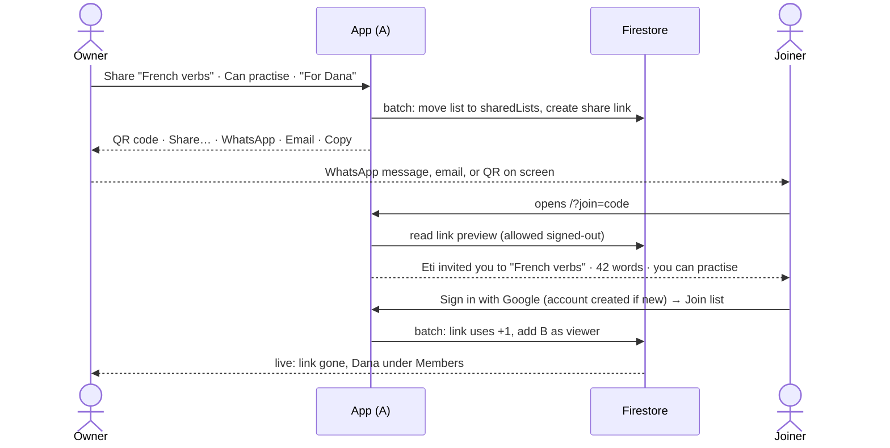

# Quickstart: 016-list-sharing

**TL;DR:** Share a list with a link and a QR code: send it over WhatsApp or email, or hold your
phone up. Whoever opens it signs in with Google (which creates an account if they have none) and
joins as **Can edit** or **Can practise**. The owner sees each link's status and can cancel it.
Everyone sees the members. Nobody ever loses their words: whenever a shared list goes away from
you, you can keep a private copy. No server, no email provider, no secrets.

---

## The whole thing in one picture



---

## Before → after

| | Before | After |
|---|---|---|
| Where a list lives | `users/{uid}/lists` only | Private: unchanged. Shared: `sharedLists/{id}`, same id |
| Who can see a list | Its creator | Private: its creator. Shared: its members |
| How someone is invited | n/a | A link, as a QR code or sent from your own apps |
| Server code | None | None |
| Secrets | None | None |
| Runtime dependencies | react, react-dom | + one tiny QR encoder, lazy-loaded |
| Practice history | Per person | Per person (unchanged, D-6) |

---

## What the owner sees for each link

| Status | Means | Actions |
|---|---|---|
| **Waiting · created 2h ago** | Not used yet | Share again · Cancel link |
| **Declined** | Someone opened it and said no | New link · Remove |
| **Expired** | 14 days, unused | New link · Remove |
| *(gone, now under Members)* | Someone joined through it | Change role · Remove member |

---

## Who can do what

| | Owner | Can edit | Can practise |
|---|---|---|---|
| Practise, test, games, saved tests | ✓ | ✓ | ✓ |
| See members | ✓ | ✓ | ✓ |
| Edit words, rename, languages | ✓ | ✓ | |
| Keep a private copy | ✓ | ✓ | ✓ |
| Make and cancel links, change roles, remove | ✓ | | |
| Stop sharing, delete for everyone | ✓ | | |
| Leave | | ✓ | ✓ |

---

## When a shared list goes away from you

| What happened | What you see on My lists |
|---|---|
| You leave | Asked right then: **Leave and keep a copy** or **Leave** |
| The owner removes you | "Eti removed you from "French verbs"." **Keep a private copy** / **Dismiss** |
| The owner stops sharing | "Eti stopped sharing "French verbs" with you." same choice |
| The owner deletes it | "Eti deleted "French verbs"." same choice |

The copy is the last version you could see, with your practice history and saved tests intact.

---

## Running it locally

```bash
npm install
npm run dev                      # app on :5173
npm run test:rules               # rules + adapters against the emulator
```

To try the joiner side, sign in as a second Google account in a private window and open the link
the Share panel gives you (it points at `http://localhost:5173/?join=<code>`). To try the QR code
on a phone, open the app at the **Network** address `npm run dev` prints (it already binds
`--host`), so the link it makes is reachable from the phone. Signing in there needs that address in
Firebase's authorised domains.

---

## Where to read more

- The why, decisions and stories: [`spec.md`](spec.md)
- Data model, rules, merge, QR, join screen, risks: [`plan.md`](plan.md)
- The ordered build: [`tasks.md`](tasks.md)
