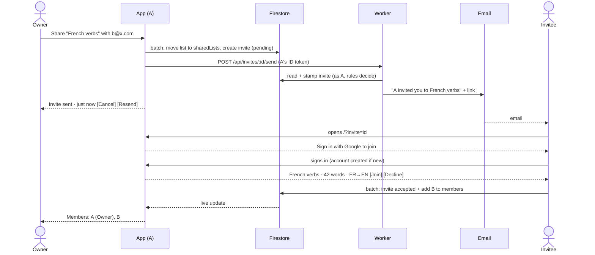

# Quickstart: 016-list-sharing

**TL;DR:** Share a list by email. The recipient joins from the email (signing in with Google first
if they have no account). The sharer sees each invite's status and can cancel it. Once joined, both
edit and practise the same list and see each other as members. Scores stay private.

---

## The whole thing in one picture



---

## Before → after

| | Before | After |
|---|---|---|
| Where a list lives | `users/{uid}/lists` only | Private: unchanged. Shared: `sharedLists/{id}`, same id |
| Who can see a list | Its creator | Private: its creator. Shared: its members |
| Email | The app never sends any | One Worker route sends invites |
| Server code | None (assets-only Worker) | One route, `POST /api/invites/:id/send` |
| Secrets | None | `RESEND_API_KEY`, as a Cloudflare secret |
| Practice history | Per person | Per person (unchanged, D-5) |

---

## Statuses the owner sees

| Status | Means | Actions |
|---|---|---|
| **Invite sent · 2 days ago** | Pending, email delivered to the provider | Cancel invitation · Resend |
| **Email not sent** | Pending, the email failed | Try again · Cancel invitation |
| **Declined** | They said no | Invite again · Remove |
| **Expired** | 14 days, no answer | Invite again · Remove |
| *(gone, now under Members)* | Accepted | Remove member |

---

## Who can do what

| | Owner | Member |
|---|---|---|
| Edit words, rename, change languages | ✓ | ✓ |
| Practise, test, use in games and saved tests | ✓ | ✓ |
| See members and pending invites | ✓ | ✓ |
| Invite, cancel, resend | ✓ | (open question D-3) |
| Remove a member | ✓ | |
| Delete the list for everyone | ✓ | |
| Leave | | ✓ |

---

## Running it locally

```bash
npm install
npm run dev                      # app, with VITE_INVITE_EMAIL=mailto (no provider needed)
npm run test:rules               # rules + adapters against the emulator
npx wrangler dev                 # app + Worker; needs .dev.vars with RESEND_API_KEY
```

`.dev.vars` (gitignored):

```
RESEND_API_KEY=re_...
FIREBASE_PROJECT_ID=your-dev-project
INVITE_FROM=Vocabulary Trainer <invites@your-domain>
```

To try the invitee side locally, sign in as a second Google account in a private window and open
`http://localhost:5173/?invite=<id>` with the id from the Firestore emulator or console.

---

## Where to read more

- The why, the decisions and the stories: [`spec.md`](spec.md)
- Data model, rules, merge, Worker, risks: [`plan.md`](plan.md)
- The ordered build: [`tasks.md`](tasks.md)
