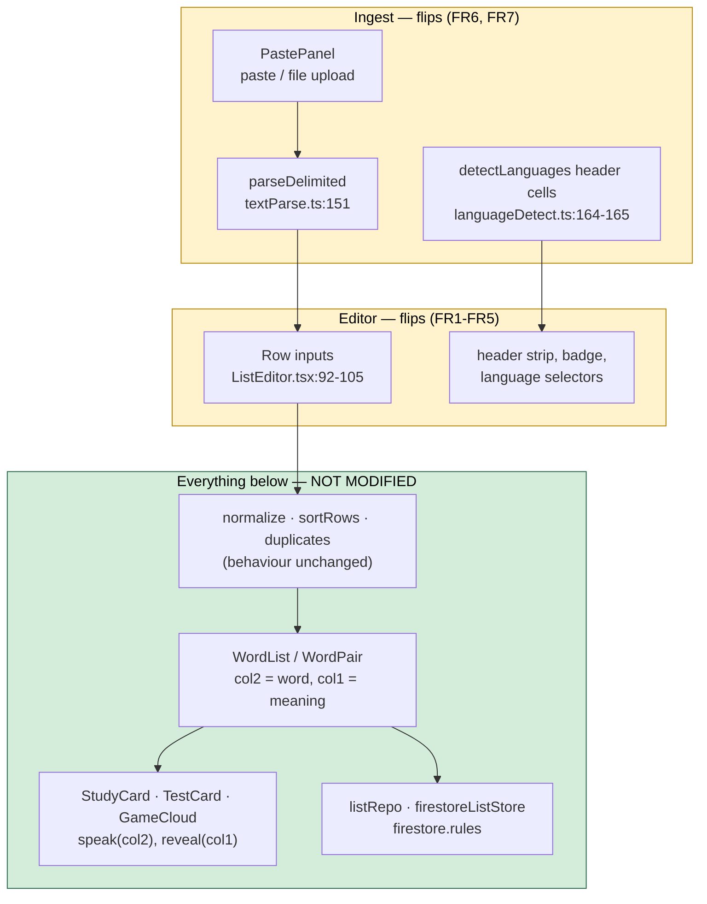
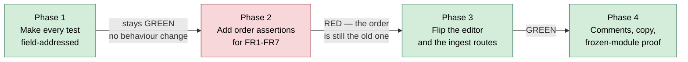

# Plan: The word you practise comes first

**Feature ID:** 017-word-first-columns
**Status:** DRAFT
**Created:** 2026-10-04
**Baseline:** `main` @ `6db3b98`
**Spec:** `spec.md` · **Tasks:** `tasks.md`

---

## Technical approach

One sentence: **render the `col2` input before the `col1` input, and make the two bulk-ingest
routes agree with it.** Nothing else moves.

The reason that is sufficient is that `col2` is already the prompt at every downstream site.
There is no "direction" variable to change, because direction was never parameterised — it is
hard-coded as `col2` in six components and it stays hard-coded as `col2`. The editor is the only
place in the app where column *position* is a visible fact, so position is the only thing to flip.



### Why the frozen box really is frozen

| Module | Keys on | Effect of this change |
|---|---|---|
| `sortRows` via `handleSort` (`ListEditor.tsx:267`) | `'col2'` | Already sorts by the practised word. That word is now the **first** column, so "Sort A to Z" becomes self-evidently correct rather than needing the explanatory comment at `ListEditor.tsx:411-414`. **No code change.** |
| `duplicates.findDuplicates` | `foldText(row.col2)` | Already warns on a repeated practised word. Now warns on a repeated **first** column. **No code change.** |
| `normalize.isComplete` / `countComplete` | both fields | Symmetric. **No code change.** |
| `handleSwap` (`ListEditor.tsx:227`) | swaps contents **and** languages | Still exchanges both together, so it still means what it says. **No code change**, comment only. |
| `detectLanguages` heuristic (`languageDetect.ts:176-205`) | scores the *content* of each field | Position-independent. **No code change.** |
| `detectLanguages` header row (`languageDetect.ts:160-176`) | `first.col1` / `first.col2` | Reads a ROW, not a screen, and the first field is already in `col2` by then. **No code change** — see § *The double flip*. |
| `DEFAULT_DETECTION` (`languageDetect.ts:12-17`) | `col1: 'en'`, `col2: 'nl'` | Renders as Dutch-first after the flip — which is the desired default. **No code change.** Do not "fix" this. |
| `links.languagePair` (`share/links.ts:38-39`) | `col2Lang → col1Lang` | Already word→meaning. **No code change.** |
| `ReadyScreen` / `TestSetup` / `GameSetup` copy | "You'll hear `{col2Lang}`…" | Already word-first prose. **No code change.** |

Four of the eight rows above are the reason this feature is cheap: the codebase already treats
`col2` as *the word* rather than as *the second thing*, consistently, everywhere below the editor.

---

## The one real hazard: ordinal cell addressing in tests

`ListEditor.test.tsx:21` and three copies in `App.test.tsx` define:

```ts
const cells = () => screen.getAllByRole('textbox').filter((el) => el.dataset.cell !== undefined)
```

…and then index it: `cells()[0]`, `cells()[1]`, `cells()[3]`. That is **DOM order**, so flipping
two JSX siblings silently redefines what every one of those 17 call sites means. The index
arithmetic is `row * 2 + side`, and `side` inverts.

Most of those tests will fail loudly, which is fine. The dangerous ones are the tests that stay
green while asserting the opposite of what they were written to assert — for example
`ListEditor.test.tsx:449-458`, which clears `cells()[3]` — row 2's `col2` today, row 2's `col1`
after the flip — to exercise the duplicate warning.

**The mitigation is a sequencing rule, and it is the spine of `tasks.md`:**



Phase 1 must be a **pure refactor with the suite green at the old order**. If a test changes
meaning in phase 1, the safety net is gone before it is needed. The new helper:

```ts
/**
 * One cell, named by the FIELD it writes rather than by where it sits.
 *
 * Addressing cells by DOM position is what made 017 risky: two JSX siblings swapped,
 * and every `cells()[n]` in the suite quietly came to mean the other column. `data-cell`
 * is the field, and the field is the thing a test actually has an opinion about.
 */
const cell = (row: number, field: 'col1' | 'col2') =>
  screen.getByLabelText(`Row ${row + 1} ${field === 'col2' ? 'word' : 'meaning'}`) as HTMLInputElement
```

…except that the labels only become `word`/`meaning` in phase 3. So phase 1's helper must select
on `data-cell`, which is stable across the whole feature (D-4):

```ts
const cell = (row: number, field: 'col1' | 'col2'): HTMLInputElement => {
  const all = [...document.querySelectorAll<HTMLInputElement>(`[data-cell="${field}"]`)]
  const found = all[row]
  if (!found) throw new Error(`no ${field} cell in row ${row + 1}`)
  return found
}
```

`querySelectorAll` returns document order, but filtered to **one field** the n-th match is the
n-th row either way — which is exactly the property that makes it survive the flip.

Keep a `cells()` that returns the full flat list, for the two assertions that legitimately care
about the *count* of inputs (`toHaveLength(2)`, `cells().length).toBeGreaterThan(2)`).

---

## What changes, file by file

### Production (5 files)

| File | Change | FR |
|---|---|---|
| `src/components/ListEditor.tsx` | `Row`: the `data-cell="col2"` input moves above `data-cell="col1"`; `aria-label`s become `Row N word` / `Row N meaning`. Header strip at `:374-375` flips and drops its numbers. Badge at `:335` becomes `{col2Lang} → {col1Lang} 🔊`. Selector loop at `:345` iterates `['col2', 'col1']` with labels `Word language` / `Meaning language` and ids `lang-col2` / `lang-col1`. Comments reworded at `:221-227` (swap) and `:411-414` (sort). | 1-5, 11, 12 |
| `src/parse/textParse.ts` | `parseDelimited` (`:151-163`): first field → `col2`, remainder → `col1`, single field → `{ col2: line, col1: '' }`. Doc comment at `:146-150` updated ("an empty column 2" → "an empty meaning cell"). | 6 |
| `src/parse/languageDetect.ts` | `:164-170`: first header cell → `col2Lang`, second → `col1Lang`. Comment says the first cell names the word column. `DEFAULT_DETECTION` and the heuristic are untouched. | 7 |
| `src/components/PastePanel.tsx` | Placeholder (`:69`) → `'dochter\tdaughter\ndoodgaan\tto die'`. | 9 |
| `src/parse/types.ts` | `RawRow` doc: `col2` is the word (renders first), `col1` the meaning (renders second); the names are historical and do not track position. | 10 |

`src/parse/duplicates.ts` is **comment-only** and may be folded into the phase-4 task, or left
alone if its wording still reads correctly once "column 2" is re-read as "the word column". Decide
by reading it; do not change its code.

### Tests (8 files)

`ListEditor.test.tsx` and `App.test.tsx` take the phase-1 refactor and the phase-2 order
assertions. `textParse.test.ts`, `languageDetect.test.ts`, `PastePanel.test.tsx`,
`normalize.test.ts`, `sortRows.test.ts`, `duplicates.test.ts` and `lang/languages.test.ts` need
fixture and prose updates where they name a column by number. `sortRows.test.ts` and
`duplicates.test.ts` assert on field names and should need **no change at all** — if either does,
that is a signal the flip has leaked below the editor and the task should stop.

---

## Technology choices

| Component | Choice | Rationale |
|---|---|---|
| Cell addressing in tests | `[data-cell="colN"]` attribute selector | The only stable address across the flip. Already present on both inputs; no production change needed to enable it (D-4). |
| Column labels | Role words, no numbers (`Word` / `Meaning`) | A number above the input would have to be either the position or the field name, and after this change those disagree permanently (D-2). |
| Ingest order | Flip inside `parseDelimited`, not at the call site | `PastePanel` and the file-upload path both go through it (`PastePanel.tsx:20-25` guarantees this), so one change covers both and they cannot drift. |
| Stored shape | Unchanged | No schema version to bump, no `firestore.rules` key list to extend, no migration to make idempotent, nothing required of any user including the owners of shared lists. |

---

## Security considerations

**None.** No rule, no stored field, no document shape and no permission is touched.
`firestore.rules:186-188` restricts a content edit to a fixed key list; this change adds no key,
so `npm run test:rules` must pass **unmodified**. If it does not, something has escaped the
editor and the change is wrong.

The one standing invariant to re-check by hand: a list shared as *Can practise* is read-only to
its viewer. This feature performs no write on open, so a viewer opening a shared list after the
change still performs no write. Covered by `tests/rules/` as it stands; no new rules test needed.

---

## Rollout

Deploy is a normal static deploy. There is no coordination problem, because an old client and a
new client read and write identical documents — they differ only in which input they draw first.
A user with a stale tab open sees the old order until they reload, and every list they save from
that stale tab is correct for both.

---

## The double flip

**This was got wrong during execution and caught by opening the app.**

`parseDelimited` and `detectLanguages` both read "the first field of a pasted line", so both
look flippable. Only one of them is: `parseDelimited` COMPOSES the row and must put the first
field in `col2`; `detectLanguages` CONSUMES that row, by which point the first field is already
in `col2`. Flipping the second as well cancels the first, and a `Dutch<TAB>English` header then
labels the list backwards and reads every Dutch word in an English voice.

The whole unit suite stayed green through it, because every header test states its rows as
`{col1, col2}` directly — a statement about fields, which says nothing about what the user
typed. Two cancelling flips are invisible to a fixture built on the far side of both.

Two tests now close it, and they are the ones to keep:

- `languageDetect.test.ts` → *reads a pasted header row word-first, through the real parser* — composes the row with `parseDelimited` instead of by hand, so the two functions cannot disagree unnoticed.
- `ListEditor.test.tsx` → *takes the word language from the first cell of a pasted header row* — the same claim at the level the user sees it.

The rule for anything added here later: **a test that starts from `{col1: …, col2: …}` cannot
see a flip.** Start from the text a user pastes, or from the box they type in.

---

## Known downstream conflict

`claude/translation-suggestions` (`47d31f5`, **local and unpushed** at the time of writing) adds
271 lines to `ListEditor.tsx` and 242 to `ListEditor.test.tsx` — the two files this feature
rewrites. 017 branches from `origin/main` deliberately, so it can ship on its own, and the two
will conflict in `Row`, in the header strip and in the ordinal `cells()[n]` sites whenever the
second of them merges.

Whoever merges second should take 017's side on column ORDER and the translate branch's side on
the 🌐 button, then re-point `handleTranslate`'s doc comment — its `toCol1 = row.col2.trim() !== ''`
rule needs **no code change**, because it already means "a filled word column fills the meaning
column" and that is still true after the flip.

---

## Confidence

**8.5 / 10 for one-pass success.**

The production diff is small and mechanical, and the frozen-module table above is the result of
reading every one of those call sites rather than assuming. The 1.5 points of doubt are entirely
in phase 1: 17 ordinal call sites have to be converted without changing a single assertion's
meaning, and a mistake there is invisible until phase 3 turns it into a confusing failure. Budget
real attention for that task and run the suite after it, before touching any production file.
